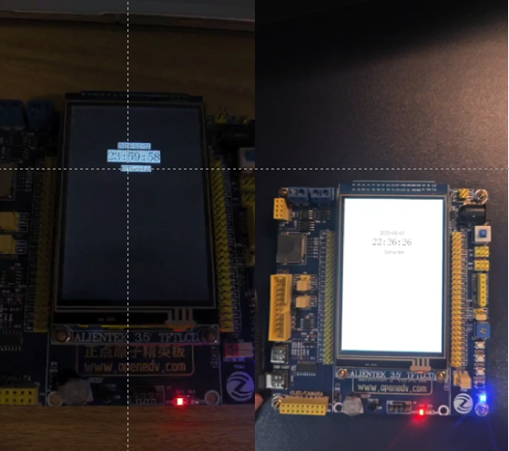

# STM32-BedsideClock

#### 介绍
基于STM32F103ZET6（正点原子精英板 V2）开发的智能床头钟，核心功能包括：
- 🕒 **高精度时间显示**：年/月/日/时/分/秒显示
- 🌓 **自动深浅色模式**：根据环境光线智能切换显示风格
- 🔋 **掉电时间保持**：自研RTC库解决传统HAL库的掉电丢失问题
- ⚡ **高效架构设计**：模块化代码+时间片轮询调度




#### 安装教程
1. **硬件准备**
   - 正点原子精英板 V2
   - 2.8寸TFT LCD显示屏
   - CR1220纽扣电池（后备电源）

2. **开发环境**
   ```bash
   IDE: Keil MDK v5.38
   STM32CubeMX: v6.14.0
   STM32F1 HAL: v1.8.6
   ```

3. **程序烧录**
   - 使用ST-Link连接开发板
   - 编译工程并烧录hex文件
   - 安装后备电池确保掉电计时

#### 使用说明
| 按键 | 功能 |
|------|------|
| KEY0 | 进入退出设置模式/选项切换 |
| KEY1 | 数值增加 |
| KEY_UP | 数值减少 |

**操作流程**：
1. 首次开机自动进入时间设置
2. 通过按键设置当前时间
3. 系统自动进入显示模式
4. 环境光线变化时自动切换深浅色

#### 参与贡献
**贡献者**:
- T'an Hao-tsun（系统架构设计）
- Ch'en Chvn-yeh（需求分析）
- Chang Chen-hung（功能测试）


