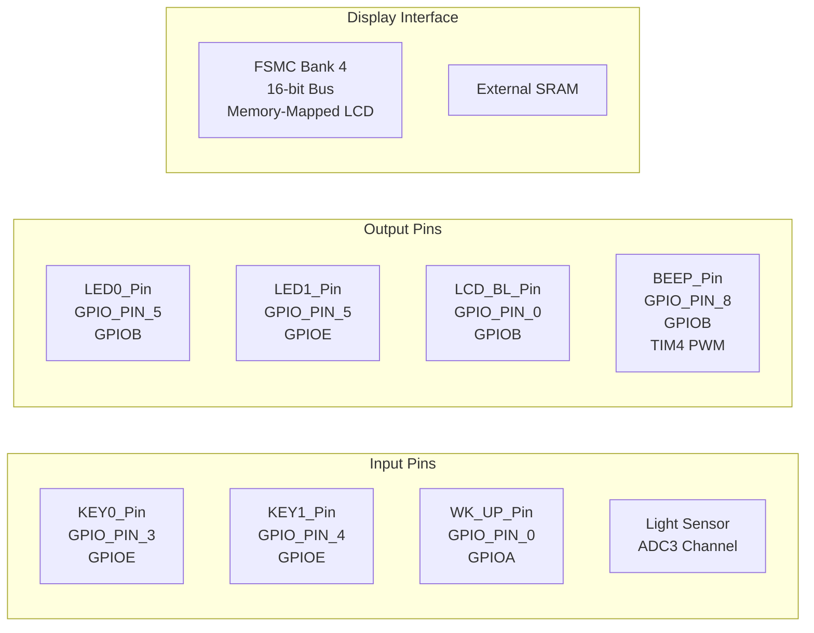

# Home

<details>
<summary>Relevant source files</summary>

The following files were used as context for generating this wiki page:

- [.mxproject](.mxproject)
- [Core/Inc/main.h](Core/Inc/main.h)
- [Core/Src/main.c](Core/Src/main.c)
- [Defense_of_work_design.pdf](Defense_of_work_design.pdf)

</details>


## Purpose and Scope

This wiki documents the **STM32-TFTLCD-UI** project, a real-time calendar and clock application for STM32F103xE microcontrollers featuring a TFT LCD display with automatic brightness adaptation. The system implements a dual-task architecture with a calendar UI and ambient light-based display mode switching.

This page provides an overview of the entire system. For detailed information on specific subsystems:
- For build instructions and development setup, see [Getting Started](#1.1)
- For application task implementation, see [Application Layer](#2)
- For peripheral driver details, see [Peripheral Drivers](#4)
- For development tools and project configuration, see [Development Environment](#5)

**Sources: ** [Core/Src/main.c](), [Core/Inc/main.h]()

---

## System Overview

The STM32-TFTLCD-UI is an embedded application that displays calendar and time information on a memory-mapped TFT LCD panel. The system responds to button inputs for time adjustment and automatically switches between light and dark display modes based on ambient light levels measured by a photoresistor.

### Target Hardware

| Component | Specification |
|-----------|--------------|
| Microcontroller | STM32F103xE (ARM Cortex-M3) |
| Display Interface | TFT LCD via FSMC (Flexible Static Memory Controller) |
| External Memory | SRAM connected to FSMC Bank 4 |
| Clock Source | HSE 8 MHz with PLL (72 MHz system clock), LSE 32.768 kHz for RTC |
| Input Devices | 3 buttons (KEY0, KEY1, WK_UP) + Photoresistor |
| Output Devices | TFT LCD, 2 LEDs, Beeper, LCD Backlight |

**Sources: ** [Core/Src/main.c:166-207](https://github.com/BA2F/STM32-TFTLCD-UI/blob/e0f407ee/Core/Src/main.c#L166-L207), [Core/Inc/main.h:59-73](https://github.com/BA2F/STM32-TFTLCD-UI/blob/e0f407ee/Core/Inc/main.h#L59-L73)

---

## System Architecture

The system follows a three-layer architecture: Application Layer, Hardware Abstraction Layer (HAL), and Hardware Peripherals.

```mermaid
graph TB
    subgraph Application["Application Layer (Core/Src)"]
        main["main()<br/>Core/Src/main.c"]
        MainTask["MainTask()<br/>task_main module"]
        automode["automode_task()<br/>task_automode module"]
        MainTaskInit["MainTaskInit()"]
        automode_init["automode_init()"]
    end
    
    subgraph HAL["Hardware Abstraction Layer"]
        HAL_Init["HAL_Init()"]
        SystemClock["SystemClock_Config()"]
        MX_GPIO["MX_GPIO_Init()"]
        MX_DMA["MX_DMA_Init()"]
        MX_FSMC["MX_FSMC_Init()"]
        MX_ADC3["MX_ADC3_Init()"]
        MX_RTC["MX_RTC_Init()"]
        MX_USART1["MX_USART1_UART_Init()"]
        MX_TIM2["MX_TIM2_Init()"]
        MX_TIM4["MX_TIM4_Init()"]
        MX_TIM7["MX_TIM7_Init()"]
    end
    
    subgraph Hardware["Hardware Peripherals"]
        GPIO["GPIO Ports<br/>KEY0(PE4), KEY1(PE3)<br/>WK_UP(PA0)<br/>LED0(PB5), LED1(PE5)<br/>LCD_BL(PB0), BEEP(PB8)"]
        ADC3_HW["ADC3<br/>Light Sensor"]
        FSMC_HW["FSMC<br/>LCD + SRAM"]
        RTC_HW["RTC<br/>Calendar/Time"]
        USART1_HW["USART1<br/>Debug Output"]
        DMA_HW["DMA1/DMA2<br/>Data Transfer"]
        TIM_HW["TIM2/4/7<br/>Time Base + PWM"]
    end
    
    main --> HAL_Init
    main --> SystemClock
    main --> MX_GPIO
    main --> MX_DMA
    main --> MX_FSMC
    main --> MX_ADC3
    main --> MX_RTC
    main --> MX_USART1
    main --> MX_TIM2
    main --> MX_TIM4
    main --> MX_TIM7
    main --> MainTaskInit
    main --> automode_init
    main --> MainTask
    main --> automode
    
    MX_GPIO --> GPIO
    MX_DMA --> DMA_HW
    MX_FSMC --> FSMC_HW
    MX_ADC3 --> ADC3_HW
    MX_RTC --> RTC_HW
    MX_USART1 --> USART1_HW
    MX_TIM2 --> TIM_HW
    MX_TIM4 --> TIM_HW
    MX_TIM7 --> TIM_HW
    
    MainTask --> GPIO
    MainTask --> FSMC_HW
    MainTask --> RTC_HW
    MainTask --> USART1_HW
    automode --> ADC3_HW
    automode --> FSMC_HW
```



**Sources: ** [Core/Src/main.c:75-160](https://github.com/BA2F/STM32-TFTLCD-UI/blob/e0f407ee/Core/Src/main.c#L75-L160), [Core/Inc/main.h:1-84](https://github.com/BA2F/STM32-TFTLCD-UI/blob/e0f407ee/Core/Inc/main.h#L1-L84)

---

## Key Features

### Dual-Task Super-Loop Architecture

The application uses a time-sliced super-loop scheduler with two periodic tasks:

| Task | Function | Period | Purpose |
|------|----------|--------|---------|
| Calendar Task | `MainTask()` | 10 ms | Key scanning, time display, UI state management |
| Auto-Brightness Task | `automode_task()` | 100 ms | Ambient light monitoring, display mode switching |

Both tasks are scheduled in [Core/Src/main.c:132-154]() using `HAL_GetTick()` for timing.

### Calendar and Time Display

The calendar task implements a state machine with two operational modes:
- **Normal Mode** (`CalendarState_Normal`): Displays current date and time from RTC
- **Setting Mode** (`CalendarState_Setting`): Allows user to adjust time values via button inputs

Button functions:
- `KEY0` (PE4): Decrement selected time value
- `KEY1` (PE3): Increment selected time value  
- `WK_UP` (PA0): Toggle between Normal and Setting modes

### Automatic Brightness Control

The `automode_task()` function reads ADC values from a photoresistor and switches display modes:
- **Light Mode**: White background (ADC < 3500)
- **Dark Mode**: Black background (ADC > 3900)
- **Hysteresis Range**: 3500-3900 prevents flickering

The auto-brightness feature only operates when `calendarState == CalendarState_Normal` to avoid interference during time setting [Core/Src/main.c:148]().

**Sources: ** [Core/Src/main.c:42-43](https://github.com/BA2F/STM32-TFTLCD-UI/blob/e0f407ee/Core/Src/main.c#L42-L43), [Core/Src/main.c:119-127](https://github.com/BA2F/STM32-TFTLCD-UI/blob/e0f407ee/Core/Src/main.c#L119-L127), [Core/Src/main.c:140-153](https://github.com/BA2F/STM32-TFTLCD-UI/blob/e0f407ee/Core/Src/main.c#L140-L153)

---

## Hardware Peripheral Configuration

### GPIO Pin Assignments



**Sources: ** [Core/Inc/main.h:59-73](https://github.com/BA2F/STM32-TFTLCD-UI/blob/e0f407ee/Core/Inc/main.h#L59-L73)

### DMA Configuration

The system employs two DMA controllers for automated data transfers:

| DMA Controller | Channel | Peripheral | Direction | Purpose |
|----------------|---------|------------|-----------|---------|
| DMA2 | Channel 5 | ADC3 | Peripheral → Memory | Continuous light sensor sampling |
| DMA1 | Channel 4 | USART1_TX | Memory → Peripheral | Debug message transmission |
| DMA1 | Channel 5 | USART1_RX | Peripheral → Memory | Debug message reception |

ADC DMA is started conditionally in [Core/Src/main.c:120-123]() only when in Normal mode.

**Sources: ** [Core/Src/main.c:104](https://github.com/BA2F/STM32-TFTLCD-UI/blob/e0f407ee/Core/Src/main.c#L104)

---

## Software Execution Flow

### Initialization Sequence

```mermaid
sequenceDiagram
    participant Reset as "Power-On Reset"
    participant main as "main()"
    participant HAL as "HAL Functions"
    participant Tasks as "Application Tasks"
    participant Loop as "Infinite Loop"
    
    Reset->>main: "Entry at main()"
    main->>HAL: "HAL_Init()"
    main->>HAL: "SystemClock_Config()"
    Note over HAL: "Configure 72MHz System Clock<br/>HSE 8MHz + PLL x9"
    main->>HAL: "MX_GPIO_Init()"
    main->>HAL: "MX_DMA_Init()"
    main->>HAL: "MX_FSMC_Init()"
    main->>HAL: "MX_TIM2_Init()"
    main->>HAL: "MX_TIM4_Init()"
    main->>HAL: "MX_ADC3_Init()"
    main->>HAL: "MX_RTC_Init()"
    main->>HAL: "MX_USART1_UART_Init()"
    main->>HAL: "MX_TIM7_Init()"
    main->>Tasks: "MainTaskInit()"
    Note over Tasks: "Initialize LCD, RTC, Keys"
    main->>Tasks: "automode_init()"
    Note over Tasks: "Set initial display mode"
    main->>HAL: "HAL_ADC_Start_DMA()"
    Note over HAL: "Start continuous ADC conversion"
    main->>Loop: "while(1)"
    loop Every 10ms/100ms
        Loop->>Tasks: "MainTask()"
        Loop->>Tasks: "automode_task()"
    end
```

**Sources: ** [Core/Src/main.c:75-160](https://github.com/BA2F/STM32-TFTLCD-UI/blob/e0f407ee/Core/Src/main.c#L75-L160)

### Task Scheduling

The main loop implements a simple cooperative scheduler using `HAL_GetTick()` for time measurement:

```c
// Task timing variables
last_key_scan_tick = HAL_GetTick();
last_automode_tick = HAL_GetTick();

while (1) {
    // Execute MainTask every 10ms
    if (HAL_GetTick() - last_key_scan_tick >= KEY_SCAN_INTERVAL) {
        MainTask();
        last_key_scan_tick = HAL_GetTick();
    }
    
    // Execute automode_task every 100ms (only in Normal mode)
    if (HAL_GetTick() - last_automode_tick >= TASK_AUTOMODE_INTERVAL && 
        calendarState == CalendarState_Normal) {
        automode_task(adc_val);
        last_automode_tick = HAL_GetTick();
    }
}
```

**Sources: ** [Core/Src/main.c:140-153](https://github.com/BA2F/STM32-TFTLCD-UI/blob/e0f407ee/Core/Src/main.c#L140-L153)

---

## Data Flow Architecture

### ADC to Display Pipeline

```mermaid
graph LR
    ENV["Ambient<br/>Light"]
    PHOTO["Photoresistor<br/>Voltage Divider"]
    ADC3["ADC3<br/>hadc3"]
    DMA2["DMA2 CH5<br/>Continuous Mode"]
    BUF["adc_val<br/>uint16_t"]
    TASK["automode_task()<br/>Threshold Logic"]
    LCD["LCD Driver<br/>FSMC Interface"]
    DISPLAY["TFT Display<br/>Mode Switch"]
    
    ENV --> PHOTO
    PHOTO -->|"Analog Signal"| ADC3
    ADC3 -->|"Digital Value"| DMA2
    DMA2 -->|"Memory Write"| BUF
    BUF -->|"Read by Task"| TASK
    TASK -->|"Display Commands"| LCD
    LCD -->|"Pixel Data"| DISPLAY
```



The ADC continuously samples the light sensor through DMA, storing values in the `adc_val` variable. The `automode_task()` reads this value and commands the LCD driver to switch between light and dark display modes based on threshold comparisons.

**Sources: ** [Core/Src/main.c:79](https://github.com/BA2F/STM32-TFTLCD-UI/blob/e0f407ee/Core/Src/main.c#L79), [Core/Src/main.c:122](https://github.com/BA2F/STM32-TFTLCD-UI/blob/e0f407ee/Core/Src/main.c#L122), [Core/Src/main.c:150](https://github.com/BA2F/STM32-TFTLCD-UI/blob/e0f407ee/Core/Src/main.c#L150)

---

## Clock Configuration

The system uses two clock sources for different purposes:

### System Clock (HSE + PLL)

- **External Crystal:** 8 MHz HSE (High-Speed External)
- **PLL Multiplier:** x9 
- **System Clock:** 72 MHz (maximum for STM32F103)
- **AHB Clock:** 72 MHz (DIV1)
- **APB1 Clock:** 36 MHz (DIV2)
- **APB2 Clock:** 72 MHz (DIV1)
- **ADC Clock:** 12 MHz (PCLK2 ÷ 6)

### RTC Clock (LSE)

- **External Crystal:** 32.768 kHz LSE (Low-Speed External)
- **Purpose:** Calendar and timekeeping functions
- **Advantage:** Low power consumption, accurate long-term timing

**Sources: ** [Core/Src/main.c:166-207](https://github.com/BA2F/STM32-TFTLCD-UI/blob/e0f407ee/Core/Src/main.c#L166-L207)

---

## Module Organization

| Module | Location | Purpose |
|--------|----------|---------|
| Main Application | `Core/Src/main.c` | System entry point, initialization, task scheduler |
| Main Header | `Core/Inc/main.h` | GPIO pin definitions, function prototypes |
| Calendar Task | `task_main` module | Time display, user input handling, RTC management |
| Auto-Brightness | `task_automode` module | Light sensor reading, display mode control |
| HAL Drivers | `Drivers/STM32F1xx_HAL_Driver/` | Hardware abstraction for peripherals |
| CMSIS | `Drivers/CMSIS/` | ARM Cortex-M core definitions |

**Sources: ** [Core/Src/main.c:20-33](https://github.com/BA2F/STM32-TFTLCD-UI/blob/e0f407ee/Core/Src/main.c#L20-L33), [.mxproject:1-40](https://github.com/BA2F/STM32-TFTLCD-UI/blob/e0f407ee/.mxproject#L1-L40)

---

## Utility Functions

### delay_ms()

A custom millisecond delay function required by the LCD driver:

```c
void delay_ms(uint32_t ms)
{
  uint32_t ms_uwTick = uwTick;
  while (uwTick - ms_uwTick < ms) { }
}
```

This function uses the global `uwTick` variable (incremented by SysTick interrupt) to implement a busy-wait delay. Located at [Core/Src/main.c:212-218]().

### Error_Handler()

System error handler that disables interrupts and enters an infinite loop when a critical error occurs [Core/Src/main.c:225-234](). Called by HAL functions when peripheral initialization fails.

**Sources: ** [Core/Src/main.c:210-234](https://github.com/BA2F/STM32-TFTLCD-UI/blob/e0f407ee/Core/Src/main.c#L210-L234), [Core/Inc/main.h:53-57](https://github.com/BA2F/STM32-TFTLCD-UI/blob/e0f407ee/Core/Inc/main.h#L53-L57)

---

## Next Steps

This overview covers the essential architecture and functionality of the STM32-TFTLCD-UI system. For detailed information:

1. **To build and run the project:** See [Getting Started](#1.1) for toolchain setup and build instructions
2. **To understand the system architecture:** See [System Architecture](#1.2) for detailed layer diagrams
3. **To modify application behavior:** See [Application Layer](#2) for task implementation details
4. **To configure peripherals:** See [Hardware Abstraction Layer](#3) for HAL configuration
5. **To work with specific hardware:** See [Peripheral Drivers](#4) for individual peripheral documentation
6. **To set up development tools:** See [Development Environment](#5) for IDE and project configuration

**Sources: ** [Core/Src/main.c](), [Core/Inc/main.h]()