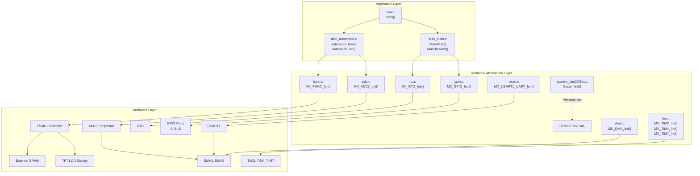
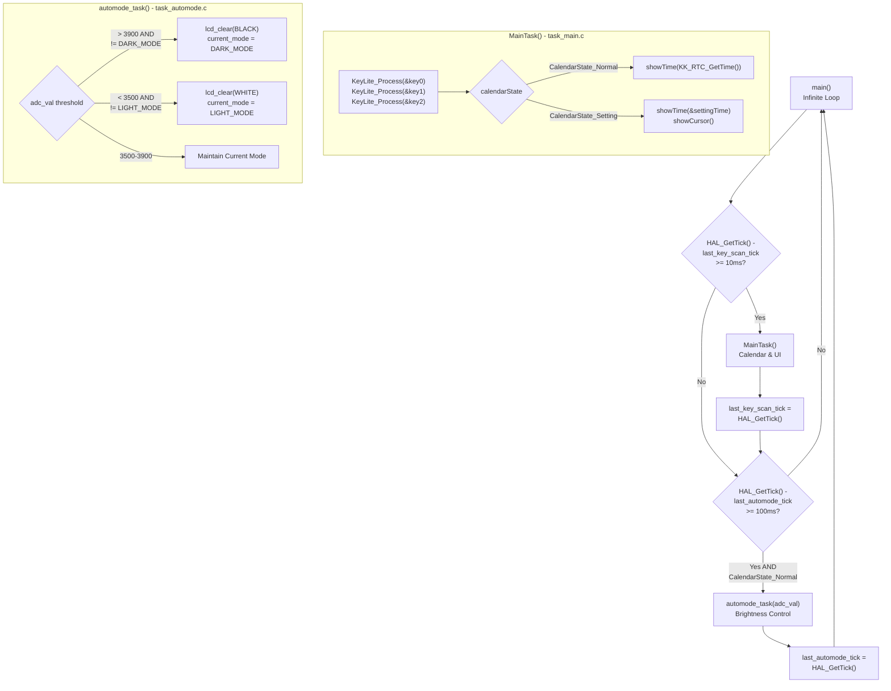
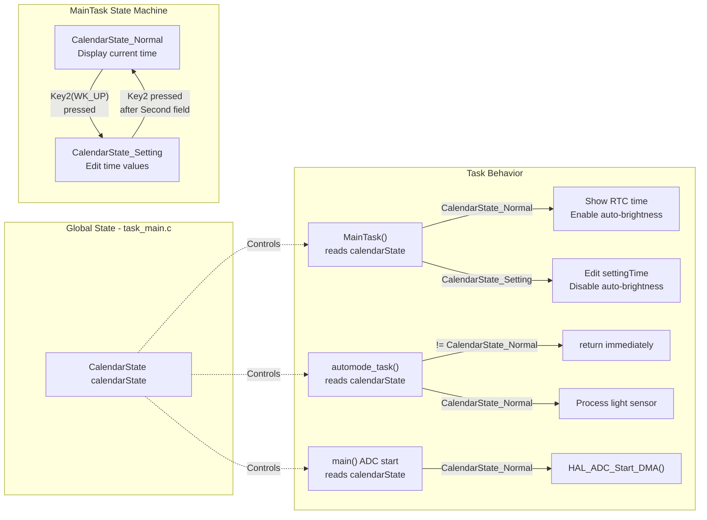
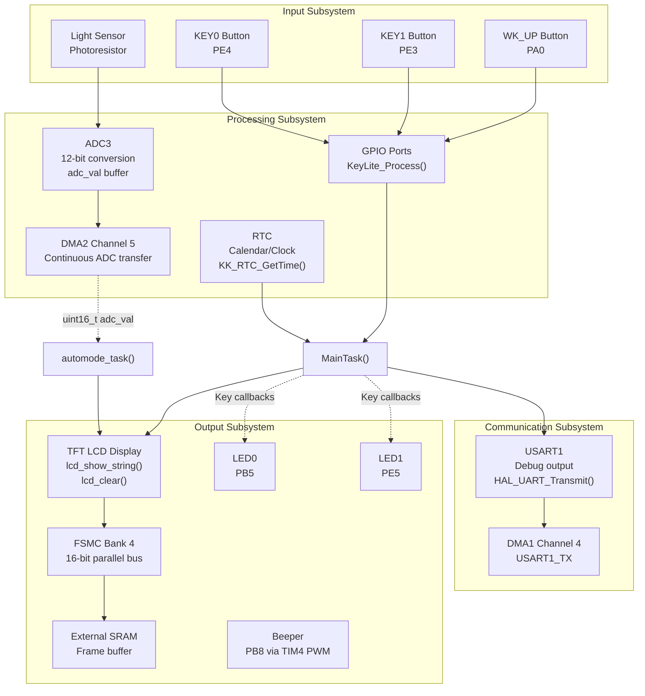
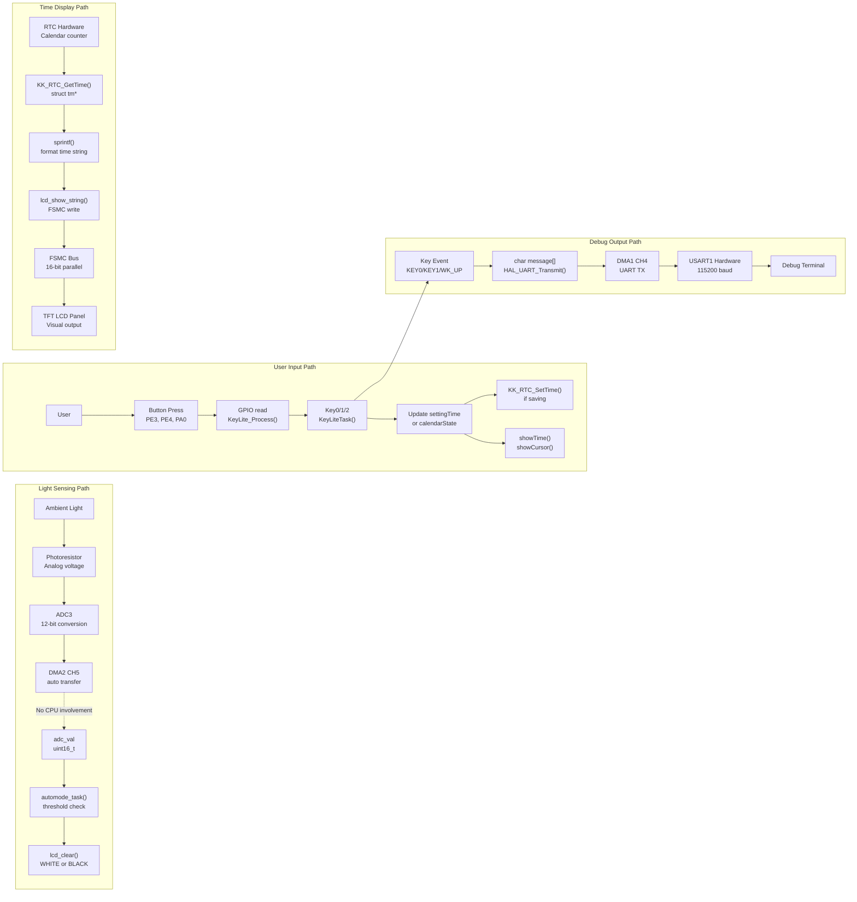
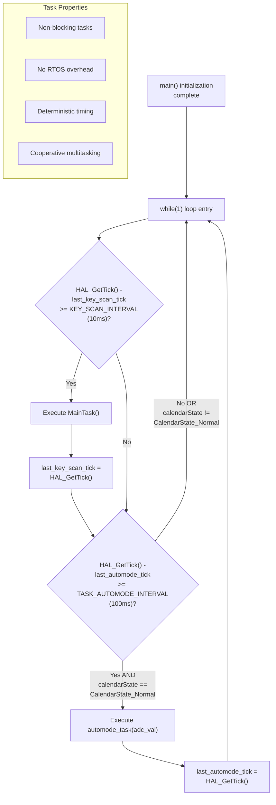

# System Architecture

<details>
<summary>Relevant source files</summary>

The following files were used as context for generating this wiki page:

- [App/Src/task_automode.c](App/Src/task_automode.c)
- [App/Src/task_main.c](App/Src/task_main.c)
- [Core/Src/main.c](Core/Src/main.c)
- [Core/Src/system_stm32f1xx.c](Core/Src/system_stm32f1xx.c)

</details>


## Purpose and Scope

This document provides a high-level overview of the STM32-TFTLCD-UI system architecture, explaining how the major components interact to create a real-time calendar/clock application with automatic brightness control. The architecture follows a layered design pattern with clear separation between application logic, hardware abstraction, and physical peripherals.

For detailed information about specific components:
- Application task implementations: See [Main Application Loop](#2.1), [Calendar Task](#2.2), and [Auto-Brightness Task](#2.3)
- HAL configuration and peripheral drivers: See [Hardware Abstraction Layer](#3) and [Peripheral Drivers](#4)
- Build configuration and tooling: See [Development Environment](#5)

## Layered Architecture

The system is organized into three distinct architectural layers:



**Sources: ** [Core/Src/main.c:1-252](https://github.com/BA2F/STM32-TFTLCD-UI/blob/e0f407ee/Core/Src/main.c#L1-L252), [App/Src/task_main.c:1-425](https://github.com/BA2F/STM32-TFTLCD-UI/blob/e0f407ee/App/Src/task_main.c#L1-L425), [App/Src/task_automode.c:1-70](https://github.com/BA2F/STM32-TFTLCD-UI/blob/e0f407ee/App/Src/task_automode.c#L1-L70), [Core/Src/system_stm32f1xx.c:1-407](https://github.com/BA2F/STM32-TFTLCD-UI/blob/e0f407ee/Core/Src/system_stm32f1xx.c#L1-L407)

### Layer Responsibilities

| Layer | Components | Responsibilities |
|-------|-----------|------------------|
| **Application Layer** | `main.c`, `task_main.c`, `task_automode.c` | Business logic, task scheduling, user interface, state management |
| **HAL Layer** | STM32F1xx HAL, peripheral initialization modules | Hardware abstraction, peripheral configuration, interrupt handling |
| **Hardware Layer** | MCU peripherals, external devices | Physical I/O operations, data conversion, signal generation |

The **Application Layer** contains the task scheduler in `main()` [Core/Src/main.c:132-159]() which periodically invokes `MainTask()` and `automode_task()`. The **HAL Layer** provides standardized APIs for peripheral access and handles low-level register configuration. The **Hardware Layer** represents the physical STM32F1xx peripherals and external components like the TFT LCD display.

**Sources: ** [Core/Src/main.c:1-252](https://github.com/BA2F/STM32-TFTLCD-UI/blob/e0f407ee/Core/Src/main.c#L1-L252), [Core/Src/system_stm32f1xx.c:167-187](https://github.com/BA2F/STM32-TFTLCD-UI/blob/e0f407ee/Core/Src/system_stm32f1xx.c#L167-L187)

## Application Task Architecture

The application implements a dual-task cooperative multitasking system using time-sliced execution:



**Sources: ** [Core/Src/main.c:132-159](https://github.com/BA2F/STM32-TFTLCD-UI/blob/e0f407ee/Core/Src/main.c#L132-L159), [App/Src/task_main.c:394-424](https://github.com/BA2F/STM32-TFTLCD-UI/blob/e0f407ee/App/Src/task_main.c#L394-L424), [App/Src/task_automode.c:46-69](https://github.com/BA2F/STM32-TFTLCD-UI/blob/e0f407ee/App/Src/task_automode.c#L46-L69)

### Task Execution Schedule

| Task | Execution Interval | Implementation | Primary Purpose |
|------|-------------------|----------------|-----------------|
| `MainTask()` | 10 ms | [App/Src/task_main.c:394-424]() | Key scanning, time display, state management |
| `automode_task()` | 100 ms | [App/Src/task_automode.c:46-69]() | Ambient light sensing, display mode switching |

The task scheduler uses `HAL_GetTick()` to track elapsed time since the last execution of each task. `MainTask()` runs at 10 ms intervals for responsive key input [Core/Src/main.c:140-145](), while `automode_task()` runs at 100 ms intervals to reduce ADC processing overhead [Core/Src/main.c:148-153](). The `automode_task()` only executes when `calendarState == CalendarState_Normal` to prevent display changes during time setting [App/Src/task_automode.c:49-52]().

**Sources: ** [Core/Src/main.c:42-43](https://github.com/BA2F/STM32-TFTLCD-UI/blob/e0f407ee/Core/Src/main.c#L42-L43), [Core/Src/main.c:132-159](https://github.com/BA2F/STM32-TFTLCD-UI/blob/e0f407ee/Core/Src/main.c#L132-L159)

## State Management

The system uses a shared state variable to coordinate task behavior:



The `calendarState` variable is defined in `task_main.c` [App/Src/task_main.c:62]() and referenced by multiple modules:
- `main()` checks it before starting ADC DMA [Core/Src/main.c:120-123]()
- `MainTask()` switches display behavior based on state [App/Src/task_main.c:402-423]()
- `automode_task()` returns early if not in Normal mode [App/Src/task_automode.c:49-52]()

**Sources: ** [App/Src/task_main.c:62](https://github.com/BA2F/STM32-TFTLCD-UI/blob/e0f407ee/App/Src/task_main.c#L62), [App/Src/task_main.c:256-280](https://github.com/BA2F/STM32-TFTLCD-UI/blob/e0f407ee/App/Src/task_main.c#L256-L280), [App/Src/task_automode.c:49-52](https://github.com/BA2F/STM32-TFTLCD-UI/blob/e0f407ee/App/Src/task_automode.c#L49-L52), [Core/Src/main.c:120-123](https://github.com/BA2F/STM32-TFTLCD-UI/blob/e0f407ee/Core/Src/main.c#L120-L123)

## Peripheral Organization

The system maps hardware peripherals to functional subsystems:



**Sources: ** [Core/Src/main.c:103-111](https://github.com/BA2F/STM32-TFTLCD-UI/blob/e0f407ee/Core/Src/main.c#L103-L111), [Core/Src/adc.c](), [Core/Src/dma.c](), [Core/Src/fsmc.c](), [Core/Src/rtc.c](), [Core/Src/usart.c](), [Core/Src/gpio.c]()

### Peripheral Configuration Summary

| Peripheral | Configuration | Usage | Initialization Function |
|-----------|---------------|-------|------------------------|
| **ADC3** | 12-bit, single conversion, DMA enabled | Light sensor reading (photoresistor) | `MX_ADC3_Init()` |
| **DMA2 CH5** | Circular mode, peripheral-to-memory | Continuous ADC value transfer to `adc_val` | `MX_DMA_Init()` |
| **FSMC Bank 4** | 16-bit data bus, NOR/SRAM mode | Memory-mapped TFT LCD interface | `MX_FSMC_Init()` |
| **RTC** | LSE clock source (32.768 kHz) | Calendar and timekeeping | `MX_RTC_Init()` |
| **USART1** | 115200 baud, 8N1, DMA TX enabled | Debug output (key presses, timestamps) | `MX_USART1_UART_Init()` |
| **TIM2** | Time base, 10 ms period | Task scheduler timing reference | `MX_TIM2_Init()` |
| **TIM4** | PWM output, PB8 | Beeper tone generation | `MX_TIM4_Init()` |
| **GPIO** | PE3, PE4 (input), PB5, PE5 (output) | Key inputs, LED outputs | `MX_GPIO_Init()` |

The FSMC peripheral is critical for display performance - it provides a parallel memory-mapped interface to the TFT LCD, allowing fast pixel data transfers without CPU involvement. The ADC3 is configured with DMA2 Channel 5 to continuously update the `adc_val` variable without polling [Core/Src/main.c:122]().

**Sources: ** [Core/Src/adc.c](), [Core/Src/dma.c](), [Core/Src/fsmc.c](), [Core/Src/rtc.c](), [Core/Src/usart.c](), [Core/Src/tim.c](), [Core/Src/gpio.c]()

## System Initialization Sequence

The system follows a strict multi-phase initialization sequence:

```mermaid
sequenceDiagram
    participant Reset as "Power-On Reset"
    participant Startup as "startup_stm32f1xx.s"
    participant SysInit as "SystemInit()"
    participant Main as "main()"
    participant HAL as "HAL Init Functions"
    participant App as "Application Init"
    participant Loop as "Main Loop"
    
    Reset->>Startup: Reset vector execution
    Startup->>SysInit: Call SystemInit()
    SysInit->>SysInit: Configure system clock<br/>Enable FSMC if needed
    SysInit-->>Startup: Return
    Startup->>Main: Branch to main()
    
    Main->>HAL: HAL_Init()
    Note over HAL: Initialize SysTick, NVIC
    Main->>Main: SystemClock_Config()
    Note over Main: Configure HSE, PLL, AHB/APB buses
    
    Main->>HAL: MX_GPIO_Init()
    Main->>HAL: MX_DMA_Init()
    Main->>HAL: MX_FSMC_Init()
    Main->>HAL: MX_TIM2_Init()
    Main->>HAL: MX_TIM4_Init()
    Main->>HAL: MX_ADC3_Init()
    Main->>HAL: MX_RTC_Init()
    Main->>HAL: MX_USART1_UART_Init()
    Main->>HAL: MX_TIM7_Init()
    
    Main->>App: MainTaskInit()
    Note over App: KK_RTC_Init()<br/>lcd_init()<br/>KeyLite_Init()
    Main->>App: automode_init()
    Note over App: lcd_clear(WHITE)<br/>current_mode = LIGHT_MODE
    
    Main->>HAL: HAL_ADC_Start_DMA(&hadc3, &adc_val, 1)
    Note over HAL: Start continuous ADC conversion
    
    Main->>Main: Initialize timing variables<br/>last_key_scan_tick<br/>last_automode_tick
    
    Main->>Loop: Enter while(1) loop
    
    loop Every 10ms / 100ms
        Loop->>App: MainTask()
        Loop->>App: automode_task(adc_val)
    end
```

**Sources: ** [Core/Src/main.c:75-160](https://github.com/BA2F/STM32-TFTLCD-UI/blob/e0f407ee/Core/Src/main.c#L75-L160), [Core/Src/system_stm32f1xx.c:175-187](https://github.com/BA2F/STM32-TFTLCD-UI/blob/e0f407ee/Core/Src/system_stm32f1xx.c#L175-L187), [App/Src/task_main.c:362-384](https://github.com/BA2F/STM32-TFTLCD-UI/blob/e0f407ee/App/Src/task_main.c#L362-L384), [App/Src/task_automode.c:28-36](https://github.com/BA2F/STM32-TFTLCD-UI/blob/e0f407ee/App/Src/task_automode.c#L28-L36)

### Initialization Phase Details

**Phase 1: Pre-main Setup** [Core/Src/system_stm32f1xx.c:175-187]()
- `SystemInit()` is called from startup assembly code
- Configures the vector table location
- Optionally enables external SRAM via `SystemInit_ExtMemCtl()` (conditional compilation)

**Phase 2: HAL and Clock Configuration** [Core/Src/main.c:88-96]()
- `HAL_Init()` initializes the SysTick timer for `HAL_GetTick()` timing
- `SystemClock_Config()` configures HSE (8 MHz) + PLL (x9) = 72 MHz system clock [Core/Src/main.c:166-207]()

**Phase 3: Peripheral Initialization** [Core/Src/main.c:103-111]()
- Follows dependency order: GPIO → DMA → peripherals using DMA
- FSMC initialized for memory-mapped LCD access
- Timers configured for time base (TIM2, TIM7) and PWM (TIM4)

**Phase 4: Application Initialization** [Core/Src/main.c:114-127]()
- `MainTaskInit()` initializes RTC, LCD driver, and key handlers [App/Src/task_main.c:362-384]()
- `automode_init()` sets initial display mode to white background [App/Src/task_automode.c:28-36]()
- ADC DMA started conditionally based on `calendarState` [Core/Src/main.c:120-123]()

**Sources: ** [Core/Src/main.c:75-160](https://github.com/BA2F/STM32-TFTLCD-UI/blob/e0f407ee/Core/Src/main.c#L75-L160), [Core/Src/system_stm32f1xx.c:175-187](https://github.com/BA2F/STM32-TFTLCD-UI/blob/e0f407ee/Core/Src/system_stm32f1xx.c#L175-L187), [App/Src/task_main.c:362-384](https://github.com/BA2F/STM32-TFTLCD-UI/blob/e0f407ee/App/Src/task_main.c#L362-L384), [App/Src/task_automode.c:28-36](https://github.com/BA2F/STM32-TFTLCD-UI/blob/e0f407ee/App/Src/task_automode.c#L28-L36)

## Data Flow Paths

The system implements several distinct data flow paths:



**Sources: ** [Core/Src/main.c:122-153](https://github.com/BA2F/STM32-TFTLCD-UI/blob/e0f407ee/Core/Src/main.c#L122-L153), [App/Src/task_main.c:85-157](https://github.com/BA2F/STM32-TFTLCD-UI/blob/e0f407ee/App/Src/task_main.c#L85-L157), [App/Src/task_main.c:165-233](https://github.com/BA2F/STM32-TFTLCD-UI/blob/e0f407ee/App/Src/task_main.c#L165-L233), [App/Src/task_main.c:243-281](https://github.com/BA2F/STM32-TFTLCD-UI/blob/e0f407ee/App/Src/task_main.c#L243-L281), [App/Src/task_main.c:301-319](https://github.com/BA2F/STM32-TFTLCD-UI/blob/e0f407ee/App/Src/task_main.c#L301-L319), [App/Src/task_automode.c:46-69](https://github.com/BA2F/STM32-TFTLCD-UI/blob/e0f407ee/App/Src/task_automode.c#L46-L69)

### Critical Data Flow Characteristics

**Autonomous ADC Path**: The light sensor → ADC3 → DMA2 → `adc_val` path operates without CPU intervention. The DMA controller continuously updates the `adc_val` variable in memory [Core/Src/main.c:122](). This minimizes CPU load and ensures fresh sensor data is always available.

**Synchronized State Management**: Both `MainTask()` and `automode_task()` read the shared `calendarState` variable. When transitioning to `CalendarState_Setting`, the auto-brightness task becomes inactive [App/Src/task_automode.c:49-52](), preventing unwanted display color changes during time editing.

**UART Debugging**: Each key handler calls `HAL_UART_Transmit()` to send identifying strings ("KEY0", "KEY1", "WK_UP") via USART1 [App/Src/task_main.c:93](), [App/Src/task_main.c:173](), [App/Src/task_main.c:253](). This provides visibility into user interactions for debugging.

**Memory-Mapped Display**: The LCD driver writes directly to FSMC-mapped addresses. The FSMC peripheral translates memory writes into 16-bit parallel bus transactions to the TFT LCD controller, enabling fast display updates without peripheral management overhead.

**Sources: ** [Core/Src/main.c:122-153](https://github.com/BA2F/STM32-TFTLCD-UI/blob/e0f407ee/Core/Src/main.c#L122-L153), [App/Src/task_main.c:85-157](https://github.com/BA2F/STM32-TFTLCD-UI/blob/e0f407ee/App/Src/task_main.c#L85-L157), [App/Src/task_automode.c:46-69](https://github.com/BA2F/STM32-TFTLCD-UI/blob/e0f407ee/App/Src/task_automode.c#L46-L69)

## Super-Loop Execution Model

The system uses a non-preemptive cooperative multitasking model:



**Sources: ** [Core/Src/main.c:132-159](https://github.com/BA2F/STM32-TFTLCD-UI/blob/e0f407ee/Core/Src/main.c#L132-L159)

### Execution Model Characteristics

| Characteristic | Implementation | Rationale |
|----------------|----------------|-----------|
| **Time-slicing** | SysTick-based timing with `HAL_GetTick()` | Precise 1 ms time base for task scheduling |
| **Non-preemptive** | Tasks run to completion, no interrupts between tasks | Simple, predictable execution flow |
| **Cooperative** | Tasks voluntarily yield by returning | No race conditions, no mutex needed |
| **Fixed intervals** | `KEY_SCAN_INTERVAL` (10 ms), `TASK_AUTOMODE_INTERVAL` (100 ms) | Responsive UI input, efficient sensor sampling |

The super-loop architecture is suitable for this application because:
- Both tasks complete execution in under 1 ms (no blocking delays)
- Real-time requirements are modest (10 ms key response is acceptable)
- No complex task dependencies require priority-based scheduling
- System resource usage is low (no RTOS memory overhead)

The `MainTask()` never blocks - it only reads RTC values, processes key states, and updates the display [App/Src/task_main.c:394-424](). Similarly, `automode_task()` performs a simple threshold comparison and occasional `lcd_clear()` call [App/Src/task_automode.c:46-69]().

**Sources: ** [Core/Src/main.c:42-43](https://github.com/BA2F/STM32-TFTLCD-UI/blob/e0f407ee/Core/Src/main.c#L42-L43), [Core/Src/main.c:132-159](https://github.com/BA2F/STM32-TFTLCD-UI/blob/e0f407ee/Core/Src/main.c#L132-L159), [App/Src/task_main.c:394-424](https://github.com/BA2F/STM32-TFTLCD-UI/blob/e0f407ee/App/Src/task_main.c#L394-L424), [App/Src/task_automode.c:46-69](https://github.com/BA2F/STM32-TFTLCD-UI/blob/e0f407ee/App/Src/task_automode.c#L46-L69)