# Calendar Task

Relevant source files

The following files were used as context for generating this wiki page:

- [App/Inc/task_main.h](App/Inc/task_main.h)
- [App/Src/task_main.c](App/Src/task_main.c)
- [Core/Inc/rtc.h](Core/Inc/rtc.h)
- [Core/Src/rtc.c](Core/Src/rtc.c)

## Purpose and Scope

This document describes the Calendar Task implementation, which provides the primary user interface for displaying and setting date/time values on the TFT LCD. The task implements a state machine with Normal (display) and Setting (edit) modes, handles user input through three buttons, and manages display updates.

For information about the RTC peripheral configuration, see [Real-Time Clock](#4.4). For LCD driver details, see [Display Interface (FSMC)](#4.3). For the main application loop that schedules this task, see [Main Application Loop](#2.1).

## Task Overview

The Calendar Task executes periodically at 10ms intervals, making it the most frequently executed application task. It is responsible for:

- Reading and displaying current date/time from the RTC peripheral
- Processing user input from three buttons (KEY0, KEY1, KEY2/WK_UP)
- Managing a state machine for switching between display and edit modes
- Rendering time information with appropriate formatting
- Providing visual feedback (cursor) during time editing

The task is implemented in [App/Src/task_main.c:1-425]() with its public interface defined in [App/Inc/task_main.h:1-32]().

**Sources: ** [App/Src/task_main.c:1-425](https://github.com/BA2F/STM32-TFTLCD-UI/blob/e0f407ee/App/Src/task_main.c#L1-L425), [App/Inc/task_main.h:1-32](https://github.com/BA2F/STM32-TFTLCD-UI/blob/e0f407ee/App/Inc/task_main.h#L1-L32)

## State Machine Architecture

### Calendar State Enumeration

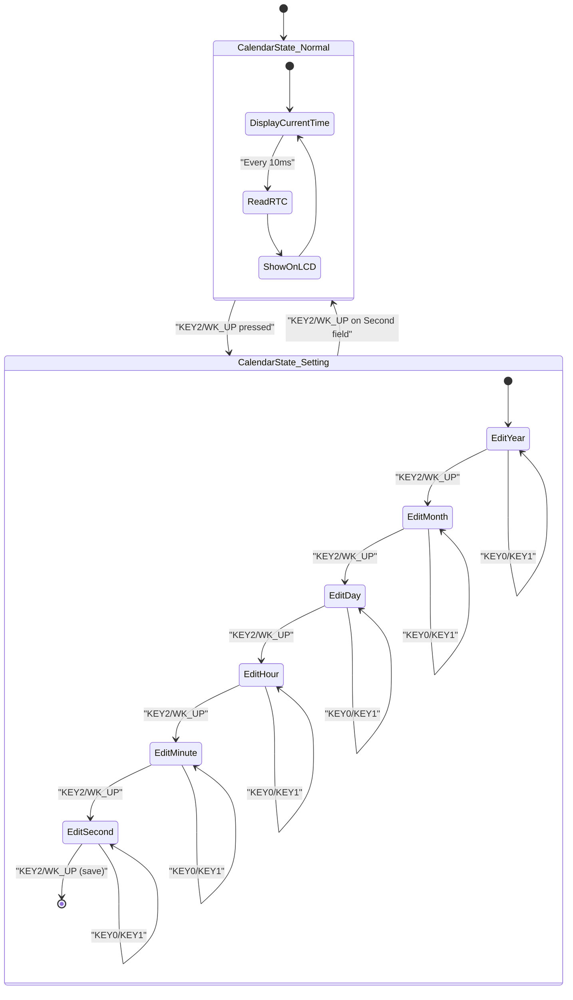

The task uses a two-level state machine:

| State Level | Enum Type | Defined In | Purpose |
|-------------|-----------|------------|---------|
| Top-level | `CalendarState` | [App/Inc/task_main.h:15-19]() | Controls Normal vs Setting mode |
| Sub-level | `SettingState` | [App/Src/task_main.c:26-34]() | Tracks which time field is being edited |

The global variable `calendarState` [App/Src/task_main.c:62]() tracks the current mode and is declared `extern` for access by the Auto-Brightness Task [App/Src/task_main.c:21]().

**Sources: ** [App/Inc/task_main.h:15-19](https://github.com/BA2F/STM32-TFTLCD-UI/blob/e0f407ee/App/Inc/task_main.h#L15-L19), [App/Src/task_main.c:26-34](https://github.com/BA2F/STM32-TFTLCD-UI/blob/e0f407ee/App/Src/task_main.c#L26-L34), [App/Src/task_main.c:62](https://github.com/BA2F/STM32-TFTLCD-UI/blob/e0f407ee/App/Src/task_main.c#L62)

### Setting State Fields

When in `CalendarState_Setting` mode, the `settingState` variable [App/Src/task_main.c:67]() determines which time component is currently being edited:

| SettingState | Field Modified | Range | Wrap Behavior |
|--------------|----------------|-------|---------------|
| `Year` | `settingTime.tm_year` | ≥70 (1970+) | Lower bound at 70 |
| `Month` | `settingTime.tm_mon` | 0-11 | Wraps to 11/0 |
| `Day` | `settingTime.tm_mday` | 1-31 | Wraps to 31/1 |
| `Hour` | `settingTime.tm_hour` | 0-23 | Wraps to 23/0 |
| `Minute` | `settingTime.tm_min` | 0-59 | Wraps to 59/0 |
| `Second` | `settingTime.tm_sec` | 0-59 | Wraps to 59/0 |

**Sources: ** [App/Src/task_main.c:67](https://github.com/BA2F/STM32-TFTLCD-UI/blob/e0f407ee/App/Src/task_main.c#L67), [App/Src/task_main.c:99-156](https://github.com/BA2F/STM32-TFTLCD-UI/blob/e0f407ee/App/Src/task_main.c#L99-L156), [App/Src/task_main.c:179-231](https://github.com/BA2F/STM32-TFTLCD-UI/blob/e0f407ee/App/Src/task_main.c#L179-L231)

## User Input Handling

### Key Initialization and Mapping

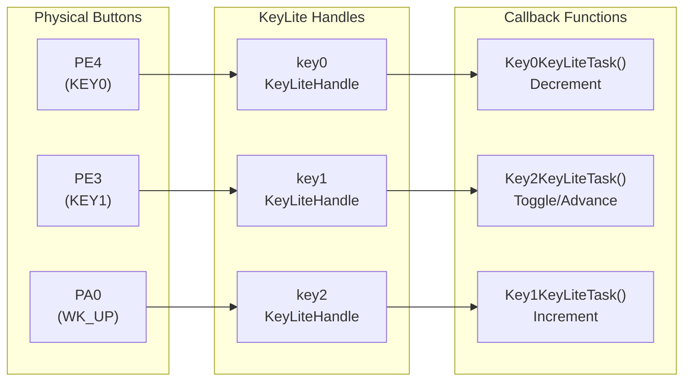

The key initialization [App/Src/task_main.c:381-383]() contains a notable remapping due to hardware pull-up characteristics. The WK_UP button (PA0) has a high-level trigger that causes issues on reset, so the physical-to-logical mapping differs from the expected layout:

| Physical Button | GPIO Pin | KeyLiteHandle | Callback Function | Logical Function |
|-----------------|----------|---------------|-------------------|------------------|
| KEY0 | PE4 | `key0` | `Key0KeyLiteTask()` | Decrement |
| KEY1 | PE3 | `key1` | `Key2KeyLiteTask()` | Toggle/Advance |
| WK_UP | PA0 | `key2` | `Key1KeyLiteTask()` | Increment |

**Sources: ** [App/Src/task_main.c:77](https://github.com/BA2F/STM32-TFTLCD-UI/blob/e0f407ee/App/Src/task_main.c#L77), [App/Src/task_main.c:381-383](https://github.com/BA2F/STM32-TFTLCD-UI/blob/e0f407ee/App/Src/task_main.c#L381-L383), [App/Src/task_main.c:371-380](https://github.com/BA2F/STM32-TFTLCD-UI/blob/e0f407ee/App/Src/task_main.c#L371-L380)

### Key Processing Flow

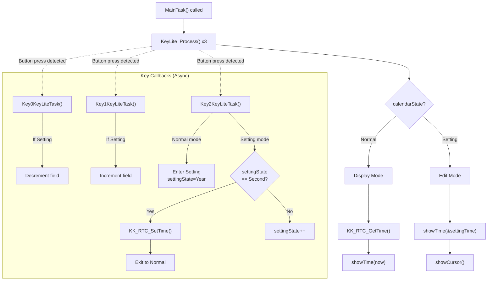

Each key handler performs the following actions:

1. **GPIO Toggle** - Toggles LED pins for visual feedback [App/Src/task_main.c:88]()
2. **UART Debug** - Transmits key identifier string [App/Src/task_main.c:91-93]()
3. **State-dependent Logic** - Modifies time or state based on `calendarState`

**Sources: ** [App/Src/task_main.c:397-399](https://github.com/BA2F/STM32-TFTLCD-UI/blob/e0f407ee/App/Src/task_main.c#L397-L399), [App/Src/task_main.c:85-157](https://github.com/BA2F/STM32-TFTLCD-UI/blob/e0f407ee/App/Src/task_main.c#L85-L157), [App/Src/task_main.c:165-233](https://github.com/BA2F/STM32-TFTLCD-UI/blob/e0f407ee/App/Src/task_main.c#L165-L233), [App/Src/task_main.c:243-281](https://github.com/BA2F/STM32-TFTLCD-UI/blob/e0f407ee/App/Src/task_main.c#L243-L281)

### Key0: Decrement Operation

The `Key0KeyLiteTask()` function [App/Src/task_main.c:85-157]() decrements the current time field with wrap-around logic:

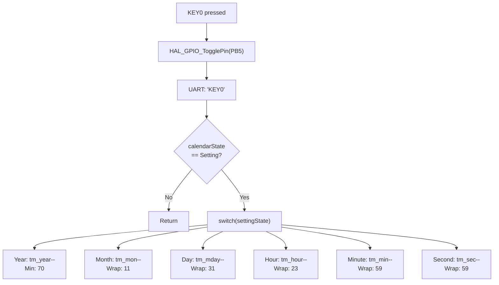

**Sources: ** [App/Src/task_main.c:85-157](https://github.com/BA2F/STM32-TFTLCD-UI/blob/e0f407ee/App/Src/task_main.c#L85-L157)

### Key1: Increment Operation

The `Key1KeyLiteTask()` function [App/Src/task_main.c:165-233]() increments the current time field with wrap-around logic:

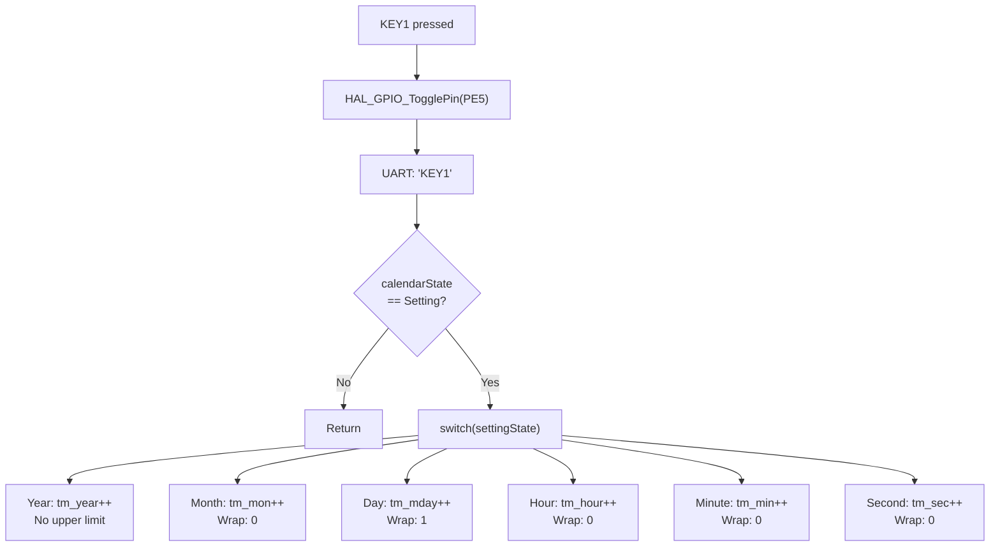

**Sources: ** [App/Src/task_main.c:165-233](https://github.com/BA2F/STM32-TFTLCD-UI/blob/e0f407ee/App/Src/task_main.c#L165-L233)

### Key2: Mode Toggle and Field Advance

The `Key2KeyLiteTask()` function [App/Src/task_main.c:243-281]() handles mode transitions and field navigation:

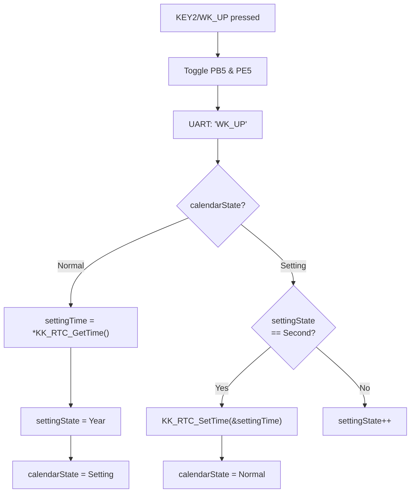

**Sources: ** [App/Src/task_main.c:243-281](https://github.com/BA2F/STM32-TFTLCD-UI/blob/e0f407ee/App/Src/task_main.c#L243-L281)

## Display Management

### Time Display Function

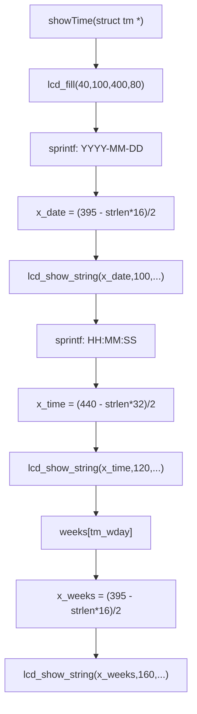

The `showTime()` function [App/Src/task_main.c:301-319]() renders three lines of text:

| Display Line | Y Position | Font Size | Format | Horizontal Alignment |
|--------------|------------|-----------|--------|----------------------|
| Date | 100 | 16px | `YYYY-MM-DD` | Centered (395px width) |
| Time | 120 | 32px | `HH:MM:SS` | Centered (440px width) |
| Weekday | 160 | 16px | Full day name | Centered (395px width) |

The weekday string is retrieved from the `weeks` array [App/Src/task_main.c:16](), which contains English day names indexed by `tm_wday` (0=Sunday, 6=Saturday).

**Sources: ** [App/Src/task_main.c:301-319](https://github.com/BA2F/STM32-TFTLCD-UI/blob/e0f407ee/App/Src/task_main.c#L301-L319), [App/Src/task_main.c:16](https://github.com/BA2F/STM32-TFTLCD-UI/blob/e0f407ee/App/Src/task_main.c#L16)

### Cursor Display and Flashing

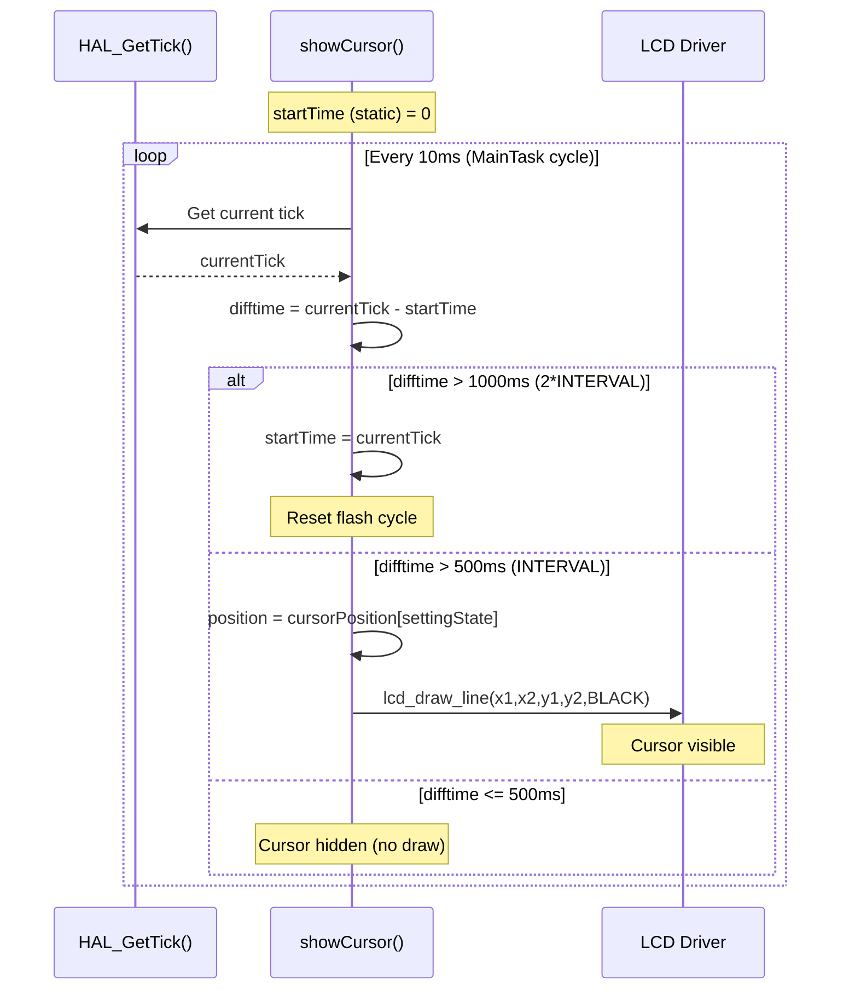

The `showCursor()` function [App/Src/task_main.c:327-356]() implements a flashing cursor with a 500ms interval (`CURSOR_FLASH_INTERVAL` [App/Src/task_main.c:11]()). The cursor positions are predefined in the `cursorPosition` array [App/Src/task_main.c:50-57]():

| Field | Cursor X1 | Cursor X2 | Cursor Y1 | Cursor Y2 |
|-------|-----------|-----------|-----------|-----------|
| Year | 117 | 115 | 149 | 115 |
| Month | 157 | 115 | 173 | 115 |
| Day | 180 | 115 | 196 | 115 |
| Hour | 95 | 150 | 119 | 150 |
| Minute | 146 | 150 | 170 | 150 |
| Second | 192 | 150 | 216 | 150 |

Each cursor is rendered as a horizontal line underneath the corresponding time field using `lcd_draw_line()`.

**Sources: ** [App/Src/task_main.c:327-356](https://github.com/BA2F/STM32-TFTLCD-UI/blob/e0f407ee/App/Src/task_main.c#L327-L356), [App/Src/task_main.c:50-57](https://github.com/BA2F/STM32-TFTLCD-UI/blob/e0f407ee/App/Src/task_main.c#L50-L57), [App/Src/task_main.c:11](https://github.com/BA2F/STM32-TFTLCD-UI/blob/e0f407ee/App/Src/task_main.c#L11)

## Initialization Sequence

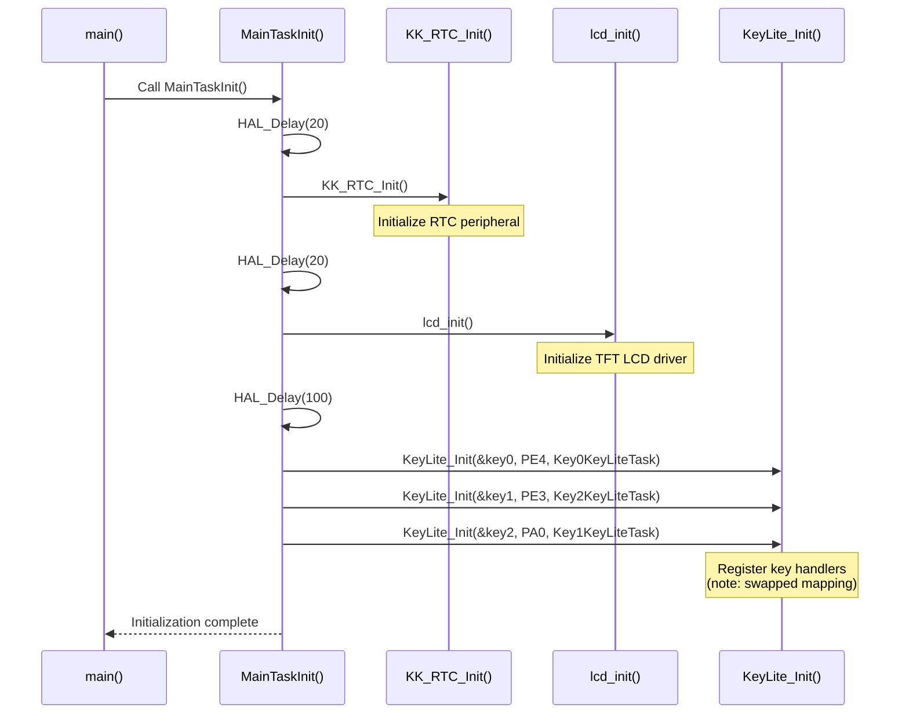

The `MainTaskInit()` function [App/Src/task_main.c:362-384]() performs initialization in the following order:

1. **Initial delay** - 20ms stabilization [App/Src/task_main.c:364]()
2. **RTC initialization** - Configures Real-Time Clock [App/Src/task_main.c:365]()
3. **Post-RTC delay** - 20ms [App/Src/task_main.c:366]()
4. **LCD initialization** - Sets up TFT display driver [App/Src/task_main.c:367]()
5. **LCD stabilization** - 100ms delay [App/Src/task_main.c:368]()
6. **Key handler registration** - Registers callbacks for three buttons [App/Src/task_main.c:381-383]()

The delays ensure hardware peripherals stabilize before use. The key initialization includes a comment [App/Src/task_main.c:371-380]() explaining the non-standard mapping due to WK_UP button pull-up behavior.

**Sources: ** [App/Src/task_main.c:362-384](https://github.com/BA2F/STM32-TFTLCD-UI/blob/e0f407ee/App/Src/task_main.c#L362-L384)

## Task Execution Flow

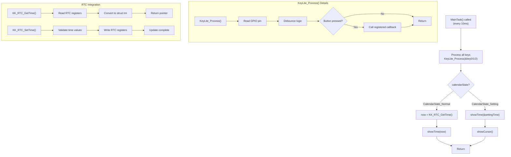

The `MainTask()` function [App/Src/task_main.c:394-424]() executes the following sequence each cycle:

### Key Scanning Phase

Three `KeyLite_Process()` calls [App/Src/task_main.c:397-399]() scan button states and trigger callbacks asynchronously if a press is detected.

### Display Update Phase

The display update behavior depends on `calendarState` [App/Src/task_main.c:402-423]():

**Normal Mode:**
- Call `KK_RTC_GetTime()` to read current time [App/Src/task_main.c:405]()
- Call `showTime(now)` to render the display [App/Src/task_main.c:408]()

**Setting Mode:**
- Call `showTime(&settingTime)` to display the editable time [App/Src/task_main.c:419]()
- Call `showCursor()` to render the flashing cursor [App/Src/task_main.c:422]()

The commented-out `usartTime()` call [App/Src/task_main.c:410-414]() indicates debug output functionality that was disabled due to `HAL_Delay()` blocking behavior.

**Sources: ** [App/Src/task_main.c:394-424](https://github.com/BA2F/STM32-TFTLCD-UI/blob/e0f407ee/App/Src/task_main.c#L394-L424)

## Integration with RTC Peripheral

### RTC Wrapper Functions

The task interfaces with the RTC through wrapper functions defined in the `kk_rtc` module [App/Inc/task_main.h:7]():

| Function | Purpose | Called From |
|----------|---------|-------------|
| `KK_RTC_Init()` | Initialize RTC peripheral | `MainTaskInit()` [App/Src/task_main.c:365]() |
| `KK_RTC_GetTime()` | Read current time into `struct tm*` | `MainTask()` [App/Src/task_main.c:405]() |
| `KK_RTC_SetTime()` | Write `struct tm*` to RTC | `Key2KeyLiteTask()` [App/Src/task_main.c:271]() |

### Time Structure Format

The task uses the standard C library `struct tm` [App/Src/task_main.c:72]() for time representation:

| Field | Range | Notes |
|-------|-------|-------|
| `tm_year` | ≥70 | Years since 1900 (70 = 1970) |
| `tm_mon` | 0-11 | 0 = January, 11 = December |
| `tm_mday` | 1-31 | Day of month |
| `tm_hour` | 0-23 | 24-hour format |
| `tm_min` | 0-59 | Minutes |
| `tm_sec` | 0-59 | Seconds |
| `tm_wday` | 0-6 | 0 = Sunday, 6 = Saturday |

### RTC Peripheral Configuration

The underlying RTC peripheral is configured in [Core/Src/rtc.c:30-62]() with a custom initialization override [Core/Src/rtc.c:34-41]() that bypasses `HAL_RTC_Init()` in favor of the custom `KK_RTC_Init()` wrapper. This allows for application-specific RTC configuration while maintaining HAL structure initialization.

**Sources: ** [App/Inc/task_main.h:7](https://github.com/BA2F/STM32-TFTLCD-UI/blob/e0f407ee/App/Inc/task_main.h#L7), [App/Src/task_main.c:72](https://github.com/BA2F/STM32-TFTLCD-UI/blob/e0f407ee/App/Src/task_main.c#L72), [App/Src/task_main.c:365](https://github.com/BA2F/STM32-TFTLCD-UI/blob/e0f407ee/App/Src/task_main.c#L365), [App/Src/task_main.c:405](https://github.com/BA2F/STM32-TFTLCD-UI/blob/e0f407ee/App/Src/task_main.c#L405), [App/Src/task_main.c:271](https://github.com/BA2F/STM32-TFTLCD-UI/blob/e0f407ee/App/Src/task_main.c#L271), [Core/Src/rtc.c:30-62](https://github.com/BA2F/STM32-TFTLCD-UI/blob/e0f407ee/Core/Src/rtc.c#L30-L62)

## Code-to-System Mapping

### Source File Organization

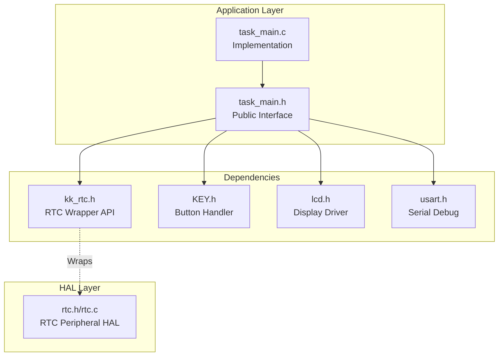

### Key Global Variables

| Variable | Type | Scope | File | Line | Purpose |
|----------|------|-------|------|------|---------|
| `calendarState` | `CalendarState` | Global (extern) | task_main.c | 62 | Current Normal/Setting mode |
| `settingState` | `SettingState` | File-static | task_main.c | 67 | Current field being edited |
| `settingTime` | `struct tm` | File-static | task_main.c | 72 | Time value being edited |
| `cursorPosition` | `CursorPosition[6]` | File-static | task_main.c | 50-57 | Cursor coordinates per field |
| `weeks` | `char[7][10]` | File-static | task_main.c | 16 | Weekday name strings |
| `key0`, `key1`, `key2` | `KeyLiteHandle` | File-static | task_main.c | 77 | Button handler instances |

### Public API Functions

| Function | Signature | File | Purpose |
|----------|-----------|------|---------|
| `MainTaskInit()` | `void MainTaskInit(void)` | [App/Inc/task_main.h:24]() | Initialize calendar task subsystems |
| `MainTask()` | `void MainTask(void)` | [App/Inc/task_main.h:29]() | Execute task cycle (called every 10ms) |

**Sources: ** [App/Src/task_main.c:62](https://github.com/BA2F/STM32-TFTLCD-UI/blob/e0f407ee/App/Src/task_main.c#L62), [App/Src/task_main.c:67](https://github.com/BA2F/STM32-TFTLCD-UI/blob/e0f407ee/App/Src/task_main.c#L67), [App/Src/task_main.c:72](https://github.com/BA2F/STM32-TFTLCD-UI/blob/e0f407ee/App/Src/task_main.c#L72), [App/Src/task_main.c:50-57](https://github.com/BA2F/STM32-TFTLCD-UI/blob/e0f407ee/App/Src/task_main.c#L50-L57), [App/Src/task_main.c:16](https://github.com/BA2F/STM32-TFTLCD-UI/blob/e0f407ee/App/Src/task_main.c#L16), [App/Src/task_main.c:77](https://github.com/BA2F/STM32-TFTLCD-UI/blob/e0f407ee/App/Src/task_main.c#L77), [App/Inc/task_main.h:24](https://github.com/BA2F/STM32-TFTLCD-UI/blob/e0f407ee/App/Inc/task_main.h#L24), [App/Inc/task_main.h:29](https://github.com/BA2F/STM32-TFTLCD-UI/blob/e0f407ee/App/Inc/task_main.h#L29)