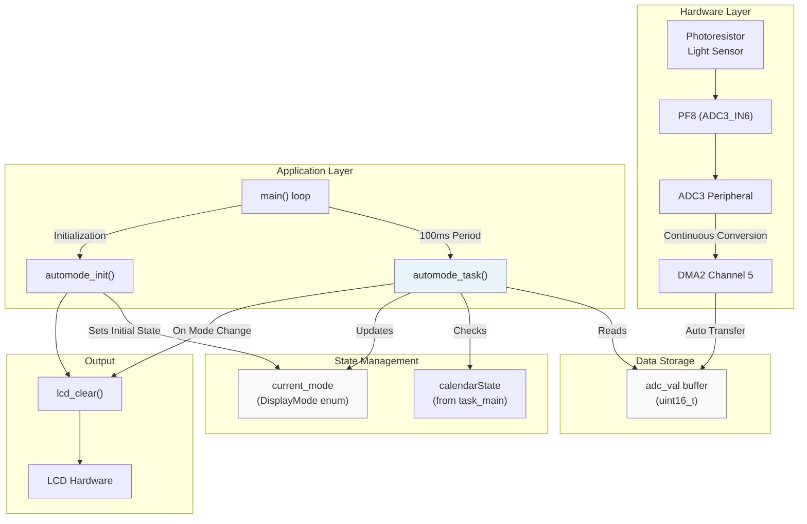
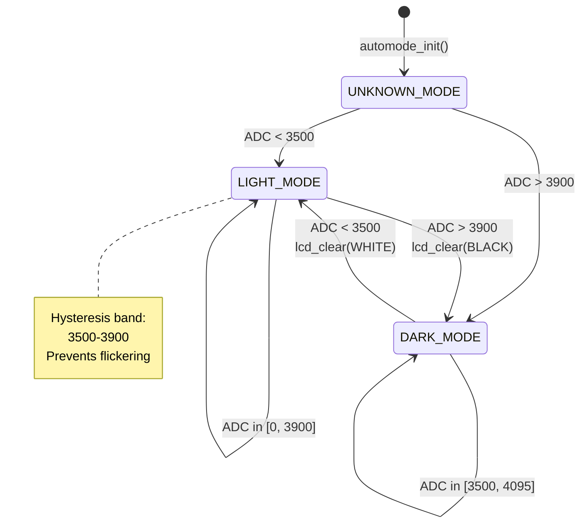
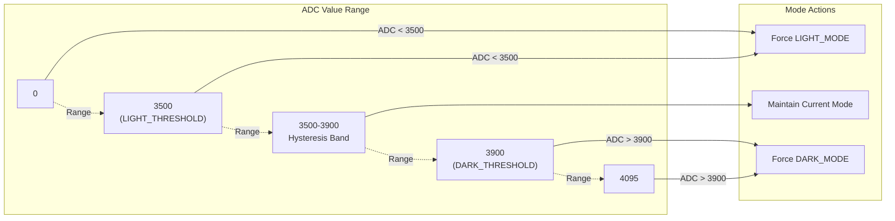
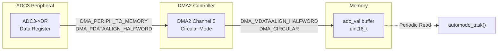
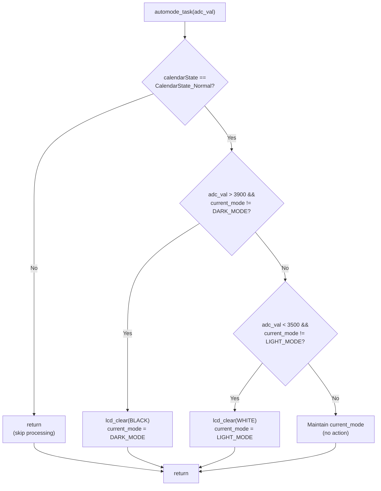

# Auto-Brightness Task

<details>
<summary>Relevant source files</summary>

The following files were used as context for generating this wiki page:

- [App/Inc/task_automode.h](App/Inc/task_automode.h)
- [App/Src/task_automode.c](App/Src/task_automode.c)
- [Core/Inc/adc.h](Core/Inc/adc.h)
- [Core/Src/adc.c](Core/Src/adc.c)

</details>


## Purpose and Scope

This document describes the **Auto-Brightness Task** (`automode_task`), which automatically adapts the LCD display background color based on ambient light conditions. The task reads analog values from a photoresistor light sensor via ADC3 and switches between light mode (white background) and dark mode (black background) using threshold-based control with hysteresis.

For information about the main calendar UI task, see [Calendar Task](#2.2). For details on ADC peripheral configuration, see [ADC and Light Sensor](#4.2). For the main application loop that schedules this task, see [Main Application Loop](#2.1).

---

## Overview

The Auto-Brightness Task provides automatic display adaptation by monitoring ambient light levels and switching the LCD background color accordingly. The system operates at a 100ms update rate and uses a hysteresis band to prevent rapid mode oscillations near threshold boundaries.

**Key Characteristics:**
- **Input**: 12-bit ADC values (0-4095) from photoresistor on pin PF8
- **Output**: LCD background color changes (white or black)
- **Update Rate**: 100ms (called every 10 cycles of the main 10ms loop)
- **Control Method**: Threshold-based with hysteresis
- **Coordination**: Only operates when calendar is in Normal state

Sources: [App/Src/task_automode.c:1-70](https://github.com/BA2F/STM32-TFTLCD-UI/blob/e0f407ee/App/Src/task_automode.c#L1-L70), [App/Inc/task_automode.h:1-36](https://github.com/BA2F/STM32-TFTLCD-UI/blob/e0f407ee/App/Inc/task_automode.h#L1-L36)

---

## System Architecture

### Component Overview



**Diagram: Auto-Brightness Task Component Architecture**

The architecture separates hardware data acquisition (ADC3 + DMA) from application logic (`automode_task`). The DMA continuously transfers ADC readings to a buffer, and the task periodically samples this buffer to make mode decisions.

Sources: [App/Src/task_automode.c:1-70](https://github.com/BA2F/STM32-TFTLCD-UI/blob/e0f407ee/App/Src/task_automode.c#L1-L70), [Core/Src/adc.c:31-71](https://github.com/BA2F/STM32-TFTLCD-UI/blob/e0f407ee/Core/Src/adc.c#L31-L71), [Core/Src/adc.c:93-108](https://github.com/BA2F/STM32-TFTLCD-UI/blob/e0f407ee/Core/Src/adc.c#L93-L108)

---

## State Machine

### Display Mode States

The task implements a simple three-state machine defined by the `DisplayMode` enumeration:

| State | Value | Description | Background Color |
|-------|-------|-------------|------------------|
| `LIGHT_MODE` | 0 | Active in bright ambient light | White (`WHITE`) |
| `DARK_MODE` | 1 | Active in dark ambient light | Black (`BLACK`) |
| `UNKNOWN_MODE` | 2 | Initial state before first mode determination | N/A |

Sources: [App/Src/task_automode.c:10-15](https://github.com/BA2F/STM32-TFTLCD-UI/blob/e0f407ee/App/Src/task_automode.c#L10-L15)

### State Transitions



**Diagram: Display Mode State Machine**

The state machine uses a **hysteresis band** between ADC values 3500 and 3900 to prevent rapid mode switching when ambient light hovers near a single threshold. This 400-count deadband ensures stable operation.

Sources: [App/Src/task_automode.c:54-66](https://github.com/BA2F/STM32-TFTLCD-UI/blob/e0f407ee/App/Src/task_automode.c#L54-L66), [App/Inc/task_automode.h:12-13](https://github.com/BA2F/STM32-TFTLCD-UI/blob/e0f407ee/App/Inc/task_automode.h#L12-L13)

---

## Threshold Configuration

### Threshold Constants

The threshold values are defined in the header file and control the mode switching behavior:

```
DARK_THRESHOLD  = 3900  // Switch to dark mode when ADC exceeds this value
LIGHT_THRESHOLD = 3500  // Switch to light mode when ADC falls below this value
```

Sources: [App/Inc/task_automode.h:12-13](https://github.com/BA2F/STM32-TFTLCD-UI/blob/e0f407ee/App/Inc/task_automode.h#L12-L13), [App/Src/task_automode.c:6-7](https://github.com/BA2F/STM32-TFTLCD-UI/blob/e0f407ee/App/Src/task_automode.c#L6-L7)

### Hysteresis Behavior



**Diagram: Threshold-Based Hysteresis Control**

The hysteresis mechanism ensures that:
- **Rising transition**: Mode changes to `DARK_MODE` only when ADC exceeds 3900
- **Falling transition**: Mode changes to `LIGHT_MODE` only when ADC falls below 3500
- **Deadband**: ADC values between 3500 and 3900 do not trigger mode changes

This prevents oscillation when ambient light conditions are near a threshold boundary.

Sources: [App/Src/task_automode.c:54-68](https://github.com/BA2F/STM32-TFTLCD-UI/blob/e0f407ee/App/Src/task_automode.c#L54-L68)

---

## ADC Configuration

### ADC3 Hardware Setup

The light sensor is connected to **ADC3 Channel 6** on pin **PF8**. The ADC is configured for continuous conversion mode with DMA transfer.

| Parameter | Configuration |
|-----------|---------------|
| Instance | `ADC3` |
| Channel | `ADC_CHANNEL_6` (PF8) |
| Conversion Mode | Continuous (`ENABLE`) |
| Trigger Source | Software trigger |
| Data Alignment | Right-aligned (12-bit: 0-4095) |
| Sampling Time | 71.5 cycles |
| DMA Controller | DMA2 Channel 5 |
| DMA Mode | Circular |
| DMA Priority | Low |

Sources: [Core/Src/adc.c:31-71](https://github.com/BA2F/STM32-TFTLCD-UI/blob/e0f407ee/Core/Src/adc.c#L31-L71), [Core/Src/adc.c:86-91](https://github.com/BA2F/STM32-TFTLCD-UI/blob/e0f407ee/Core/Src/adc.c#L86-L91)

### DMA Transfer Configuration



**Diagram: ADC3 to Memory Data Flow**

The DMA operates in **circular mode**, continuously transferring ADC conversion results to the same memory location. This configuration requires:
- **Peripheral Data Alignment**: Halfword (16-bit) to match ADC data register width
- **Memory Data Alignment**: Halfword (16-bit) to match target buffer type
- **Transfer Direction**: Peripheral-to-memory
- **Memory Increment**: Disabled (single-location circular buffer)

Sources: [Core/Src/adc.c:93-108](https://github.com/BA2F/STM32-TFTLCD-UI/blob/e0f407ee/Core/Src/adc.c#L93-L108)

---

## Task Implementation

### Initialization Function

The `automode_init()` function sets up the initial state and display configuration:

```
Function: automode_init()
Location: App/Src/task_automode.c:28-36
Purpose: Initialize auto-brightness module state

Actions:
1. Set current_mode to UNKNOWN_MODE
2. Clear LCD with WHITE color
3. Update current_mode to LIGHT_MODE
```

The initialization assumes a light environment and sets the display to white background by default.

Sources: [App/Src/task_automode.c:28-36](https://github.com/BA2F/STM32-TFTLCD-UI/blob/e0f407ee/App/Src/task_automode.c#L28-L36)

### Main Task Function



**Diagram: automode_task() Execution Flow**

The task function performs these operations in sequence:

1. **Guard Check**: Verify that `calendarState == CalendarState_Normal` [App/Src/task_automode.c:49-52]()
   - If the calendar is in Setting mode, the task exits immediately
   - This prevents display changes while the user is editing time/date

2. **Dark Mode Check**: If `adc_val > DARK_MODE_THRESHOLD` and not already in dark mode [App/Src/task_automode.c:55-60]()
   - Call `lcd_clear(BLACK)` to change background to black
   - Update `current_mode = DARK_MODE`

3. **Light Mode Check**: If `adc_val < LIGHT_MODE_THRESHOLD` and not already in light mode [App/Src/task_automode.c:61-66]()
   - Call `lcd_clear(WHITE)` to change background to white
   - Update `current_mode = LIGHT_MODE`

4. **Hysteresis**: ADC values between 3500-3900 trigger no action [App/Src/task_automode.c:68]()
   - Current mode is maintained
   - Prevents flickering

Sources: [App/Src/task_automode.c:46-69](https://github.com/BA2F/STM32-TFTLCD-UI/blob/e0f407ee/App/Src/task_automode.c#L46-L69)

---

## Integration with Calendar Task

### State Coordination

The auto-brightness task accesses the global `calendarState` variable to determine if it should operate:

```
External Variable: calendarState (from task_main.c)
Type: CalendarState enum
Referenced at: App/Src/task_automode.c:21, 49
```

**Coordination Logic:**
- **Normal Mode**: Auto-brightness operates normally, adjusting display based on light
- **Setting Mode**: Auto-brightness is disabled to prevent interference during time editing
- **Rationale**: Changing the display background while the user is setting time would disrupt the UI

Sources: [App/Src/task_automode.c:21](https://github.com/BA2F/STM32-TFTLCD-UI/blob/e0f407ee/App/Src/task_automode.c#L21), [App/Src/task_automode.c:49-52](https://github.com/BA2F/STM32-TFTLCD-UI/blob/e0f407ee/App/Src/task_automode.c#L49-L52)

### Task Scheduling Context

From the main application loop perspective:

| Task | Period | Priority | Dependency |
|------|--------|----------|------------|
| `MainTask()` (Calendar) | 10ms | High | None |
| `automode_task()` | 100ms | Low | Reads `calendarState` |

The auto-brightness task runs at 1/10th the frequency of the calendar task, providing sufficient responsiveness for ambient light changes while minimizing LCD clearing overhead.

Sources: Based on system architecture documentation

---

## Display Operations

### LCD Clear Function Usage

The task triggers display mode changes by calling `lcd_clear()` with color parameters:

| Mode Transition | Function Call | Visual Effect |
|----------------|---------------|---------------|
| To Light Mode | `lcd_clear(WHITE)` | Sets entire display background to white |
| To Dark Mode | `lcd_clear(BLACK)` | Sets entire display background to black |

**Performance Note**: The `lcd_clear()` operation is expensive as it writes to every pixel in the frame buffer. The state machine's mode tracking (`current_mode != DARK_MODE` checks) prevents redundant clears when the mode hasn't changed.

Sources: [App/Src/task_automode.c:58](https://github.com/BA2F/STM32-TFTLCD-UI/blob/e0f407ee/App/Src/task_automode.c#L58), [App/Src/task_automode.c:64](https://github.com/BA2F/STM32-TFTLCD-UI/blob/e0f407ee/App/Src/task_automode.c#L64)

---

## Module Interface

### Public Functions

#### `automode_init()`
```
Declaration: App/Inc/task_automode.h:20
Definition: App/Src/task_automode.c:28-36

Purpose: Initialize auto-brightness module
Called by: main() during system startup
Parameters: None
Returns: void
Side Effects: Sets LCD to white background, initializes state to LIGHT_MODE
```

#### `automode_task(uint16_t adc_val)`
```
Declaration: App/Inc/task_automode.h:29
Definition: App/Src/task_automode.c:46-69

Purpose: Execute auto-brightness logic based on current ADC reading
Called by: main() every 100ms
Parameters: 
  - adc_val: Current ADC reading from light sensor (0-4095)
Returns: void
Side Effects: May call lcd_clear() and update current_mode
```

Sources: [App/Inc/task_automode.h:15-29](https://github.com/BA2F/STM32-TFTLCD-UI/blob/e0f407ee/App/Inc/task_automode.h#L15-L29)

---

## Configuration Constants

### Header-Defined Thresholds

```
File: App/Inc/task_automode.h:12-13

#define DARK_THRESHOLD 3900   // Transition to dark mode threshold
#define LIGHT_THRESHOLD 3500  // Transition to light mode threshold
```

These constants define the behavior of the hysteresis control system. To adjust sensitivity:
- **Increase both equally**: Shift the entire transition band toward darker conditions
- **Decrease both equally**: Shift the entire transition band toward brighter conditions
- **Increase the gap**: Widen the hysteresis band for more stable operation
- **Decrease the gap**: Narrow the hysteresis band for faster mode switching (risk of flickering)

**Note**: ADC values are inversely proportional to light intensity for typical photoresistor circuits (higher resistance in dark = higher voltage = higher ADC value).

Sources: [App/Inc/task_automode.h:11-13](https://github.com/BA2F/STM32-TFTLCD-UI/blob/e0f407ee/App/Inc/task_automode.h#L11-L13)

---

## Implementation Notes

### Static State Management

The task maintains internal state using a file-scope static variable:

```
Variable: current_mode
Type: DisplayMode (enum)
Scope: File-static (App/Src/task_automode.c)
Initial Value: UNKNOWN_MODE
Purpose: Track current display mode to prevent redundant LCD operations
```

This design encapsulates the mode state within the module, exposing only the functional interface (`automode_init()` and `automode_task()`) to external code.

Sources: [App/Src/task_automode.c:18](https://github.com/BA2F/STM32-TFTLCD-UI/blob/e0f407ee/App/Src/task_automode.c#L18)

### Mode Change Protection

The task includes dual-condition checks to prevent unnecessary display operations:

1. **Threshold Check**: `adc_val > DARK_THRESHOLD` or `adc_val < LIGHT_THRESHOLD`
2. **Mode Check**: `current_mode != DARK_MODE` or `current_mode != LIGHT_MODE`

This pattern ensures that `lcd_clear()` is only called when an actual mode transition occurs, not on every task iteration when conditions remain stable.

Sources: [App/Src/task_automode.c:55](https://github.com/BA2F/STM32-TFTLCD-UI/blob/e0f407ee/App/Src/task_automode.c#L55), [App/Src/task_automode.c:61](https://github.com/BA2F/STM32-TFTLCD-UI/blob/e0f407ee/App/Src/task_automode.c#L61)