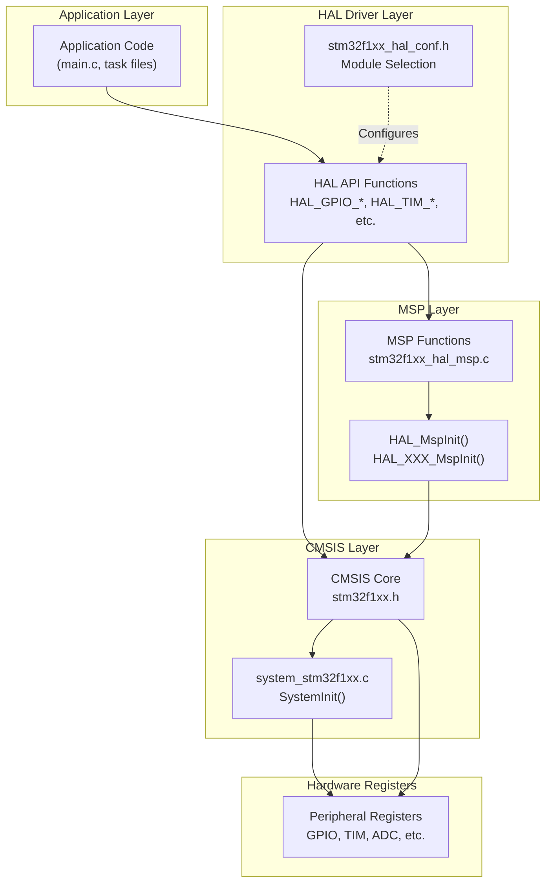
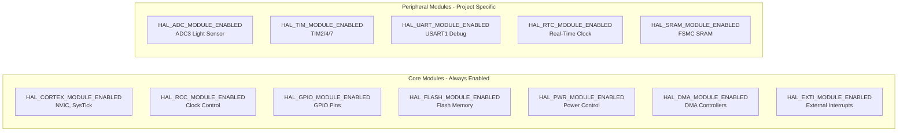
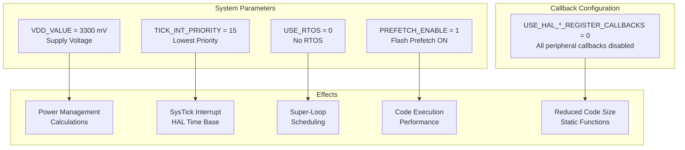
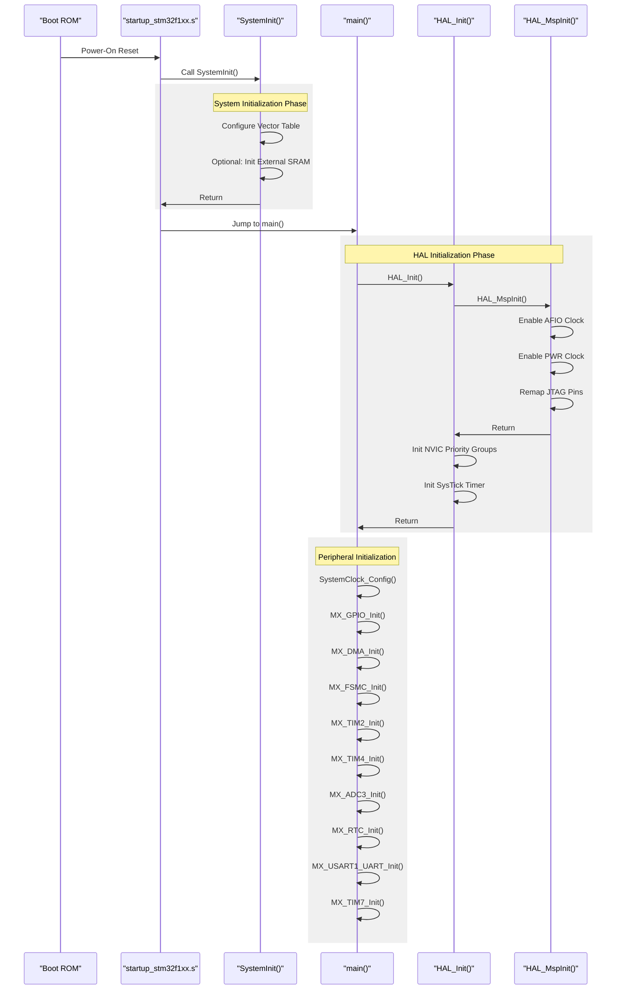
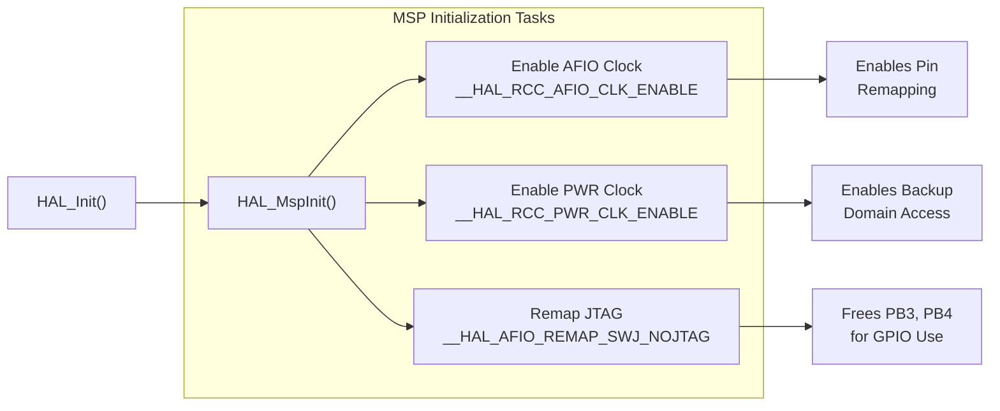
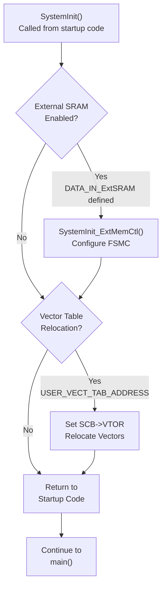
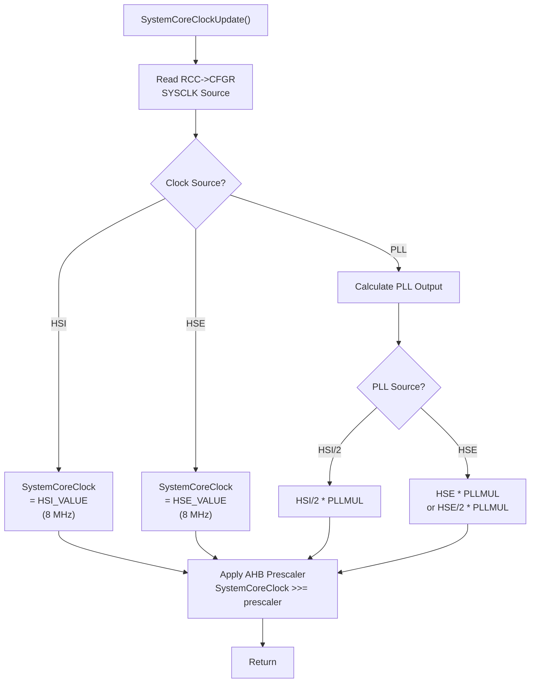
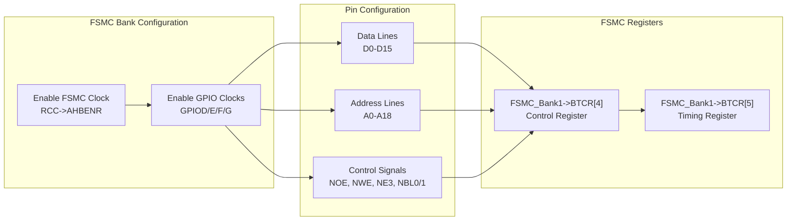
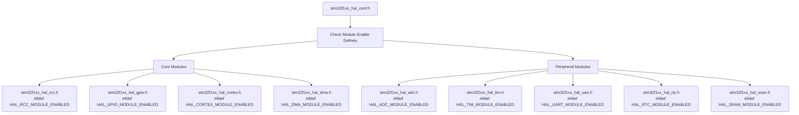

# Hardware Abstraction Layer

<details>
<summary>Relevant source files</summary>

The following files were used as context for generating this wiki page:

- [Core/Inc/stm32f1xx_hal_conf.h](Core/Inc/stm32f1xx_hal_conf.h)
- [Core/Src/stm32f1xx_hal_msp.c](Core/Src/stm32f1xx_hal_msp.c)
- [Core/Src/system_stm32f1xx.c](Core/Src/system_stm32f1xx.c)

</details>


## Purpose and Scope

This document provides an overview of the STM32 Hardware Abstraction Layer (HAL) implementation in this project. The HAL serves as the primary interface between the application code and the microcontroller's hardware peripherals, providing a standardized API that abstracts register-level operations. This page covers the HAL's architecture, module selection, and initialization patterns.

For specific HAL configuration details, see [HAL Configuration](#3.1). For system startup and clock configuration, see [System Initialization](#3.2). For interrupt handling mechanisms, see [Interrupt System](#3.3). For individual peripheral driver implementations, see [Peripheral Drivers](#4).

## Overview

The STM32 HAL is a vendor-provided firmware abstraction layer developed by STMicroelectronics. It provides a consistent API across the STM32 microcontroller family, enabling code portability and simplifying peripheral management. In this project, the HAL handles all low-level hardware operations for peripherals including GPIO, timers, ADC, DMA, USART, RTC, and the FSMC memory controller.

**Sources: ** [Core/Inc/stm32f1xx_hal_conf.h:1-22](https://github.com/BA2F/STM32-TFTLCD-UI/blob/e0f407ee/Core/Inc/stm32f1xx_hal_conf.h#L1-L22)

## HAL Architecture

The HAL follows a multi-layer architecture that separates hardware-specific code from application logic:



**Layer Responsibilities:**

| Layer | Files | Responsibilities |
|-------|-------|------------------|
| **Application** | `main.c`, task files | Business logic, peripheral usage via HAL API |
| **HAL Driver** | `stm32f1xx_hal_*.c/h` | Peripheral control functions, state management |
| **MSP (MCU Support Package)** | `stm32f1xx_hal_msp.c` | Low-level peripheral initialization (clocks, pins, interrupts) |
| **CMSIS** | `stm32f1xx.h`, `system_stm32f1xx.c` | Register definitions, system clock setup |
| **Hardware** | - | Physical peripheral registers |

**Sources: ** [Core/Inc/stm32f1xx_hal_conf.h:1-390](https://github.com/BA2F/STM32-TFTLCD-UI/blob/e0f407ee/Core/Inc/stm32f1xx_hal_conf.h#L1-L390), [Core/Src/stm32f1xx_hal_msp.c:1-87](https://github.com/BA2F/STM32-TFTLCD-UI/blob/e0f407ee/Core/Src/stm32f1xx_hal_msp.c#L1-L87), [Core/Src/system_stm32f1xx.c:1-407](https://github.com/BA2F/STM32-TFTLCD-UI/blob/e0f407ee/Core/Src/system_stm32f1xx.c#L1-L407)

## Enabled HAL Modules

The project selectively enables HAL modules based on the peripherals in use. Module selection occurs in `stm32f1xx_hal_conf.h` through preprocessor definitions:



### Module Selection Table

| Module | Define | Purpose in Project |
|--------|--------|-------------------|
| `HAL_ADC_MODULE_ENABLED` | [stm32f1xx_hal_conf.h:37]() | ADC3 for photoresistor light sensor readings |
| `HAL_DMA_MODULE_ENABLED` | [stm32f1xx_hal_conf.h:45,73]() | DMA1 (USART), DMA2 (ADC3) data transfers |
| `HAL_GPIO_MODULE_ENABLED` | [stm32f1xx_hal_conf.h:48,76]() | Keys, LEDs, LCD backlight control |
| `HAL_RTC_MODULE_ENABLED` | [stm32f1xx_hal_conf.h:60]() | Calendar and timekeeping functionality |
| `HAL_SRAM_MODULE_ENABLED` | [stm32f1xx_hal_conf.h:66]() | FSMC interface to external SRAM for LCD |
| `HAL_TIM_MODULE_ENABLED` | [stm32f1xx_hal_conf.h:67]() | TIM2/TIM4/TIM7 for time bases and PWM |
| `HAL_UART_MODULE_ENABLED` | [stm32f1xx_hal_conf.h:68]() | USART1 for debug serial communication |
| `HAL_CORTEX_MODULE_ENABLED` | [stm32f1xx_hal_conf.h:72]() | NVIC interrupt configuration |
| `HAL_FLASH_MODULE_ENABLED` | [stm32f1xx_hal_conf.h:74]() | Flash memory access and wait states |
| `HAL_EXTI_MODULE_ENABLED` | [stm32f1xx_hal_conf.h:75]() | External interrupt line configuration |
| `HAL_PWR_MODULE_ENABLED` | [stm32f1xx_hal_conf.h:77]() | Power management and backup domain |
| `HAL_RCC_MODULE_ENABLED` | [stm32f1xx_hal_conf.h:78]() | Reset and clock control |

**Disabled Modules:** CAN, CEC, CRC, DAC, ETH, I2C, I2S, IRDA, IWDG, NOR, NAND, PCCARD, PCD, HCD, SD, MMC, SDRAM, SMARTCARD, SPI, USART, WWDG

**Sources: ** [Core/Inc/stm32f1xx_hal_conf.h:31-79](https://github.com/BA2F/STM32-TFTLCD-UI/blob/e0f407ee/Core/Inc/stm32f1xx_hal_conf.h#L31-L79)

## Oscillator Configuration

The HAL configuration defines the system's oscillator values, which are critical for clock generation and peripheral timing:

| Oscillator | Symbol | Value | Purpose |
|------------|--------|-------|---------|
| External High Speed | `HSE_VALUE` | 8 MHz | System clock source (via PLL) |
| Internal High Speed | `HSI_VALUE` | 8 MHz | Backup clock source |
| External Low Speed | `LSE_VALUE` | 32.768 kHz | RTC clock source |
| Internal Low Speed | `LSI_VALUE` | 40 kHz | Watchdog and RTC backup |

**Timeout Values:**

- `HSE_STARTUP_TIMEOUT`: 100 ms - Maximum time for HSE to stabilize
- `LSE_STARTUP_TIMEOUT`: 5000 ms - Maximum time for LSE to stabilize

**Sources: ** [Core/Inc/stm32f1xx_hal_conf.h:80-122](https://github.com/BA2F/STM32-TFTLCD-UI/blob/e0f407ee/Core/Inc/stm32f1xx_hal_conf.h#L80-L122), [Core/Src/system_stm32f1xx.c:76-84](https://github.com/BA2F/STM32-TFTLCD-UI/blob/e0f407ee/Core/Src/system_stm32f1xx.c#L76-L84)

## System Configuration Parameters

The HAL system configuration defines operational parameters:



**Key Configuration Details:**

- **VDD_VALUE** ([stm32f1xx_hal_conf.h:131]()): Set to 3300 mV (3.3V), used for ADC reference voltage calculations
- **TICK_INT_PRIORITY** ([stm32f1xx_hal_conf.h:132]()): Priority 15 (lowest) for SysTick, allowing all other interrupts to preempt HAL timeouts
- **USE_RTOS** ([stm32f1xx_hal_conf.h:133]()): Disabled - system uses super-loop architecture instead of RTOS
- **PREFETCH_ENABLE** ([stm32f1xx_hal_conf.h:134]()): Enabled - flash prefetch buffer improves performance when executing from flash
- **Callback Registration** ([stm32f1xx_hal_conf.h:136-158]()): All set to 0, meaning callback functions are not dynamically registered (reduces overhead)

**Sources: ** [Core/Inc/stm32f1xx_hal_conf.h:127-159](https://github.com/BA2F/STM32-TFTLCD-UI/blob/e0f407ee/Core/Inc/stm32f1xx_hal_conf.h#L127-L159)

## HAL Initialization Sequence

The HAL initialization follows a specific sequence to ensure proper hardware configuration:



**Sources: ** [Core/Src/system_stm32f1xx.c:175-187](https://github.com/BA2F/STM32-TFTLCD-UI/blob/e0f407ee/Core/Src/system_stm32f1xx.c#L175-L187), [Core/Src/stm32f1xx_hal_msp.c:63-82](https://github.com/BA2F/STM32-TFTLCD-UI/blob/e0f407ee/Core/Src/stm32f1xx_hal_msp.c#L63-L82)

## MSP (MCU Support Package) Layer

The MSP layer provides low-level hardware initialization for HAL peripherals. It acts as a bridge between the HAL driver layer and hardware-specific configuration.

### HAL_MspInit Function

The `HAL_MspInit()` function performs global MCU-level initialization:



**Function Purpose:**

- **AFIO Clock**: Required for alternate function pin remapping and EXTI configuration
- **PWR Clock**: Necessary for backup domain access (RTC, backup registers)
- **JTAG Remapping**: Disables JTAG interface but keeps SWD for debugging, freeing up PB3, PB4, PA15 pins for GPIO use

**Implementation Details:**

- Located in: [Core/Src/stm32f1xx_hal_msp.c:63-82]()
- Called automatically by: `HAL_Init()` in the HAL initialization sequence
- Clock enables: [stm32f1xx_hal_msp.c:70-71]()
- JTAG remap: [stm32f1xx_hal_msp.c:77]()

**Sources: ** [Core/Src/stm32f1xx_hal_msp.c:63-82](https://github.com/BA2F/STM32-TFTLCD-UI/blob/e0f407ee/Core/Src/stm32f1xx_hal_msp.c#L63-L82)

## System Core Functions

The `system_stm32f1xx.c` file provides CMSIS-required system functions:

### SystemInit

The `SystemInit()` function is called before `main()` to perform minimal system setup:



**Function Behavior:**

1. **External SRAM Initialization** ([system_stm32f1xx.c:177-180]()): If `DATA_IN_ExtSRAM` is defined, configures FSMC Bank1 for external SRAM before C runtime initialization
2. **Vector Table Relocation** ([system_stm32f1xx.c:184-186]()): If `USER_VECT_TAB_ADDRESS` is defined, relocates the interrupt vector table
3. **Default Operation**: In this project, both options are disabled, so `SystemInit()` simply returns

**Sources: ** [Core/Src/system_stm32f1xx.c:175-187](https://github.com/BA2F/STM32-TFTLCD-UI/blob/e0f407ee/Core/Src/system_stm32f1xx.c#L175-L187)

### SystemCoreClock Variable

The `SystemCoreClock` global variable holds the current CPU core clock frequency:

| Variable | Type | Initial Value | Purpose |
|----------|------|---------------|---------|
| `SystemCoreClock` | `uint32_t` | 8000000 (8 MHz) | Current HCLK frequency in Hz |
| `AHBPrescTable` | `const uint8_t[16]` | Prescaler lookup | Converts RCC register values to prescaler shifts |
| `APBPrescTable` | `const uint8_t[8]` | Prescaler lookup | Converts RCC register values to prescaler shifts |

**Update Mechanisms:**

The `SystemCoreClock` variable is automatically updated by:
1. `SystemCoreClockUpdate()` - Manual update function
2. `HAL_RCC_GetHCLKFreq()` - HAL API call
3. `HAL_RCC_ClockConfig()` - Automatic update when system clock changes

**Sources: ** [Core/Src/system_stm32f1xx.c:129-147](https://github.com/BA2F/STM32-TFTLCD-UI/blob/e0f407ee/Core/Src/system_stm32f1xx.c#L129-L147), [Core/Src/system_stm32f1xx.c:224-330](https://github.com/BA2F/STM32-TFTLCD-UI/blob/e0f407ee/Core/Src/system_stm32f1xx.c#L224-L330)

### SystemCoreClockUpdate

The `SystemCoreClockUpdate()` function recalculates `SystemCoreClock` based on current RCC register values:



**Calculation Details:**

- Reads system clock source from `RCC->CFGR` register ([system_stm32f1xx.c:237]())
- For PLL mode, calculates based on PLL multiplier and source ([system_stm32f1xx.c:247-318]())
- Applies AHB prescaler from `RCC->CFGR` to get final HCLK ([system_stm32f1xx.c:325-329]())
- Uses lookup tables `AHBPrescTable` for prescaler conversion ([system_stm32f1xx.c:142]())

**Sources: ** [Core/Src/system_stm32f1xx.c:224-330](https://github.com/BA2F/STM32-TFTLCD-UI/blob/e0f407ee/Core/Src/system_stm32f1xx.c#L224-L330)

## External SRAM Configuration

For STM32F103xE/G high-density devices, the system supports optional external SRAM configuration:



**Configuration Values:**

- **Bank Used**: FSMC Bank1 SRAM3 (NE3)
- **Control Register** ([system_stm32f1xx.c:390]()): `0x00001091` - Enables memory bank with specific timing
- **Timing Register** ([system_stm32f1xx.c:391]()): `0x00110212` - Sets address setup, data setup, and bus turnaround times

**GPIO Pin Mapping:**

| Port | Configuration | Purpose |
|------|---------------|---------|
| GPIOD | CRL: `0x44BB44BB`, CRH: `0xBBBBBBBB` | Data lines and address lines |
| GPIOE | CRL: `0xB44444BB`, CRH: `0xBBBBBBBB` | Data lines and control signals |
| GPIOF | CRL: `0x44BBBBBBB`, CRH: `0xBBBB4444` | Address lines |
| GPIOG | CRL: `0x44BBBBBBB`, CRH: `0x444B4B44` | Control signals (NE3) |

**Note**: In this project, `DATA_IN_ExtSRAM` is not defined, so this configuration is inactive. However, the FSMC is still used for LCD interfacing (configured separately in peripheral initialization).

**Sources: ** [Core/Src/system_stm32f1xx.c:332-394](https://github.com/BA2F/STM32-TFTLCD-UI/blob/e0f407ee/Core/Src/system_stm32f1xx.c#L332-L394)

## HAL Naming Conventions

The HAL follows consistent naming patterns for functions and types:

### Function Naming

| Pattern | Example | Purpose |
|---------|---------|---------|
| `HAL_XXX_Init()` | `HAL_GPIO_Init()` | Initialize peripheral |
| `HAL_XXX_DeInit()` | `HAL_GPIO_DeInit()` | De-initialize peripheral |
| `HAL_XXX_MspInit()` | `HAL_GPIO_MspInit()` | MSP-level initialization (user-defined) |
| `HAL_XXX_MspDeInit()` | `HAL_GPIO_MspDeInit()` | MSP-level de-initialization (user-defined) |
| `HAL_XXX_Start()` | `HAL_ADC_Start()` | Start peripheral operation |
| `HAL_XXX_Stop()` | `HAL_ADC_Stop()` | Stop peripheral operation |
| `HAL_XXX_Start_IT()` | `HAL_ADC_Start_IT()` | Start with interrupts |
| `HAL_XXX_Start_DMA()` | `HAL_ADC_Start_DMA()` | Start with DMA |
| `HAL_XXX_IRQHandler()` | `HAL_ADC_IRQHandler()` | Interrupt handler |
| `HAL_XXX_Callback()` | `HAL_ADC_ConvCpltCallback()` | Weak callback function |

### Macro Naming

| Pattern | Example | Purpose |
|---------|---------|---------|
| `__HAL_RCC_XXX_CLK_ENABLE()` | `__HAL_RCC_GPIOA_CLK_ENABLE()` | Enable peripheral clock |
| `__HAL_RCC_XXX_CLK_DISABLE()` | `__HAL_RCC_GPIOA_CLK_DISABLE()` | Disable peripheral clock |
| `__HAL_XXX_GET_FLAG()` | `__HAL_ADC_GET_FLAG()` | Read status flag |
| `__HAL_XXX_CLEAR_FLAG()` | `__HAL_ADC_CLEAR_FLAG()` | Clear status flag |
| `__HAL_XXX_ENABLE_IT()` | `__HAL_ADC_ENABLE_IT()` | Enable interrupt |
| `__HAL_XXX_DISABLE_IT()` | `__HAL_ADC_DISABLE_IT()` | Disable interrupt |

**Sources: ** [Core/Inc/stm32f1xx_hal_conf.h:1-390](https://github.com/BA2F/STM32-TFTLCD-UI/blob/e0f407ee/Core/Inc/stm32f1xx_hal_conf.h#L1-L390)

## Header File Inclusion Order

The HAL configuration file includes peripheral headers in a specific order:



**Inclusion Guards:**

Each peripheral header is conditionally included based on its enable define:

```
#ifdef HAL_RCC_MODULE_ENABLED
#include "stm32f1xx_hal_rcc.h"
#endif /* HAL_RCC_MODULE_ENABLED */
```

This ensures only the necessary peripheral drivers are compiled, reducing code size and compilation time.

**Sources: ** [Core/Inc/stm32f1xx_hal_conf.h:232-368](https://github.com/BA2F/STM32-TFTLCD-UI/blob/e0f407ee/Core/Inc/stm32f1xx_hal_conf.h#L232-L368)

## Key Takeaways

1. **Modular Design**: The HAL uses preprocessor definitions to enable only required peripheral modules, minimizing code size
2. **Three-Layer Architecture**: Application code → HAL API → MSP layer → Hardware registers provides clear separation of concerns
3. **Weak Callbacks**: HAL uses weak callback functions that applications can override for custom behavior
4. **Static Configuration**: This project disables dynamic callback registration for reduced overhead
5. **System Initialization Order**: SystemInit() → HAL_Init() → HAL_MspInit() → Peripheral Init is critical for proper operation
6. **Clock-First Pattern**: All peripheral initialization requires enabling peripheral clocks first via RCC
7. **CMSIS Foundation**: HAL builds on CMSIS-Core for register access and system initialization

For detailed peripheral initialization sequences, see [Peripheral Drivers](#4). For specific clock configuration details, see [System Initialization](#3.2).