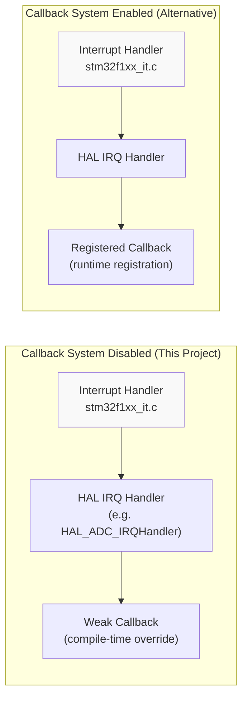
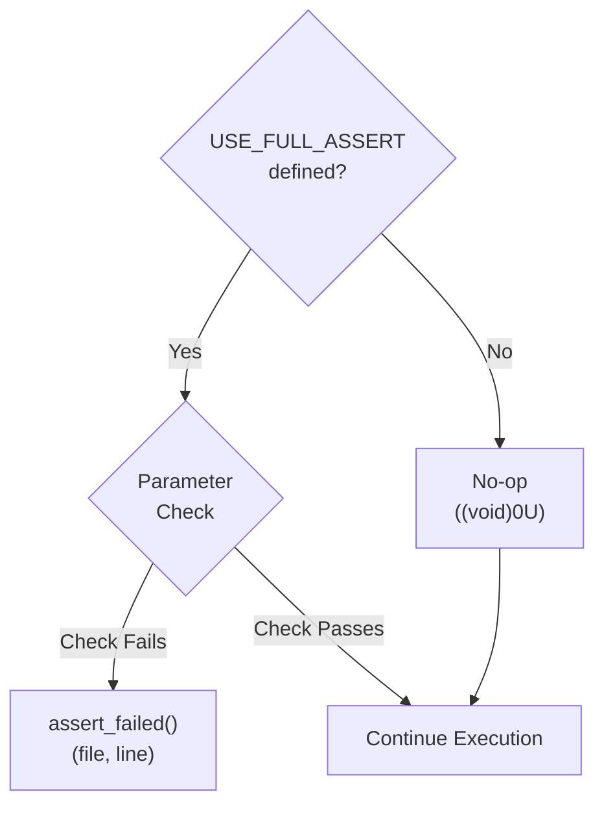
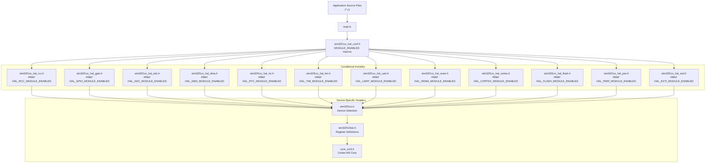

# HAL Configuration

<details>
<summary>Relevant source files</summary>

The following files were used as context for generating this wiki page:

- [.mxproject](.mxproject)
- [Core/Inc/stm32f1xx_hal_conf.h](Core/Inc/stm32f1xx_hal_conf.h)

</details>


## Purpose and Scope

This page documents the HAL (Hardware Abstraction Layer) configuration for the STM32-TFTLCD-UI project, specifically the compile-time settings defined in `stm32f1xx_hal_conf.h`. This file controls which HAL peripheral modules are compiled into the firmware, configures oscillator frequencies, and sets system-wide HAL parameters.

For information about how the HAL is initialized at runtime, see [System Initialization](#3.2). For details on specific peripheral driver configurations, see [Peripheral Drivers](#4).

---

## HAL Module Selection

The project selectively enables only the HAL modules required for operation, reducing code size and compilation time. Module selection is controlled via preprocessor macros in [Core/Inc/stm32f1xx_hal_conf.h:36-78]().

### Enabled HAL Modules

The following table lists all enabled HAL modules and their purposes in this project:

| Module | Macro | Purpose |
|--------|-------|---------|
| **Core HAL** | `HAL_MODULE_ENABLED` | Base HAL functionality, time base management |
| **ADC** | `HAL_ADC_MODULE_ENABLED` | Light sensor reading via ADC3 |
| **DMA** | `HAL_DMA_MODULE_ENABLED` | DMA transfers for ADC and USART |
| **GPIO** | `HAL_GPIO_MODULE_ENABLED` | Key inputs, LED outputs, LCD backlight control |
| **RTC** | `HAL_RTC_MODULE_ENABLED` | Calendar and timekeeping functionality |
| **SRAM** | `HAL_SRAM_MODULE_ENABLED` | External SRAM access via FSMC for LCD framebuffer |
| **TIM** | `HAL_TIM_MODULE_ENABLED` | Timer peripherals (TIM2, TIM4, TIM7) for time base and PWM |
| **UART** | `HAL_UART_MODULE_ENABLED` | Serial communication via USART1 for debugging |
| **CORTEX** | `HAL_CORTEX_MODULE_ENABLED` | NVIC and SysTick configuration |
| **FLASH** | `HAL_FLASH_MODULE_ENABLED` | Flash memory operations |
| **PWR** | `HAL_PWR_MODULE_ENABLED` | Power management |
| **RCC** | `HAL_RCC_MODULE_ENABLED` | Clock control and configuration |
| **EXTI** | `HAL_EXTI_MODULE_ENABLED` | External interrupt management |

### Disabled HAL Modules

The following modules are explicitly disabled (commented out) to minimize firmware size:

- CAN, CEC, CRC, DAC, Ethernet (ETH)
- I2C, I2S, IRDA, IWDG
- MMC, NAND, NOR, PCCARD
- PCD, HCD, SD, SDRAM
- Smartcard, SPI, USART, WWDG

**Sources: ** [Core/Inc/stm32f1xx_hal_conf.h:36-78](https://github.com/BA2F/STM32-TFTLCD-UI/blob/e0f407ee/Core/Inc/stm32f1xx_hal_conf.h#L36-L78)

---

## HAL Module Dependency Graph

```mermaid
graph TB
    subgraph "Application Layer"
        APP["Application Code<br/>(main.c, tasks)"]
    end
    
    subgraph "HAL Module Layer"
        HAL_CORE["HAL_MODULE_ENABLED<br/>stm32f1xx_hal.h"]
        HAL_ADC["HAL_ADC_MODULE_ENABLED<br/>stm32f1xx_hal_adc.h"]
        HAL_DMA["HAL_DMA_MODULE_ENABLED<br/>stm32f1xx_hal_dma.h"]
        HAL_GPIO["HAL_GPIO_MODULE_ENABLED<br/>stm32f1xx_hal_gpio.h"]
        HAL_RTC["HAL_RTC_MODULE_ENABLED<br/>stm32f1xx_hal_rtc.h"]
        HAL_SRAM["HAL_SRAM_MODULE_ENABLED<br/>stm32f1xx_hal_sram.h"]
        HAL_TIM["HAL_TIM_MODULE_ENABLED<br/>stm32f1xx_hal_tim.h"]
        HAL_UART["HAL_UART_MODULE_ENABLED<br/>stm32f1xx_hal_uart.h"]
        HAL_RCC["HAL_RCC_MODULE_ENABLED<br/>stm32f1xx_hal_rcc.h"]
        HAL_CORTEX["HAL_CORTEX_MODULE_ENABLED<br/>stm32f1xx_hal_cortex.h"]
        HAL_FLASH["HAL_FLASH_MODULE_ENABLED<br/>stm32f1xx_hal_flash.h"]
        HAL_PWR["HAL_PWR_MODULE_ENABLED<br/>stm32f1xx_hal_pwr.h"]
        HAL_EXTI["HAL_EXTI_MODULE_ENABLED<br/>stm32f1xx_hal_exti.h"]
    end
    
    subgraph "Low-Level Drivers"
        LL_FSMC["stm32f1xx_ll_fsmc.h<br/>FSMC Low-Level Driver"]
        LL_RTC["stm32f1xx_ll_rtc.h<br/>RTC Low-Level Driver"]
        LL_TIM["stm32f1xx_ll_tim.h<br/>Timer Low-Level Driver"]
        LL_ADC["stm32f1xx_ll_adc.h<br/>ADC Low-Level Driver"]
        LL_DMA["stm32f1xx_ll_dma.h<br/>DMA Low-Level Driver"]
        LL_GPIO["stm32f1xx_ll_gpio.h<br/>GPIO Low-Level Driver"]
        LL_USART["stm32f1xx_ll_usart.h<br/>USART Low-Level Driver"]
    end
    
    subgraph "CMSIS Layer"
        CMSIS["CMSIS Core<br/>STM32F1xx Device Headers"]
    end
    
    APP --> HAL_CORE
    APP --> HAL_ADC
    APP --> HAL_GPIO
    APP --> HAL_RTC
    APP --> HAL_SRAM
    APP --> HAL_TIM
    APP --> HAL_UART
    
    HAL_CORE --> HAL_RCC
    HAL_CORE --> HAL_CORTEX
    HAL_CORE --> HAL_FLASH
    
    HAL_ADC --> HAL_DMA
    HAL_ADC --> LL_ADC
    HAL_UART --> HAL_DMA
    HAL_UART --> LL_USART
    HAL_SRAM --> LL_FSMC
    HAL_RTC --> LL_RTC
    HAL_TIM --> LL_TIM
    HAL_GPIO --> LL_GPIO
    HAL_DMA --> LL_DMA
    
    HAL_RCC --> CMSIS
    HAL_CORTEX --> CMSIS
    HAL_FLASH --> CMSIS
    HAL_ADC --> CMSIS
    HAL_DMA --> CMSIS
    HAL_GPIO --> CMSIS
    HAL_RTC --> CMSIS
    HAL_SRAM --> CMSIS
    HAL_TIM --> CMSIS
    HAL_UART --> CMSIS
    HAL_PWR --> CMSIS
    HAL_EXTI --> CMSIS
```



This diagram shows the dependency relationships between HAL modules. Core modules (`HAL_RCC`, `HAL_CORTEX`, `HAL_FLASH`) are required by the base HAL. Peripheral-specific modules depend on DMA where applicable, and many modules also include corresponding Low-Level (LL) drivers for direct register access.

**Sources: ** [Core/Inc/stm32f1xx_hal_conf.h:237-367](https://github.com/BA2F/STM32-TFTLCD-UI/blob/e0f407ee/Core/Inc/stm32f1xx_hal_conf.h#L237-L367)

---

## Oscillator Configuration

The HAL requires precise oscillator frequency values to calculate system clocks, baud rates, and peripheral timings correctly. These values are defined as preprocessor macros and must match the hardware crystal frequencies.

### Oscillator Values Summary

| Oscillator | Macro | Value | Purpose |
|------------|-------|-------|---------|
| **HSE** | `HSE_VALUE` | 8,000,000 Hz (8 MHz) | External high-speed oscillator, system clock source |
| **HSI** | `HSI_VALUE` | 8,000,000 Hz (8 MHz) | Internal high-speed oscillator, backup clock source |
| **LSE** | `LSE_VALUE` | 32,768 Hz (32.768 kHz) | External low-speed oscillator, RTC clock source |
| **LSI** | `LSI_VALUE` | 40,000 Hz (40 kHz) | Internal low-speed oscillator, watchdog/RTC backup |

### High-Speed External Oscillator (HSE)

[Core/Inc/stm32f1xx_hal_conf.h:86-92]() defines the HSE configuration:

```
#define HSE_VALUE    8000000U /*!< Value of the External oscillator in Hz */
#define HSE_STARTUP_TIMEOUT    100U   /*!< Time out for HSE start up, in ms */
```

The 8 MHz HSE crystal serves as the primary clock source for the STM32F103xE. The system clock configuration (see [System Initialization](#3.2)) multiplies this via the PLL to achieve the maximum 72 MHz core frequency. The 100 ms startup timeout ensures the oscillator stabilizes before use.

### High-Speed Internal Oscillator (HSI)

[Core/Inc/stm32f1xx_hal_conf.h:99-101]() defines the HSI configuration:

```
#define HSI_VALUE    8000000U /*!< Value of the Internal oscillator in Hz*/
```

The HSI is an RC oscillator that provides a backup clock source if HSE fails. It has approximately ±1% accuracy at 25°C, which is insufficient for USB or precision timing but adequate for system startup.

### Low-Speed External Oscillator (LSE)

[Core/Inc/stm32f1xx_hal_conf.h:116-122]() defines the LSE configuration:

```
#define LSE_VALUE    32768U /*!< Value of the External oscillator in Hz*/
#define LSE_STARTUP_TIMEOUT    5000U   /*!< Time out for LSE start up, in ms */
```

The 32.768 kHz LSE crystal is specifically chosen because it divides evenly to 1 Hz (2^15 = 32768), making it ideal for calendar/clock applications. This oscillator drives the RTC peripheral for accurate timekeeping.

### Low-Speed Internal Oscillator (LSI)

[Core/Inc/stm32f1xx_hal_conf.h:106-110]() defines the LSI configuration:

```
#define LSI_VALUE               40000U    /*!< LSI Typical Value in Hz */
```

The LSI is an RC oscillator with approximately ±40% tolerance. It serves as a backup for the RTC if LSE is unavailable or as a clock source for the independent watchdog (IWDG).

**Sources: ** [Core/Inc/stm32f1xx_hal_conf.h:80-125](https://github.com/BA2F/STM32-TFTLCD-UI/blob/e0f407ee/Core/Inc/stm32f1xx_hal_conf.h#L80-L125)

---

## System Configuration Parameters

### Core System Settings

The following table documents system-wide HAL configuration parameters defined in [Core/Inc/stm32f1xx_hal_conf.h:131-134]():

| Parameter | Value | Description |
|-----------|-------|-------------|
| `VDD_VALUE` | 3300 mV | Supply voltage for analog references (ADC) |
| `TICK_INT_PRIORITY` | 15 | SysTick interrupt priority (lowest, preemptable) |
| `USE_RTOS` | 0 | RTOS support disabled (bare-metal application) |
| `PREFETCH_ENABLE` | 1 | Flash prefetch buffer enabled for 72 MHz operation |

### SysTick Priority Configuration

The `TICK_INT_PRIORITY` value of 15 (lowest priority on ARM Cortex-M3) ensures that:
- Time-critical peripheral interrupts (ADC, DMA, UART) preempt SysTick
- HAL timeout mechanisms still function but don't block urgent operations
- The HAL time base increments via `HAL_IncTick()` called from `SysTick_Handler()`

### Prefetch Buffer

Enabling `PREFETCH_ENABLE` is critical for 72 MHz operation. The STM32F103xE flash memory has only 2 wait states at this frequency, but the prefetch buffer pre-loads the next instruction while the current one executes, significantly improving performance for sequential code execution.

**Sources: ** [Core/Inc/stm32f1xx_hal_conf.h:127-134](https://github.com/BA2F/STM32-TFTLCD-UI/blob/e0f407ee/Core/Inc/stm32f1xx_hal_conf.h#L127-L134)

---

## HAL Register Callback Configuration

All HAL register callback mechanisms are explicitly disabled in [Core/Inc/stm32f1xx_hal_conf.h:136-158]():

```
#define USE_HAL_ADC_REGISTER_CALLBACKS         0U
#define USE_HAL_RTC_REGISTER_CALLBACKS         0U
#define USE_HAL_TIM_REGISTER_CALLBACKS         0U
#define USE_HAL_UART_REGISTER_CALLBACKS        0U
/* ... all other callbacks set to 0U ... */
```

### Callback System Overview



### Rationale for Disabling Callbacks

Disabling register callbacks provides several advantages for this embedded application:

1. **Reduced Code Size**: Callback registration infrastructure adds approximately 100-200 bytes per peripheral module
2. **Simplified Call Stack**: Direct weak callback invocation eliminates function pointer indirection
3. **Compile-Time Safety**: Callback functions are resolved at link time, preventing null pointer dereferences
4. **Single-Instance Design**: The application uses one instance of each peripheral, eliminating runtime callback switching

The project overrides weak callback functions (e.g., `HAL_ADC_ConvCpltCallback()`) directly in application code, which is simpler and more efficient for single-instance use cases.

**Sources: ** [Core/Inc/stm32f1xx_hal_conf.h:136-158](https://github.com/BA2F/STM32-TFTLCD-UI/blob/e0f407ee/Core/Inc/stm32f1xx_hal_conf.h#L136-L158)

---

## Assert Configuration

### Assert Macro Definition

The `USE_FULL_ASSERT` macro controls parameter validation in HAL functions. It is disabled by default in [Core/Inc/stm32f1xx_hal_conf.h:165]():

```
/* #define USE_FULL_ASSERT    1U */
```

### Assert Behavior

When `USE_FULL_ASSERT` is undefined (production builds):
- The `assert_param()` macro expands to `((void)0U)` (no-op)
- All parameter validation code is eliminated by the preprocessor
- Firmware size is minimized
- Execution speed is maximized

When `USE_FULL_ASSERT` is defined (debug builds):
- The `assert_param()` macro checks expressions and calls `assert_failed()` on failure
- Failed assertions report the source file and line number
- Developer must implement `assert_failed()` function
- Useful during development to catch API misuse

### Assert Macro Implementation



### Recommended Usage

For development and testing:
```c
#define USE_FULL_ASSERT    1U

void assert_failed(uint8_t *file, uint32_t line) {
    // Log error via UART or halt execution
    printf("Assert failed: %s:%lu\
", file, line);
    while(1);
}
```

For production releases, leave `USE_FULL_ASSERT` undefined to optimize for size and speed.

**Sources: ** [Core/Inc/stm32f1xx_hal_conf.h:160-384](https://github.com/BA2F/STM32-TFTLCD-UI/blob/e0f407ee/Core/Inc/stm32f1xx_hal_conf.h#L160-L384)

---

## HAL Header Include Chain

The HAL configuration file conditionally includes peripheral-specific headers based on enabled modules. The include chain follows this structure:



### Include Mechanism

The conditional include pattern in [Core/Inc/stm32f1xx_hal_conf.h:237-367]() ensures only required headers are compiled:

```c
#ifdef HAL_RCC_MODULE_ENABLED
#include "stm32f1xx_hal_rcc.h"
#endif /* HAL_RCC_MODULE_ENABLED */

#ifdef HAL_GPIO_MODULE_ENABLED
#include "stm32f1xx_hal_gpio.h"
#endif /* HAL_GPIO_MODULE_ENABLED */
```

This mechanism:
- Prevents compilation errors from unused modules
- Reduces preprocessor overhead
- Makes dependency relationships explicit
- Allows fine-grained control of code size

**Sources: ** [Core/Inc/stm32f1xx_hal_conf.h:232-367](https://github.com/BA2F/STM32-TFTLCD-UI/blob/e0f407ee/Core/Inc/stm32f1xx_hal_conf.h#L232-L367)

---

## Configuration File Management

### STM32CubeMX Integration

The `stm32f1xx_hal_conf.h` file is generated by STM32CubeMX based on the `.ioc` project configuration. The `.mxproject` file tracks the configuration state.

**Important:** Modifications to `stm32f1xx_hal_conf.h` should be made in USER CODE sections to prevent them from being overwritten when regenerating code from STM32CubeMX:

```c
/* USER CODE BEGIN <section_name> */
// Custom configuration here
/* USER CODE END <section_name> */
```

### Build System Integration

The HAL configuration affects the build system through:

1. **Include Paths**: The path to `Core/Inc` must be in the compiler's include search path
2. **Preprocessor Defines**: `USE_HAL_DRIVER` and `STM32F103xE` must be defined
3. **Source Files**: Only source files for enabled modules need to be compiled

The `.mxproject` file documents these requirements in [.mxproject:6-7]():
```
HeaderPath=..\Drivers\STM32F1xx_HAL_Driver\Inc;...;..\Core\Inc;
CDefines=USE_HAL_DRIVER;STM32F103xE;USE_HAL_DRIVER;USE_HAL_DRIVER;
```

**Sources: ** [.mxproject:1-40](https://github.com/BA2F/STM32-TFTLCD-UI/blob/e0f407ee/.mxproject#L1-L40), [Core/Inc/stm32f1xx_hal_conf.h:1-390](https://github.com/BA2F/STM32-TFTLCD-UI/blob/e0f407ee/Core/Inc/stm32f1xx_hal_conf.h#L1-L390)

---

## Summary

The HAL configuration establishes the foundation for all hardware access in the STM32-TFTLCD-UI project:

- **Selective Module Compilation**: Only 13 of 30+ available HAL modules are enabled, minimizing code size
- **Oscillator Definitions**: 8 MHz HSE and 32.768 kHz LSE provide precise system and RTC clocks
- **System Parameters**: 3.3V VDD, SysTick priority 15, RTOS disabled, prefetch enabled
- **Callback Mechanism**: Disabled for reduced code size and simplified call paths
- **Assert Configuration**: Disabled in production for optimal performance
- **Modular Include Chain**: Conditional compilation based on enabled modules

This configuration is optimized for a bare-metal, single-instance peripheral application with minimal memory footprint and maximum execution speed.

**Sources: ** [Core/Inc/stm32f1xx_hal_conf.h:1-390](https://github.com/BA2F/STM32-TFTLCD-UI/blob/e0f407ee/Core/Inc/stm32f1xx_hal_conf.h#L1-L390)