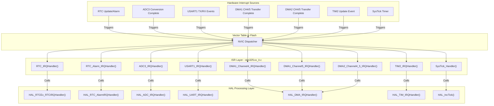
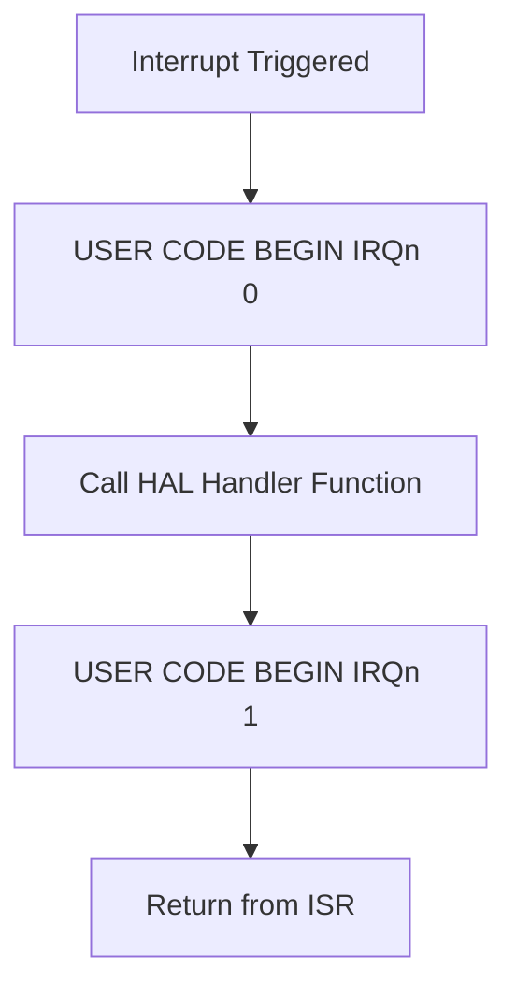
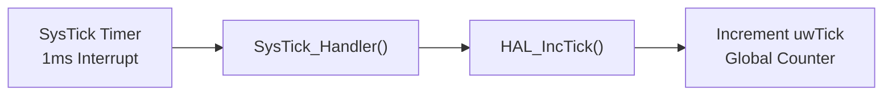
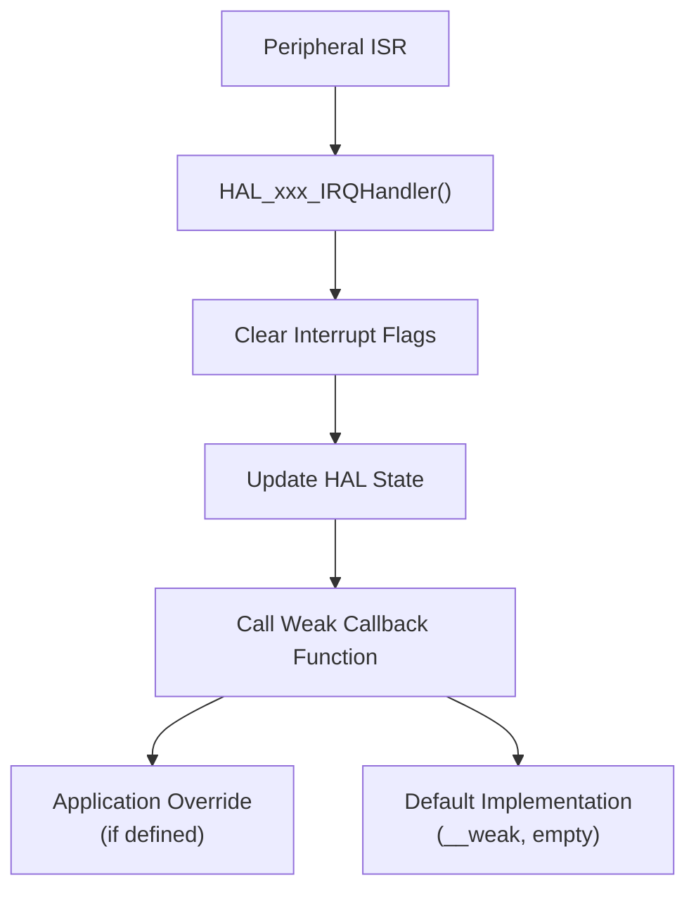
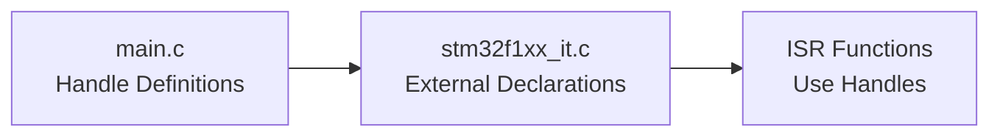

# Interrupt System

Relevant source files

The following files were used as context for generating this wiki page:

- [Core/Inc/stm32f1xx_hal_conf.h](Core/Inc/stm32f1xx_hal_conf.h)
- [Core/Inc/stm32f1xx_it.h](Core/Inc/stm32f1xx_it.h)
- [Core/Src/stm32f1xx_it.c](Core/Src/stm32f1xx_it.c)

## Purpose and Scope

This document describes the interrupt handling architecture in the STM32-TFTLCD-UI application. It covers the interrupt service routine (ISR) implementations, the interrupt vector table, HAL interrupt processing, and the relationship between hardware interrupts and application-level event handling.

For information about peripheral-specific configurations that generate interrupts (ADC, DMA, timers), see the respective peripheral documentation under [Peripheral Drivers](#4). For system initialization that configures the NVIC, see [System Initialization](#3.2).

---

## Interrupt Architecture Overview

The STM32 interrupt system follows the **CMSIS-HAL three-layer architecture** pattern. This design separates hardware-specific interrupt handling from portable HAL logic and application callbacks.

The three layers are:

1. **Hardware Layer**: Peripheral events trigger interrupts through the Nested Vectored Interrupt Controller (NVIC)
2. **ISR Dispatch Layer**: Thin wrapper functions in [Core/Src/stm32f1xx_it.c]() that dispatch to HAL handlers
3. **HAL Processing Layer**: HAL library functions that clear flags, manage state, and invoke application callbacks

**Sources**: System architecture diagrams (Diagram 6: Interrupt System Architecture)

---

## Interrupt Flow Architecture

The following diagram shows how interrupts flow from hardware sources through the vector table to HAL processing and application callbacks:

**Sources**: [Core/Src/stm32f1xx_it.c:207-317](), [Core/Inc/stm32f1xx_it.h:49-65]()

---

## Cortex-M3 Exception Handlers

The Cortex-M3 processor defines a set of system exception handlers that handle fault conditions and system services. These are implemented as infinite loops in fault conditions, as recovery from these exceptions is typically not possible in embedded systems.

### Exception Handler Functions

| Exception | Handler Function | Purpose | Implementation |
|-----------|-----------------|---------|----------------|
| Non-Maskable Interrupt | `NMI_Handler()` | Critical system failures | Enters infinite loop |
| Hard Fault | `HardFault_Handler()` | Memory access violations, bus errors | Enters infinite loop |
| Memory Management | `MemManage_Handler()` | MPU violations | Enters infinite loop |
| Bus Fault | `BusFault_Handler()` | Prefetch/memory access faults | Enters infinite loop |
| Usage Fault | `UsageFault_Handler()` | Undefined instructions, illegal states | Enters infinite loop |
| Supervisor Call | `SVC_Handler()` | System service calls (unused) | Empty handler |
| Debug Monitor | `DebugMon_Handler()` | Debug events | Empty handler |
| PendSV | `PendSV_Handler()` | Pendable service request (unused) | Empty handler |

All fault handlers [Core/Src/stm32f1xx_it.c:75-145]() trap execution in an infinite loop to prevent the system from continuing in an undefined state. This is standard practice for bare-metal embedded systems without exception recovery mechanisms.

**Sources**: [Core/Src/stm32f1xx_it.c:72-184](), [Core/Inc/stm32f1xx_it.h:49-57]()

---

## Peripheral Interrupt Handlers

Peripheral interrupt handlers follow a consistent pattern: each ISR calls the appropriate HAL handler function, passing a pointer to the peripheral's handle structure. The HAL handler clears interrupt flags, updates internal state, and may invoke weak callback functions.

### Active Peripheral Interrupts

The following table maps peripheral interrupt sources to their handler functions and the HAL functions they invoke:

| Peripheral | ISR Function | HAL Handler | Handle Variable | Purpose |
|------------|--------------|-------------|-----------------|---------|
| RTC | `RTC_IRQHandler()` | `HAL_RTCEx_RTCIRQHandler(&hrtc)` | `hrtc` | RTC update events |
| RTC Alarm | `RTC_Alarm_IRQHandler()` | `HAL_RTC_AlarmIRQHandler(&hrtc)` | `hrtc` | RTC alarm via EXTI line 17 |
| ADC3 | `ADC3_IRQHandler()` | `HAL_ADC_IRQHandler(&hadc3)` | `hadc3` | ADC conversion complete |
| USART1 | `USART1_IRQHandler()` | `HAL_UART_IRQHandler(&huart1)` | `huart1` | UART TX/RX events |
| TIM2 | `TIM2_IRQHandler()` | `HAL_TIM_IRQHandler(&htim2)` | `htim2` | Timer update events |
| DMA1 CH4 | `DMA1_Channel4_IRQHandler()` | `HAL_DMA_IRQHandler(&hdma_usart1_tx)` | `hdma_usart1_tx` | USART1 TX DMA complete |
| DMA1 CH5 | `DMA1_Channel5_IRQHandler()` | `HAL_DMA_IRQHandler(&hdma_usart1_rx)` | `hdma_usart1_rx` | USART1 RX DMA complete |
| DMA2 CH4/5 | `DMA2_Channel4_5_IRQHandler()` | `HAL_DMA_IRQHandler(&hdma_adc3)` | `hdma_adc3` | ADC3 DMA complete |

**Sources**: [Core/Src/stm32f1xx_it.c:207-317](), [Core/Src/stm32f1xx_it.c:57-64]()

---

## ISR Implementation Pattern

All peripheral ISRs follow the same implementation pattern, which provides user code insertion points before and after the HAL handler call:

Example from [Core/Src/stm32f1xx_it.c:292-303]():

- Lines 296-298: `USER CODE BEGIN ADC3_IRQn 0` - code executes before HAL processing
- Line 299: `HAL_ADC_IRQHandler(&hadc3)` - HAL clears flags and processes interrupt
- Lines 300-302: `USER CODE BEGIN ADC3_IRQn 1` - code executes after HAL processing

This pattern allows developers to add custom interrupt handling logic while preserving the HAL's interrupt processing and flag clearing.

**Sources**: [Core/Src/stm32f1xx_it.c:292-303](), [Core/Src/stm32f1xx_it.c:224-233]()

---

## SysTick Timer Interrupt

The `SysTick_Handler()` is a special system interrupt that provides the HAL's time base for timeout mechanisms and delay functions. It is configured to fire at regular intervals (typically 1ms).

### SysTick Handler Implementation

The implementation [Core/Src/stm32f1xx_it.c:186-198]() calls `HAL_IncTick()` which increments the global `uwTick` variable. This counter is used by:

- `HAL_Delay()` - blocking delay function
- HAL timeout mechanisms in peripheral functions
- Application time tracking (if needed)

The SysTick priority is configured in [Core/Inc/stm32f1xx_hal_conf.h:132]() as `TICK_INT_PRIORITY = 15U`, making it the lowest priority interrupt to ensure it doesn't preempt critical peripheral interrupts.

**Sources**: [Core/Src/stm32f1xx_it.c:186-198](), [Core/Inc/stm32f1xx_hal_conf.h:132]()

---

## Interrupt Priority Configuration

The STM32F1xx uses a 4-bit priority field, allowing 16 priority levels (0-15, where 0 is highest priority). The system uses the default NVIC priority grouping, which allocates these bits between preemption priority and sub-priority.

### Priority Assignment

The HAL configuration defines the SysTick interrupt priority:

| Setting | Value | Description |
|---------|-------|-------------|
| `TICK_INT_PRIORITY` | 15 | Lowest priority - ensures SysTick doesn't preempt peripherals |

This is defined at [Core/Inc/stm32f1xx_hal_conf.h:132](). All other peripheral interrupts use the default priority level assigned during initialization in [Core/Src/main.c]().

The priority configuration ensures:
- Critical data transfers (DMA) can preempt timer interrupts
- Time-critical peripherals can interrupt non-critical ones
- SysTick always runs at lowest priority as it only increments a counter

**Sources**: [Core/Inc/stm32f1xx_hal_conf.h:132]()

---

## HAL Callback Mechanism

The HAL library implements a weak function callback mechanism that allows application code to respond to interrupt events without modifying the HAL source code.

### Callback Invocation Flow

### Common Callback Functions

The HAL defines weak callback functions for various interrupt events. Applications can override these by providing their own implementations:

| Peripheral | Callback Function | Event |
|------------|-------------------|-------|
| ADC | `HAL_ADC_ConvCpltCallback()` | Conversion complete |
| ADC DMA | `HAL_ADC_ConvHalfCpltCallback()` | Half transfer complete |
| UART | `HAL_UART_TxCpltCallback()` | Transmit complete |
| UART | `HAL_UART_RxCpltCallback()` | Receive complete |
| DMA | `HAL_DMA_XferCpltCallback()` | Transfer complete |
| DMA | `HAL_DMA_XferHalfCpltCallback()` | Half transfer complete |
| Timer | `HAL_TIM_PeriodElapsedCallback()` | Timer period elapsed |
| RTC | `HAL_RTC_AlarmAEventCallback()` | RTC Alarm A triggered |

The HAL configuration [Core/Inc/stm32f1xx_hal_conf.h:136-158]() shows that all peripheral callback registration is disabled (`USE_HAL_xxx_REGISTER_CALLBACKS = 0U`), meaning the application uses the simpler weak callback override pattern rather than the dynamic callback registration mechanism.

**Sources**: [Core/Inc/stm32f1xx_hal_conf.h:136-158]()

---

## External Variable Dependencies

The interrupt handlers in [Core/Src/stm32f1xx_it.c]() require access to peripheral handle structures that are defined and initialized elsewhere in the application. These handles are declared as external variables:

The following handles are declared at [Core/Src/stm32f1xx_it.c:58-64]():

| Handle Variable | Type | Peripheral |
|-----------------|------|------------|
| `hdma_adc3` | `DMA_HandleTypeDef` | DMA2 Channel 5 for ADC3 |
| `hadc3` | `ADC_HandleTypeDef` | ADC3 peripheral |
| `hrtc` | `RTC_HandleTypeDef` | Real-Time Clock |
| `htim2` | `TIM_HandleTypeDef` | Timer 2 |
| `hdma_usart1_rx` | `DMA_HandleTypeDef` | DMA1 Channel 5 for USART1 RX |
| `hdma_usart1_tx` | `DMA_HandleTypeDef` | DMA1 Channel 4 for USART1 TX |
| `huart1` | `UART_HandleTypeDef` | USART1 peripheral |

These handles are passed to HAL functions within the ISRs, allowing the HAL to access peripheral configuration and state information.

**Sources**: [Core/Src/stm32f1xx_it.c:57-64]()

---

## Interrupt Vector Table

The interrupt vector table is defined in the startup assembly file and contains function pointers to all interrupt handlers. When an interrupt occurs, the NVIC uses this table to jump to the appropriate handler function.

### Vector Table Structure

The vector table maps IRQ numbers to handler functions declared in [Core/Inc/stm32f1xx_it.h:49-65](). The table is located in Flash memory at the beginning of the program image.

The application uses the following peripheral interrupts:

| IRQ Name | Handler Function | Peripheral/Event |
|----------|------------------|------------------|
| `RTC_IRQn` | `RTC_IRQHandler()` | RTC global interrupt |
| `DMA1_Channel4_IRQn` | `DMA1_Channel4_IRQHandler()` | DMA1 channel 4 (USART1 TX) |
| `DMA1_Channel5_IRQn` | `DMA1_Channel5_IRQHandler()` | DMA1 channel 5 (USART1 RX) |
| `TIM2_IRQn` | `TIM2_IRQHandler()` | Timer 2 global interrupt |
| `USART1_IRQn` | `USART1_IRQHandler()` | USART1 global interrupt |
| `RTC_Alarm_IRQn` | `RTC_Alarm_IRQHandler()` | RTC alarm via EXTI line 17 |
| `ADC3_IRQn` | `ADC3_IRQHandler()` | ADC3 global interrupt |
| `DMA2_Channel4_5_IRQn` | `DMA2_Channel4_5_IRQHandler()` | DMA2 channels 4 and 5 (ADC3) |

**Sources**: [Core/Inc/stm32f1xx_it.h:49-65]()

---

## HAL Module Configuration

The interrupt system depends on several HAL modules being enabled in the configuration file. The following modules are required for interrupt processing:

### Core HAL Modules

Defined at [Core/Inc/stm32f1xx_hal_conf.h:72-78]():

- `HAL_CORTEX_MODULE_ENABLED` - NVIC and SysTick configuration
- `HAL_DMA_MODULE_ENABLED` - DMA interrupt handling
- `HAL_EXTI_MODULE_ENABLED` - External interrupt line support (for RTC alarm)

### Peripheral HAL Modules

Defined at [Core/Inc/stm32f1xx_hal_conf.h:37-68]():

- `HAL_ADC_MODULE_ENABLED` - ADC interrupt support
- `HAL_RTC_MODULE_ENABLED` - RTC interrupt support
- `HAL_TIM_MODULE_ENABLED` - Timer interrupt support
- `HAL_UART_MODULE_ENABLED` - UART interrupt support
- `HAL_GPIO_MODULE_ENABLED` - GPIO (used by peripherals)

These modules must be enabled for their respective interrupt handlers to compile and function correctly.

**Sources**: [Core/Inc/stm32f1xx_hal_conf.h:36-78]()

---

## Interrupt-Driven Data Flow

The interrupt system enables autonomous data transfer without CPU intervention, improving system efficiency. The following diagram shows how interrupts enable data flow in the application:

```mermaid
graph TB
    subgraph "Light Sensor Path"
        LIGHT["Photoresistor"] -->|"Analog"| ADC["ADC3 Conversion"]
        ADC -->|"DMA Request"| DMA_ADC["DMA2 CH5 Transfer"]
        DMA_ADC -->|"Interrupt"| DMA_ADC_ISR["DMA2_Channel4_5_IRQHandler()"]
        DMA_ADC_ISR -->|"Buffer Updated"| APP_ADC["adc_val buffer<br/>read by automode_task"]
    end
    
    subgraph "UART Debug Path"
        APP_UART["Application"] -->|"TX Request"| UART["USART1 Transmit"]
        UART -->|"DMA Request"| DMA_TX["DMA1 CH4 Transfer"]
        DMA_TX -->|"Interrupt"| DMA_TX_ISR["DMA1_Channel4_IRQHandler()"]
        DMA_TX_ISR -->|"Complete"| APP_TX_CB["HAL_UART_TxCpltCallback()"]
    end
    
    subgraph "Timer Timebase"
        TIM_HW["TIM2 Hardware"] -->|"Update Event"| TIM_INT["TIM2 Interrupt"]
        TIM_INT --> TIM_ISR["TIM2_IRQHandler()"]
        TIM_ISR -->|"Callback"| APP_TIM["HAL_TIM_PeriodElapsedCallback()"]
    end
    
    subgraph "System Timebase"
        SYSTICK_HW["SysTick Timer"] -->|"1ms Tick"| SYSTICK_INT["SysTick Interrupt"]
        SYSTICK_INT --> SYSTICK_ISR["SysTick_Handler()"]
        SYSTICK_ISR -->|"Increment"| TICK_VAR["uwTick variable"]
        TICK_VAR -->|"Used by"| HAL_DELAY["HAL_Delay()<br/>Timeout functions"]
    end
```

This architecture demonstrates how interrupts enable efficient background processing:
- ADC conversions complete automatically via DMA interrupts
- UART transmission proceeds without blocking the CPU
- Timers provide precise timing events for application tasks
- SysTick maintains system time for HAL functions

**Sources**: [Core/Src/stm32f1xx_it.c:224-317]()