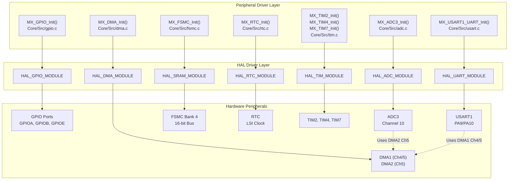
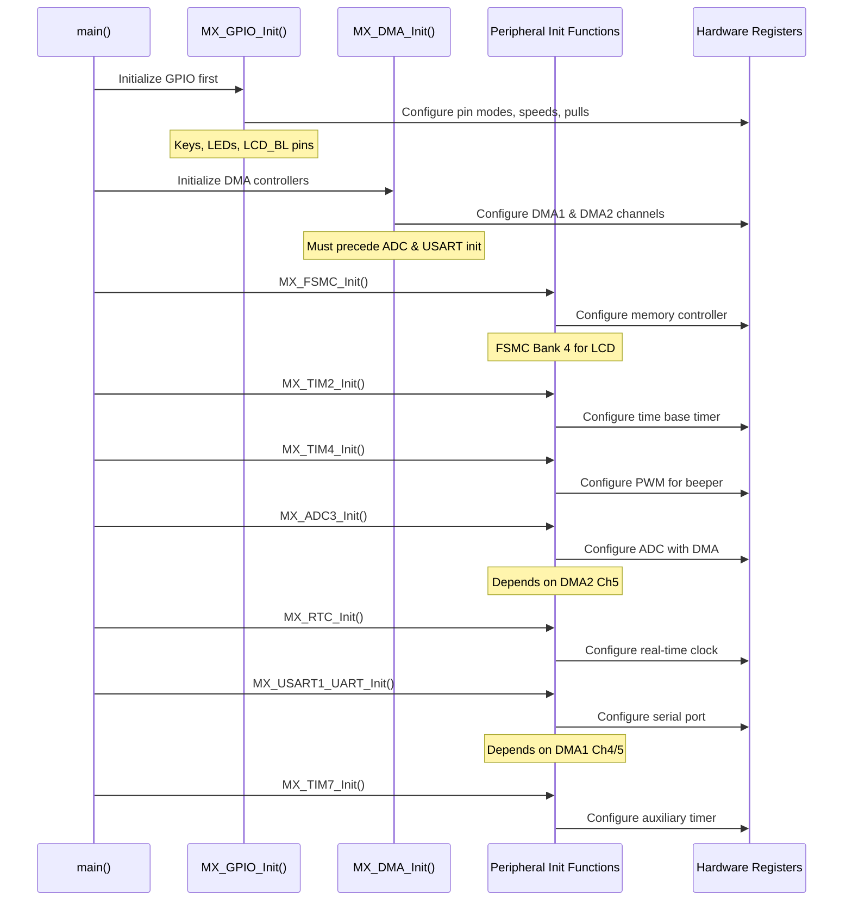
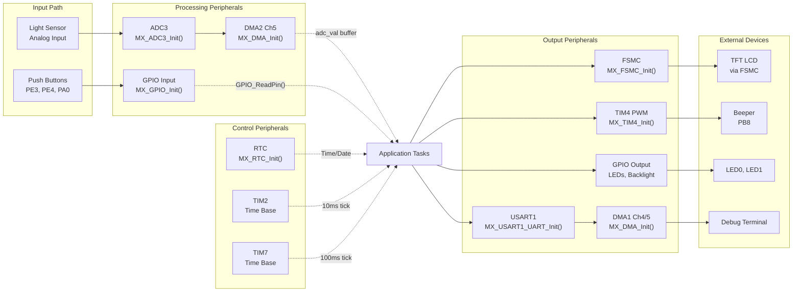
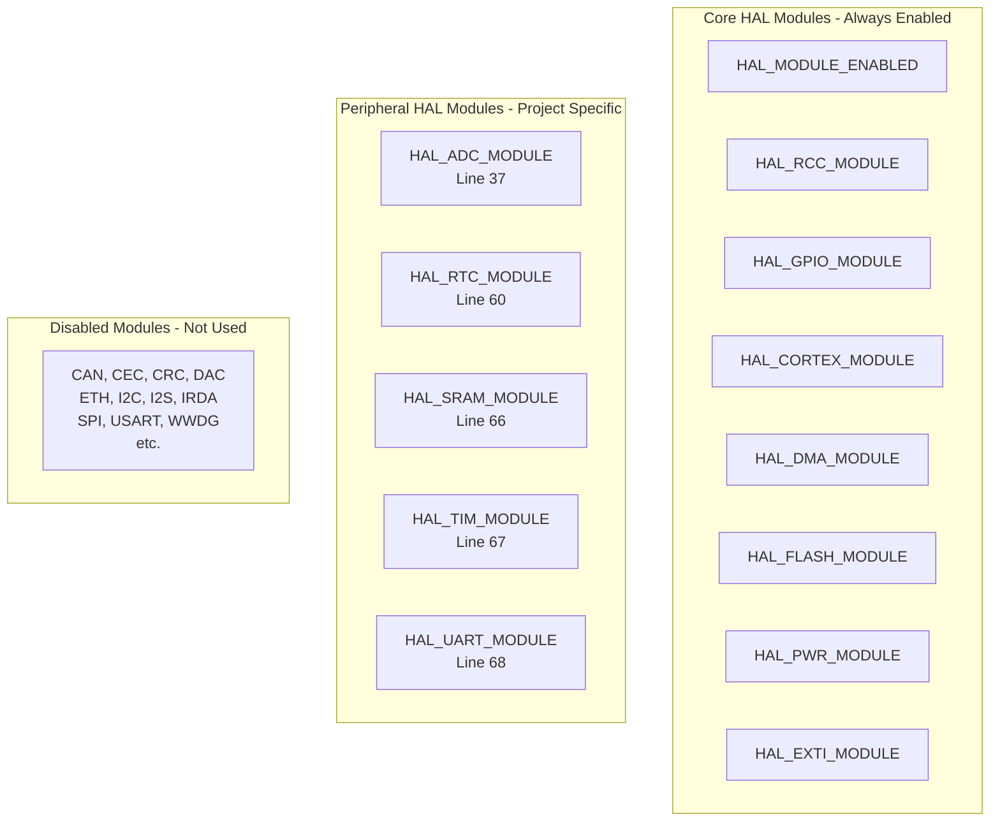
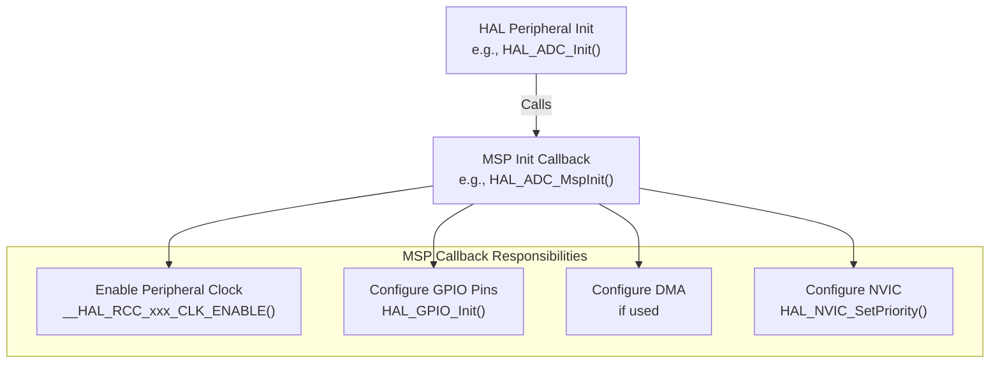

# Peripheral Drivers

Relevant source files

The following files were used as context for generating this wiki page:

- [.mxproject](.mxproject)
- [Core/Inc/main.h](Core/Inc/main.h)
- [Core/Inc/stm32f1xx_hal_conf.h](Core/Inc/stm32f1xx_hal_conf.h)

This page provides an overview of all hardware peripheral drivers used in the STM32-TFTLCD-UI system. It documents the initialization functions, configuration patterns, and interdependencies between peripherals. Each peripheral has dedicated initialization code generated by STM32CubeMX and is managed through the STM32 HAL (Hardware Abstraction Layer).

For detailed HAL configuration and module selection, see [HAL Configuration](#3.1). For the system initialization sequence, see [System Initialization](#3.2). For interrupt handler implementations, see [Interrupt System](#3.3).

## Peripheral Overview

The system uses seven hardware peripherals to implement the calendar/clock UI with automatic brightness control:

| Peripheral | Purpose | HAL Module | Initialization Function |
|------------|---------|------------|------------------------|
| **GPIO** | Digital I/O for keys, LEDs, LCD backlight | `HAL_GPIO_MODULE_ENABLED` | `MX_GPIO_Init()` |
| **ADC3** | Analog-to-digital conversion for light sensor | `HAL_ADC_MODULE_ENABLED` | `MX_ADC3_Init()` |
| **DMA1/DMA2** | Direct memory access for ADC and USART | `HAL_DMA_MODULE_ENABLED` | `MX_DMA_Init()` |
| **FSMC** | Memory controller for TFT LCD interface | `HAL_SRAM_MODULE_ENABLED` | `MX_FSMC_Init()` |
| **RTC** | Real-time clock for calendar/timekeeping | `HAL_RTC_MODULE_ENABLED` | `MX_RTC_Init()` |
| **TIM2/4/7** | Timers for time base and PWM generation | `HAL_TIM_MODULE_ENABLED` | `MX_TIM2_Init()`, `MX_TIM4_Init()`, `MX_TIM7_Init()` |
| **USART1** | Serial communication for debugging | `HAL_UART_MODULE_ENABLED` | `MX_USART1_UART_Init()` |

**Sources: ** [Core/Inc/stm32f1xx_hal_conf.h:36-78](https://github.com/BA2F/STM32-TFTLCD-UI/blob/e0f407ee/Core/Inc/stm32f1xx_hal_conf.h#L36-L78), [.mxproject:26-32](https://github.com/BA2F/STM32-TFTLCD-UI/blob/e0f407ee/.mxproject#L26-L32)

## Peripheral Architecture

The following diagram shows the relationships between peripheral drivers, their HAL modules, and the hardware they control:

**Sources: ** [.mxproject:26-37](https://github.com/BA2F/STM32-TFTLCD-UI/blob/e0f407ee/.mxproject#L26-L37), [Core/Inc/stm32f1xx_hal_conf.h:36-78](https://github.com/BA2F/STM32-TFTLCD-UI/blob/e0f407ee/Core/Inc/stm32f1xx_hal_conf.h#L36-L78)

## Initialization Sequence

Peripheral initialization follows a strict ordering to handle dependencies correctly. The sequence is executed in `main()` after HAL and system clock initialization:

**Key Initialization Dependencies:**
1. **GPIO must initialize first** - Other peripherals rely on pins being configured for alternate functions
2. **DMA must initialize before ADC and USART** - These peripherals use DMA channels for data transfer
3. **FSMC initializes early** - Required for LCD memory-mapped access
4. **Timers initialize after DMA** - Ensures PWM and time base functionality is available

**Sources: ** [Core/Src/main.c:90-120](https://github.com/BA2F/STM32-TFTLCD-UI/blob/e0f407ee/Core/Src/main.c#L90-L120) (inferred from typical STM32CubeMX pattern)

## Peripheral Configuration Summary

### GPIO Pin Assignments

The system uses three GPIO ports (A, B, E) for various inputs and outputs:

| Pin | Signal Name | Direction | Purpose | Port |
|-----|-------------|-----------|---------|------|
| PE3 | KEY1 | Input | Decrement button | GPIOE |
| PE4 | KEY0 | Input | Increment button | GPIOE |
| PE5 | LED1 | Output | Status indicator LED | GPIOE |
| PA0 | WK_UP | Input | Wake-up / mode toggle button | GPIOA |
| PB0 | LCD_BL | Output | LCD backlight control | GPIOB |
| PB5 | LED0 | Output | Status indicator LED | GPIOB |
| PB8 | BEEP | Output (TIM4 CH3) | Beeper PWM output | GPIOB |

For detailed GPIO configuration including pull-up/pull-down resistors and interrupt settings, see [GPIO Configuration](#4.1).

**Sources: ** [Core/Inc/main.h:60-73](https://github.com/BA2F/STM32-TFTLCD-UI/blob/e0f407ee/Core/Inc/main.h#L60-L73)

### DMA Channel Allocation

The system uses two DMA controllers with specific channel assignments:

| DMA Controller | Channel | Peripheral | Direction | Purpose |
|----------------|---------|------------|-----------|---------|
| **DMA1** | Channel 4 | USART1_TX | Memory-to-Peripheral | UART transmit |
| **DMA1** | Channel 5 | USART1_RX | Peripheral-to-Memory | UART receive |
| **DMA2** | Channel 5 | ADC3 | Peripheral-to-Memory | ADC conversion data |

For detailed DMA configuration including circular mode, data width, and interrupt settings, see [DMA System](#4.7).

**Sources: ** [.mxproject:28](https://github.com/BA2F/STM32-TFTLCD-UI/blob/e0f407ee/.mxproject#L28)

### Timer Configurations

Three timers serve different purposes in the system:

| Timer | Mode | Purpose | Configuration Details |
|-------|------|---------|----------------------|
| **TIM2** | Time Base | Task scheduling / 10ms tick | See [Timer Peripherals](#4.5) |
| **TIM4** | PWM Output | Beeper audio generation (Channel 3) | See [Timer Peripherals](#4.5) |
| **TIM7** | Time Base | Auxiliary time base / 100ms tick | See [Timer Peripherals](#4.5) |

**Sources: ** [.mxproject:31](https://github.com/BA2F/STM32-TFTLCD-UI/blob/e0f407ee/.mxproject#L31)

## Peripheral Interdependencies

The following diagram illustrates data flow dependencies between peripherals:

**Critical Dependencies:**
- **ADC3 requires DMA2** to be initialized first for continuous conversion mode
- **USART1 requires DMA1** for efficient transmit/receive operations
- **FSMC must be ready** before LCD initialization in application tasks
- **GPIO must configure alternate functions** before timer PWM output works

**Sources: ** [.mxproject:26-32](https://github.com/BA2F/STM32-TFTLCD-UI/blob/e0f407ee/.mxproject#L26-L32)

## HAL Module Selection

The HAL modules are selectively enabled in `stm32f1xx_hal_conf.h` to minimize code size and compilation time. The following modules are enabled for this project:

**Enabled Modules:**
- **HAL_ADC_MODULE_ENABLED** ([stm32f1xx_hal_conf.h:37]()) - For light sensor reading
- **HAL_DMA_MODULE_ENABLED** ([stm32f1xx_hal_conf.h:45,73]()) - For ADC and USART transfers
- **HAL_GPIO_MODULE_ENABLED** ([stm32f1xx_hal_conf.h:48,76]()) - For digital I/O
- **HAL_RTC_MODULE_ENABLED** ([stm32f1xx_hal_conf.h:60]()) - For calendar/clock
- **HAL_SRAM_MODULE_ENABLED** ([stm32f1xx_hal_conf.h:66]()) - For FSMC/LCD interface
- **HAL_TIM_MODULE_ENABLED** ([stm32f1xx_hal_conf.h:67]()) - For timers and PWM
- **HAL_UART_MODULE_ENABLED** ([stm32f1xx_hal_conf.h:68]()) - For serial communication

**Sources: ** [Core/Inc/stm32f1xx_hal_conf.h:36-78](https://github.com/BA2F/STM32-TFTLCD-UI/blob/e0f407ee/Core/Inc/stm32f1xx_hal_conf.h#L36-L78)

## Peripheral Driver Files

Each peripheral has dedicated source and header files generated by STM32CubeMX:

| Peripheral | Header File | Source File | Key Functions |
|------------|-------------|-------------|---------------|
| **GPIO** | `Core/Inc/gpio.h` | `Core/Src/gpio.c` | `MX_GPIO_Init()` |
| **ADC3** | `Core/Inc/adc.h` | `Core/Src/adc.c` | `MX_ADC3_Init()` |
| **DMA** | `Core/Inc/dma.h` | `Core/Src/dma.c` | `MX_DMA_Init()` |
| **FSMC** | `Core/Inc/fsmc.h` | `Core/Src/fsmc.c` | `MX_FSMC_Init()` |
| **RTC** | `Core/Inc/rtc.h` | `Core/Src/rtc.c` | `MX_RTC_Init()` |
| **Timers** | `Core/Inc/tim.h` | `Core/Src/tim.c` | `MX_TIM2_Init()`, `MX_TIM4_Init()`, `MX_TIM7_Init()` |
| **USART1** | `Core/Inc/usart.h` | `Core/Src/usart.c` | `MX_USART1_UART_Init()` |

**Code Generation Note:** These files are auto-generated by STM32CubeMX from the `.ioc` project file. User code should be placed within `/* USER CODE BEGIN */` and `/* USER CODE END */` comment blocks to survive regeneration.

**Sources: ** [.mxproject:12-37](https://github.com/BA2F/STM32-TFTLCD-UI/blob/e0f407ee/.mxproject#L12-L37)

## MSP (MCU Support Package) Functions

The HAL uses MSP callback functions to configure low-level peripheral resources like clocks, pins, and interrupts. These are implemented in `Core/Src/stm32f1xx_hal_msp.c`:

**MSP Functions per Peripheral:**
- `HAL_ADC_MspInit()` / `HAL_ADC_MspDeInit()` - ADC clock, GPIO, DMA, interrupts
- `HAL_RTC_MspInit()` / `HAL_RTC_MspDeInit()` - RTC clock source selection
- `HAL_TIM_Base_MspInit()` / `HAL_TIM_Base_MspDeInit()` - Timer clocks
- `HAL_TIM_PWM_MspInit()` / `HAL_TIM_PWM_MspDeInit()` - PWM GPIO configuration
- `HAL_UART_MspInit()` / `HAL_UART_MspDeInit()` - UART clock, GPIO, DMA, interrupts

**Sources: ** [.mxproject:34](https://github.com/BA2F/STM32-TFTLCD-UI/blob/e0f407ee/.mxproject#L34)

## Peripheral Handle Structures

Each peripheral maintains a handle structure that stores its configuration and state. These handles are typically declared as global variables in the respective peripheral driver files:

| Handle Variable | Type | Defined In | Purpose |
|----------------|------|------------|---------|
| `hadc3` | `ADC_HandleTypeDef` | `Core/Src/adc.c` | ADC3 configuration and state |
| `hdma_adc3` | `DMA_HandleTypeDef` | `Core/Src/dma.c` | DMA for ADC3 transfers |
| `hdma_usart1_rx` | `DMA_HandleTypeDef` | `Core/Src/dma.c` | DMA for USART1 RX |
| `hdma_usart1_tx` | `DMA_HandleTypeDef` | `Core/Src/dma.c` | DMA for USART1 TX |
| `hsram4` | `SRAM_HandleTypeDef` | `Core/Src/fsmc.c` | FSMC Bank 4 for LCD |
| `hrtc` | `RTC_HandleTypeDef` | `Core/Src/rtc.c` | RTC configuration |
| `htim2` | `TIM_HandleTypeDef` | `Core/Src/tim.c` | TIM2 time base |
| `htim4` | `TIM_HandleTypeDef` | `Core/Src/tim.c` | TIM4 PWM |
| `htim7` | `TIM_HandleTypeDef` | `Core/Src/tim.c` | TIM7 time base |
| `huart1` | `UART_HandleTypeDef` | `Core/Src/usart.c` | USART1 serial port |

These handle structures are passed to HAL API functions for all peripheral operations.

**Sources: ** [.mxproject:26-32](https://github.com/BA2F/STM32-TFTLCD-UI/blob/e0f407ee/.mxproject#L26-L32) (structure names follow STM32 HAL naming convention)

## System Clock Requirements

Different peripherals derive their clocks from different sources in the clock tree:

| Peripheral | Clock Source | Typical Frequency | Notes |
|------------|--------------|-------------------|-------|
| **GPIO** | AHB Bus | 72 MHz | From HCLK |
| **ADC3** | APB2 with Prescaler | ≤14 MHz | ADC clock must not exceed 14 MHz |
| **DMA1/DMA2** | AHB Bus | 72 MHz | Direct access to system bus |
| **FSMC** | AHB Bus | 72 MHz | High-speed memory interface |
| **RTC** | LSI (Low-Speed Internal) | 40 kHz | Independent of system clock |
| **TIM2** | APB1 Timer Clock | 72 MHz | 2x multiplier if APB1 prescaler > 1 |
| **TIM4** | APB1 Timer Clock | 72 MHz | 2x multiplier if APB1 prescaler > 1 |
| **TIM7** | APB1 Timer Clock | 72 MHz | 2x multiplier if APB1 prescaler > 1 |
| **USART1** | APB2 | 72 MHz | For baud rate generation |

For detailed clock tree configuration, see [System Initialization](#3.2).

**Sources: ** [Core/Inc/stm32f1xx_hal_conf.h:86-122](https://github.com/BA2F/STM32-TFTLCD-UI/blob/e0f407ee/Core/Inc/stm32f1xx_hal_conf.h#L86-L122)

## Related Pages

For detailed information about specific peripherals:
- **[GPIO Configuration](#4.1)** - Pin assignments, modes, and interrupt configuration
- **[ADC and Light Sensor](#4.2)** - ADC3 setup for photoresistor reading with DMA
- **[Display Interface (FSMC)](#4.3)** - Memory-mapped LCD interface via FSMC Bank 4
- **[Real-Time Clock](#4.4)** - RTC configuration for calendar and timekeeping
- **[Timer Peripherals](#4.5)** - TIM2/4/7 configurations for time base and PWM
- **[Serial Communication (USART)](#4.6)** - USART1 with DMA for debugging
- **[DMA System](#4.7)** - DMA controller configuration and channel allocation

For system-level architecture:
- **[System Architecture](#1.2)** - High-level system overview
- **[HAL Configuration](#3.1)** - HAL module selection and configuration
- **[System Initialization](#3.2)** - Startup sequence and clock configuration