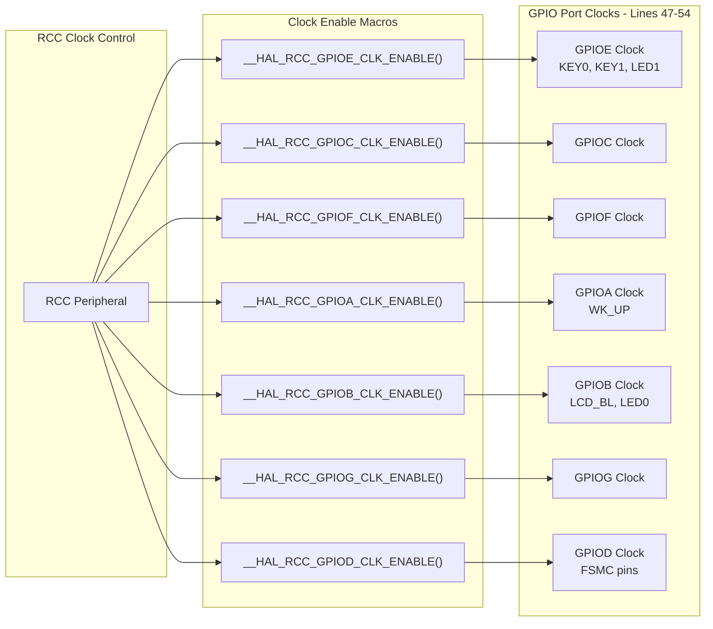
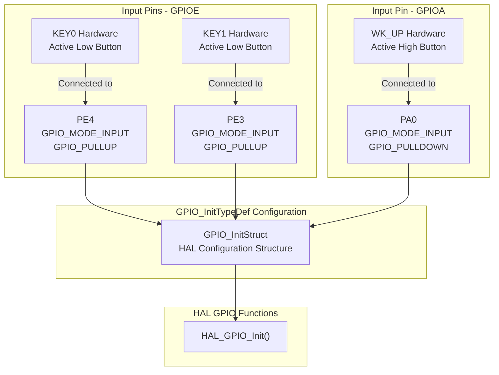
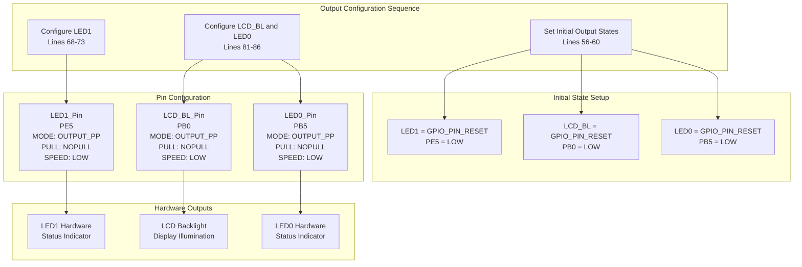
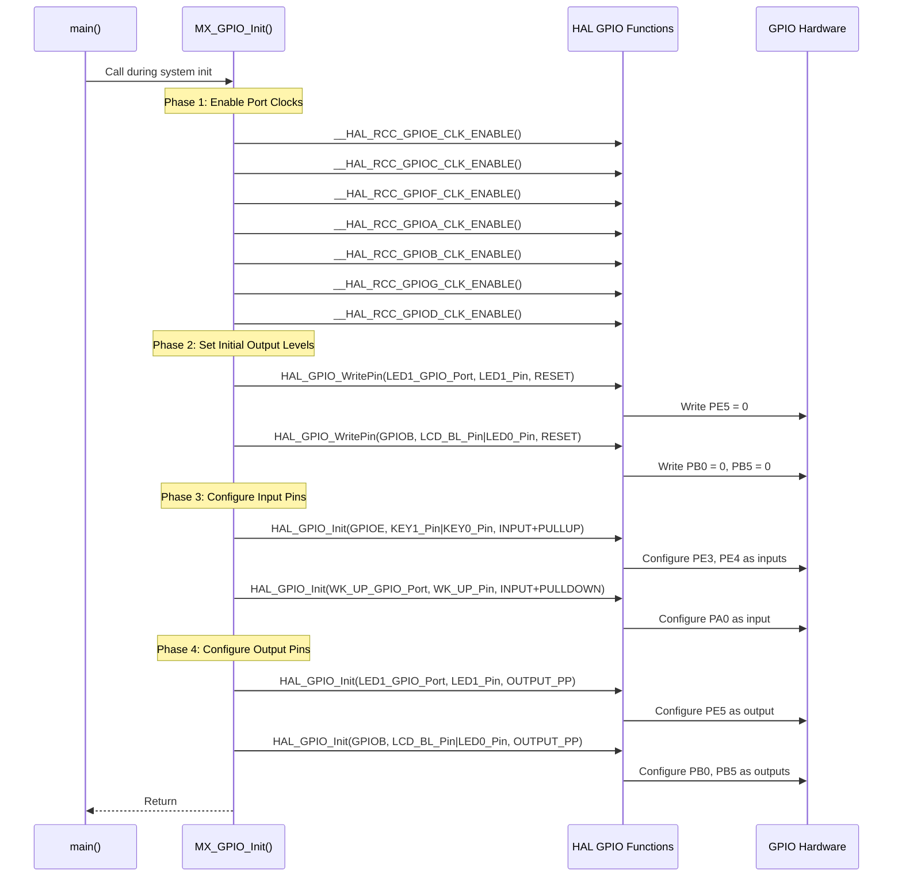
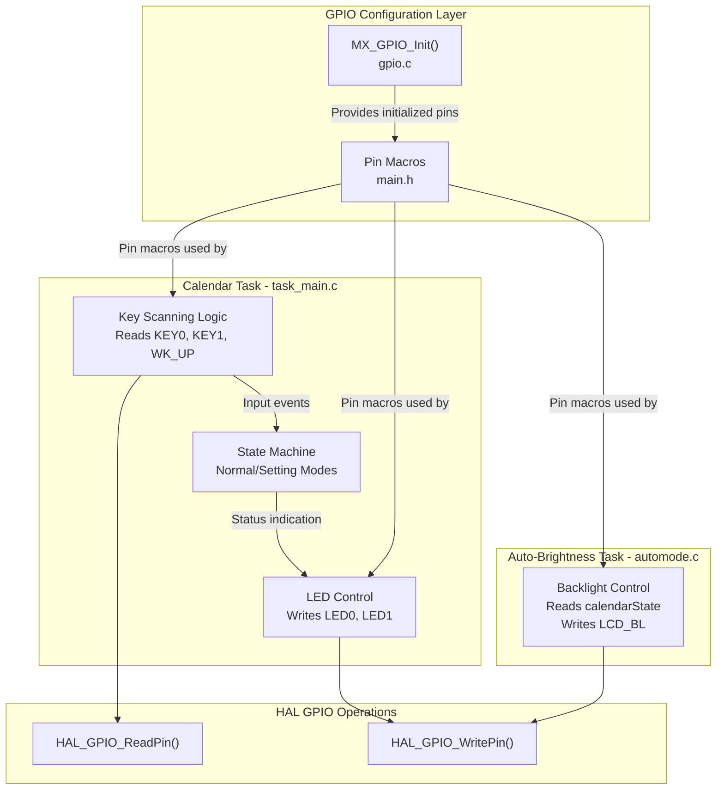

# GPIO Configuration

<details>
<summary>Relevant source files</summary>

The following files were used as context for generating this wiki page:

- [Core/Inc/gpio.h](Core/Inc/gpio.h)
- [Core/Inc/main.h](Core/Inc/main.h)
- [Core/Src/gpio.c](Core/Src/gpio.c)

</details>


## Purpose and Scope

This document describes the General Purpose Input/Output (GPIO) peripheral configuration for the STM32-TFTLCD-UI project. It covers the pin assignments for user input buttons, status LEDs, LCD backlight control, and the beeper output. This page focuses on GPIO pin configuration and initialization; for information about the FSMC GPIO pins used for the LCD interface, see [Display Interface (FSMC)](#4.3). For the ADC input pin used by the light sensor, see [ADC and Light Sensor](#4.2).

**Sources: ** [Core/Inc/main.h:1-84](https://github.com/BA2F/STM32-TFTLCD-UI/blob/e0f407ee/Core/Inc/main.h#L1-L84), [Core/Src/gpio.c:1-93](https://github.com/BA2F/STM32-TFTLCD-UI/blob/e0f407ee/Core/Src/gpio.c#L1-L93), [Core/Inc/gpio.h:1-50](https://github.com/BA2F/STM32-TFTLCD-UI/blob/e0f407ee/Core/Inc/gpio.h#L1-L50)

---

## GPIO Pin Assignment Overview

The system utilizes GPIO pins across multiple ports (A, B, E) for discrete input/output operations. All GPIO configuration is generated by STM32CubeMX and implemented in the `MX_GPIO_Init()` function.

### Pin Assignment Summary

| Pin Name | Port.Pin | Direction | Function | Pull Configuration | Initial State |
|----------|----------|-----------|----------|-------------------|---------------|
| `KEY0` | PE4 | Input | User button 0 | Pull-up | High (unpressed) |
| `KEY1` | PE3 | Input | User button 1 | Pull-up | High (unpressed) |
| `WK_UP` | PA0 | Input | Wake-up button | Pull-down | Low (unpressed) |
| `LED0` | PB5 | Output | Status LED 0 | No pull | Low (off) |
| `LED1` | PE5 | Output | Status LED 1 | No pull | Low (off) |
| `LCD_BL` | PB0 | Output | LCD backlight control | No pull | Low (off) |
| `BEEP` | PB8 | Output | Beeper (PWM via TIM4) | Not configured in GPIO | N/A |

**Note:** The `BEEP_Pin` (PB8) is defined in [Core/Inc/main.h:72-73]() but is not configured in `MX_GPIO_Init()` because it is configured as an alternate function (TIM4_CH3) for PWM output. See [Timer Peripherals](#4.5) for details.

**Sources: ** [Core/Inc/main.h:59-73](https://github.com/BA2F/STM32-TFTLCD-UI/blob/e0f407ee/Core/Inc/main.h#L59-L73), [Core/Src/gpio.c:42-88](https://github.com/BA2F/STM32-TFTLCD-UI/blob/e0f407ee/Core/Src/gpio.c#L42-L88)

---

## GPIO Port Clock Configuration

Before any GPIO pin can be used, its corresponding port clock must be enabled. The `MX_GPIO_Init()` function enables clocks for all GPIO ports, even those that may not have all pins utilized in this configuration.



**Clock Enablement Sequence**

The clock enable sequence in [Core/Src/gpio.c:47-54]() follows this order:

1. GPIOE - Used for KEY0, KEY1, LED1
2. GPIOC - Reserved (may be used by FSMC or other peripherals)
3. GPIOF - Reserved (may be used by FSMC address lines)
4. GPIOA - Used for WK_UP
5. GPIOB - Used for LCD_BL, LED0
6. GPIOG - Reserved (may be used by FSMC data/control lines)
7. GPIOD - Used extensively by FSMC for LCD interface

**Sources: ** [Core/Src/gpio.c:47-54](https://github.com/BA2F/STM32-TFTLCD-UI/blob/e0f407ee/Core/Src/gpio.c#L47-L54)

---

## Input Pin Configuration

The system implements three user input buttons with different pull configurations to accommodate their hardware design.

### Input Configuration Diagram



### KEY0 and KEY1 Configuration (Active-Low)

These buttons are configured as **active-low inputs** with internal pull-up resistors enabled. When unpressed, the pins read logic high; when pressed, they are pulled to ground.

**Configuration in [Core/Src/gpio.c:62-66]():**

```
GPIO_InitStruct.Pin = KEY1_Pin | KEY0_Pin;
GPIO_InitStruct.Mode = GPIO_MODE_INPUT;
GPIO_InitStruct.Pull = GPIO_PULLUP;
HAL_GPIO_Init(GPIOE, &GPIO_InitStruct);
```

| Parameter | Value | Description |
|-----------|-------|-------------|
| `Pin` | `KEY1_Pin \| KEY0_Pin` | Configures both PE3 and PE4 simultaneously |
| `Mode` | `GPIO_MODE_INPUT` | Standard input mode (not interrupt-driven) |
| `Pull` | `GPIO_PULLUP` | Internal pull-up resistor enabled (~40kΩ typical) |
| `Speed` | Not set (input) | Speed parameter not applicable to inputs |

### WK_UP Configuration (Active-High)

The wake-up button is configured as an **active-high input** with internal pull-down resistor. When unpressed, the pin reads logic low; when pressed, it is pulled to VDD.

**Configuration in [Core/Src/gpio.c:75-79]():**

```
GPIO_InitStruct.Pin = WK_UP_Pin;
GPIO_InitStruct.Mode = GPIO_MODE_INPUT;
GPIO_InitStruct.Pull = GPIO_PULLDOWN;
HAL_GPIO_Init(WK_UP_GPIO_Port, &GPIO_InitStruct);
```

| Parameter | Value | Description |
|-----------|-------|-------------|
| `Pin` | `WK_UP_Pin` | Configures PA0 |
| `Mode` | `GPIO_MODE_INPUT` | Standard input mode |
| `Pull` | `GPIO_PULLDOWN` | Internal pull-down resistor enabled |

**Design Rationale:** The opposite pull configuration for WK_UP suggests different hardware design or the need to avoid floating states during system wake-up scenarios. PA0 is often used as the WKUP pin on STM32 devices for waking from low-power modes.

**Sources: ** [Core/Src/gpio.c:62-79](https://github.com/BA2F/STM32-TFTLCD-UI/blob/e0f407ee/Core/Src/gpio.c#L62-L79), [Core/Inc/main.h:60-67](https://github.com/BA2F/STM32-TFTLCD-UI/blob/e0f407ee/Core/Inc/main.h#L60-L67)

---

## Output Pin Configuration

The system implements three GPIO outputs: two status LEDs and one LCD backlight control. All outputs are configured as push-pull with low-speed drive capability.

### Output Configuration Diagram



### Initial Output State Configuration

Before configuring pin modes, the system sets initial output levels using `HAL_GPIO_WritePin()` to ensure known states immediately after GPIO clock enablement.

**LED1 Initial State [Core/Src/gpio.c:56-57]():**
```
HAL_GPIO_WritePin(LED1_GPIO_Port, LED1_Pin, GPIO_PIN_RESET);
```
Sets PE5 to logic low (LED off).

**LCD_BL and LED0 Initial State [Core/Src/gpio.c:59-60]():**
```
HAL_GPIO_WritePin(GPIOB, LCD_BL_Pin|LED0_Pin, GPIO_PIN_RESET);
```
Sets both PB0 (LCD backlight) and PB5 (LED0) to logic low (both off).

### LED1 Configuration

**Configuration in [Core/Src/gpio.c:68-73]():**

```
GPIO_InitStruct.Pin = LED1_Pin;
GPIO_InitStruct.Mode = GPIO_MODE_OUTPUT_PP;
GPIO_InitStruct.Pull = GPIO_NOPULL;
GPIO_InitStruct.Speed = GPIO_SPEED_FREQ_LOW;
HAL_GPIO_Init(LED1_GPIO_Port, &GPIO_InitStruct);
```

| Parameter | Value | Description |
|-----------|-------|-------------|
| `Pin` | `LED1_Pin` (PE5) | Single pin configuration |
| `Mode` | `GPIO_MODE_OUTPUT_PP` | Push-pull output driver |
| `Pull` | `GPIO_NOPULL` | No pull resistor (output controls level) |
| `Speed` | `GPIO_SPEED_FREQ_LOW` | Low-speed output (~2 MHz), sufficient for LED |

### LCD_BL and LED0 Configuration

**Configuration in [Core/Src/gpio.c:81-86]():**

```
GPIO_InitStruct.Pin = LCD_BL_Pin|LED0_Pin;
GPIO_InitStruct.Mode = GPIO_MODE_OUTPUT_PP;
GPIO_InitStruct.Pull = GPIO_NOPULL;
GPIO_InitStruct.Speed = GPIO_SPEED_FREQ_LOW;
HAL_GPIO_Init(GPIOB, &GPIO_InitStruct);
```

| Parameter | Value | Description |
|-----------|-------|-------------|
| `Pin` | `LCD_BL_Pin \| LED0_Pin` | Both PB0 and PB5 configured together |
| `Mode` | `GPIO_MODE_OUTPUT_PP` | Push-pull output driver |
| `Pull` | `GPIO_NOPULL` | No pull resistor |
| `Speed` | `GPIO_SPEED_FREQ_LOW` | Low-speed output |

**Push-Pull vs. Open-Drain:** All outputs use push-pull mode, which actively drives both high and low states. This is appropriate for LEDs (which require current sourcing) and LCD backlight control (which typically drives an enable signal for a backlight driver circuit).

**Sources: ** [Core/Src/gpio.c:56-86](https://github.com/BA2F/STM32-TFTLCD-UI/blob/e0f407ee/Core/Src/gpio.c#L56-L86), [Core/Inc/main.h:64-71](https://github.com/BA2F/STM32-TFTLCD-UI/blob/e0f407ee/Core/Inc/main.h#L64-L71)

---

## GPIO Initialization Function

The `MX_GPIO_Init()` function orchestrates the complete GPIO configuration sequence.

### Initialization Sequence Diagram



### Initialization Phases

The initialization follows a strict four-phase sequence to ensure proper GPIO operation:

**Phase 1: Clock Enablement** [Core/Src/gpio.c:47-54]()
- All GPIO port clocks enabled before any pin access
- Prevents bus faults from accessing unclockedregisters
- Enables all ports even if not all pins are used (may support FSMC)

**Phase 2: Initial Output States** [Core/Src/gpio.c:56-60]()
- Output levels set before configuring as outputs
- Prevents glitches during mode transition
- All outputs initialized to LOW (off state)

**Phase 3: Input Configuration** [Core/Src/gpio.c:62-79]()
- Inputs configured with appropriate pull resistors
- No initialization delay needed for input pins

**Phase 4: Output Configuration** [Core/Src/gpio.c:68-86]()
- Outputs configured last after levels are set
- Push-pull mode with low-speed drive

**Sources: ** [Core/Src/gpio.c:42-88](https://github.com/BA2F/STM32-TFTLCD-UI/blob/e0f407ee/Core/Src/gpio.c#L42-L88)

---

## GPIO Pin Definitions and Macros

Pin assignments are defined as preprocessor macros in [Core/Inc/main.h:59-73](), allowing easy reference throughout the codebase.

### Pin Macro Structure

Each GPIO pin is defined with two macros following the pattern:
- `<PIN_NAME>_Pin` - The GPIO pin number (GPIO_PIN_x)
- `<PIN_NAME>_GPIO_Port` - The GPIO port base address (GPIOx)

### Pin Definition Table

| Macro Name | Value | Port Macro | Value | Description |
|------------|-------|------------|-------|-------------|
| `KEY1_Pin` | `GPIO_PIN_3` | `KEY1_GPIO_Port` | `GPIOE` | Button 1 input |
| `KEY0_Pin` | `GPIO_PIN_4` | `KEY0_GPIO_Port` | `GPIOE` | Button 0 input |
| `LED1_Pin` | `GPIO_PIN_5` | `LED1_GPIO_Port` | `GPIOE` | Status LED 1 |
| `WK_UP_Pin` | `GPIO_PIN_0` | `WK_UP_GPIO_Port` | `GPIOA` | Wake-up button |
| `LCD_BL_Pin` | `GPIO_PIN_0` | `LCD_BL_GPIO_Port` | `GPIOB` | LCD backlight |
| `LED0_Pin` | `GPIO_PIN_5` | `LED0_GPIO_Port` | `GPIOB` | Status LED 0 |
| `BEEP_Pin` | `GPIO_PIN_8` | `BEEP_GPIO_Port` | `GPIOB` | Beeper (TIM4_CH3) |

### Usage in Application Code

These macros allow portable GPIO access using HAL functions:

**Reading Inputs:**
```c
GPIO_PinState key0_state = HAL_GPIO_ReadPin(KEY0_GPIO_Port, KEY0_Pin);
GPIO_PinState key1_state = HAL_GPIO_ReadPin(KEY1_GPIO_Port, KEY1_Pin);
GPIO_PinState wkup_state = HAL_GPIO_ReadPin(WK_UP_GPIO_Port, WK_UP_Pin);
```

**Writing Outputs:**
```c
HAL_GPIO_WritePin(LED0_GPIO_Port, LED0_Pin, GPIO_PIN_SET);    // Turn on LED0
HAL_GPIO_WritePin(LED1_GPIO_Port, LED1_Pin, GPIO_PIN_RESET);  // Turn off LED1
HAL_GPIO_WritePin(LCD_BL_GPIO_Port, LCD_BL_Pin, GPIO_PIN_SET); // Enable backlight
```

**Toggling Outputs:**
```c
HAL_GPIO_TogglePin(LED0_GPIO_Port, LED0_Pin);  // Toggle LED0 state
```

**Sources: ** [Core/Inc/main.h:59-73](https://github.com/BA2F/STM32-TFTLCD-UI/blob/e0f407ee/Core/Inc/main.h#L59-L73)

---

## Integration with Application Layer

The GPIO configuration provides the hardware foundation for user interaction and visual feedback in the application layer.

### GPIO Usage in Application Tasks



### Key Input Processing

The Calendar Task (see [Calendar Task](#2.2)) polls the GPIO input pins every 10ms to detect button presses:

- **KEY0** (PE4) - Decrements time values in setting mode
- **KEY1** (PE3) - Increments time values in setting mode  
- **WK_UP** (PA0) - Toggles between normal and setting modes

The input scanning logic reads the pin states using `HAL_GPIO_ReadPin()` with the macros defined in [Core/Inc/main.h:60-67]().

### LED Status Indication

LEDs provide visual feedback for system state:

- **LED0** (PB5) - May indicate system activity or mode
- **LED1** (PE5) - May indicate errors or specific states

The application code controls these LEDs by calling `HAL_GPIO_WritePin()` or `HAL_GPIO_TogglePin()` with the macros defined in [Core/Inc/main.h:64-65,70-71]().

### LCD Backlight Control

The LCD backlight (PB0) is controlled based on ambient light detection:

- The Auto-Brightness Task (see [Auto-Brightness Task](#2.3)) reads the light sensor via ADC
- Based on threshold comparisons, it enables or disables the backlight
- The backlight control is coordinated with the LCD display mode (light/dark theme)

Backlight control uses the `LCD_BL_Pin` and `LCD_BL_GPIO_Port` macros defined in [Core/Inc/main.h:68-69]().

**Sources: ** [Core/Inc/main.h:59-73](https://github.com/BA2F/STM32-TFTLCD-UI/blob/e0f407ee/Core/Inc/main.h#L59-L73), System architecture diagrams

---

## Relationship to Other Peripherals

While this document covers GPIO pins for discrete I/O, several other GPIO pins are used by alternate functions:

| Peripheral | GPIO Pins Used | Configuration Location | Documentation Page |
|------------|----------------|------------------------|-------------------|
| FSMC | PD0-PD15, PE7-PE15, PF0-PF15, PG0-PG12 | `MX_FSMC_Init()` | [Display Interface (FSMC)](#4.3) |
| ADC3 | PC2 (ADC3_IN12) | `MX_ADC3_Init()` | [ADC and Light Sensor](#4.2) |
| TIM4_CH3 | PB8 (BEEP) | `MX_TIM4_Init()` | [Timer Peripherals](#4.5) |
| USART1 | PA9 (TX), PA10 (RX) | `MX_USART1_UART_Init()` | [Serial Communication](#4.6) |

These pins are not configured in `MX_GPIO_Init()` because they require alternate function mode configuration, which is handled by their respective peripheral initialization functions.

**Sources: ** System architecture, peripheral configuration files

---

## Function Reference

### `MX_GPIO_Init()`

**Declaration:** [Core/Inc/gpio.h:39]()  
**Definition:** [Core/Src/gpio.c:42-88]()

**Purpose:** Initializes all GPIO pins used for discrete input/output operations in the system.

**Parameters:** None

**Returns:** `void`

**Initialization Order:**
1. Enable GPIO port clocks (GPIOE, GPIOC, GPIOF, GPIOA, GPIOB, GPIOG, GPIOD)
2. Set initial output levels (all LEDs and backlight off)
3. Configure input pins (KEY0, KEY1, WK_UP)
4. Configure output pins (LED0, LED1, LCD_BL)

**Called By:** `main()` during system initialization, after HAL initialization but before peripheral initialization.

**Thread Safety:** Not thread-safe. Must only be called once during system initialization.

**Sources: ** [Core/Inc/gpio.h:39](https://github.com/BA2F/STM32-TFTLCD-UI/blob/e0f407ee/Core/Inc/gpio.h#L39), [Core/Src/gpio.c:42-88](https://github.com/BA2F/STM32-TFTLCD-UI/blob/e0f407ee/Core/Src/gpio.c#L42-L88)