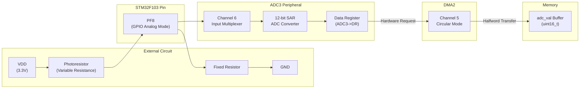
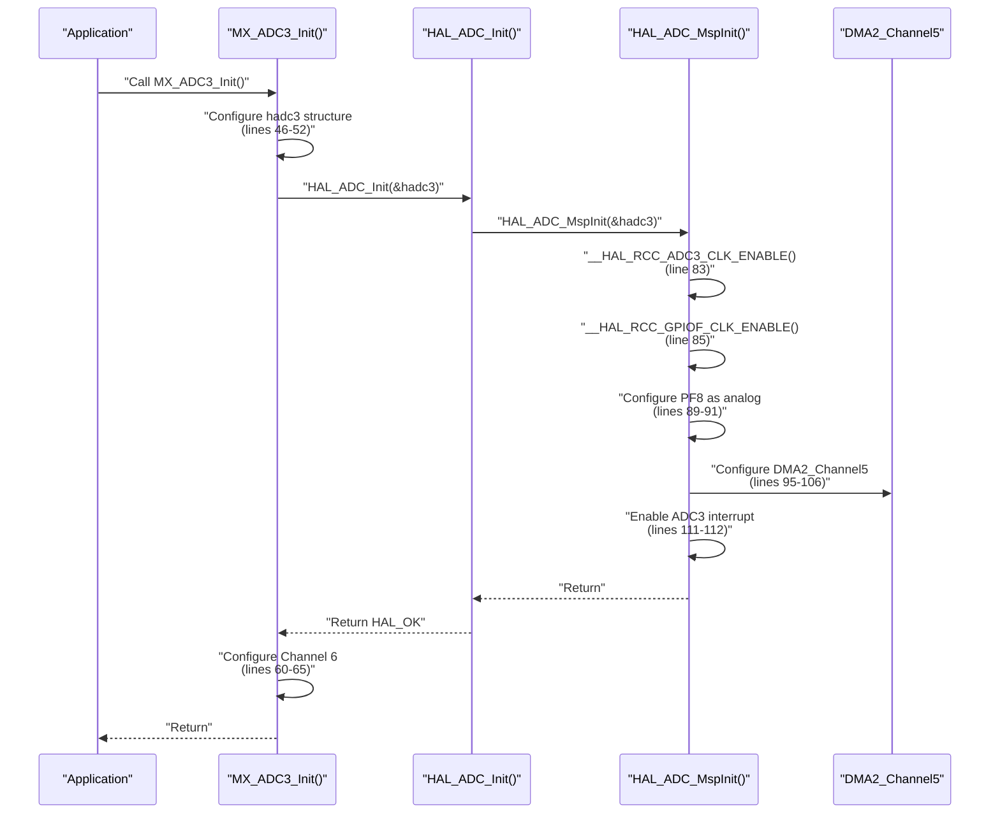
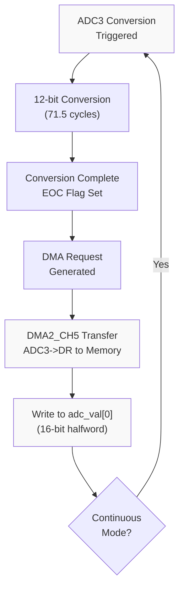
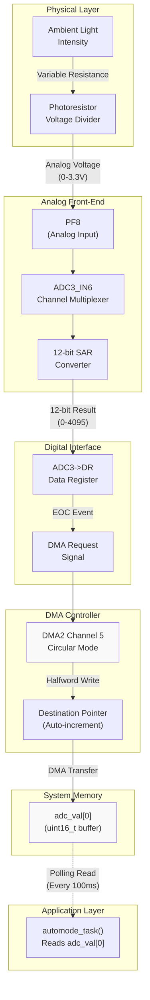

# ADC and Light Sensor

<details>
<summary>Relevant source files</summary>

The following files were used as context for generating this wiki page:

- [Core/Inc/adc.h](Core/Inc/adc.h)
- [Core/Inc/dma.h](Core/Inc/dma.h)
- [Core/Src/adc.c](Core/Src/adc.c)
- [Core/Src/dma.c](Core/Src/dma.c)

</details>


## Purpose and Scope

This document describes the ADC3 peripheral configuration used to interface with a photoresistor light sensor. The system continuously samples ambient light levels and stores the digitized values in memory via DMA transfer. This data enables the automatic brightness control feature described in [Auto-Brightness Task](#2.3).

For information about how the ADC data is processed to control display brightness, see [Auto-Brightness Task](#2.3). For DMA controller details, see [DMA System](#4.7).

---

## Hardware Connection

The light sensor circuit uses a photoresistor connected to GPIO pin PF8, which is configured as ADC3 Channel 6. The photoresistor forms a voltage divider that produces an analog voltage proportional to ambient light intensity.

### Pin Assignment

| Signal | GPIO Pin | ADC Channel | Function |
|--------|----------|-------------|----------|
| Light Sensor Analog Input | PF8 | ADC3_IN6 | Analog input from photoresistor voltage divider |

The GPIO pin is configured in analog mode with no pull-up or pull-down resistors, allowing the ADC to directly sample the voltage from the external circuit.

**Sources: ** [Core/Src/adc.c:86-91](https://github.com/BA2F/STM32-TFTLCD-UI/blob/e0f407ee/Core/Src/adc.c#L86-L91)



**Diagram:** Hardware connection and data flow from photoresistor to memory buffer

**Sources: ** [Core/Src/adc.c:86-108](https://github.com/BA2F/STM32-TFTLCD-UI/blob/e0f407ee/Core/Src/adc.c#L86-L108)

---

## ADC3 Peripheral Configuration

The ADC3 peripheral is configured for continuous, single-channel analog-to-digital conversion. The configuration prioritizes simplicity and low CPU overhead through DMA integration.

### Core ADC Parameters

| Parameter | Configuration | Value/Setting |
|-----------|--------------|---------------|
| ADC Instance | `hadc3.Instance` | `ADC3` |
| Scan Mode | `hadc3.Init.ScanConvMode` | `ADC_SCAN_DISABLE` (single channel) |
| Continuous Mode | `hadc3.Init.ContinuousConvMode` | `ENABLE` (continuous sampling) |
| Discontinuous Mode | `hadc3.Init.DiscontinuousConvMode` | `DISABLE` |
| Trigger Source | `hadc3.Init.ExternalTrigConv` | `ADC_SOFTWARE_START` |
| Data Alignment | `hadc3.Init.DataAlign` | `ADC_DATAALIGN_RIGHT` |
| Number of Conversions | `hadc3.Init.NbrOfConversion` | `1` |

**Sources: ** [Core/Src/adc.c:46-56](https://github.com/BA2F/STM32-TFTLCD-UI/blob/e0f407ee/Core/Src/adc.c#L46-L56)

### Channel Configuration

| Parameter | Configuration | Value |
|-----------|--------------|-------|
| Channel | `sConfig.Channel` | `ADC_CHANNEL_6` (PF8) |
| Conversion Rank | `sConfig.Rank` | `ADC_REGULAR_RANK_1` |
| Sampling Time | `sConfig.SamplingTime` | `ADC_SAMPLETIME_71CYCLES_5` |

The sampling time of 71.5 cycles provides adequate settling time for the high-impedance photoresistor circuit. With a typical ADC clock frequency of 12 MHz (derived from PCLK2/6), this results in a sampling period of approximately 6 microseconds per conversion.

**Sources: ** [Core/Src/adc.c:58-66](https://github.com/BA2F/STM32-TFTLCD-UI/blob/e0f407ee/Core/Src/adc.c#L58-L66)

### Initialization Sequence

The `MX_ADC3_Init()` function performs the following initialization steps:



**Diagram:** ADC3 initialization call sequence

**Sources: ** [Core/Src/adc.c:31-71](https://github.com/BA2F/STM32-TFTLCD-UI/blob/e0f407ee/Core/Src/adc.c#L31-L71), [Core/Src/adc.c:73-117](https://github.com/BA2F/STM32-TFTLCD-UI/blob/e0f407ee/Core/Src/adc.c#L73-L117)

---

## DMA Integration

DMA2 Channel 5 is dedicated to transferring ADC3 conversion results from the peripheral data register to a memory buffer without CPU intervention.

### DMA Configuration

The DMA channel is configured in `HAL_ADC_MspInit()` with the following parameters:

| Parameter | Configuration | Value/Setting |
|-----------|--------------|---------------|
| DMA Instance | `hdma_adc3.Instance` | `DMA2_Channel5` |
| Direction | `hdma_adc3.Init.Direction` | `DMA_PERIPH_TO_MEMORY` |
| Peripheral Increment | `hdma_adc3.Init.PeriphInc` | `DMA_PINC_DISABLE` (fixed address) |
| Memory Increment | `hdma_adc3.Init.MemInc` | `DMA_MINC_ENABLE` (auto-increment) |
| Peripheral Data Width | `hdma_adc3.Init.PeriphDataAlignment` | `DMA_PDATAALIGN_HALFWORD` (16-bit) |
| Memory Data Width | `hdma_adc3.Init.MemDataAlignment` | `DMA_MDATAALIGN_HALFWORD` (16-bit) |
| Mode | `hdma_adc3.Init.Mode` | `DMA_CIRCULAR` (continuous operation) |
| Priority | `hdma_adc3.Init.Priority` | `DMA_PRIORITY_LOW` |

**Sources: ** [Core/Src/adc.c:93-106](https://github.com/BA2F/STM32-TFTLCD-UI/blob/e0f407ee/Core/Src/adc.c#L93-L106)

### Circular DMA Mode

The circular mode configuration allows the DMA to continuously overwrite the destination buffer. When the ADC completes a conversion, DMA2 Channel 5 automatically transfers the 16-bit value from `ADC3->DR` to the memory location specified by the application. After reaching the end of the buffer, the DMA automatically wraps around to the beginning.



**Diagram:** ADC continuous conversion with DMA transfer cycle

**Sources: ** [Core/Src/adc.c:48](https://github.com/BA2F/STM32-TFTLCD-UI/blob/e0f407ee/Core/Src/adc.c#L48), [Core/Src/adc.c:95-102](https://github.com/BA2F/STM32-TFTLCD-UI/blob/e0f407ee/Core/Src/adc.c#L95-L102)

### Interrupt Configuration

Two interrupt vectors are configured to support ADC and DMA operation:

| Interrupt | Priority | Purpose |
|-----------|----------|---------|
| `ADC3_IRQn` | 0, 0 | ADC3 error conditions and conversion complete callbacks |
| `DMA2_Channel4_5_IRQn` | 0, 0 | DMA transfer complete and error interrupts |

**Sources: ** [Core/Src/adc.c:110-112](https://github.com/BA2F/STM32-TFTLCD-UI/blob/e0f407ee/Core/Src/adc.c#L110-L112), [Core/Src/dma.c:54-55](https://github.com/BA2F/STM32-TFTLCD-UI/blob/e0f407ee/Core/Src/dma.c#L54-L55)

---

## Data Flow Architecture

The complete data path from the physical light sensor to application memory operates autonomously after initialization.



**Diagram:** Complete data flow from light sensor to application

**Sources: ** [Core/Src/adc.c:86-108](https://github.com/BA2F/STM32-TFTLCD-UI/blob/e0f407ee/Core/Src/adc.c#L86-L108)

---

## Application Integration

The ADC system integrates with the application through a simple memory buffer interface. The application does not directly interact with ADC3 registers or DMA control.

### Memory Buffer

The destination buffer for DMA transfers is typically declared in the application layer as:

```c
uint16_t adc_val[1];  // Single-element buffer for ADC3 value
```

This buffer is passed to `HAL_ADC_Start_DMA()` during system initialization. The DMA continuously updates `adc_val[0]` with the latest conversion result.

### Starting ADC Conversion

The application starts ADC conversion with DMA by calling:

```c
HAL_ADC_Start_DMA(&hadc3, (uint32_t*)adc_val, 1);
```

This function configures the DMA destination address and enables both the DMA channel and ADC peripheral. Due to the circular DMA mode, this only needs to be called once during initialization.

### Reading ADC Values

The `automode_task()` function reads the light sensor value directly from the buffer:

```c
uint16_t light_level = adc_val[0];
```

No synchronization primitives are required because:
1. The DMA performs atomic 16-bit writes to the buffer
2. The application reads the buffer at a much slower rate (100ms) than the ADC conversion rate
3. The application only reads the value; it never writes to the buffer

### ADC Value Range

The 12-bit ADC produces values in the range 0-4095, where:
- **0** indicates the lowest voltage (darkest ambient light)
- **4095** indicates the highest voltage (brightest ambient light)

The specific threshold values used by the auto-brightness system are:
- **ADC > 3900**: Triggers transition to dark mode (black background)
- **ADC < 3500**: Triggers transition to light mode (white background)
- **3500-3900**: Hysteresis zone to prevent mode flickering

**Sources: ** High-level system architecture diagrams, Diagram 2

---

## Configuration Summary

### Key Code Entities

| Entity | Location | Description |
|--------|----------|-------------|
| `hadc3` | [Core/Src/adc.c:27]() | ADC3 handle structure |
| `hdma_adc3` | [Core/Src/adc.c:28]() | DMA handle for ADC3 |
| `MX_ADC3_Init()` | [Core/Src/adc.c:31-71]() | ADC3 initialization function |
| `HAL_ADC_MspInit()` | [Core/Src/adc.c:73-117]() | MCU-specific ADC initialization |
| `HAL_ADC_MspDeInit()` | [Core/Src/adc.c:119-144]() | ADC deinitialization and cleanup |

### Clock Configuration

The ADC3 peripheral clock is enabled in the MSP initialization:

```c
__HAL_RCC_ADC3_CLK_ENABLE();  // Enable ADC3 peripheral clock
__HAL_RCC_GPIOF_CLK_ENABLE(); // Enable GPIOF clock for PF8
```

The ADC clock is typically derived from PCLK2 with a prescaler divider (commonly /6), resulting in a 12 MHz ADC clock on systems with a 72 MHz PCLK2.

**Sources: ** [Core/Src/adc.c:83-85](https://github.com/BA2F/STM32-TFTLCD-UI/blob/e0f407ee/Core/Src/adc.c#L83-L85)

### Resource Utilization

| Resource | Usage |
|----------|-------|
| ADC Peripheral | ADC3 (one of three available ADC units) |
| DMA Channel | DMA2 Channel 5 (dedicated to ADC3) |
| GPIO Pin | PF8 (analog input mode) |
| Memory | 2 bytes for `adc_val[0]` buffer |
| Interrupts | ADC3_IRQn and DMA2_Channel4_5_IRQn |

---

## Design Considerations

### Continuous Conversion Mode

The system uses continuous conversion mode (`ContinuousConvMode = ENABLE`) rather than single-shot conversion. This design choice provides:
- **Continuous sampling** without software intervention
- **Latest data always available** in the buffer
- **Minimal latency** for light level detection
- **Reduced CPU overhead** compared to periodic software triggers

### DMA Circular Mode

Circular DMA mode is ideal for this single-channel continuous acquisition because:
- The buffer size is one element, so "circular" effectively means continuous overwrite
- No buffer management or pointer wraparound logic is needed
- The DMA never stops, matching the continuous ADC operation

### Sampling Time Selection

The 71.5 cycle sampling time (`ADC_SAMPLETIME_71CYCLES_5`) was chosen to accommodate:
- **High source impedance** of the photoresistor voltage divider
- **Adequate charge time** for the ADC's internal sampling capacitor
- **Accuracy** over the full input voltage range

Shorter sampling times could result in inaccurate conversions due to insufficient settling time.

**Sources: ** [Core/Src/adc.c:47-48](https://github.com/BA2F/STM32-TFTLCD-UI/blob/e0f407ee/Core/Src/adc.c#L47-L48), [Core/Src/adc.c:62](https://github.com/BA2F/STM32-TFTLCD-UI/blob/e0f407ee/Core/Src/adc.c#L62), [Core/Src/adc.c:101](https://github.com/BA2F/STM32-TFTLCD-UI/blob/e0f407ee/Core/Src/adc.c#L101)