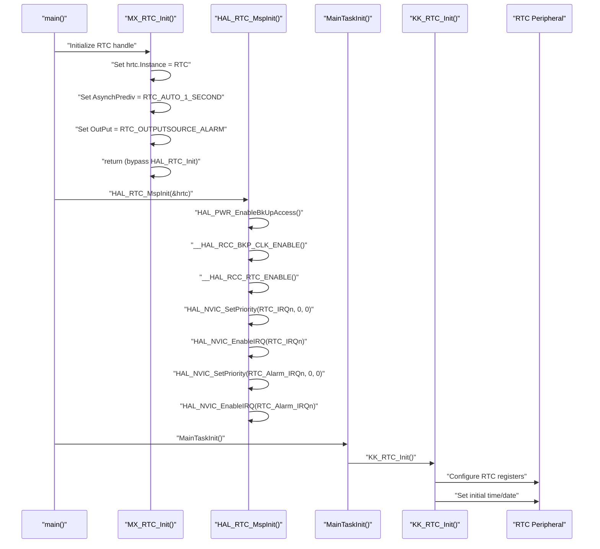
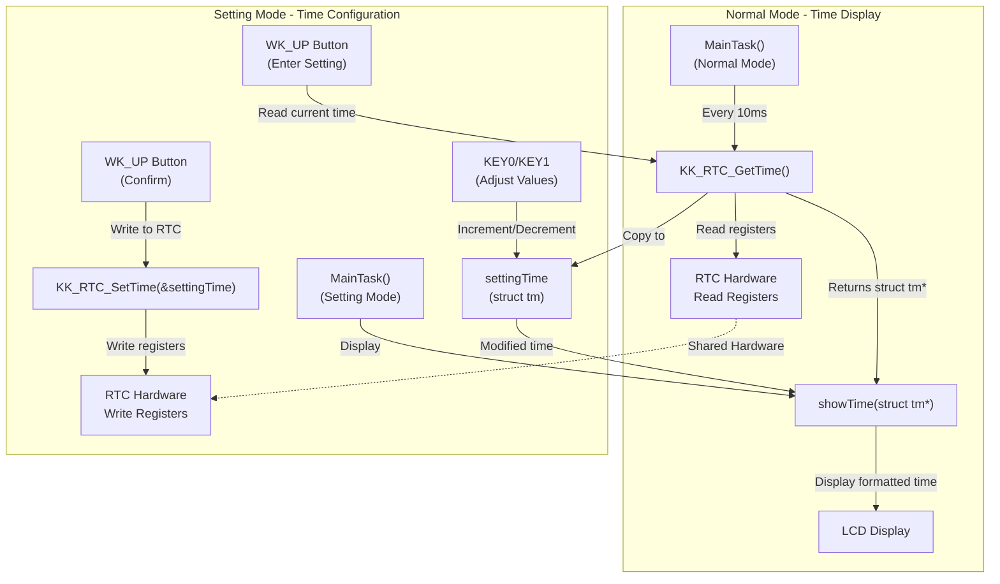
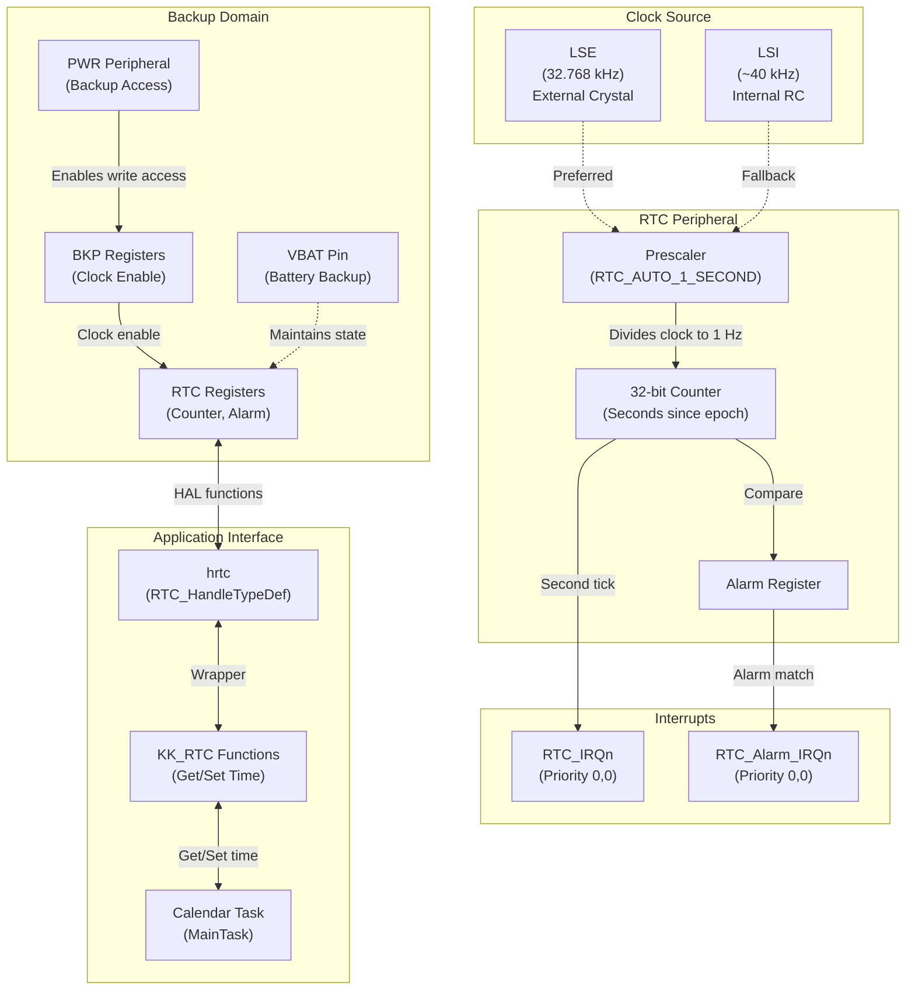

# Real-Time Clock

<details>
<summary>Relevant source files</summary>

The following files were used as context for generating this wiki page:

- [App/Src/task_main.c](App/Src/task_main.c)
- [Core/Inc/rtc.h](Core/Inc/rtc.h)
- [Core/Src/rtc.c](Core/Src/rtc.c)

</details>


## Purpose and Scope

This document describes the Real-Time Clock (RTC) peripheral configuration and its integration with the calendar/clock application. The RTC provides timekeeping functionality, maintaining the current date and time even during power cycling (when backup power is available). 

For information about how the calendar task uses the RTC for user interaction and display, see [Calendar Task](#2.2). For general peripheral initialization sequence, see [System Initialization](#3.2).

**Sources: ** [Core/Src/rtc.c:1-112](https://github.com/BA2F/STM32-TFTLCD-UI/blob/e0f407ee/Core/Src/rtc.c#L1-L112), [Core/Inc/rtc.h:1-53](https://github.com/BA2F/STM32-TFTLCD-UI/blob/e0f407ee/Core/Inc/rtc.h#L1-L53), [App/Src/task_main.c:1-425](https://github.com/BA2F/STM32-TFTLCD-UI/blob/e0f407ee/App/Src/task_main.c#L1-L425)

---

## RTC Peripheral Configuration

The RTC peripheral is configured through the STM32 HAL framework with custom initialization logic. The system uses a custom RTC wrapper layer (`KK_RTC`) instead of the standard HAL RTC functions.

### Hardware Configuration Overview

| Parameter | Value | Description |
|-----------|-------|-------------|
| **Peripheral Instance** | `RTC` | STM32F1xx RTC peripheral |
| **Asynchronous Prescaler** | `RTC_AUTO_1_SECOND` | Automatic prescaler for 1-second tick |
| **Output Source** | `RTC_OUTPUTSOURCE_ALARM` | RTC alarm output enabled |
| **Clock Source** | LSE/LSI | Low-speed external or internal oscillator |
| **Backup Domain** | Enabled | Allows RTC operation during power-down |

**Sources: ** [Core/Src/rtc.c:36-62](https://github.com/BA2F/STM32-TFTLCD-UI/blob/e0f407ee/Core/Src/rtc.c#L36-L62)

### HAL Initialization Bypass

The standard HAL initialization is bypassed in favor of a custom implementation:

```c
// In MX_RTC_Init()
if(1 == 1){
  hrtc.Instance = RTC;
  hrtc.Init.AsynchPrediv = RTC_AUTO_1_SECOND;
  hrtc.Init.OutPut = RTC_OUTPUTSOURCE_ALARM;	
  return;	// Bypasses HAL_RTC_Init()
}
```

This design pattern allows the custom `KK_RTC_Init()` function to be called from the application layer instead, providing specialized initialization tailored to the calendar application's requirements.

**Sources: ** [Core/Src/rtc.c:33-42](https://github.com/BA2F/STM32-TFTLCD-UI/blob/e0f407ee/Core/Src/rtc.c#L33-L42)

---

## RTC Initialization Sequence



**Initialization Flow:**

1. **HAL Handle Setup** - `MX_RTC_Init()` configures the `hrtc` handle structure but bypasses `HAL_RTC_Init()`
2. **MSP Initialization** - `HAL_RTC_MspInit()` enables backup domain access, clocks, and interrupts
3. **Custom Initialization** - `KK_RTC_Init()` performs application-specific RTC setup in `MainTaskInit()`

**Sources: ** [Core/Src/rtc.c:30-62](https://github.com/BA2F/STM32-TFTLCD-UI/blob/e0f407ee/Core/Src/rtc.c#L30-L62), [Core/Src/rtc.c:64-87](https://github.com/BA2F/STM32-TFTLCD-UI/blob/e0f407ee/Core/Src/rtc.c#L64-L87), [App/Src/task_main.c:362-368](https://github.com/BA2F/STM32-TFTLCD-UI/blob/e0f407ee/App/Src/task_main.c#L362-L368)

---

## MSP (MCU Support Package) Configuration

The `HAL_RTC_MspInit()` function performs low-level hardware configuration required for RTC operation.

### Backup Domain Access

The RTC peripheral resides in the backup domain, which requires special access permissions:

```c
HAL_PWR_EnableBkUpAccess();
```

This enables write access to the backup domain registers, which is necessary for configuring the RTC.

### Clock Configuration

```c
__HAL_RCC_BKP_CLK_ENABLE();   // Enable backup registers clock
__HAL_RCC_RTC_ENABLE();       // Enable RTC peripheral clock
```

The backup domain clock must be enabled before the RTC clock to ensure proper operation.

### Interrupt Configuration

Two RTC interrupts are configured with highest priority (0, 0):

| Interrupt | Purpose | Priority |
|-----------|---------|----------|
| `RTC_IRQn` | RTC global interrupt (seconds, overflow, alarm) | 0, 0 |
| `RTC_Alarm_IRQn` | RTC alarm specific interrupt | 0, 0 |

**Sources: ** [Core/Src/rtc.c:64-87](https://github.com/BA2F/STM32-TFTLCD-UI/blob/e0f407ee/Core/Src/rtc.c#L64-L87)

---

## RTC Handle Structure

The RTC is accessed through a global handle defined in `rtc.c`:

```c
RTC_HandleTypeDef hrtc;
```

This handle is declared as `extern` in `rtc.h` for access by other modules:

```c
extern RTC_HandleTypeDef hrtc;
```

**Handle Configuration:**
- **Instance**: Points to the RTC peripheral base address
- **Init.AsynchPrediv**: Set to `RTC_AUTO_1_SECOND` for automatic 1-second time base
- **Init.OutPut**: Set to `RTC_OUTPUTSOURCE_ALARM` to output alarm signal

**Sources: ** [Core/Src/rtc.c:27](https://github.com/BA2F/STM32-TFTLCD-UI/blob/e0f407ee/Core/Src/rtc.c#L27), [Core/Inc/rtc.h:35](https://github.com/BA2F/STM32-TFTLCD-UI/blob/e0f407ee/Core/Inc/rtc.h#L35)

---

## Integration with Calendar Task

The calendar application uses the RTC through a custom wrapper layer (`KK_RTC`) that provides simplified time management functions.

### Time Structure Format

The application uses the standard C library `struct tm` for representing date/time:

```c
struct tm settingTime;  // Used in Setting mode
```

**`struct tm` Members Used:**
- `tm_year` - Years since 1900 (70 = 1970 is minimum in code)
- `tm_mon` - Months [0-11]
- `tm_mday` - Day of month [1-31]
- `tm_hour` - Hours [0-23]
- `tm_min` - Minutes [0-59]
- `tm_sec` - Seconds [0-59]
- `tm_wday` - Day of week [0-6], Sunday = 0

**Sources: ** [App/Src/task_main.c:72](https://github.com/BA2F/STM32-TFTLCD-UI/blob/e0f407ee/App/Src/task_main.c#L72)

### RTC Wrapper Functions

The custom RTC wrapper provides two primary functions (referenced but not defined in provided files):

| Function | Purpose | Used In |
|----------|---------|---------|
| `KK_RTC_Init()` | Initialize RTC with default or stored time | `MainTaskInit()` |
| `KK_RTC_GetTime()` | Read current time as `struct tm*` | Normal mode display |
| `KK_RTC_SetTime(struct tm*)` | Write time to RTC | Setting mode confirmation |

**Sources: ** [App/Src/task_main.c:259](https://github.com/BA2F/STM32-TFTLCD-UI/blob/e0f407ee/App/Src/task_main.c#L259), [App/Src/task_main.c:271](https://github.com/BA2F/STM32-TFTLCD-UI/blob/e0f407ee/App/Src/task_main.c#L271), [App/Src/task_main.c:365](https://github.com/BA2F/STM32-TFTLCD-UI/blob/e0f407ee/App/Src/task_main.c#L365), [App/Src/task_main.c:405](https://github.com/BA2F/STM32-TFTLCD-UI/blob/e0f407ee/App/Src/task_main.c#L405)

---

## RTC Read/Write Data Flow



### Normal Mode - Time Reading

In normal operation mode, the calendar task continuously reads the current time from the RTC:

1. **Periodic Call**: `MainTask()` executes every 10ms
2. **Time Read**: `KK_RTC_GetTime()` returns pointer to current time
3. **Display Update**: `showTime()` formats and displays the time on LCD

```c
// In MainTask() - Normal mode
struct tm *now = KK_RTC_GetTime();
showTime(now);
```

**Sources: ** [App/Src/task_main.c:402-408](https://github.com/BA2F/STM32-TFTLCD-UI/blob/e0f407ee/App/Src/task_main.c#L402-L408)

### Setting Mode - Time Writing

When the user enters setting mode to adjust the time:

1. **Enter Setting**: WK_UP button triggers transition to Setting mode
2. **Time Capture**: Current RTC time is copied to `settingTime`
3. **User Adjustment**: KEY0/KEY1 buttons increment/decrement values
4. **Confirmation**: WK_UP button (after navigating through fields) writes to RTC

```c
// Enter setting mode
if (calendarState == CalendarState_Normal) {
    settingTime = *KK_RTC_GetTime();  // Capture current time
    settingState = Year;
    calendarState = CalendarState_Setting;
}

// Confirm and write
if (settingState == Second) {
    KK_RTC_SetTime(&settingTime);  // Write to RTC
    calendarState = CalendarState_Normal;
}
```

**Sources: ** [App/Src/task_main.c:256-274](https://github.com/BA2F/STM32-TFTLCD-UI/blob/e0f407ee/App/Src/task_main.c#L256-L274), [App/Src/task_main.c:85-157](https://github.com/BA2F/STM32-TFTLCD-UI/blob/e0f407ee/App/Src/task_main.c#L85-L157), [App/Src/task_main.c:165-233](https://github.com/BA2F/STM32-TFTLCD-UI/blob/e0f407ee/App/Src/task_main.c#L165-L233)

---

## Time Value Validation

The calendar task implements bounds checking when adjusting time values in Setting mode:

### Year Validation
```c
settingTime.tm_year--;
if (settingTime.tm_year < 70) {  // 1970 minimum
    settingTime.tm_year = 70;
}
```

### Month Validation (0-11)
```c
settingTime.tm_mon--;
if (settingTime.tm_mon < 1) {
    settingTime.tm_mon = 11;
}
```

### Day Validation (1-31)
```c
settingTime.tm_mday--;
if (settingTime.tm_mday <= 0) {
    settingTime.tm_mday = 31;  // Note: No month-specific validation
}
```

### Hour Validation (0-23)
```c
settingTime.tm_hour--;
if (settingTime.tm_hour < 0) {
    settingTime.tm_hour = 23;
}
```

### Minute/Second Validation (0-59)
```c
settingTime.tm_min--;
if (settingTime.tm_min < 0) {
    settingTime.tm_min = 59;
}
```

**Note**: The day validation does not account for different month lengths (28/29/30/31 days). All months wrap at 31.

**Sources: ** [App/Src/task_main.c:100-155](https://github.com/BA2F/STM32-TFTLCD-UI/blob/e0f407ee/App/Src/task_main.c#L100-L155), [App/Src/task_main.c:180-230](https://github.com/BA2F/STM32-TFTLCD-UI/blob/e0f407ee/App/Src/task_main.c#L180-L230)

---

## RTC Interrupt Configuration

The RTC peripheral has two interrupt lines configured in the MSP initialization:

### RTC Global Interrupt (`RTC_IRQn`)

Handles:
- Second increment events
- Overflow events  
- Alarm events (if enabled)

```c
HAL_NVIC_SetPriority(RTC_IRQn, 0, 0);
HAL_NVIC_EnableIRQ(RTC_IRQn);
```

### RTC Alarm Interrupt (`RTC_Alarm_IRQn`)

Dedicated interrupt for alarm events:

```c
HAL_NVIC_SetPriority(RTC_Alarm_IRQn, 0, 0);
HAL_NVIC_EnableIRQ(RTC_Alarm_IRQn);
```

**Priority Configuration:**
- Both interrupts are set to **priority 0, sub-priority 0** (highest priority)
- This ensures time-critical RTC operations are not delayed

**Note**: The actual interrupt handlers (`RTC_IRQHandler`, `RTC_Alarm_IRQHandler`) are defined in `stm32f1xx_it.c` but are not shown in the provided files.

**Sources: ** [Core/Src/rtc.c:78-82](https://github.com/BA2F/STM32-TFTLCD-UI/blob/e0f407ee/Core/Src/rtc.c#L78-L82)

---

## RTC Hardware Architecture



### Backup Domain Operation

The RTC resides in the backup domain, which:
- **Persists during reset**: RTC continues running through system resets
- **Battery backup**: Can be powered by VBAT when VDD is removed
- **Write protection**: Requires explicit PWR peripheral enable for write access
- **Independent clock**: Uses LSE/LSI, not system clock

### Time Base Generation

The RTC uses a prescaler to generate a 1-second time base:
- **Input**: 32.768 kHz (LSE) or ~40 kHz (LSI)
- **Prescaler**: `RTC_AUTO_1_SECOND` divides to 1 Hz
- **Counter**: Increments once per second
- **Range**: 32-bit counter = ~136 years from epoch

**Sources: ** [Core/Src/rtc.c:36-42](https://github.com/BA2F/STM32-TFTLCD-UI/blob/e0f407ee/Core/Src/rtc.c#L36-L42), [Core/Src/rtc.c:72-76](https://github.com/BA2F/STM32-TFTLCD-UI/blob/e0f407ee/Core/Src/rtc.c#L72-L76)

---

## RTC De-initialization

The system provides cleanup functionality through `HAL_RTC_MspDeInit()`:

```c
void HAL_RTC_MspDeInit(RTC_HandleTypeDef* rtcHandle) {
    __HAL_RCC_RTC_DISABLE();           // Disable RTC clock
    HAL_NVIC_DisableIRQ(RTC_IRQn);     // Disable interrupts
    HAL_NVIC_DisableIRQ(RTC_Alarm_IRQn);
}
```

This function is called when the RTC handle is de-initialized, typically during:
- System reconfiguration
- Low-power mode transitions
- Error recovery

**Sources: ** [Core/Src/rtc.c:89-107](https://github.com/BA2F/STM32-TFTLCD-UI/blob/e0f407ee/Core/Src/rtc.c#L89-L107)

---

## Summary

The RTC peripheral in this system provides:

| Feature | Implementation |
|---------|----------------|
| **Time Base** | 1-second tick via `RTC_AUTO_1_SECOND` prescaler |
| **Clock Source** | LSE (32.768 kHz) or LSI fallback |
| **Backup Domain** | Enabled for persistent timekeeping |
| **Interrupts** | RTC global and alarm interrupts at priority 0 |
| **Application Interface** | Custom `KK_RTC` wrapper with `struct tm` format |
| **Integration** | Calendar task reads every 10ms, writes on user confirmation |
| **Range** | 1970-2106 (32-bit seconds counter) |

The RTC configuration follows a hybrid approach:
- HAL initialization sets up the hardware structure but bypasses standard initialization
- Custom `KK_RTC_Init()` performs application-specific setup
- MSP functions handle low-level clock and interrupt configuration
- Calendar task provides user-friendly time adjustment with wraparound validation

**Sources: ** [Core/Src/rtc.c:1-112](https://github.com/BA2F/STM32-TFTLCD-UI/blob/e0f407ee/Core/Src/rtc.c#L1-L112), [Core/Inc/rtc.h:1-53](https://github.com/BA2F/STM32-TFTLCD-UI/blob/e0f407ee/Core/Inc/rtc.h#L1-L53), [App/Src/task_main.c:1-425](https://github.com/BA2F/STM32-TFTLCD-UI/blob/e0f407ee/App/Src/task_main.c#L1-L425)