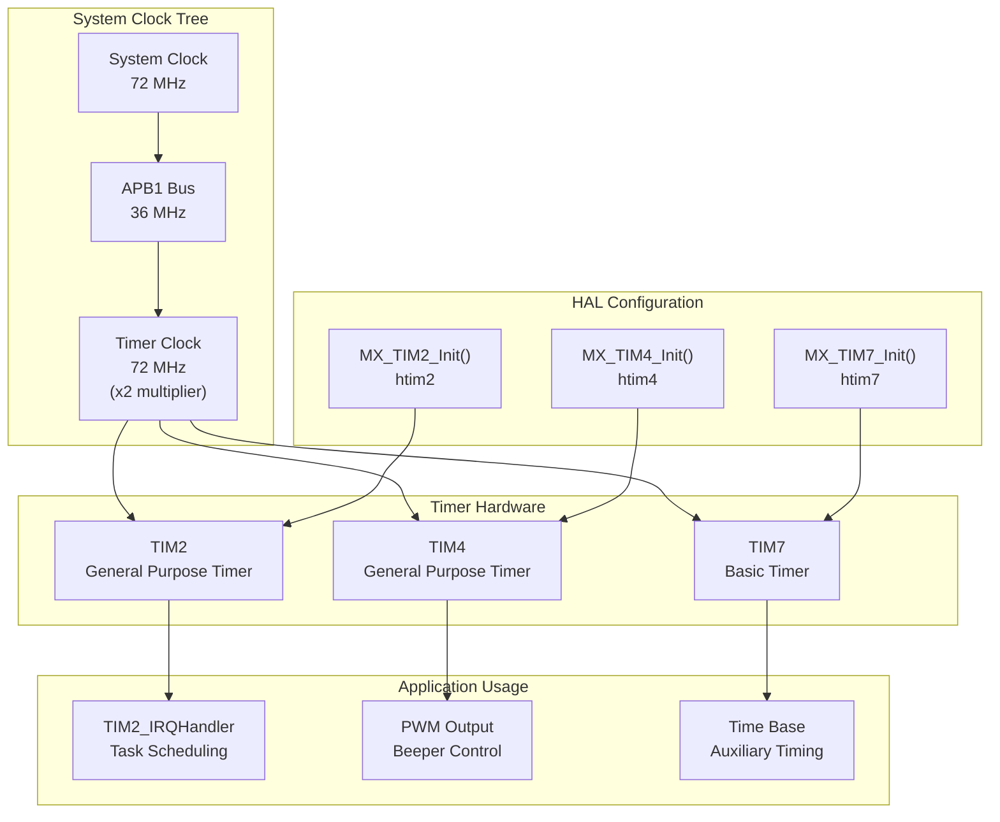
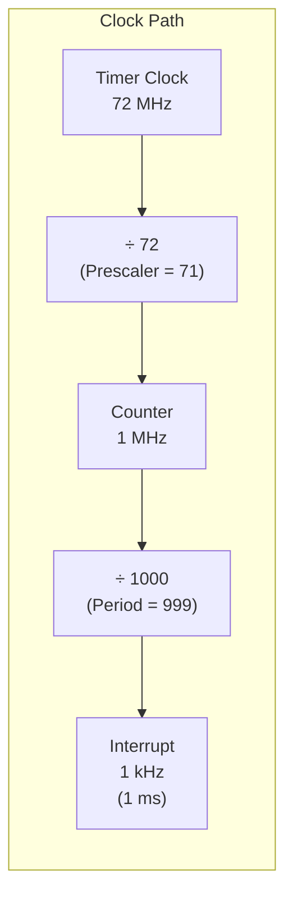
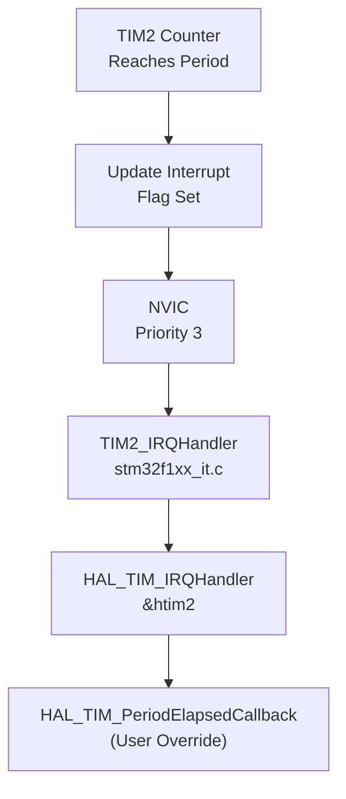
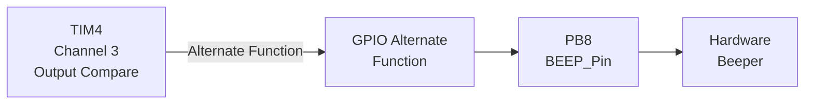
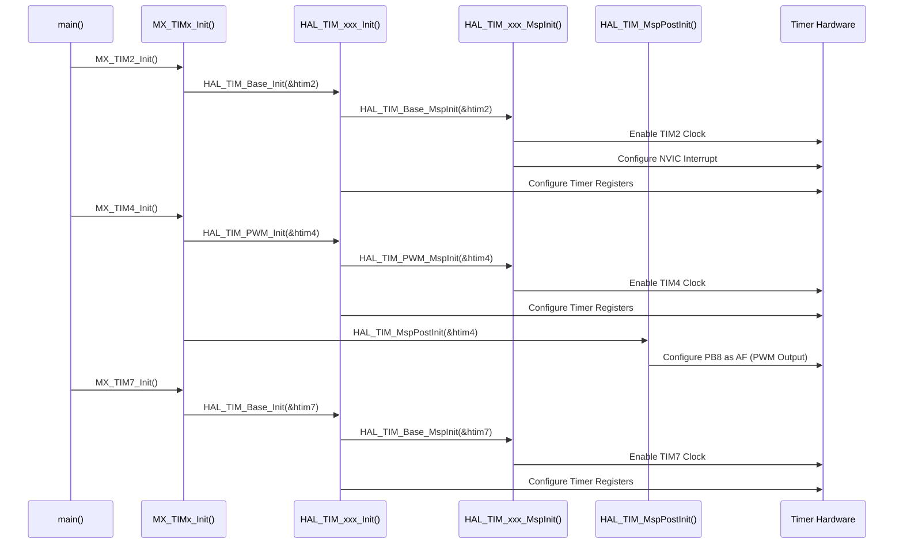

# Timer Peripherals

<details>
<summary>Relevant source files</summary>

The following files were used as context for generating this wiki page:

- [Core/Inc/main.h](Core/Inc/main.h)
- [Core/Inc/tim.h](Core/Inc/tim.h)
- [Core/Src/tim.c](Core/Src/tim.c)

</details>


## Purpose and Scope

This document describes the configuration and usage of the three timer peripherals (TIM2, TIM4, and TIM7) in the STM32-TFTLCD-UI system. These timers provide critical timing functions including task scheduling time bases, PWM generation for audio feedback, and auxiliary timing services.

For information about the interrupt handlers for these timers, see [Interrupt System](#3.3). For details on the application tasks that depend on timer scheduling, see [Main Application Loop](#2.1).

## Timer Overview

The system utilizes three hardware timers from the STM32F1xx timer subsystem:

| Timer | Type | Primary Function | Interrupt Enabled | Output Channel |
|-------|------|------------------|-------------------|----------------|
| TIM2  | General Purpose | Time base for task scheduling | Yes (Priority 3) | None |
| TIM4  | General Purpose | PWM generation for beeper | No | Channel 3 (PB8) |
| TIM7  | Basic Timer | Auxiliary time base | No | None |

All three timers are configured to generate a 1 kHz tick rate (1 ms period), providing consistent timing resolution across the system.

**Sources: ** [Core/Src/tim.c:27-147](https://github.com/BA2F/STM32-TFTLCD-UI/blob/e0f407ee/Core/Src/tim.c#L27-L147), [Core/Inc/tim.h:35-47](https://github.com/BA2F/STM32-TFTLCD-UI/blob/e0f407ee/Core/Inc/tim.h#L35-L47)

## Timer Configuration Architecture

The following diagram shows the relationship between timer hardware, HAL configuration, and application usage:



**Sources: ** [Core/Src/tim.c:32-147](https://github.com/BA2F/STM32-TFTLCD-UI/blob/e0f407ee/Core/Src/tim.c#L32-L147)

## TIM2: Time Base Timer with Interrupt

TIM2 serves as the primary time base for the application's task scheduler. It generates periodic interrupts at 1 ms intervals, which are used to implement the 10 ms and 100 ms task execution cycles.

### Configuration Parameters

The TIM2 configuration is implemented in `MX_TIM2_Init()`:

| Parameter | Value | Description |
|-----------|-------|-------------|
| Instance | TIM2 | Hardware timer peripheral |
| Prescaler | 71 | Divides input clock by 72 |
| Period | 999 | Auto-reload value (1000 counts) |
| Counter Mode | TIM_COUNTERMODE_UP | Counts from 0 to Period |
| Clock Division | TIM_CLOCKDIVISION_DIV1 | No additional clock division |
| Auto-Reload Preload | ENABLED | Buffered period updates |
| Clock Source | Internal | Uses APB1 timer clock |

**Sources: ** [Core/Src/tim.c:32-70](https://github.com/BA2F/STM32-TFTLCD-UI/blob/e0f407ee/Core/Src/tim.c#L32-L70)

### Timing Calculation



**Calculation:**
- Input Clock: 72 MHz (APB1 timer clock with 2x multiplier)
- After Prescaler: 72 MHz ÷ 72 = 1 MHz
- Counter Frequency: 1 MHz
- Interrupt Rate: 1 MHz ÷ 1000 = 1 kHz (1 ms period)

**Sources: ** [Core/Src/tim.c:45-49](https://github.com/BA2F/STM32-TFTLCD-UI/blob/e0f407ee/Core/Src/tim.c#L45-L49)

### Interrupt Configuration

TIM2 is the only timer configured with interrupt capability:



The interrupt is initialized in `HAL_TIM_Base_MspInit()`:

- Priority: 3 (lower priority than critical system interrupts)
- Sub-priority: 0
- IRQ: TIM2_IRQn

**Sources: ** [Core/Src/tim.c:149-166](https://github.com/BA2F/STM32-TFTLCD-UI/blob/e0f407ee/Core/Src/tim.c#L149-L166)

## TIM4: PWM Generation for Beeper

TIM4 is configured to generate a PWM signal on Channel 3, which drives the beeper output on pin PB8. This provides audio feedback for user interactions.

### Configuration Parameters

The TIM4 configuration is implemented in `MX_TIM4_Init()`:

| Parameter | Value | Description |
|-----------|-------|-------------|
| Instance | TIM4 | Hardware timer peripheral |
| Prescaler | 71 | Divides input clock by 72 |
| Period | 999 | PWM frequency divider (1000 counts) |
| Counter Mode | TIM_COUNTERMODE_UP | Counts from 0 to Period |
| Clock Division | TIM_CLOCKDIVISION_DIV1 | No additional clock division |
| Auto-Reload Preload | DISABLED | Immediate period updates |
| Mode | PWM | Pulse Width Modulation |

**Sources: ** [Core/Src/tim.c:72-114](https://github.com/BA2F/STM32-TFTLCD-UI/blob/e0f407ee/Core/Src/tim.c#L72-L114)

### PWM Channel Configuration

TIM4 Channel 3 is configured for PWM output:

| Parameter | Value | Description |
|-----------|-------|-------------|
| Channel | TIM_CHANNEL_3 | Output compare channel 3 |
| OCMode | TIM_OCMODE_PWM1 | PWM mode 1 (active when CNT < Pulse) |
| Pulse | 0 | Initial duty cycle (0%) |
| OCPolarity | TIM_OCPOLARITY_HIGH | Active high output |
| OCFastMode | DISABLED | No fast output mode |

**Sources: ** [Core/Src/tim.c:101-108](https://github.com/BA2F/STM32-TFTLCD-UI/blob/e0f407ee/Core/Src/tim.c#L101-L108)

### GPIO Pin Configuration

The PWM output is routed to the beeper pin through `HAL_TIM_MspPostInit()`:



GPIO Configuration:
- Pin: PB8 (BEEP_Pin)
- Mode: GPIO_MODE_AF_PP (Alternate Function Push-Pull)
- Speed: GPIO_SPEED_FREQ_LOW

**Sources: ** [Core/Src/tim.c:195-219](https://github.com/BA2F/STM32-TFTLCD-UI/blob/e0f407ee/Core/Src/tim.c#L195-L219), [Core/Inc/main.h:72-73](https://github.com/BA2F/STM32-TFTLCD-UI/blob/e0f407ee/Core/Inc/main.h#L72-L73)

### PWM Frequency

The PWM frequency is identical to TIM2's update rate:
- Base Frequency: 72 MHz ÷ 72 = 1 MHz
- PWM Frequency: 1 MHz ÷ 1000 = 1 kHz

The duty cycle is controlled by modifying the `Pulse` value (0-999), which determines the beeper volume or tone characteristics.

**Sources: ** [Core/Src/tim.c:85-88](https://github.com/BA2F/STM32-TFTLCD-UI/blob/e0f407ee/Core/Src/tim.c#L85-L88)

## TIM7: Auxiliary Time Base

TIM7 is a basic timer configured identically to TIM2 but without interrupt capability. It serves as an auxiliary time base that can be used by other peripherals or for timing measurements.

### Configuration Parameters

The TIM7 configuration is implemented in `MX_TIM7_Init()`:

| Parameter | Value | Description |
|-----------|-------|-------------|
| Instance | TIM7 | Hardware timer peripheral |
| Prescaler | 72-1 (71) | Divides input clock by 72 |
| Period | 1000-1 (999) | Auto-reload value (1000 counts) |
| Counter Mode | TIM_COUNTERMODE_UP | Counts from 0 to Period |
| Auto-Reload Preload | DISABLED | Immediate period updates |

**Sources: ** [Core/Src/tim.c:116-147](https://github.com/BA2F/STM32-TFTLCD-UI/blob/e0f407ee/Core/Src/tim.c#L116-L147)

### Timing Characteristics

TIM7 generates the same 1 ms tick rate as TIM2:
- Input Clock: 72 MHz
- After Prescaler: 1 MHz
- Update Rate: 1 kHz (1 ms period)

Unlike TIM2, TIM7 does not have its interrupt enabled, suggesting it may be used for:
- Triggering ADC conversions (TIM_TRGO_RESET configured)
- Providing a time reference for polling operations
- Synchronization with other peripherals

**Sources: ** [Core/Src/tim.c:128-132](https://github.com/BA2F/STM32-TFTLCD-UI/blob/e0f407ee/Core/Src/tim.c#L128-L132)

## Timer Handle Declarations

All three timer handles are declared as global variables accessible throughout the application:

```c
extern TIM_HandleTypeDef htim2;
extern TIM_HandleTypeDef htim4;
extern TIM_HandleTypeDef htim7;
```

These handles are used by the HAL API for all timer operations:
- `HAL_TIM_Base_Start_IT(&htim2)` - Start TIM2 with interrupts
- `HAL_TIM_PWM_Start(&htim4, TIM_CHANNEL_3)` - Start TIM4 PWM output
- `__HAL_TIM_SET_COMPARE(&htim4, TIM_CHANNEL_3, duty)` - Set PWM duty cycle

**Sources: ** [Core/Inc/tim.h:35-39](https://github.com/BA2F/STM32-TFTLCD-UI/blob/e0f407ee/Core/Inc/tim.h#L35-L39), [Core/Src/tim.c:27-29](https://github.com/BA2F/STM32-TFTLCD-UI/blob/e0f407ee/Core/Src/tim.c#L27-L29)

## Clock Enable and Disable

The HAL MSP (MCU Support Package) functions manage peripheral clock gating:

### Clock Enable

Implemented in `HAL_TIM_Base_MspInit()` and `HAL_TIM_PWM_MspInit()`:

| Timer | Clock Enable Macro | Function |
|-------|-------------------|----------|
| TIM2  | `__HAL_RCC_TIM2_CLK_ENABLE()` | HAL_TIM_Base_MspInit |
| TIM4  | `__HAL_RCC_TIM4_CLK_ENABLE()` | HAL_TIM_PWM_MspInit |
| TIM7  | `__HAL_RCC_TIM7_CLK_ENABLE()` | HAL_TIM_Base_MspInit |

**Sources: ** [Core/Src/tim.c:152-193](https://github.com/BA2F/STM32-TFTLCD-UI/blob/e0f407ee/Core/Src/tim.c#L152-L193)

### Clock Disable

Implemented in `HAL_TIM_Base_MspDeInit()` and `HAL_TIM_PWM_MspDeInit()`:

| Timer | Clock Disable Macro | Function |
|-------|---------------------|----------|
| TIM2  | `__HAL_RCC_TIM2_CLK_DISABLE()` | HAL_TIM_Base_MspDeInit |
| TIM4  | `__HAL_RCC_TIM4_CLK_DISABLE()` | HAL_TIM_PWM_MspDeInit |
| TIM7  | `__HAL_RCC_TIM7_CLK_DISABLE()` | HAL_TIM_Base_MspDeInit |

**Sources: ** [Core/Src/tim.c:221-265](https://github.com/BA2F/STM32-TFTLCD-UI/blob/e0f407ee/Core/Src/tim.c#L221-L265)

## Timer Initialization Sequence

The following diagram shows the complete initialization sequence for all three timers during system startup:



**Sources: ** [Core/Src/tim.c:32-219](https://github.com/BA2F/STM32-TFTLCD-UI/blob/e0f407ee/Core/Src/tim.c#L32-L219)

## Master Configuration

All three timers are configured with master output trigger settings:

```c
sMasterConfig.MasterOutputTrigger = TIM_TRGO_RESET;
sMasterConfig.MasterSlaveMode = TIM_MASTERSLAVEMODE_DISABLE;
```

This configuration sets:
- **TIM_TRGO_RESET**: The master trigger output (TRGO) is reset event
- **TIM_MASTERSLAVEMODE_DISABLE**: Timer operates independently

These settings allow the timers to potentially trigger other peripherals (like ADC) through their TRGO signal, though master-slave synchronization is disabled for independent operation.

**Sources: ** [Core/Src/tim.c:60-65](https://github.com/BA2F/STM32-TFTLCD-UI/blob/e0f407ee/Core/Src/tim.c#L60-L65), [Core/Src/tim.c:95-100](https://github.com/BA2F/STM32-TFTLCD-UI/blob/e0f407ee/Core/Src/tim.c#L95-L100), [Core/Src/tim.c:137-142](https://github.com/BA2F/STM32-TFTLCD-UI/blob/e0f407ee/Core/Src/tim.c#L137-L142)

## Summary Table

| Feature | TIM2 | TIM4 | TIM7 |
|---------|------|------|------|
| **Type** | General Purpose | General Purpose | Basic Timer |
| **Frequency** | 1 kHz (1 ms) | 1 kHz (1 ms) | 1 kHz (1 ms) |
| **Prescaler** | 71 | 71 | 71 |
| **Period** | 999 | 999 | 999 |
| **Interrupt** | Enabled (Priority 3) | Disabled | Disabled |
| **Output** | None | PWM CH3 (PB8) | None |
| **Use Case** | Task scheduling | Beeper audio | Auxiliary timing |
| **Auto-Reload Preload** | Enabled | Disabled | Disabled |

**Sources: ** [Core/Src/tim.c:32-147](https://github.com/BA2F/STM32-TFTLCD-UI/blob/e0f407ee/Core/Src/tim.c#L32-L147)