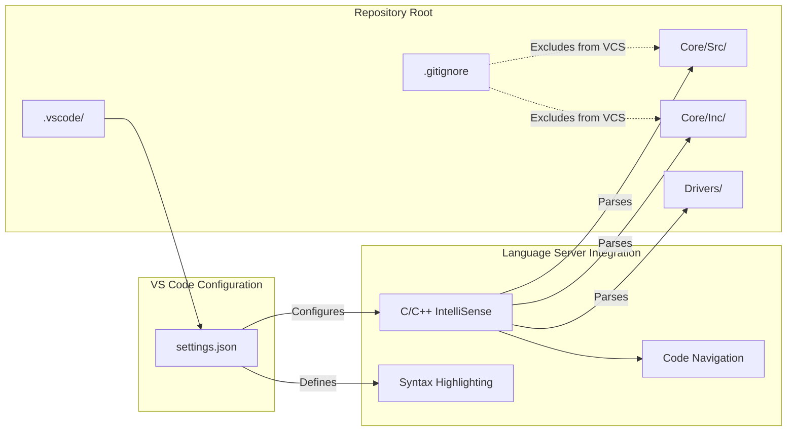
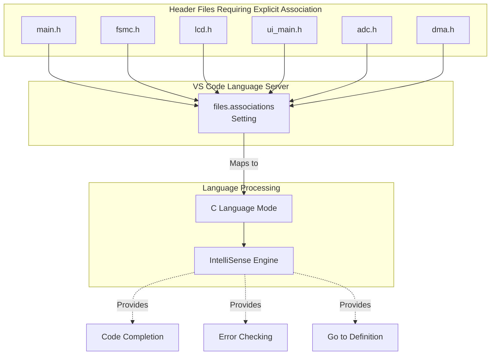
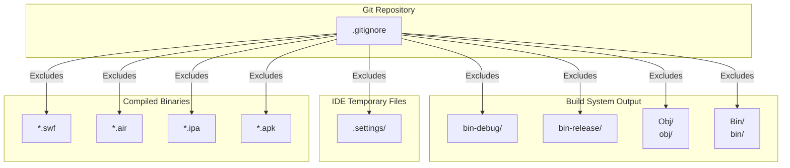
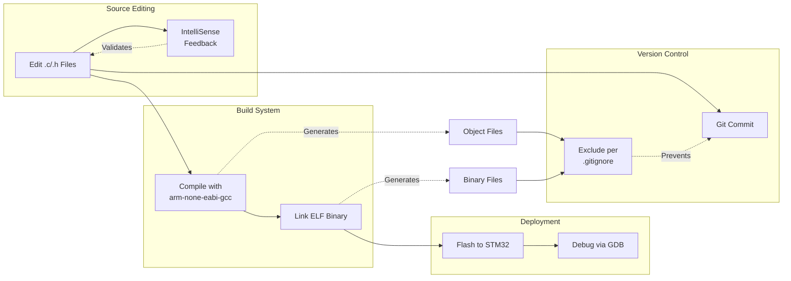

# IDE Configuration

Relevant source files

The following files were used as context for generating this wiki page:

- [.gitignore](.gitignore)
- [.vscode/settings.json](.vscode/settings.json)

## Purpose and Scope

This document covers the Visual Studio Code (VS Code) configuration used for developing the STM32-TFTLCD-UI project. It details the workspace settings, file associations, and version control configuration that enable efficient embedded C development.

For information about the STM32CubeMX project structure and HAL code generation, see [STM32CubeMX Project](#5.1). For broader build system and toolchain documentation, see [Getting Started](#1.1).

---

## Visual Studio Code Workspace

The project uses **Visual Studio Code** as the primary development environment for STM32 embedded C development. VS Code provides a lightweight, extensible platform suitable for cross-platform embedded development with ARM toolchains.

### Workspace Configuration Files

The `.vscode/` directory contains IDE-specific configuration that is committed to version control, allowing consistent development experience across team members:

**Figure 1: VS Code Workspace Structure**

**Sources: ** [.vscode/settings.json:1-10](https://github.com/BA2F/STM32-TFTLCD-UI/blob/e0f407ee/.vscode/settings.json#L1-L10), [.gitignore:1-19](https://github.com/BA2F/STM32-TFTLCD-UI/blob/e0f407ee/.gitignore#L1-L19)

---

## File Associations Configuration

The `settings.json` file defines explicit language mode mappings for header files in the project. This configuration ensures that VS Code's C/C++ language server correctly recognizes header files as C language files rather than defaulting to C++ mode.

### Configured File Associations

The following table lists all file associations defined in [.vscode/settings.json:2-9]():

| Header File | Language Mode | Purpose |
|-------------|---------------|---------|
| `main.h` | `c` | Main application header |
| `fsmc.h` | `c` | FSMC peripheral driver header |
| `lcd.h` | `c` | LCD display driver header |
| `ui_main.h` | `c` | UI task interface header |
| `adc.h` | `c` | ADC peripheral driver header |
| `dma.h` | `c` | DMA controller driver header |

### File Association Mapping

**Figure 2: File Association Processing Flow**

**Sources: ** [.vscode/settings.json:2-9](https://github.com/BA2F/STM32-TFTLCD-UI/blob/e0f407ee/.vscode/settings.json#L2-L9)

### Rationale for Explicit Associations

These explicit associations are necessary because:

1. **Language disambiguation**: Header files (`.h`) can be either C or C++. VS Code may default to C++ mode, which has different parsing rules and standard libraries.

2. **STM32 HAL compatibility**: The STM32 HAL libraries are pure C code and use C-specific constructs that are invalid or deprecated in C++.

3. **IntelliSense accuracy**: Correct language mode ensures accurate syntax highlighting, error detection, and code completion.

4. **Project consistency**: All developers see the same syntax highlighting and receive the same diagnostic messages.

The files explicitly configured represent the core driver interfaces used throughout the application layer. HAL-generated peripheral initialization files (in `Core/Inc/`) are included by these headers and benefit from the C language mode setting.

**Sources: ** [.vscode/settings.json:2-9](https://github.com/BA2F/STM32-TFTLCD-UI/blob/e0f407ee/.vscode/settings.json#L2-L9)

---

## Version Control Configuration

The `.gitignore` file defines patterns for excluding build artifacts and IDE-specific temporary files from version control.

### Ignored Build Artifacts

**Figure 3: Git Ignore Pattern Structure**

### Ignore Pattern Categories

The ignore patterns fall into three categories as defined in [.gitignore:1-19]():

| Pattern | Type | Purpose |
|---------|------|---------|
| `bin-debug/`, `bin-release/` | Build output | Debug and release binary directories |
| `[Oo]bj/`, `[Bb]in/` | Build artifacts | Object files and binaries (case-insensitive) |
| `.settings/` | IDE metadata | IDE-specific project settings |
| `*.swf`, `*.air`, `*.ipa`, `*.apk` | Executables | Platform-specific executable formats |

**Note:** The presence of `.swf`, `.air`, `.ipa`, and `.apk` patterns suggests this `.gitignore` may have been derived from a template for cross-platform development. These patterns are not relevant to STM32 embedded development but cause no harm.

**Sources: ** [.gitignore:1-19](https://github.com/BA2F/STM32-TFTLCD-UI/blob/e0f407ee/.gitignore#L1-L19)

---

## Recommended Development Environment Setup

While the project's committed configuration covers essential file associations, a complete development environment for STM32 embedded C requires additional tooling.

### Required VS Code Extensions

The following extensions are recommended for STM32 development (not explicitly configured in the repository):

| Extension | Purpose | Functionality |
|-----------|---------|---------------|
| **C/C++** (Microsoft) | Language support | IntelliSense, debugging, code browsing |
| **Cortex-Debug** | ARM debugging | GDB integration for STM32 targets |
| **STM32 VS Code Extension** | STM32 toolchain | Build system and flash programming |

### Additional Configuration Recommendations

For a complete development setup, developers should create the following additional files locally (these may be user-specific and therefore not committed):

1. **`.vscode/c_cpp_properties.json`**: Configure IntelliSense for ARM toolchain
   - Define ARM GCC include paths
   - Set compiler path to `arm-none-eabi-gcc`
   - Define preprocessor symbols (`STM32F103xE`, `USE_HAL_DRIVER`)

2. **`.vscode/launch.json`**: Configure debugging sessions
   - Define debug configurations for OpenOCD or ST-Link
   - Set executable path to `build/*.elf`
   - Configure SVD file for peripheral register viewing

3. **`.vscode/tasks.json`**: Define build tasks
   - Configure `make` or CMake build commands
   - Define flash programming tasks
   - Set up clean/rebuild targets

### IntelliSense Configuration Considerations

For accurate IntelliSense in STM32 projects, the C/C++ extension must be configured with:

- **Include paths**: `Core/Inc/`, `Drivers/STM32F1xx_HAL_Driver/Inc/`, `Drivers/CMSIS/Device/ST/STM32F1xx/Include/`, `Drivers/CMSIS/Include/`
- **Defines**: `USE_HAL_DRIVER`, `STM32F103xE` (or appropriate STM32 part number)
- **Compiler path**: Path to `arm-none-eabi-gcc` in the ARM GNU toolchain
- **IntelliSense mode**: `gcc-arm` or `gcc-x86` depending on toolchain

The file associations in [.vscode/settings.json:2-9]() work in conjunction with these broader IntelliSense settings to ensure correct parsing of all project files.

**Sources: ** [.vscode/settings.json:1-10](https://github.com/BA2F/STM32-TFTLCD-UI/blob/e0f407ee/.vscode/settings.json#L1-L10)

---

## Development Workflow Integration

The IDE configuration supports the following development workflows:

**Figure 4: Development Workflow with IDE Configuration**

### Configuration Impact on Workflow

The committed configuration directly supports:

1. **Code editing**: File associations ensure correct syntax highlighting and IntelliSense for header files referenced by application code.

2. **Code review**: Consistent language modes across developers prevent spurious syntax highlighting differences in code reviews.

3. **Build cleanliness**: `.gitignore` patterns prevent accidental commits of build artifacts that would pollute the repository.

4. **Onboarding**: New developers clone the repository and immediately have correct file associations without manual configuration.

**Sources: ** [.vscode/settings.json:1-10](https://github.com/BA2F/STM32-TFTLCD-UI/blob/e0f407ee/.vscode/settings.json#L1-L10), [.gitignore:1-19](https://github.com/BA2F/STM32-TFTLCD-UI/blob/e0f407ee/.gitignore#L1-L19)

---

## Summary

The IDE configuration for this STM32 project provides:

- **Language mode consistency** via explicit C language associations for key header files
- **Repository cleanliness** through comprehensive build artifact exclusion patterns  
- **Foundation for toolchain integration** that can be extended with user-specific debugging and build configurations

The committed configuration ([.vscode/settings.json:1-10]()) represents the minimal shared settings required for consistent development experience, while allowing developers to extend with local toolchain-specific configurations as needed.