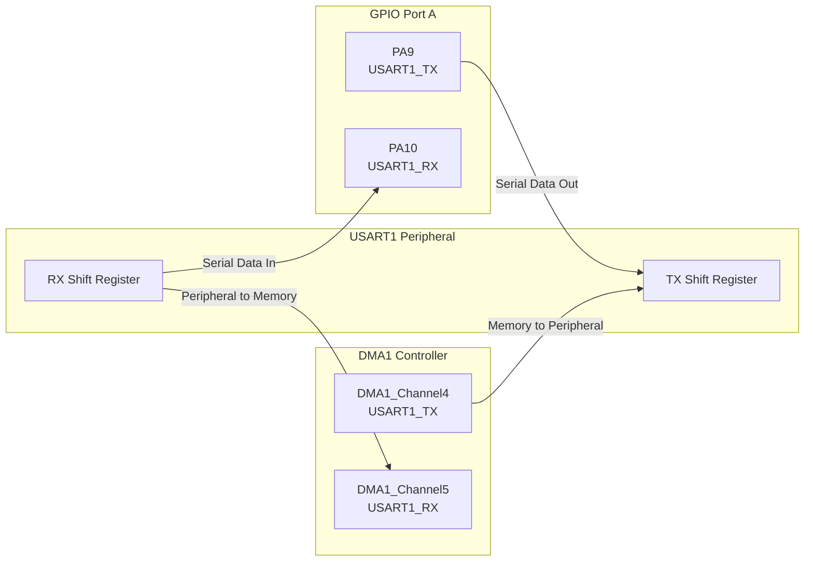
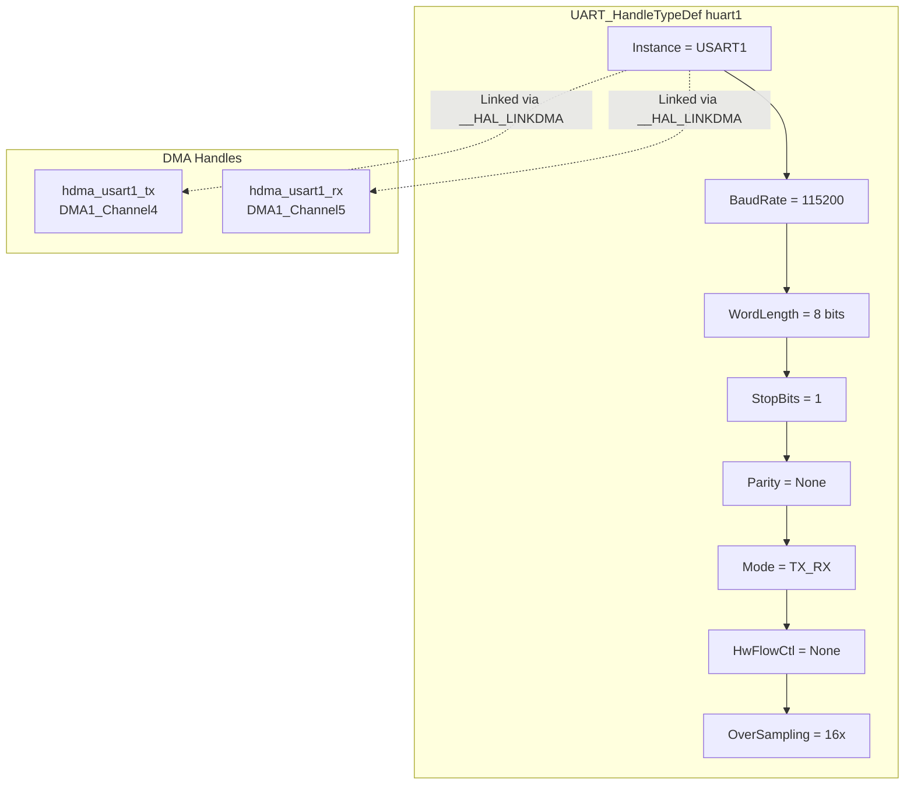
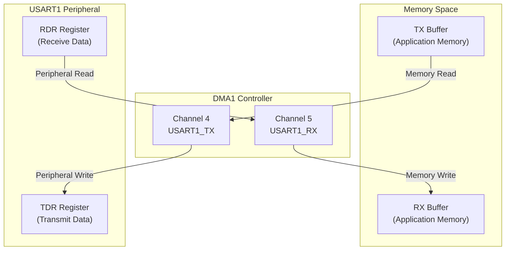
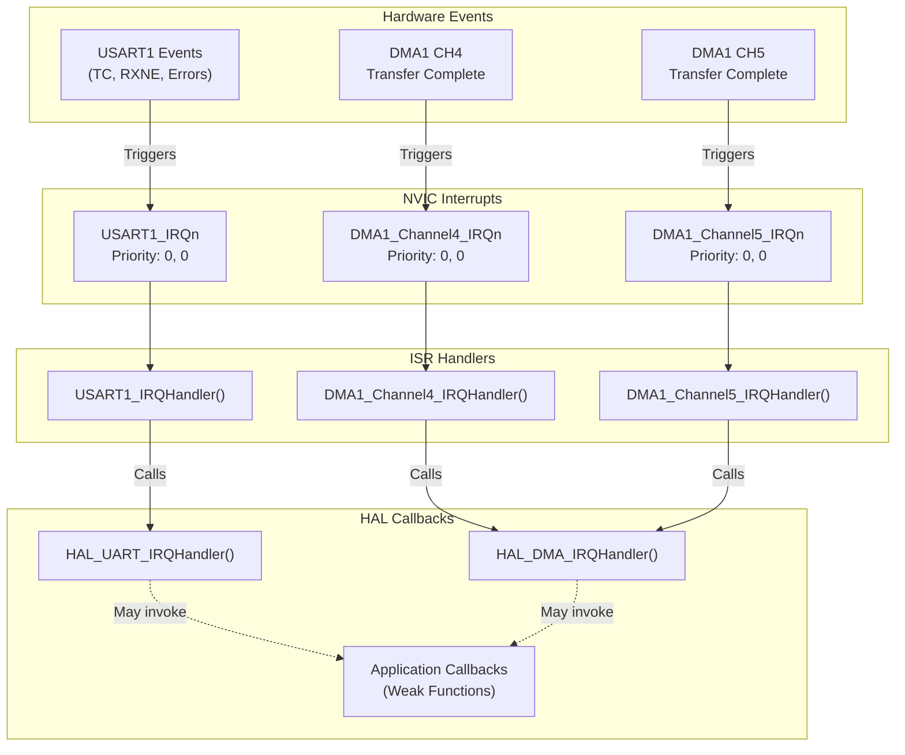
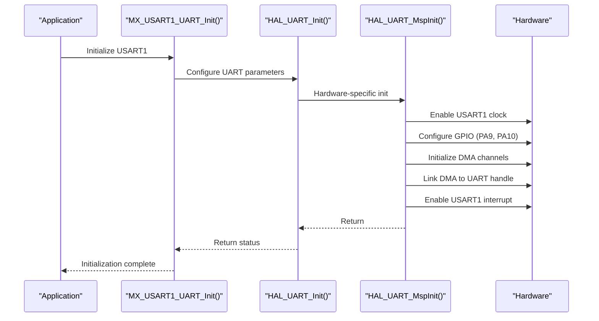
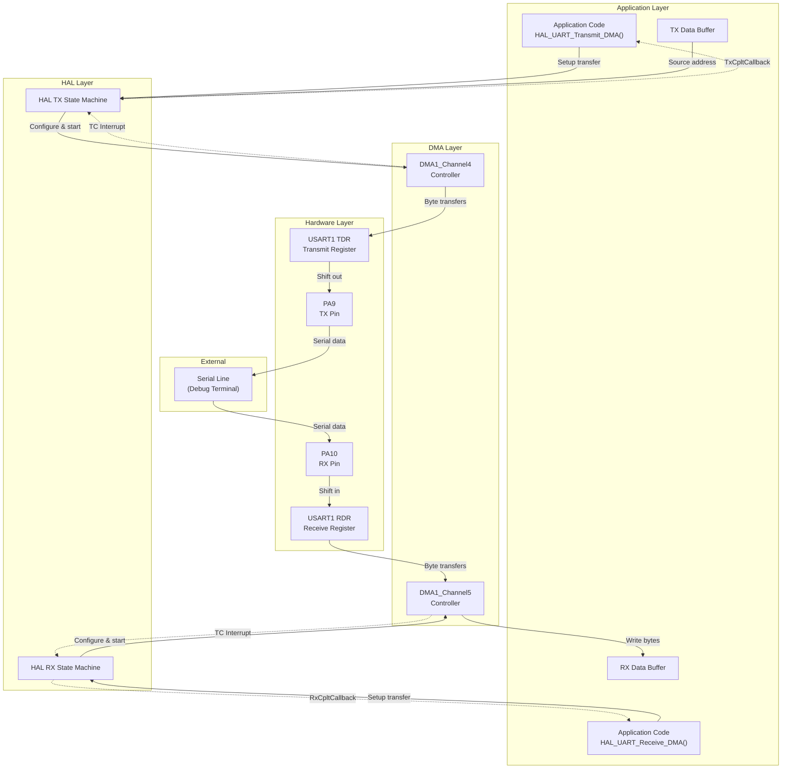
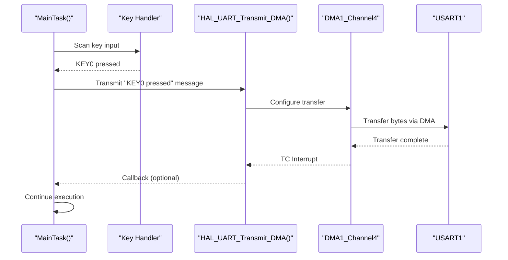

# Serial Communication (USART)

Relevant source files

The following files were used as context for generating this wiki page:

- [Core/Inc/usart.h](Core/Inc/usart.h)
- [Core/Src/dma.c](Core/Src/dma.c)
- [Core/Src/usart.c](Core/Src/usart.c)

## Purpose and Scope

This document describes the USART1 peripheral configuration used for serial communication in the STM32-TFTLCD-UI system. USART1 is configured for asynchronous serial communication at 115200 baud with DMA-enabled transmission and reception. The primary use case is debugging output, allowing the application to transmit status messages and key press events to an external serial terminal.

For information about the DMA controller configuration, see [DMA System](#4.7). For interrupt handling details, see [Interrupt System](#3.3).

**Sources: ** [Core/Inc/usart.h:1-53](https://github.com/BA2F/STM32-TFTLCD-UI/blob/e0f407ee/Core/Inc/usart.h#L1-L53), [Core/Src/usart.c:1-162](https://github.com/BA2F/STM32-TFTLCD-UI/blob/e0f407ee/Core/Src/usart.c#L1-L162)

---

## Hardware Pin Configuration

USART1 uses the following GPIO pins on Port A:

| Pin | Function | Mode | Speed | Configuration |
|-----|----------|------|-------|---------------|
| PA9 | USART1_TX | Alternate Function Push-Pull | High | Transmit Data Output |
| PA10 | USART1_RX | Input | N/A | Receive Data Input (No Pull) |

The GPIO configuration is performed in the `HAL_UART_MspInit()` function, which is called automatically during UART initialization.

**Diagram: USART1 Hardware Connection Architecture**

The GPIO pins are configured with alternate function mode, routing them to the USART1 peripheral. TX is configured as push-pull output for driving the serial line, while RX is configured as floating input for receiving data.

**Sources: ** [Core/Src/usart.c:74-86](https://github.com/BA2F/STM32-TFTLCD-UI/blob/e0f407ee/Core/Src/usart.c#L74-L86)

---

## USART Parameter Configuration

USART1 is configured through the `huart1` handle with the following parameters:

**Diagram: USART1 Configuration Parameters**

### Communication Parameters

| Parameter | Value | Description |
|-----------|-------|-------------|
| **Baud Rate** | 115200 | Bits per second transmission rate |
| **Word Length** | 8 bits | Data frame size (8N1 configuration) |
| **Stop Bits** | 1 | Single stop bit per frame |
| **Parity** | None | No parity checking |
| **Mode** | TX_RX | Both transmit and receive enabled |
| **Hardware Flow Control** | None | No RTS/CTS flow control |
| **Oversampling** | 16x | 16x oversampling for noise immunity |

This configuration implements the standard **8N1** serial format (8 data bits, no parity, 1 stop bit), which is the most common configuration for asynchronous serial communication. The 115200 baud rate provides a good balance between speed and reliability over typical serial cable lengths.

**Sources: ** [Core/Src/usart.c:43-50](https://github.com/BA2F/STM32-TFTLCD-UI/blob/e0f407ee/Core/Src/usart.c#L43-L50)

---

## DMA Configuration

USART1 uses DMA for both transmission and reception, offloading data transfer from the CPU. Two DMA channels are configured:

### DMA Channel Assignments

**Diagram: DMA Data Transfer Paths**

### DMA TX Configuration (Channel 4)

The transmit DMA channel transfers data from application memory to the USART1 transmit register:

| Parameter | Value | Purpose |
|-----------|-------|---------|
| **Instance** | `DMA1_Channel4` | Hardware DMA channel |
| **Direction** | `DMA_MEMORY_TO_PERIPH` | Memory → USART1 TDR |
| **PeriphInc** | `DMA_PINC_DISABLE` | TDR address fixed |
| **MemInc** | `DMA_MINC_ENABLE` | Buffer pointer increments |
| **PeriphDataAlignment** | `DMA_PDATAALIGN_BYTE` | 8-bit peripheral access |
| **MemDataAlignment** | `DMA_MDATAALIGN_BYTE` | 8-bit memory access |
| **Mode** | `DMA_NORMAL` | Single transfer mode |
| **Priority** | `DMA_PRIORITY_LOW` | Low priority |

**Sources: ** [Core/Src/usart.c:106-119](https://github.com/BA2F/STM32-TFTLCD-UI/blob/e0f407ee/Core/Src/usart.c#L106-L119)

### DMA RX Configuration (Channel 5)

The receive DMA channel transfers data from the USART1 receive register to application memory:

| Parameter | Value | Purpose |
|-----------|-------|---------|
| **Instance** | `DMA1_Channel5` | Hardware DMA channel |
| **Direction** | `DMA_PERIPH_TO_MEMORY` | USART1 RDR → Memory |
| **PeriphInc** | `DMA_PINC_DISABLE` | RDR address fixed |
| **MemInc** | `DMA_MINC_ENABLE` | Buffer pointer increments |
| **PeriphDataAlignment** | `DMA_PDATAALIGN_BYTE` | 8-bit peripheral access |
| **MemDataAlignment** | `DMA_MDATAALIGN_BYTE` | 8-bit memory access |
| **Mode** | `DMA_NORMAL` | Single transfer mode |
| **Priority** | `DMA_PRIORITY_LOW` | Low priority |

**Sources: ** [Core/Src/usart.c:90-103](https://github.com/BA2F/STM32-TFTLCD-UI/blob/e0f407ee/Core/Src/usart.c#L90-L103)

### DMA Normal Mode

Both channels use `DMA_NORMAL` mode, which performs a single transfer and then stops. The application must restart the DMA transfer for each transmission or reception operation. This differs from circular mode, which would automatically restart transfers.

---

## Interrupt Configuration

The USART system uses three interrupt sources for handling communication events and DMA transfers:

**Diagram: USART Interrupt System Architecture**

### Interrupt Priority Configuration

All USART-related interrupts are configured with the same priority level:

| Interrupt | Priority Group | Sub-Priority | Purpose |
|-----------|----------------|--------------|---------|
| `USART1_IRQn` | 0 | 0 | USART events (TC, errors) |
| `DMA1_Channel4_IRQn` | 0 | 0 | TX DMA transfer complete |
| `DMA1_Channel5_IRQn` | 0 | 0 | RX DMA transfer complete |

The priority 0/0 configuration gives these interrupts the highest priority in the system, ensuring responsive communication handling. The interrupts are enabled during initialization via `HAL_NVIC_EnableIRQ()`.

**Sources: ** [Core/Src/usart.c:122-123](https://github.com/BA2F/STM32-TFTLCD-UI/blob/e0f407ee/Core/Src/usart.c#L122-L123), [Core/Src/dma.c:47-55](https://github.com/BA2F/STM32-TFTLCD-UI/blob/e0f407ee/Core/Src/dma.c#L47-L55)

---

## API and Usage

### Initialization Functions

The USART module provides a single initialization function:

#### `MX_USART1_UART_Init()`

This function configures USART1 with the parameters defined in the `huart1` handle. It calls `HAL_UART_Init()`, which internally invokes `HAL_UART_MspInit()` for hardware-specific initialization.

**Declaration:** [Core/Inc/usart.h:41]()  
**Definition:** [Core/Src/usart.c:33-59]()

**Initialization Sequence:**

**Diagram: USART1 Initialization Sequence**

### Global Handle

The USART module exports a single global handle:

#### `huart1`

**Type:** `UART_HandleTypeDef`  
**Declaration:** [Core/Inc/usart.h:35]()  
**Definition:** [Core/Src/usart.c:27]()

This handle is used by HAL API functions for all USART1 operations. The application should pass this handle to HAL transmission and reception functions.

### DMA Handles

Two DMA handles are defined for USART operations:

#### `hdma_usart1_tx`

**Type:** `DMA_HandleTypeDef`  
**Definition:** [Core/Src/usart.c:29]()  
**Purpose:** Manages DMA1 Channel 4 for USART1 transmission

#### `hdma_usart1_rx`

**Type:** `DMA_HandleTypeDef`  
**Definition:** [Core/Src/usart.c:28]()  
**Purpose:** Manages DMA1 Channel 5 for USART1 reception

These handles are linked to `huart1` via the `__HAL_LINKDMA()` macro during initialization.

**Sources: ** [Core/Src/usart.c:103](https://github.com/BA2F/STM32-TFTLCD-UI/blob/e0f407ee/Core/Src/usart.c#L103), [Core/Src/usart.c:119](https://github.com/BA2F/STM32-TFTLCD-UI/blob/e0f407ee/Core/Src/usart.c#L119)

### MSP Functions

The module implements HAL MSP (MCU Support Package) callback functions:

#### `HAL_UART_MspInit()`

Performs hardware-specific initialization for USART1:
- Enables USART1 and GPIOA peripheral clocks
- Configures GPIO pins for alternate function
- Initializes and links DMA channels
- Enables USART1 interrupt in NVIC

**Definition:** [Core/Src/usart.c:61-128]()

#### `HAL_UART_MspDeInit()`

Performs hardware-specific de-initialization:
- Disables USART1 peripheral clock
- De-initializes GPIO pins
- De-initializes DMA channels
- Disables USART1 interrupt

**Definition:** [Core/Src/usart.c:130-157]()

---

## Data Flow Architecture

The following diagram illustrates the complete data flow for USART transmission and reception operations:

**Diagram: Complete USART Data Flow**

### Transmission Flow

1. Application calls `HAL_UART_Transmit_DMA(&huart1, buffer, length)`
2. HAL configures DMA1 Channel 4 with source buffer address and transfer count
3. DMA controller automatically transfers bytes from memory to USART1 TDR register
4. USART1 shifts out bits on PA9 at configured baud rate (115200 bps)
5. Upon transfer completion, DMA triggers interrupt
6. `DMA1_Channel4_IRQHandler()` calls `HAL_DMA_IRQHandler()`
7. HAL may invoke `HAL_UART_TxCpltCallback()` (weak function, overrideable)

### Reception Flow

1. Application calls `HAL_UART_Receive_DMA(&huart1, buffer, length)`
2. HAL configures DMA1 Channel 5 with destination buffer address and transfer count
3. USART1 shifts in bits from PA10 at configured baud rate
4. DMA controller automatically transfers bytes from USART1 RDR register to memory
5. Upon transfer completion, DMA triggers interrupt
6. `DMA1_Channel5_IRQHandler()` calls `HAL_DMA_IRQHandler()`
7. HAL may invoke `HAL_UART_RxCpltCallback()` (weak function, overrideable)

**Sources: ** [Core/Src/usart.c:88-119](https://github.com/BA2F/STM32-TFTLCD-UI/blob/e0f407ee/Core/Src/usart.c#L88-L119), [Core/Src/dma.c:47-52](https://github.com/BA2F/STM32-TFTLCD-UI/blob/e0f407ee/Core/Src/dma.c#L47-L52)

---

## Integration with Application

In the context of the STM32-TFTLCD-UI application, USART1 is primarily used for debugging output. Based on the system architecture, the Calendar Task transmits debug messages when keys are pressed (KEY0, KEY1, WK_UP events).

### Typical Usage Pattern

**Diagram: Debug Message Transmission Pattern**

The application does not require custom interrupt handlers or callbacks since the transmission is fire-and-forget for debugging purposes. The DMA-based approach ensures that the CPU can continue executing application tasks while data is being transmitted serially.

**Sources: ** System architecture diagrams, [Core/Src/usart.c:1-162](https://github.com/BA2F/STM32-TFTLCD-UI/blob/e0f407ee/Core/Src/usart.c#L1-L162)

---

## Summary

The USART1 peripheral configuration provides:

- **115200 baud serial communication** with standard 8N1 format
- **DMA-enabled transmission and reception** for CPU-efficient data transfers
- **GPIO pins PA9/PA10** for TX/RX with appropriate alternate function configuration
- **Interrupt-driven operation** with priority 0/0 for responsive handling
- **HAL-based abstraction** for portability and ease of use
- **Debug output capability** for monitoring application events

The configuration is optimized for debugging output in the calendar/clock application, allowing key press events and system status messages to be transmitted to an external serial terminal without consuming significant CPU resources.