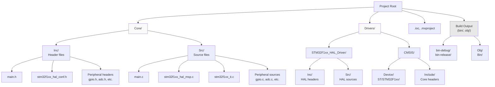
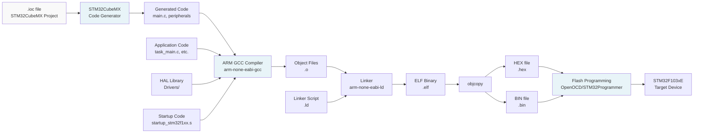
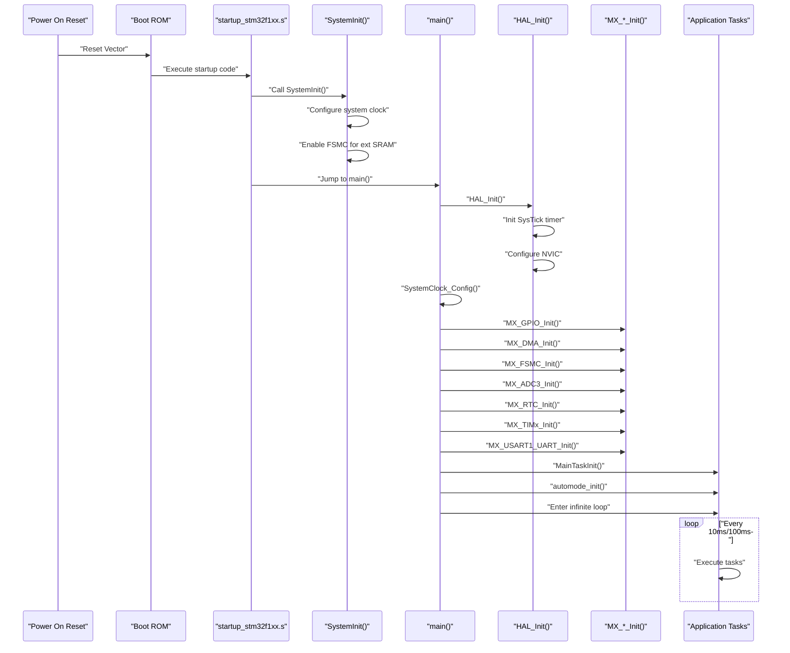

# Getting Started

<details>
<summary>Relevant source files</summary>

The following files were used as context for generating this wiki page:

- [.gitignore](.gitignore)
- [.mxproject](.mxproject)
- [.vscode/settings.json](.vscode/settings.json)
- [Core/Inc/stm32f1xx_hal_conf.h](Core/Inc/stm32f1xx_hal_conf.h)

</details>


This document provides instructions for building, configuring, and deploying the STM32-TFTLCD-UI project to an STM32F103xE microcontroller. It covers the required hardware, software tools, project structure, and build process.

For detailed information about the system architecture and how components interact, see [System Architecture](#1.2). For STM32CubeMX project configuration, see [STM32CubeMX Project](#5.1). For IDE-specific settings, see [IDE Configuration](#5.2).

---

## Prerequisites

### Hardware Requirements

The project is designed for the following hardware configuration:

| Component | Specification | Purpose |
|-----------|---------------|---------|
| **Microcontroller** | STM32F103xE (High-density performance line) | Main processor with 512KB Flash, 64KB SRAM |
| **TFT LCD Display** | Memory-mapped TFT (FSMC interface) | User interface display |
| **External SRAM** | FSMC Bank 4 connected | Frame buffer for LCD operations |
| **Light Sensor** | Photoresistor connected to ADC3 | Ambient light detection for auto-brightness |
| **User Input** | KEY0 (PE4), KEY1 (PE3), WK_UP (PA0) | Button inputs for user interaction |
| **Debug Interface** | ST-LINK/V2 or compatible | Programming and debugging |
| **Serial Port** | USART1 (optional) | Debug output and logging |

### Software Requirements

The following tools are required to build and deploy the project:

| Tool | Purpose | Version |
|------|---------|---------|
| **STM32CubeMX** | Peripheral configuration and code generation | 6.0 or later |
| **ARM GCC Toolchain** | Cross-compiler for ARM Cortex-M3 | arm-none-eabi-gcc 10.3 or later |
| **Make** | Build automation | GNU Make 4.0 or later |
| **OpenOCD** or **STM32CubeProgrammer** | Flash programming utility | Latest stable version |
| **VS Code** (optional) | Development environment | Latest stable version |

**Sources: ** [.mxproject:1-40](https://github.com/BA2F/STM32-TFTLCD-UI/blob/e0f407ee/.mxproject#L1-L40), [Core/Inc/stm32f1xx_hal_conf.h:1-390](https://github.com/BA2F/STM32-TFTLCD-UI/blob/e0f407ee/Core/Inc/stm32f1xx_hal_conf.h#L1-L390), [.vscode/settings.json:1-10](https://github.com/BA2F/STM32-TFTLCD-UI/blob/e0f407ee/.vscode/settings.json#L1-L10)

---

## Project Structure Overview

The project follows the standard STM32CubeMX-generated structure with application-specific code additions:



**Key Directories:**

- **Core/Inc** and **Core/Src**: Application code and peripheral initialization functions
- **Drivers/STM32F1xx_HAL_Driver**: STM32 Hardware Abstraction Layer implementation
- **Drivers/CMSIS**: Cortex Microcontroller Software Interface Standard headers and startup code
- **Build outputs**: Generated object files and binaries (excluded from version control per [.gitignore:1-19]())

**Sources: ** [.gitignore:1-19](https://github.com/BA2F/STM32-TFTLCD-UI/blob/e0f407ee/.gitignore#L1-L19), [.mxproject:9-40](https://github.com/BA2F/STM32-TFTLCD-UI/blob/e0f407ee/.mxproject#L9-L40), [.vscode/settings.json:1-10](https://github.com/BA2F/STM32-TFTLCD-UI/blob/e0f407ee/.vscode/settings.json#L1-L10)

---

## HAL Module Configuration

The project uses a subset of available STM32 HAL modules. The configuration is defined in `stm32f1xx_hal_conf.h`:

```mermaid
graph LR
    subgraph "Enabled HAL Modules"
        ADC["HAL_ADC_MODULE_ENABLED<br/>ADC3 for light sensor"]
        DMA["HAL_DMA_MODULE_ENABLED<br/>DMA1/DMA2 transfers"]
        GPIO["HAL_GPIO_MODULE_ENABLED<br/>Keys, LEDs, backlight"]
        RTC["HAL_RTC_MODULE_ENABLED<br/>Calendar/clock"]
        SRAM["HAL_SRAM_MODULE_ENABLED<br/>External memory via FSMC"]
        TIM["HAL_TIM_MODULE_ENABLED<br/>TIM2, TIM4, TIM7"]
        UART["HAL_UART_MODULE_ENABLED<br/>USART1 debug output"]
        CORTEX["HAL_CORTEX_MODULE_ENABLED<br/>NVIC, SysTick"]
        FLASH["HAL_FLASH_MODULE_ENABLED<br/>Flash operations"]
        EXTI["HAL_EXTI_MODULE_ENABLED<br/>External interrupts"]
        PWR["HAL_PWR_MODULE_ENABLED<br/>Power management"]
        RCC["HAL_RCC_MODULE_ENABLED<br/>Clock configuration"]
    end
    
    subgraph "Disabled Modules"
        DISABLED["CAN, CEC, CRC, DAC,<br/>ETH, I2C, I2S, IRDA,<br/>SPI, WWDG, etc."]
    end
    
    style ADC fill:#f9f9f9
    style DMA fill:#f9f9f9
    style GPIO fill:#f9f9f9
    style RTC fill:#f9f9f9
    style SRAM fill:#f9f9f9
    style TIM fill:#f9f9f9
    style UART fill:#f9f9f9
```



**Module Selection Rationale:**

- **ADC**: Light sensor input on ADC3 with DMA transfer
- **DMA**: Automated data transfers for ADC and USART, reducing CPU load
- **GPIO**: Digital I/O for keys (KEY0, KEY1, WK_UP) and outputs (LEDs, LCD backlight)
- **RTC**: Real-time clock for calendar/time display functionality
- **SRAM**: External SRAM access via FSMC for LCD frame buffer
- **TIM**: Timer peripherals for task scheduling (TIM2), PWM beeper (TIM4), auxiliary timing (TIM7)
- **UART**: Serial debug output via USART1 with DMA

**Sources: ** [Core/Inc/stm32f1xx_hal_conf.h:36-78](https://github.com/BA2F/STM32-TFTLCD-UI/blob/e0f407ee/Core/Inc/stm32f1xx_hal_conf.h#L36-L78), [Core/Inc/stm32f1xx_hal_conf.h:136-158](https://github.com/BA2F/STM32-TFTLCD-UI/blob/e0f407ee/Core/Inc/stm32f1xx_hal_conf.h#L136-L158)

---

## Clock Configuration

The system operates with the following clock configuration:

| Clock Domain | Frequency | Source | Purpose |
|--------------|-----------|--------|---------|
| **HSE** | 8 MHz | External crystal oscillator | Primary clock source |
| **System Clock (SYSCLK)** | 72 MHz (typical) | HSE via PLL | Main CPU clock |
| **AHB Clock (HCLK)** | 72 MHz | SYSCLK | Bus clocks, DMA, memory |
| **APB1 Clock** | 36 MHz max | HCLK / prescaler | Low-speed peripherals (TIM2, USART) |
| **APB2 Clock** | 72 MHz | HCLK | High-speed peripherals (ADC, TIM4, GPIO) |
| **LSE** | 32.768 kHz | External low-speed crystal | RTC timekeeping |
| **ADC Clock** | ≤14 MHz | APB2 / prescaler | ADC3 conversion clock |

**Clock Definitions:**

```c
// From stm32f1xx_hal_conf.h
#define HSE_VALUE    8000000U   // External oscillator: 8 MHz
#define HSI_VALUE    8000000U   // Internal oscillator: 8 MHz
#define LSE_VALUE    32768U     // RTC crystal: 32.768 kHz
#define LSI_VALUE    40000U     // Low-speed internal: ~40 kHz
```

**Sources: ** [Core/Inc/stm32f1xx_hal_conf.h:86-122](https://github.com/BA2F/STM32-TFTLCD-UI/blob/e0f407ee/Core/Inc/stm32f1xx_hal_conf.h#L86-L122)

---

## Build Process

### Build Toolchain Flow



### Build Steps

**1. Generate Initialization Code (if modifying peripheral configuration):**

```bash
# Open STM32CubeMX
# File → Load Project → select .ioc file
# Modify peripherals as needed
# Project → Generate Code
```

The `.ioc` file contains the complete peripheral configuration. Regeneration overwrites initialization code in `main.c` between `USER CODE BEGIN` and `USER CODE END` markers.

**2. Compile Source Files:**

```bash
# Typical Makefile-based build
make clean          # Clean previous build artifacts
make all            # Build project
make -j4            # Parallel build (4 jobs)
```

**3. Build Output:**

Successful compilation produces:
- **Object files** (`.o`): Compiled but not linked code
- **ELF file** (`.elf`): Linked executable with debug symbols
- **HEX file** (`.hex`): Intel HEX format for programming
- **BIN file** (`.bin`): Raw binary image
- **MAP file** (`.map`): Memory layout and symbol information

Build artifacts are typically placed in `bin-debug/` or `bin-release/` directories as specified in [.gitignore:2-5]().

**Sources: ** [.mxproject:1-40](https://github.com/BA2F/STM32-TFTLCD-UI/blob/e0f407ee/.mxproject#L1-L40), [.gitignore:1-19](https://github.com/BA2F/STM32-TFTLCD-UI/blob/e0f407ee/.gitignore#L1-L19)

---

## Programming the Device

### Flash Memory Layout

```mermaid
graph TB
    subgraph "STM32F103xE Flash Memory Map"
        IVT["0x08000000<br/>Interrupt Vector Table<br/>(startup code)"]
        FLASH_CODE["0x08000xxx<br/>Application Code<br/>(main.c, HAL, drivers)"]
        FLASH_DATA["0x0807xxxx<br/>Constants & Data<br/>(strings, lookup tables)"]
        FLASH_END["0x0807FFFF<br/>End of Flash<br/>(512 KB total)"]
    end
    
    subgraph "SRAM Memory Map"
        SRAM_START["0x20000000<br/>Stack & Heap<br/>(System SRAM)"]
        SRAM_DATA["RAM Variables<br/>(global, static)"]
        SRAM_END["0x2000FFFF<br/>End of SRAM<br/>(64 KB total)"]
    end
    
    subgraph "External SRAM (FSMC Bank 4)"
        EXT_SRAM["0x6C000000<br/>LCD Frame Buffer<br/>(external SRAM)"]
    end
    
    IVT --> FLASH_CODE
    FLASH_CODE --> FLASH_DATA
    FLASH_DATA --> FLASH_END
    
    SRAM_START --> SRAM_DATA
    SRAM_DATA --> SRAM_END
    
    style IVT fill:#f9f9f9
    style FLASH_CODE fill:#f9f9f9
    style SRAM_START fill:#e8f4f8
    style EXT_SRAM fill:#fff4e1
```



### Programming Methods

**Method 1: Using OpenOCD (Recommended for development)**

```bash
# Connect ST-LINK debugger to target
# Start OpenOCD with appropriate config
openocd -f interface/stlink.cfg -f target/stm32f1x.cfg

# In separate terminal, connect via telnet
telnet localhost 4444

# Flash commands in OpenOCD
> reset halt
> flash write_image erase project.bin 0x08000000
> reset run
> exit
```

**Method 2: Using STM32CubeProgrammer (GUI)**

1. Launch STM32CubeProgrammer
2. Select ST-LINK connection
3. Connect to target device
4. Load `.hex` or `.bin` file
5. Set start address: `0x08000000`
6. Click "Start Programming"

**Method 3: Using st-flash (Command-line)**

```bash
# Install stlink tools
# Flash binary directly
st-flash write project.bin 0x08000000

# Verify flash contents
st-flash read flash_dump.bin 0x08000000 0x80000

# Reset device
st-flash reset
```

**Sources: ** General STM32 flash programming procedures

---

## Initial Setup and Verification

### Post-Programming Checklist

After flashing the firmware, verify the following:

| Step | Expected Behavior | Troubleshooting |
|------|-------------------|-----------------|
| **Power On** | System initializes within 100ms | Check power supply voltage (3.3V regulated) |
| **LCD Display** | Calendar/clock UI appears | Verify FSMC connections and external SRAM |
| **RTC Function** | Time/date displayed (may need setting) | Check LSE crystal oscillation (32.768 kHz) |
| **Key Input** | KEY0/KEY1/WK_UP respond to presses | Check GPIO pin connections (PE4, PE3, PA0) |
| **Auto-Brightness** | Display switches light/dark mode | Verify photoresistor connection to ADC3 |
| **Debug Output** | USART1 transmits key press events | Connect serial adapter to USART1 TX pin |

### Debug Serial Output Configuration

The project outputs debug information via USART1:

| Parameter | Value |
|-----------|-------|
| **Baud Rate** | 115200 bps (typical) |
| **Data Bits** | 8 |
| **Parity** | None |
| **Stop Bits** | 1 |
| **Flow Control** | None |

Connect a USB-to-serial adapter to USART1 TX pin and monitor output with a terminal emulator:

```bash
# Linux/macOS
screen /dev/ttyUSB0 115200

# Or using minicom
minicom -D /dev/ttyUSB0 -b 115200

# Windows: Use PuTTY or TeraTerm
```

### System Initialization Sequence



If the system fails to initialize:
1. Verify clock configuration matches hardware (HSE crystal value)
2. Check HAL module configuration in [Core/Inc/stm32f1xx_hal_conf.h:36-78]()
3. Ensure external SRAM is properly connected (required for LCD)
4. Review initialization sequence in `main.c`

**Sources: ** [.mxproject:1-40](https://github.com/BA2F/STM32-TFTLCD-UI/blob/e0f407ee/.mxproject#L1-L40), [Core/Inc/stm32f1xx_hal_conf.h:1-390](https://github.com/BA2F/STM32-TFTLCD-UI/blob/e0f407ee/Core/Inc/stm32f1xx_hal_conf.h#L1-L390)

---

## Development Environment Setup

### VS Code Configuration

The project includes VS Code workspace settings in [.vscode/settings.json:1-10](). Key file associations:

```json
{
    "files.associations": {
        "main.h": "c",
        "fsmc.h": "c",
        "lcd.h": "c",
        "ui_main.h": "c",
        "adc.h": "c",
        "dma.h": "c"
    }
}
```

**Recommended VS Code Extensions:**

- **C/C++** (Microsoft): IntelliSense and debugging
- **Cortex-Debug**: ARM Cortex-M debugging with OpenOCD/ST-LINK
- **LinkerScript**: Syntax highlighting for `.ld` files
- **Makefile Tools**: Build task integration

### Debugging Setup

For interactive debugging:

1. Install OpenOCD and ARM GCC toolchain
2. Create `.vscode/launch.json`:

```json
{
    "type": "cortex-debug",
    "request": "launch",
    "servertype": "openocd",
    "cwd": "${workspaceRoot}",
    "executable": "./bin-debug/project.elf",
    "configFiles": [
        "interface/stlink.cfg",
        "target/stm32f1x.cfg"
    ]
}
```

3. Set breakpoints in source code
4. Press F5 to start debugging session

**Sources: ** [.vscode/settings.json:1-10](https://github.com/BA2F/STM32-TFTLCD-UI/blob/e0f407ee/.vscode/settings.json#L1-L10)

---

## Next Steps

After successfully building and deploying the project:

1. **Understand the Architecture**: Read [System Architecture](#1.2) for component relationships
2. **Explore Application Tasks**: See [Calendar Task](#2.2) and [Auto-Brightness Task](#2.3)
3. **Review HAL Configuration**: See [HAL Configuration](#3.1) for detailed HAL setup
4. **Study Peripheral Drivers**: Examine [Peripheral Drivers](#4) for hardware interface details
5. **Customize CubeMX Project**: See [STM32CubeMX Project](#5.1) for peripheral reconfiguration

**Sources: ** Table of contents structure