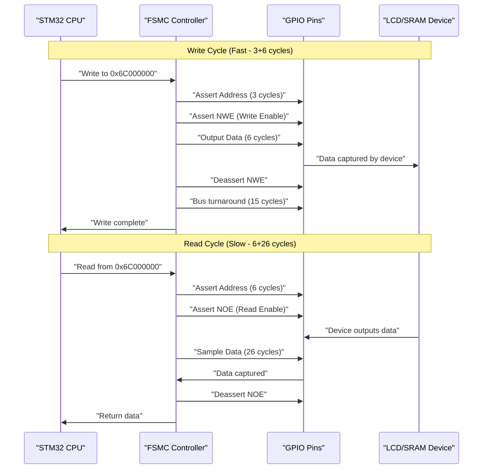
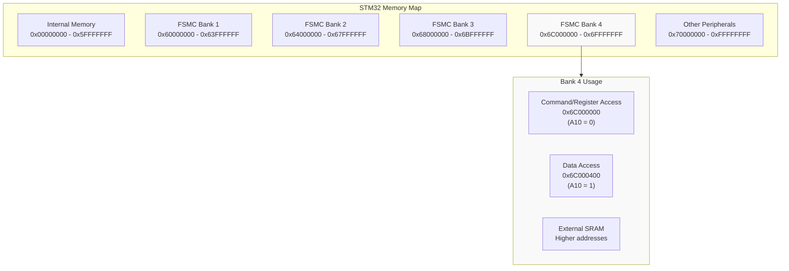
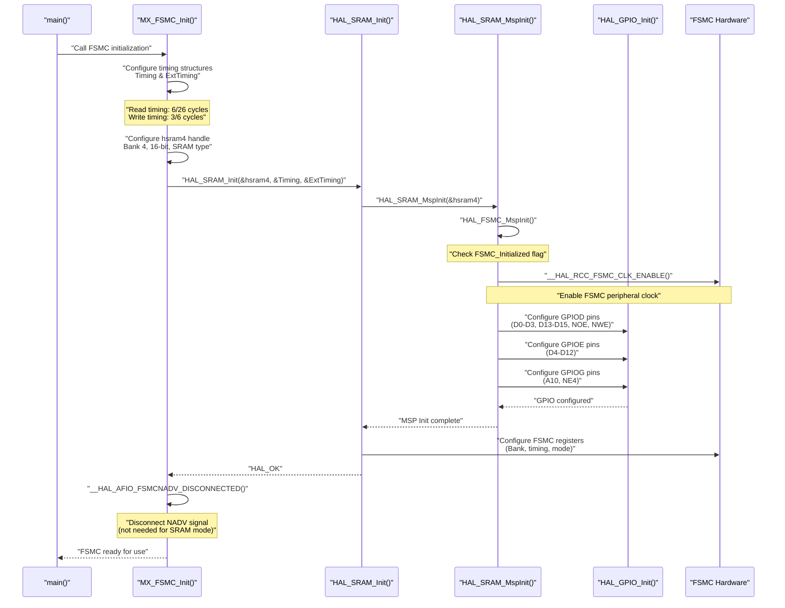
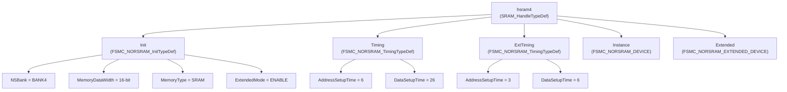

# Display Interface (FSMC)

<details>
<summary>Relevant source files</summary>

The following files were used as context for generating this wiki page:

- [.vscode/settings.json](.vscode/settings.json)
- [Core/Inc/fsmc.h](Core/Inc/fsmc.h)
- [Core/Src/fsmc.c](Core/Src/fsmc.c)

</details>


## Purpose and Scope

This document describes the FSMC (Flexible Static Memory Controller) peripheral configuration used to interface the TFT LCD display and external SRAM in this project. The FSMC provides a memory-mapped interface that allows the STM32F1xx to communicate with the display controller as if it were directly addressable memory, enabling high-performance graphics operations.

For information about GPIO pin assignments and other digital I/O, see [GPIO Configuration](#4.1). For details on the higher-level LCD driver that uses this FSMC interface, refer to the application layer documentation.

## Overview

The FSMC peripheral in the STM32F103 series provides a parallel external memory interface capable of connecting to various memory types including SRAM, NOR Flash, NAND Flash, and LCD controllers. In this project, the FSMC is configured to interface with:

1. **TFT LCD Display Controller** - Memory-mapped for fast pixel data transfer
2. **External SRAM** - Connected to FSMC Bank 4 for display buffering

The FSMC uses a 16-bit data bus and provides separate read/write timing configurations, allowing optimization for different access patterns (display writes vs. SRAM reads/writes).

**Sources: ** [Core/Src/fsmc.c:1-92](https://github.com/BA2F/STM32-TFTLCD-UI/blob/e0f407ee/Core/Src/fsmc.c#L1-L92)

## FSMC Configuration Summary

The FSMC is configured with the following key parameters:

| Parameter | Value | Description |
|-----------|-------|-------------|
| Memory Bank | `FSMC_NORSRAM_BANK4` | Uses Bank 4 of the NOR/SRAM controller |
| Memory Type | `FSMC_MEMORY_TYPE_SRAM` | Configured as SRAM-type device |
| Data Width | `FSMC_NORSRAM_MEM_BUS_WIDTH_16` | 16-bit parallel data bus |
| Extended Mode | `FSMC_EXTENDED_MODE_ENABLE` | Separate read/write timing |
| Address Multiplexing | `FSMC_DATA_ADDRESS_MUX_DISABLE` | Separate address and data lines |
| Write Operation | `FSMC_WRITE_OPERATION_ENABLE` | Write operations enabled |
| Wait Signal | `FSMC_WAIT_SIGNAL_DISABLE` | No wait state signaling |

**Sources: ** [Core/Src/fsmc.c:44-61](https://github.com/BA2F/STM32-TFTLCD-UI/blob/e0f407ee/Core/Src/fsmc.c#L44-L61)

## Hardware Pin Assignment

### FSMC Signal Mapping

The FSMC interface uses 22 GPIO pins across three GPIO ports (D, E, G) for the parallel bus interface:

```mermaid
graph TB
    subgraph GPIOD["GPIOD - Data Bus & Control"]
        PD0["PD0<br/>FSMC_D2"]
        PD1["PD1<br/>FSMC_D3"]
        PD4["PD4<br/>FSMC_NOE<br/>(Read Enable)"]
        PD5["PD5<br/>FSMC_NWE<br/>(Write Enable)"]
        PD8["PD8<br/>FSMC_D13"]
        PD9["PD9<br/>FSMC_D14"]
        PD10["PD10<br/>FSMC_D15"]
        PD14["PD14<br/>FSMC_D0"]
        PD15["PD15<br/>FSMC_D1"]
    end
    
    subgraph GPIOE["GPIOE - Data Bus"]
        PE7["PE7<br/>FSMC_D4"]
        PE8["PE8<br/>FSMC_D5"]
        PE9["PE9<br/>FSMC_D6"]
        PE10["PE10<br/>FSMC_D7"]
        PE11["PE11<br/>FSMC_D8"]
        PE12["PE12<br/>FSMC_D9"]
        PE13["PE13<br/>FSMC_D10"]
        PE14["PE14<br/>FSMC_D11"]
        PE15["PE15<br/>FSMC_D12"]
    end
    
    subgraph GPIOG["GPIOG - Address & Chip Select"]
        PG0["PG0<br/>FSMC_A10<br/>(Address Line)"]
        PG12["PG12<br/>FSMC_NE4<br/>(Chip Enable Bank 4)"]
    end
    
    subgraph External["External Device"]
        LCD["TFT LCD Controller<br/>& SRAM"]
    end
    
    PD14 -->|D0| LCD
    PD15 -->|D1| LCD
    PD0 -->|D2| LCD
    PD1 -->|D3| LCD
    PE7 -->|D4| LCD
    PE8 -->|D5| LCD
    PE9 -->|D6| LCD
    PE10 -->|D7| LCD
    PE11 -->|D8| LCD
    PE12 -->|D9| LCD
    PE13 -->|D10| LCD
    PE14 -->|D11| LCD
    PE15 -->|D12| LCD
    PD8 -->|D13| LCD
    PD9 -->|D14| LCD
    PD10 -->|D15| LCD
    PG0 -->|A10| LCD
    PD4 -->|Read Enable| LCD
    PD5 -->|Write Enable| LCD
    PG12 -->|Chip Enable| LCD
```



**Sources: ** [Core/Src/fsmc.c:109-130](https://github.com/BA2F/STM32-TFTLCD-UI/blob/e0f407ee/Core/Src/fsmc.c#L109-L130), [Core/Src/fsmc.c:184-205](https://github.com/BA2F/STM32-TFTLCD-UI/blob/e0f407ee/Core/Src/fsmc.c#L184-L205)

### Pin Configuration Details

All FSMC GPIO pins are configured with the following characteristics:

- **Mode:** `GPIO_MODE_AF_PP` - Alternate Function Push-Pull
- **Speed:** `GPIO_SPEED_FREQ_HIGH` - High-speed I/O (50 MHz)

The 16-bit data bus (`D0`-`D15`) is distributed across GPIOD and GPIOE ports. The address line `A10` on PG0 is used to distinguish between command and data transfers to the LCD controller (commonly used in parallel LCD interfaces where A0/RS selects register vs. data).

**Sources: ** [Core/Src/fsmc.c:132-154](https://github.com/BA2F/STM32-TFTLCD-UI/blob/e0f407ee/Core/Src/fsmc.c#L132-L154)

## Timing Configuration

### Read vs. Write Timing

The FSMC is configured with **Extended Mode** enabled, allowing separate timing parameters for read and write operations. This optimization is critical for LCD controllers, which often have different performance characteristics for read vs. write operations.

#### Read Timing Parameters

| Parameter | Value (HCLK cycles) | Description |
|-----------|---------------------|-------------|
| `AddressSetupTime` | 6 | Address setup before read strobe |
| `AddressHoldTime` | 15 | Address hold after read strobe |
| `DataSetupTime` | 26 | Data valid time during read |
| `BusTurnAroundDuration` | 0 | Bus turnaround between operations |
| `AccessMode` | `FSMC_ACCESS_MODE_A` | Access mode A (standard) |

#### Write Timing Parameters (Extended)

| Parameter | Value (HCLK cycles) | Description |
|-----------|---------------------|-------------|
| `AddressSetupTime` | 3 | Address setup before write strobe |
| `AddressHoldTime` | 15 | Address hold after write strobe |
| `DataSetupTime` | 6 | Data setup time during write |
| `BusTurnAroundDuration` | 15 | Bus turnaround to next operation |
| `AccessMode` | `FSMC_ACCESS_MODE_A` | Access mode A (standard) |

**Note:** Write timings are significantly faster than read timings (3/6 cycles vs. 6/26 cycles for address/data setup), reflecting the typical usage pattern where the application writes display data frequently but rarely reads back from the LCD controller.

**Sources: ** [Core/Src/fsmc.c:62-77](https://github.com/BA2F/STM32-TFTLCD-UI/blob/e0f407ee/Core/Src/fsmc.c#L62-L77)

### Timing Diagram



**Sources: ** [Core/Src/fsmc.c:62-77](https://github.com/BA2F/STM32-TFTLCD-UI/blob/e0f407ee/Core/Src/fsmc.c#L62-L77)

## Memory Bank Organization

### FSMC Bank 4 Address Space

The FSMC Bank 4 is mapped to a specific region of the STM32's external memory address space:



**Key Address Mapping:**
- **Base Address:** `0x6C000000` (FSMC Bank 4)
- **A10 = 0:** Command/Register access to LCD controller
- **A10 = 1:** Data access to LCD controller (address offset +0x400)
- The address line A10 acts as the Register Select (RS) line for the LCD

**Sources: ** [Core/Src/fsmc.c:49](https://github.com/BA2F/STM32-TFTLCD-UI/blob/e0f407ee/Core/Src/fsmc.c#L49)

## Initialization Sequence

### FSMC Initialization Flow



**Sources: ** [Core/Src/fsmc.c:31-92](https://github.com/BA2F/STM32-TFTLCD-UI/blob/e0f407ee/Core/Src/fsmc.c#L31-L92), [Core/Src/fsmc.c:96-169](https://github.com/BA2F/STM32-TFTLCD-UI/blob/e0f407ee/Core/Src/fsmc.c#L96-L169)

### Initialization Function Details

The initialization occurs through the following key functions:

#### `MX_FSMC_Init()`

This function [Core/Src/fsmc.c:31-92]() performs the top-level FSMC initialization:

1. **Create timing structures** - Separate `Timing` and `ExtTiming` structures for read/write operations
2. **Configure SRAM handle** - Set up the `hsram4` handle with Bank 4 parameters
3. **Call HAL initialization** - `HAL_SRAM_Init()` configures the FSMC hardware
4. **Disconnect NADV** - The NADV (address valid) signal is disconnected as it's not needed for SRAM-type devices

#### `HAL_FSMC_MspInit()`

This MSP (MCU Support Package) initialization function [Core/Src/fsmc.c:96-159]() performs low-level setup:

1. **Check initialization flag** - Prevents multiple initializations via the `FSMC_Initialized` static variable
2. **Enable peripheral clock** - Activates the FSMC peripheral clock via RCC
3. **Configure GPIO pins** - Initializes all 22 GPIO pins in alternate function mode with high-speed output

The function uses GPIO bulk initialization to configure multiple pins simultaneously for efficiency.

**Sources: ** [Core/Src/fsmc.c:31-92](https://github.com/BA2F/STM32-TFTLCD-UI/blob/e0f407ee/Core/Src/fsmc.c#L31-L92), [Core/Src/fsmc.c:96-159](https://github.com/BA2F/STM32-TFTLCD-UI/blob/e0f407ee/Core/Src/fsmc.c#L96-L159)

## Key Data Structures

### `SRAM_HandleTypeDef hsram4`

The global SRAM handle [Core/Src/fsmc.c:28]() is defined as `hsram4` and contains:

- **Instance:** Points to `FSMC_NORSRAM_DEVICE` (the hardware peripheral registers)
- **Extended:** Points to `FSMC_NORSRAM_EXTENDED_DEVICE` (extended mode registers)
- **Init:** Configuration structure containing all operational parameters

This handle is used by the HAL library to manage the FSMC peripheral state and is passed to all HAL SRAM functions.

### Configuration Structure Hierarchy



**Sources: ** [Core/Src/fsmc.c:28](https://github.com/BA2F/STM32-TFTLCD-UI/blob/e0f407ee/Core/Src/fsmc.c#L28), [Core/Src/fsmc.c:37-77](https://github.com/BA2F/STM32-TFTLCD-UI/blob/e0f407ee/Core/Src/fsmc.c#L37-L77)

## NADV Signal Disconnection

After initialization, the NADV (Address Valid) signal is explicitly disconnected [Core/Src/fsmc.c:87](). This is done because:

1. **SRAM devices don't require NADV** - Unlike multiplexed address/data buses, SRAM-type devices use separate address and data lines
2. **Frees up a GPIO pin** - The pin can be used for other purposes if needed
3. **Standard practice** - Recommended by STMicroelectronics for SRAM configurations

The disconnection is performed using the macro:
```c
__HAL_AFIO_FSMCNADV_DISCONNECTED();
```

**Sources: ** [Core/Src/fsmc.c:84-87](https://github.com/BA2F/STM32-TFTLCD-UI/blob/e0f407ee/Core/Src/fsmc.c#L84-L87)

## De-initialization

### De-initialization Functions

The FSMC peripheral can be de-initialized to free resources and disable the peripheral:

#### `HAL_FSMC_MspDeInit()`

This function [Core/Src/fsmc.c:173-220]() performs the reverse of initialization:

1. **Check de-initialization flag** - Prevents multiple de-initializations via `FSMC_DeInitialized`
2. **Disable peripheral clock** - `__HAL_RCC_FSMC_CLK_DISABLE()`
3. **De-initialize all GPIO pins** - Returns pins to their reset state
4. **Reset GPIO ports** - GPIOD, GPIOE, and GPIOG pins are de-initialized

The de-initialization follows the same pin groupings as initialization for consistency.

**Sources: ** [Core/Src/fsmc.c:173-220](https://github.com/BA2F/STM32-TFTLCD-UI/blob/e0f407ee/Core/Src/fsmc.c#L173-L220)

## Usage in Application

The FSMC peripheral is initialized early in the system startup sequence and remains active throughout the application lifetime. Higher-level LCD driver code accesses the display by:

1. **Writing to the command register** - Address `0x6C000000` (A10 = 0)
2. **Writing to the data register** - Address `0x6C000400` (A10 = 1)
3. **Reading from registers** (less common) - Same address space, using NOE signal

The memory-mapped interface allows simple pointer dereferencing for display access, abstracting the FSMC protocol from the application layer. The optimized write timings enable high-speed pixel data transfer for smooth graphics rendering.

**Sources: ** [Core/Src/fsmc.c:1-238](https://github.com/BA2F/STM32-TFTLCD-UI/blob/e0f407ee/Core/Src/fsmc.c#L1-L238)

## Summary

The FSMC configuration in this project provides:

- **Memory-mapped LCD access** via FSMC Bank 4 at address `0x6C000000`
- **16-bit parallel data bus** for high-throughput display operations
- **Optimized timing** with fast write cycles (9 HCLK) and slower read cycles (32 HCLK)
- **External SRAM support** through the same interface
- **Address line A10** used as Register Select (RS) for LCD command/data distinction
- **22 GPIO pins** configured in high-speed alternate function mode

The FSMC abstraction allows the application to treat the LCD controller as memory-mapped peripherals, simplifying display driver implementation while achieving high performance.

**Sources: ** [Core/Inc/fsmc.h:1-60](https://github.com/BA2F/STM32-TFTLCD-UI/blob/e0f407ee/Core/Inc/fsmc.h#L1-L60), [Core/Src/fsmc.c:1-238](https://github.com/BA2F/STM32-TFTLCD-UI/blob/e0f407ee/Core/Src/fsmc.c#L1-L238)