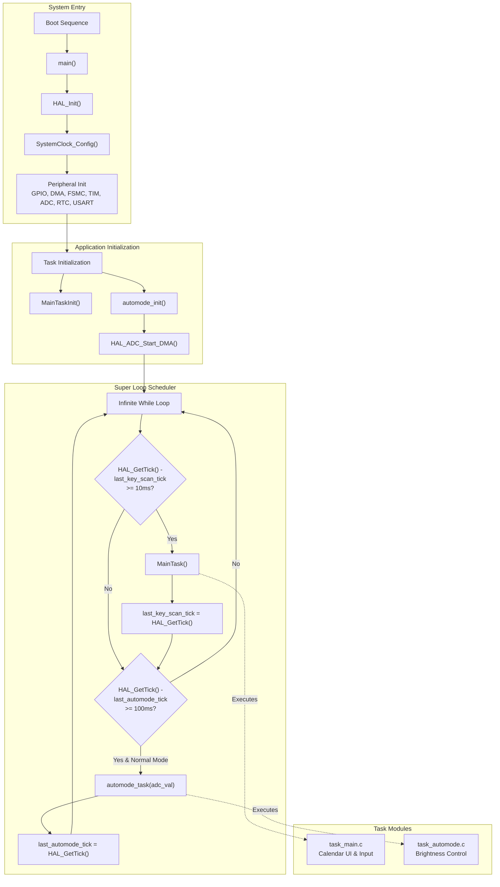
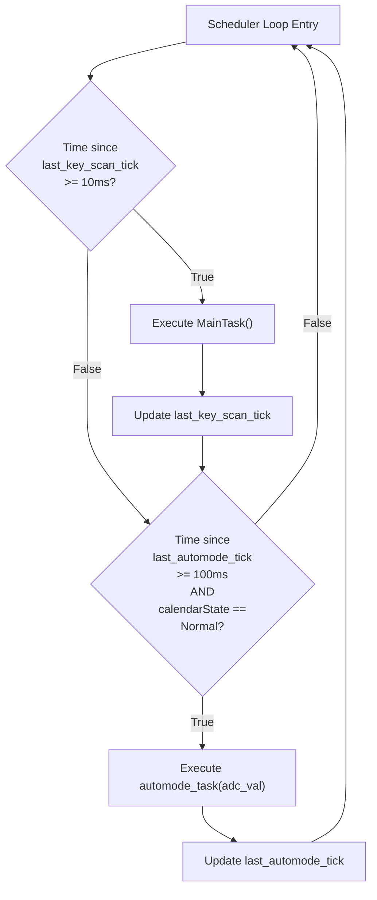
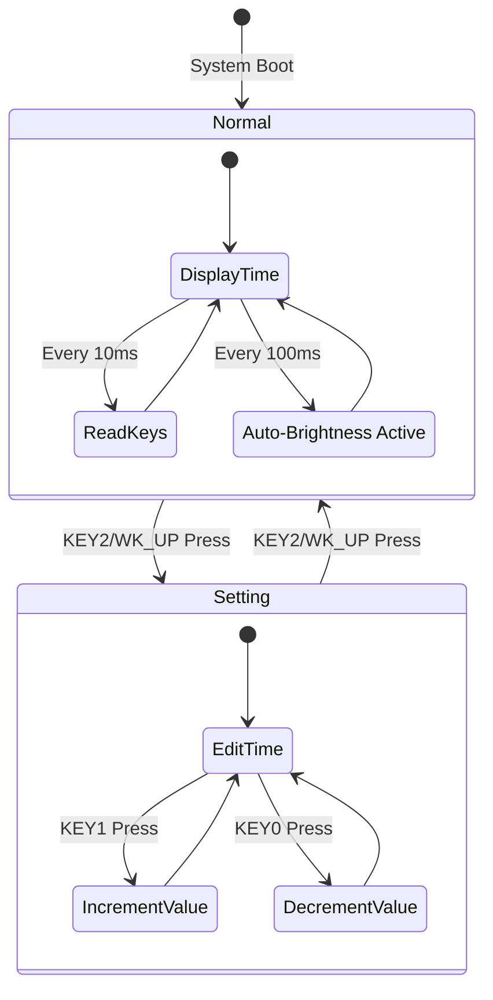
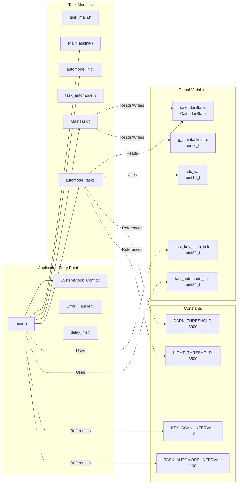
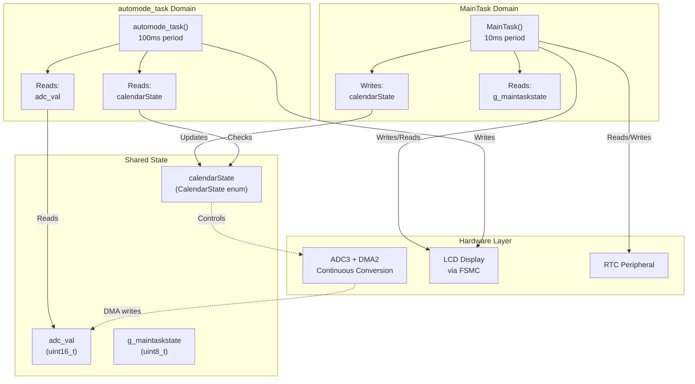

# Application Layer

<details>
<summary>Relevant source files</summary>

The following files were used as context for generating this wiki page:

- [App/Inc/task_automode.h](App/Inc/task_automode.h)
- [App/Inc/task_main.h](App/Inc/task_main.h)
- [Core/Inc/main.h](Core/Inc/main.h)
- [Core/Src/main.c](Core/Src/main.c)

</details>


## Purpose and Scope

The Application Layer represents the top-level software logic of the STM32-TFTLCD-UI system. It contains the system entry point, task scheduler, and two primary application tasks that provide calendar/clock functionality with automatic brightness adaptation. This layer orchestrates periodic execution of application logic while managing shared state and coordinating access to hardware resources through the Hardware Abstraction Layer.

This page provides an overview of the Application Layer architecture and task coordination. For detailed information about specific components:
- Main application loop and initialization: see [Main Application Loop](#2.1)
- Calendar/clock UI implementation: see [Calendar Task](#2.2)
- Auto-brightness control: see [Auto-Brightness Task](#2.3)
- Hardware peripheral drivers: see [Peripheral Drivers](#4)
- HAL configuration: see [Hardware Abstraction Layer](#3)

**Sources: ** [Core/Src/main.c:1-252](https://github.com/BA2F/STM32-TFTLCD-UI/blob/e0f407ee/Core/Src/main.c#L1-L252), [App/Inc/task_main.h:1-32](https://github.com/BA2F/STM32-TFTLCD-UI/blob/e0f407ee/App/Inc/task_main.h#L1-L32), [App/Inc/task_automode.h:1-36](https://github.com/BA2F/STM32-TFTLCD-UI/blob/e0f407ee/App/Inc/task_automode.h#L1-L36)

## Application Architecture



**Application Entry and Scheduling Flow**

This diagram illustrates the complete application lifecycle from boot to periodic task execution. The system follows a three-phase initialization sequence before entering the main scheduling loop.

**Sources: ** [Core/Src/main.c:75-160](https://github.com/BA2F/STM32-TFTLCD-UI/blob/e0f407ee/Core/Src/main.c#L75-L160)

## Task Scheduling Architecture

The application uses a **super-loop architecture** with time-based task scheduling. The `main()` function enters an infinite loop after initialization and periodically checks elapsed time using `HAL_GetTick()` to determine when tasks should execute.

### Task Timing Configuration

| Parameter | Definition Location | Value | Purpose |
|-----------|-------------------|-------|---------|
| `KEY_SCAN_INTERVAL` | [Core/Src/main.c:42]() | 10 ms | MainTask execution period |
| `TASK_AUTOMODE_INTERVAL` | [Core/Src/main.c:43]() | 100 ms | automode_task execution period |
| `last_key_scan_tick` | [Core/Src/main.c:56]() | Variable | Last MainTask execution timestamp |
| `last_automode_tick` | [Core/Src/main.c:57]() | Variable | Last automode_task execution timestamp |

### Task Execution Logic

The scheduler implements non-blocking periodic execution using tick comparison:



**Task Scheduling Decision Tree**

**Sources: ** [Core/Src/main.c:130-158](https://github.com/BA2F/STM32-TFTLCD-UI/blob/e0f407ee/Core/Src/main.c#L130-L158)

### Task Properties

| Task | Function | Execution Period | Conditional Execution | Primary Purpose |
|------|----------|------------------|----------------------|-----------------|
| Main Task | `MainTask()` | 10 ms | Always | Key scanning, time display, RTC management |
| Auto-brightness Task | `automode_task()` | 100 ms | Only in `CalendarState_Normal` | ADC reading, display mode switching |

**Sources: ** [Core/Src/main.c:42-43](https://github.com/BA2F/STM32-TFTLCD-UI/blob/e0f407ee/Core/Src/main.c#L42-L43), [Core/Src/main.c:139-153](https://github.com/BA2F/STM32-TFTLCD-UI/blob/e0f407ee/Core/Src/main.c#L139-L153)

## State Management

The application uses a shared global state variable `calendarState` to coordinate task behavior. This state determines whether the system is in normal display mode or time-setting mode.



**Application State Machine**

### CalendarState Enumeration

| State | Enum Value | Description | Active Tasks |
|-------|-----------|-------------|--------------|
| Normal | `CalendarState_Normal` | Display current time/date | MainTask + automode_task |
| Setting | `CalendarState_Setting` | Edit time/date values | MainTask only |

**Sources: ** [App/Inc/task_main.h:15-19](https://github.com/BA2F/STM32-TFTLCD-UI/blob/e0f407ee/App/Inc/task_main.h#L15-L19), [Core/Src/main.c:54-55](https://github.com/BA2F/STM32-TFTLCD-UI/blob/e0f407ee/Core/Src/main.c#L54-L55), [Core/Src/main.c:148](https://github.com/BA2F/STM32-TFTLCD-UI/blob/e0f407ee/Core/Src/main.c#L148)

### State-Based Task Coordination

The `calendarState` variable enables conditional task execution:

- **ADC DMA Start**: ADC DMA conversion begins only if `calendarState == CalendarState_Normal` during initialization ([Core/Src/main.c:120-123]())
- **Auto-brightness Execution**: `automode_task()` executes only when `calendarState == CalendarState_Normal` ([Core/Src/main.c:148]())

This coordination prevents auto-brightness changes during time editing, which would interfere with user interaction.

**Sources: ** [Core/Src/main.c:119-123](https://github.com/BA2F/STM32-TFTLCD-UI/blob/e0f407ee/Core/Src/main.c#L119-L123), [Core/Src/main.c:147-153](https://github.com/BA2F/STM32-TFTLCD-UI/blob/e0f407ee/Core/Src/main.c#L147-L153)

## Code Entity Mapping

The following diagram maps high-level system concepts to specific code entities for reference:



**Code Entity Reference Map**

**Sources: ** [Core/Src/main.c:1-252](https://github.com/BA2F/STM32-TFTLCD-UI/blob/e0f407ee/Core/Src/main.c#L1-L252), [App/Inc/task_main.h:1-32](https://github.com/BA2F/STM32-TFTLCD-UI/blob/e0f407ee/App/Inc/task_main.h#L1-L32), [App/Inc/task_automode.h:1-36](https://github.com/BA2F/STM32-TFTLCD-UI/blob/e0f407ee/App/Inc/task_automode.h#L1-L36), [Core/Inc/main.h:1-84](https://github.com/BA2F/STM32-TFTLCD-UI/blob/e0f407ee/Core/Inc/main.h#L1-L84)

## Initialization Sequence

The system initialization follows a strict ordering to ensure proper hardware configuration before task execution:

| Order | Function Call | Location | Purpose |
|-------|--------------|----------|---------|
| 1 | `HAL_Init()` | [Core/Src/main.c:89]() | Initialize HAL library, SysTick |
| 2 | `SystemClock_Config()` | [Core/Src/main.c:96]() | Configure system clocks (72 MHz) |
| 3 | `MX_GPIO_Init()` | [Core/Src/main.c:103]() | Initialize GPIO pins for keys, LEDs |
| 4 | `MX_DMA_Init()` | [Core/Src/main.c:104]() | Configure DMA controllers |
| 5 | `MX_FSMC_Init()` | [Core/Src/main.c:105]() | Initialize FSMC for LCD/SRAM |
| 6 | `MX_TIM2_Init()` | [Core/Src/main.c:106]() | Initialize timer 2 |
| 7 | `MX_TIM4_Init()` | [Core/Src/main.c:107]() | Initialize timer 4 (PWM) |
| 8 | `MX_ADC3_Init()` | [Core/Src/main.c:108]() | Initialize ADC3 |
| 9 | `MX_RTC_Init()` | [Core/Src/main.c:109]() | Initialize RTC |
| 10 | `MX_USART1_UART_Init()` | [Core/Src/main.c:110]() | Initialize USART1 |
| 11 | `MX_TIM7_Init()` | [Core/Src/main.c:111]() | Initialize timer 7 |
| 12 | `MainTaskInit()` | [Core/Src/main.c:115]() | Initialize calendar task (LCD, RTC) |
| 13 | `automode_init()` | [Core/Src/main.c:117]() | Initialize auto-brightness |
| 14 | `HAL_ADC_Start_DMA()` | [Core/Src/main.c:122]() | Start ADC DMA (conditional) |

**Sources: ** [Core/Src/main.c:75-128](https://github.com/BA2F/STM32-TFTLCD-UI/blob/e0f407ee/Core/Src/main.c#L75-L128)

## Inter-Task Communication

Tasks communicate and coordinate through shared global variables and state flags:



**Inter-Task Communication and Shared Resources**

### Critical Shared Resources

| Resource | Access Pattern | Synchronization |
|----------|---------------|-----------------|
| `calendarState` | MainTask writes, automode_task reads | State-based execution gating |
| `adc_val` | DMA writes, automode_task reads | DMA buffer, single 16-bit value |
| LCD Display | Both tasks write | Time-division (different execution periods) |
| RTC | MainTask exclusive | No concurrent access |

The system uses **implicit synchronization** through task execution periods and state-based gating rather than explicit mutexes, which is appropriate for this super-loop architecture with non-preemptive task execution.

**Sources: ** [Core/Src/main.c:54-58](https://github.com/BA2F/STM32-TFTLCD-UI/blob/e0f407ee/Core/Src/main.c#L54-L58), [Core/Src/main.c:79](https://github.com/BA2F/STM32-TFTLCD-UI/blob/e0f407ee/Core/Src/main.c#L79), [Core/Src/main.c:147-153](https://github.com/BA2F/STM32-TFTLCD-UI/blob/e0f407ee/Core/Src/main.c#L147-L153)

## System Clock Configuration

The `SystemClock_Config()` function configures the microcontroller to operate at 72 MHz using the external high-speed oscillator (HSE) with PLL multiplication:

| Clock Domain | Source | Configuration | Frequency |
|--------------|--------|---------------|-----------|
| HSE | External Crystal | `RCC_HSE_ON` | 8 MHz |
| LSE | External Crystal | `RCC_LSE_ON` | 32.768 kHz (RTC) |
| PLL | HSE | `RCC_PLL_MUL9` | 72 MHz |
| SYSCLK | PLL | - | 72 MHz |
| AHB (HCLK) | SYSCLK/1 | `RCC_SYSCLK_DIV1` | 72 MHz |
| APB1 (PCLK1) | HCLK/2 | `RCC_HCLK_DIV2` | 36 MHz |
| APB2 (PCLK2) | HCLK/1 | `RCC_HCLK_DIV1` | 72 MHz |
| ADC | PCLK2/6 | `RCC_ADCPCLK2_DIV6` | 12 MHz |
| RTC | LSE | `RCC_RTCCLKSOURCE_LSE` | 32.768 kHz |

**Sources: ** [Core/Src/main.c:166-207](https://github.com/BA2F/STM32-TFTLCD-UI/blob/e0f407ee/Core/Src/main.c#L166-L207)

## Utility Functions

The application layer provides utility functions for use by other modules:

### delay_ms()

```
void delay_ms(uint32_t ms)
```

Located at [Core/Src/main.c:212-218](), this function implements a busy-wait delay using the HAL SysTick counter (`uwTick`). The LCD driver requires this function for timing-critical operations.

**Implementation:** Captures the current tick value and spins in a while loop until the specified milliseconds have elapsed.

**Sources: ** [Core/Src/main.c:212-218](https://github.com/BA2F/STM32-TFTLCD-UI/blob/e0f407ee/Core/Src/main.c#L212-L218), [Core/Inc/main.h:56](https://github.com/BA2F/STM32-TFTLCD-UI/blob/e0f407ee/Core/Inc/main.h#L56)

### Error_Handler()

```
void Error_Handler(void)
```

Located at [Core/Src/main.c:225-234](), this function is invoked when a fatal error occurs during HAL operations. It disables all interrupts and enters an infinite loop, halting system operation.

**Sources: ** [Core/Src/main.c:225-234](https://github.com/BA2F/STM32-TFTLCD-UI/blob/e0f407ee/Core/Src/main.c#L225-L234), [Core/Inc/main.h:53](https://github.com/BA2F/STM32-TFTLCD-UI/blob/e0f407ee/Core/Inc/main.h#L53)

## GPIO Pin Assignments

The application layer defines GPIO pin assignments used throughout the system:

| Pin Name | GPIO Port/Pin | Function | Direction |
|----------|---------------|----------|-----------|
| `KEY0_Pin` | PE4 | Key 0 button input | Input |
| `KEY1_Pin` | PE3 | Key 1 button input | Input |
| `WK_UP_Pin` | PA0 | Wake-up button input | Input |
| `LED0_Pin` | PB5 | LED 0 output | Output |
| `LED1_Pin` | PE5 | LED 1 output | Output |
| `LCD_BL_Pin` | PB0 | LCD backlight control | Output |
| `BEEP_Pin` | PB8 | Beeper control | Output (PWM) |

**Sources: ** [Core/Inc/main.h:60-73](https://github.com/BA2F/STM32-TFTLCD-UI/blob/e0f407ee/Core/Inc/main.h#L60-L73)

## Summary

The Application Layer implements a **super-loop architecture** with time-sliced task execution suitable for the system's real-time requirements. Key architectural characteristics:

- **Non-preemptive scheduling**: Tasks execute to completion in the main loop
- **Time-based execution**: `HAL_GetTick()` provides 1ms resolution timing
- **State-based coordination**: `calendarState` enables conditional task execution
- **Minimal overhead**: Simple tick comparison for task scheduling
- **Resource sharing**: Implicit synchronization through execution gating

The two-task design separates concerns effectively: MainTask handles user interaction and display updates at 10ms intervals for responsive input, while automode_task manages ambient light adaptation at 100ms intervals. State-based execution gating ensures that auto-brightness does not interfere during time editing operations.

**Sources: ** [Core/Src/main.c:1-252](https://github.com/BA2F/STM32-TFTLCD-UI/blob/e0f407ee/Core/Src/main.c#L1-L252), [App/Inc/task_main.h:1-32](https://github.com/BA2F/STM32-TFTLCD-UI/blob/e0f407ee/App/Inc/task_main.h#L1-L32), [App/Inc/task_automode.h:1-36](https://github.com/BA2F/STM32-TFTLCD-UI/blob/e0f407ee/App/Inc/task_automode.h#L1-L36)