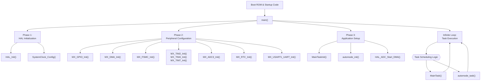
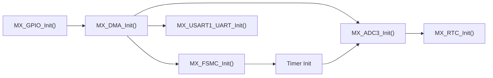
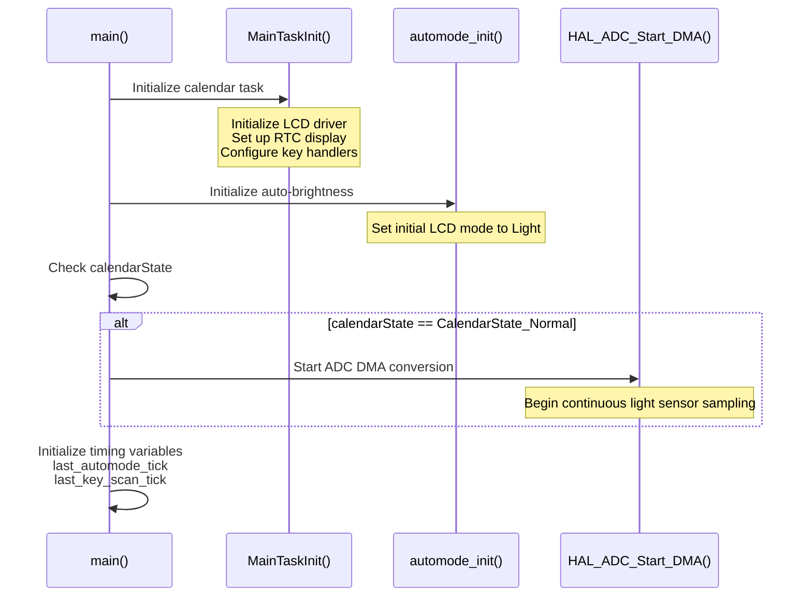
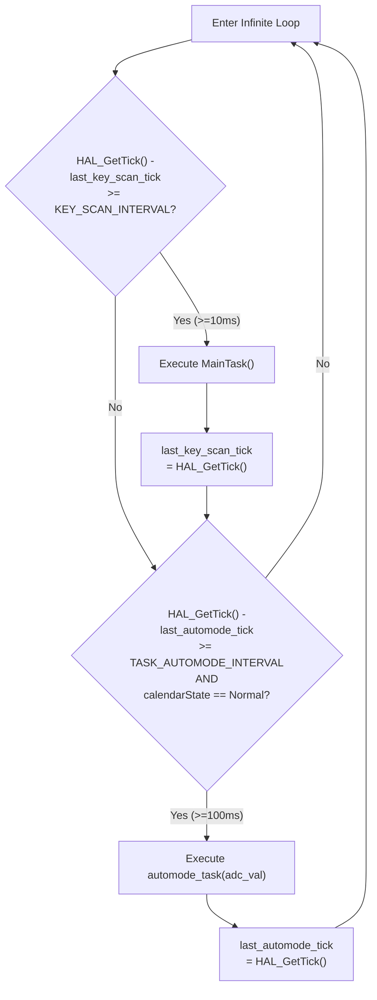
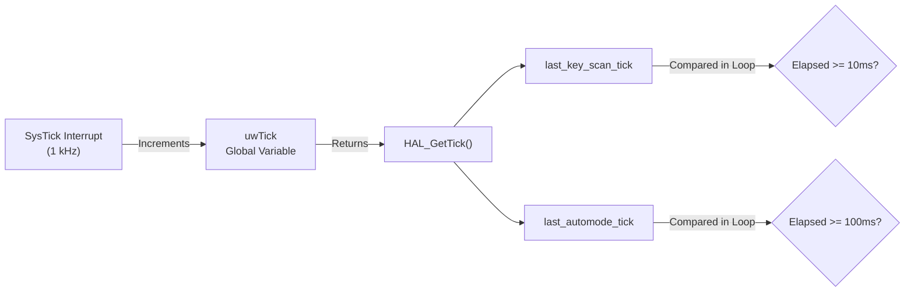
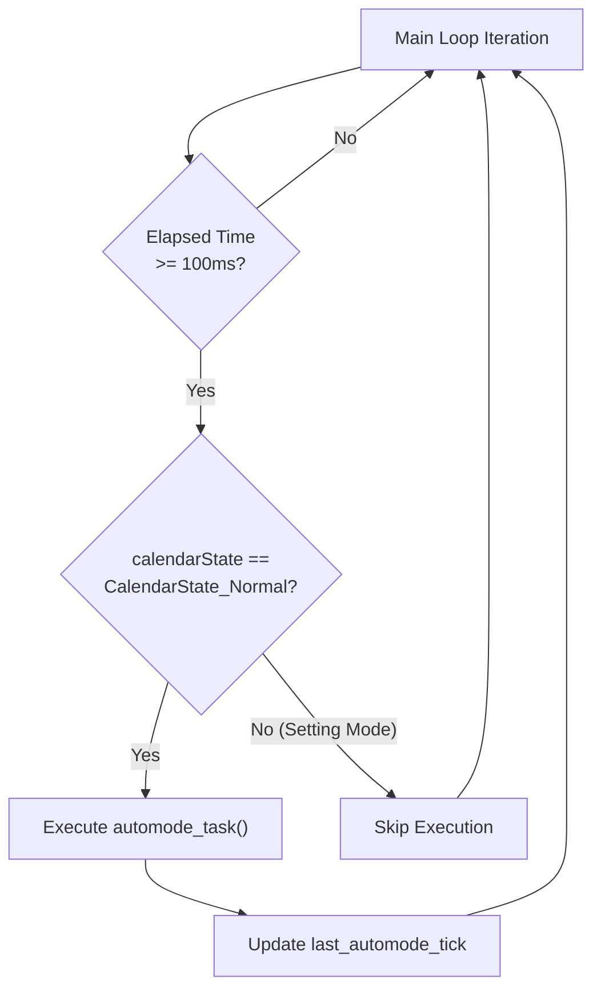
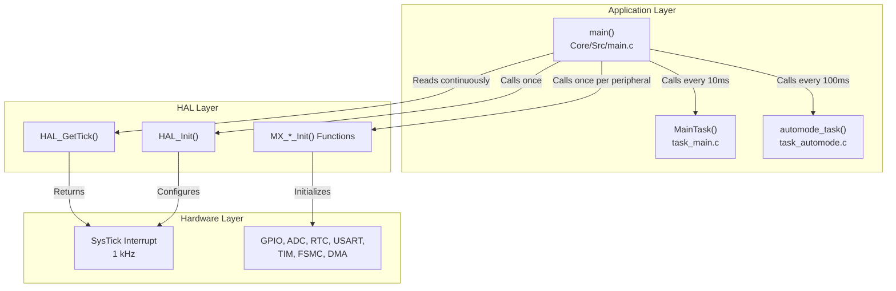

# Main Application Loop

<details>
<summary>Relevant source files</summary>

The following files were used as context for generating this wiki page:

- [Core/Inc/main.h](Core/Inc/main.h)
- [Core/Src/main.c](Core/Src/main.c)
- [Core/Src/system_stm32f1xx.c](Core/Src/system_stm32f1xx.c)

</details>


## Purpose and Scope

This page documents the main application loop implemented in [Core/Src/main.c](), which serves as the system entry point and coordinates periodic execution of application tasks. It covers the initialization sequence, super-loop architecture, and time-based task scheduling mechanism.

For details about the individual tasks executed by this loop, see the Calendar Task ([#2.2](#2.2)) and Auto-Brightness Task ([#2.3](#2.3)) pages. For low-level system startup before `main()` is reached, see System Initialization ([#3.2](#3.2)).

**Sources: ** [Core/Src/main.c:1-252](https://github.com/BA2F/STM32-TFTLCD-UI/blob/e0f407ee/Core/Src/main.c#L1-L252)

---

## System Entry Point

The `main()` function at [Core/Src/main.c:75-160]() is the application entry point after the C runtime initialization completes. The function follows a standard three-phase pattern: hardware initialization, application setup, and infinite loop execution.



**Sources: ** [Core/Src/main.c:75-160](https://github.com/BA2F/STM32-TFTLCD-UI/blob/e0f407ee/Core/Src/main.c#L75-L160)

---

## Initialization Sequence

### HAL and Clock Configuration

The initialization begins with HAL framework setup and system clock configuration:

| Function | Location | Purpose |
|----------|----------|---------|
| `HAL_Init()` | [Core/Src/main.c:89]() | Initializes HAL framework, SysTick timer, and NVIC priorities |
| `SystemClock_Config()` | [Core/Src/main.c:166-207]() | Configures system clock to 72 MHz using HSE and PLL |

The `SystemClock_Config()` function configures multiple clock domains:

- **HSE (High-Speed External)**: 8 MHz crystal oscillator
- **LSE (Low-Speed External)**: 32.768 kHz for RTC
- **PLL**: Multiplies HSE by 9 to generate 72 MHz system clock
- **AHB**: System clock divided by 1 (72 MHz)
- **APB1**: AHB clock divided by 2 (36 MHz)
- **APB2**: AHB clock divided by 1 (72 MHz)
- **ADC**: APB2 clock divided by 6 (12 MHz)
- **RTC**: Uses LSE as clock source

**Sources: ** [Core/Src/main.c:89-96](https://github.com/BA2F/STM32-TFTLCD-UI/blob/e0f407ee/Core/Src/main.c#L89-L96), [Core/Src/main.c:166-207](https://github.com/BA2F/STM32-TFTLCD-UI/blob/e0f407ee/Core/Src/main.c#L166-L207)

### Peripheral Initialization Order

The peripherals are initialized in a specific order to satisfy dependencies:



**Initialization Order Rationale:**

1. **GPIO first** ([Core/Src/main.c:103]()): Configures pin modes before any peripheral uses them
2. **DMA second** ([Core/Src/main.c:104]()): Must be ready before ADC and USART that depend on it
3. **FSMC third** ([Core/Src/main.c:105]()): Enables external memory interface for LCD
4. **Timers** ([Core/Src/main.c:106-107,111]()): Provide time bases and PWM outputs
5. **ADC** ([Core/Src/main.c:108]()): Requires DMA to be configured
6. **RTC** ([Core/Src/main.c:109]()): Independent peripheral
7. **USART** ([Core/Src/main.c:110]()): Requires DMA for efficient operation

**Sources: ** [Core/Src/main.c:103-111](https://github.com/BA2F/STM32-TFTLCD-UI/blob/e0f407ee/Core/Src/main.c#L103-L111)

### Application Task Initialization

After peripheral setup, application-specific initialization occurs:



The initialization at [Core/Src/main.c:115-127]() includes:

1. **`MainTaskInit()`** ([Core/Src/main.c:115]()): Initializes the calendar/clock UI task
2. **`automode_init()`** ([Core/Src/main.c:117]()): Sets up automatic brightness control
3. **Conditional ADC start** ([Core/Src/main.c:120-123]()): ADC DMA only starts if `calendarState == CalendarState_Normal`
4. **Timing initialization** ([Core/Src/main.c:125-127]()): Captures initial `HAL_GetTick()` values for task scheduling

**Sources: ** [Core/Src/main.c:115-127](https://github.com/BA2F/STM32-TFTLCD-UI/blob/e0f407ee/Core/Src/main.c#L115-L127)

---

## Main Loop Architecture

### Super-Loop Design

The application uses a **super-loop architecture** (also called a "main loop" or "cyclic executive") where an infinite loop continuously checks conditions and executes tasks:



The main loop at [Core/Src/main.c:132-158]() implements time-based task scheduling without an RTOS. Each task tracks its last execution time and runs only when sufficient time has elapsed.

**Sources: ** [Core/Src/main.c:132-158](https://github.com/BA2F/STM32-TFTLCD-UI/blob/e0f407ee/Core/Src/main.c#L132-L158)

### Task Execution Intervals

Two timing constants define the task execution rates:

| Constant | Value | Location | Purpose |
|----------|-------|----------|---------|
| `KEY_SCAN_INTERVAL` | 10 ms | [Core/Src/main.c:42]() | Ensures responsive key input handling |
| `TASK_AUTOMODE_INTERVAL` | 100 ms | [Core/Src/main.c:43]() | Rate-limits brightness adaptation checks |

**Task Execution Summary:**

```mermaid
gantt
    title Task Execution Timeline
    dateFormat X
    axisFormat %L
    
    section MainTask
    MainTask Execution (10ms) :0, 10
    MainTask Execution (10ms) :10, 20
    MainTask Execution (10ms) :20, 30
    MainTask Execution (10ms) :30, 40
    MainTask Execution (10ms) :40, 50
    MainTask Execution (10ms) :50, 60
    MainTask Execution (10ms) :60, 70
    MainTask Execution (10ms) :70, 80
    MainTask Execution (10ms) :80, 90
    MainTask Execution (10ms) :90, 100
    
    section automode_task
    automode_task Execution (100ms) :0, 100
    automode_task Execution (100ms) :100, 200
```



The 10 ms interval for `MainTask()` provides:
- **100 Hz key scanning rate**: Fast enough for human interaction
- **Smooth display updates**: Frequent enough to appear instantaneous
- **Low CPU overhead**: Leaves most CPU time idle or available for interrupt handlers

The 100 ms interval for `automode_task()` provides:
- **Adequate response to lighting changes**: Human perception doesn't require faster updates
- **Hysteresis effectiveness**: Allows threshold logic to stabilize (see [#2.3](#2.3))
- **Reduced ADC processing load**: Only needs to check 10 times per second

**Sources: ** [Core/Src/main.c:42-43](https://github.com/BA2F/STM32-TFTLCD-UI/blob/e0f407ee/Core/Src/main.c#L42-L43), [Core/Src/main.c:140-153](https://github.com/BA2F/STM32-TFTLCD-UI/blob/e0f407ee/Core/Src/main.c#L140-L153)

---

## Task Scheduling Mechanism

### Timing Implementation

The scheduling mechanism uses the HAL's `HAL_GetTick()` function, which returns milliseconds elapsed since system start:



**Key Variables:**

| Variable | Type | Location | Purpose |
|----------|------|----------|---------|
| `last_key_scan_tick` | `uint32_t` | [Core/Src/main.c:56]() | Tracks last `MainTask()` execution time |
| `last_automode_tick` | `uint32_t` | [Core/Src/main.c:57]() | Tracks last `automode_task()` execution time |

**Scheduling Logic for MainTask:**

```c
// From Core/Src/main.c:140-145
if (HAL_GetTick() - last_key_scan_tick >= KEY_SCAN_INTERVAL)
{
    MainTask();
    last_key_scan_tick = HAL_GetTick();
}
```

**Scheduling Logic for automode_task:**

```c
// From Core/Src/main.c:148-153
if (HAL_GetTick() - last_automode_tick >= TASK_AUTOMODE_INTERVAL && 
    calendarState == CalendarState_Normal)
{
    automode_task(adc_val);
    last_automode_tick = HAL_GetTick();
}
```

**Sources: ** [Core/Src/main.c:56-57](https://github.com/BA2F/STM32-TFTLCD-UI/blob/e0f407ee/Core/Src/main.c#L56-L57), [Core/Src/main.c:140-153](https://github.com/BA2F/STM32-TFTLCD-UI/blob/e0f407ee/Core/Src/main.c#L140-L153)

### State-Based Execution Control

The `automode_task()` includes an additional execution condition beyond timing:



**Rationale for Conditional Execution:**

The auto-brightness task only runs in `CalendarState_Normal` mode ([Core/Src/main.c:148]()) because:

1. **Prevents interference during time setting**: When the user is editing time/date values (Setting mode), automatic brightness changes would be disruptive
2. **ADC is not running in Setting mode**: The ADC DMA is stopped when entering Setting mode to reduce power consumption
3. **Maintains consistent UI state**: Brightness remains stable during user interaction with settings

**Sources: ** [Core/Src/main.c:148-153](https://github.com/BA2F/STM32-TFTLCD-UI/blob/e0f407ee/Core/Src/main.c#L148-L153)

---

## Timing Accuracy and Rollover Handling

### HAL_GetTick() Characteristics

The `HAL_GetTick()` function returns a 32-bit unsigned integer that:
- Increments every 1 millisecond via SysTick interrupt
- Rolls over after approximately 49.7 days (2^32 milliseconds)
- Uses unsigned arithmetic, which handles rollover correctly

### Rollover-Safe Arithmetic

The subtraction-based timing check is **rollover-safe** due to unsigned integer wraparound behavior:

```
Example when rollover occurs:
- last_key_scan_tick = 0xFFFFFFF0 (4,294,967,280 ms)
- HAL_GetTick() after 20ms = 0x00000004 (4 ms after rollover)
- Calculation: 0x00000004 - 0xFFFFFFF0 = 0x00000014 (20 in decimal)
- Result: Correctly calculates 20ms elapsed
```

This works because unsigned integer subtraction in C follows modulo 2^32 arithmetic, making the pattern at [Core/Src/main.c:140,148]() robust against timer rollover.

**Sources: ** [Core/Src/main.c:140-153](https://github.com/BA2F/STM32-TFTLCD-UI/blob/e0f407ee/Core/Src/main.c#L140-L153)

---

## Utility Functions

### delay_ms()

The `delay_ms()` function at [Core/Src/main.c:212-218]() provides a blocking delay using the HAL tick counter:

```c
void delay_ms(uint32_t ms)
{
    uint32_t ms_uwTick = uwTick;
    while (uwTick - ms_uwTick < ms)
    {
    }
}
```

**Usage:**
- Required by the LCD driver for initialization timing
- Implements busy-wait loop checking the `uwTick` global variable
- Should NOT be used in the main loop (would block task execution)

**Sources: ** [Core/Src/main.c:212-218](https://github.com/BA2F/STM32-TFTLCD-UI/blob/e0f407ee/Core/Src/main.c#L212-L218), [Core/Inc/main.h:56](https://github.com/BA2F/STM32-TFTLCD-UI/blob/e0f407ee/Core/Inc/main.h#L56)

---

## Error Handling

### Error_Handler()

The `Error_Handler()` function at [Core/Src/main.c:225-234]() is called when a fatal error occurs during initialization:

```c
void Error_Handler(void)
{
    __disable_irq();
    while (1)
    {
    }
}
```

**Behavior:**
- Disables all interrupts via `__disable_irq()`
- Enters infinite loop to halt system execution
- Prevents undefined behavior after initialization failures

**Common Error Conditions:**
- Clock configuration failure (HSE not starting, PLL lock failure)
- Peripheral initialization timeout
- Invalid HAL function parameters

The function is declared in [Core/Inc/main.h:53]() and called by HAL initialization functions when errors are detected ([Core/Src/main.c:183-186,196-199,203-206]()).

**Sources: ** [Core/Src/main.c:225-234](https://github.com/BA2F/STM32-TFTLCD-UI/blob/e0f407ee/Core/Src/main.c#L225-L234), [Core/Inc/main.h:53](https://github.com/BA2F/STM32-TFTLCD-UI/blob/e0f407ee/Core/Inc/main.h#L53)

---

## GPIO Pin Definitions

The main header file defines symbolic names for GPIO pins used throughout the application:

| Pin Name | Port | Pin Number | Purpose | Location |
|----------|------|------------|---------|----------|
| `KEY0_Pin` | PE | 4 | User input button 0 | [Core/Inc/main.h:62-63]() |
| `KEY1_Pin` | PE | 3 | User input button 1 | [Core/Inc/main.h:60-61]() |
| `WK_UP_Pin` | PA | 0 | Wake-up/mode button | [Core/Inc/main.h:66-67]() |
| `LED0_Pin` | PB | 5 | Status LED 0 | [Core/Inc/main.h:70-71]() |
| `LED1_Pin` | PE | 5 | Status LED 1 | [Core/Inc/main.h:64-65]() |
| `LCD_BL_Pin` | PB | 0 | LCD backlight control | [Core/Inc/main.h:68-69]() |
| `BEEP_Pin` | PB | 8 | Beeper output | [Core/Inc/main.h:72-73]() |

These definitions are used by task functions to access hardware without hardcoding port/pin values. See GPIO Configuration ([#4.1](#4.1)) for detailed pin configuration.

**Sources: ** [Core/Inc/main.h:60-73](https://github.com/BA2F/STM32-TFTLCD-UI/blob/e0f407ee/Core/Inc/main.h#L60-L73)

---

## System Architecture Integration

The main loop serves as the coordination point between multiple system layers:



**Key Responsibilities:**

1. **Initialization Orchestration**: Ensures correct peripheral setup order
2. **Task Coordination**: Schedules `MainTask()` and `automode_task()` at appropriate rates
3. **Timing Management**: Uses `HAL_GetTick()` for non-blocking time-based scheduling
4. **State Awareness**: Controls task execution based on `calendarState`

For details about how tasks interact with peripherals, see:
- Calendar Task ([#2.2](#2.2)) for RTC and LCD usage
- Auto-Brightness Task ([#2.3](#2.3)) for ADC and display mode switching
- Peripheral Drivers ([#4](#4)) for individual peripheral configurations

**Sources: ** [Core/Src/main.c:75-160](https://github.com/BA2F/STM32-TFTLCD-UI/blob/e0f407ee/Core/Src/main.c#L75-L160)