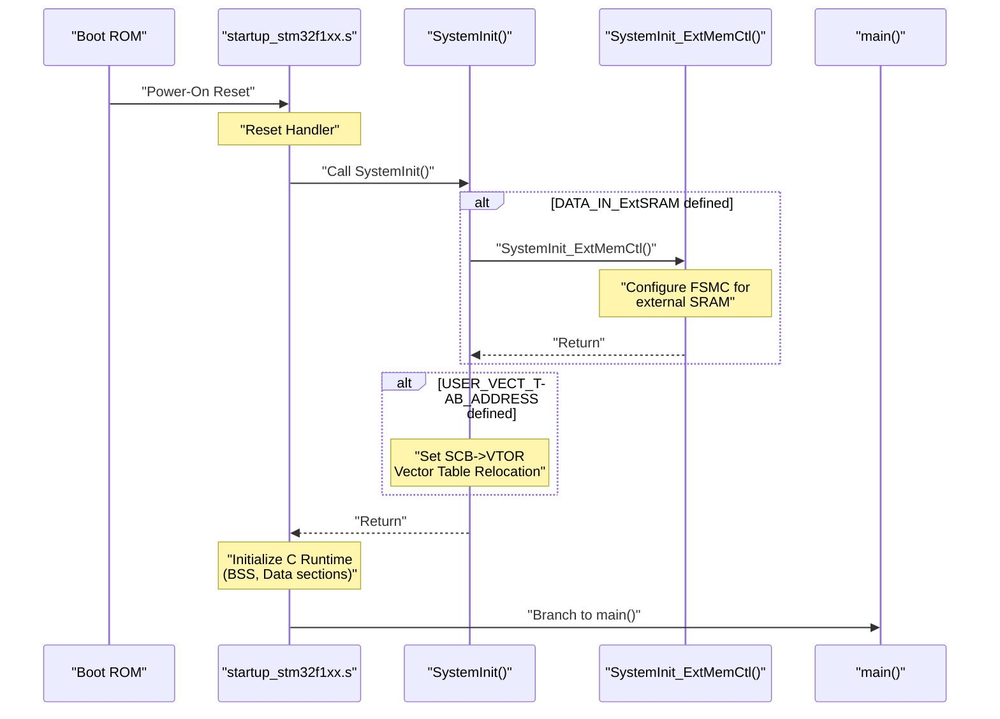
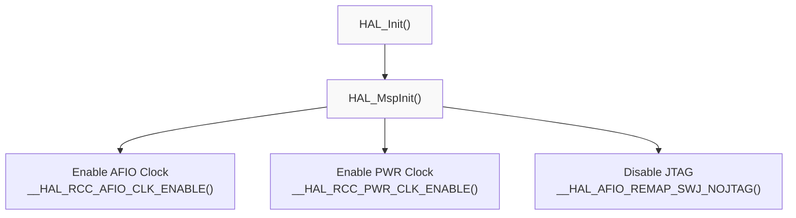
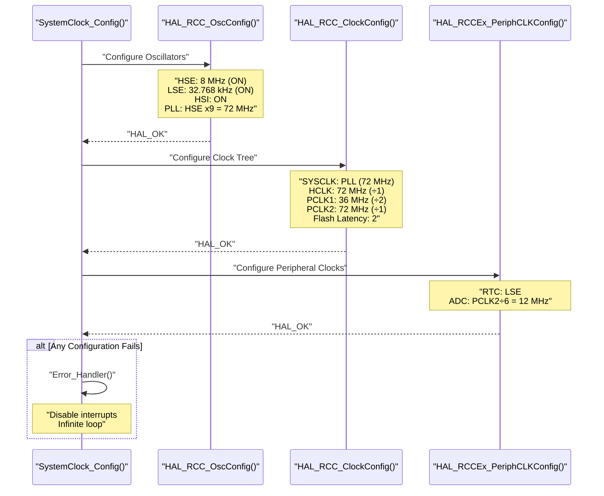
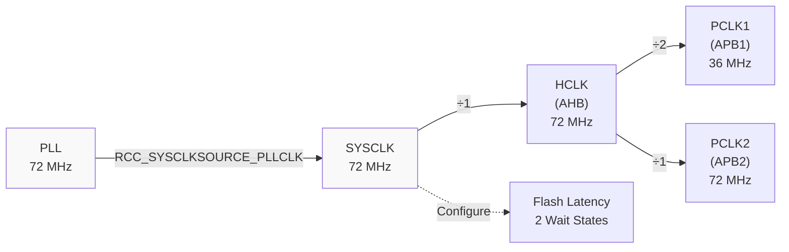
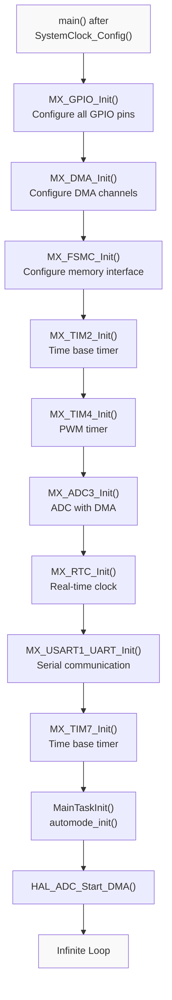
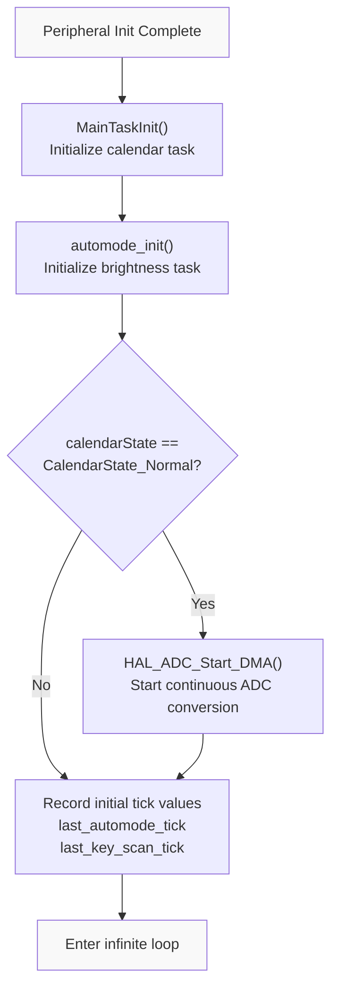

# System Initialization

<details>
<summary>Relevant source files</summary>

The following files were used as context for generating this wiki page:

- [Core/Src/main.c](Core/Src/main.c)
- [Core/Src/stm32f1xx_hal_msp.c](Core/Src/stm32f1xx_hal_msp.c)
- [Core/Src/system_stm32f1xx.c](Core/Src/system_stm32f1xx.c)

</details>


## Purpose and Scope

This page documents the system startup sequence, clock configuration, and low-level hardware initialization that occurs before the application begins execution. It covers the initialization code that runs from power-on reset through peripheral setup, focusing on the functions in `system_stm32f1xx.c`, `main.c`, and `stm32f1xx_hal_msp.c`.

For information about HAL configuration macros and module selection, see [HAL Configuration](#3.1). For peripheral-specific initialization details, see [Peripheral Drivers](#4).

---

## Initialization Phases Overview

The system initialization follows a strict four-phase sequence that ensures hardware components are configured in the correct order:

| Phase | Location | Key Functions | Purpose |
|-------|----------|---------------|---------|
| **Phase 1** | Pre-main | `SystemInit()` | Configure core system clock, optionally enable external SRAM |
| **Phase 2** | `main()` entry | `HAL_Init()`, `HAL_MspInit()` | Initialize HAL framework, configure SysTick timer, enable clocks |
| **Phase 3** | `main()` | `SystemClock_Config()` | Configure PLL, set bus dividers, establish final clock tree |
| **Phase 4** | `main()` | `MX_*_Init()` functions | Initialize and configure all peripheral hardware |

**Sources: ** [Core/Src/main.c:75-128](https://github.com/BA2F/STM32-TFTLCD-UI/blob/e0f407ee/Core/Src/main.c#L75-L128), [Core/Src/system_stm32f1xx.c:175-187](https://github.com/BA2F/STM32-TFTLCD-UI/blob/e0f407ee/Core/Src/system_stm32f1xx.c#L175-L187)

---

## Phase 1: Pre-Main Initialization

### SystemInit() Function

The `SystemInit()` function executes before C runtime initialization and the `main()` function. It is called directly from the startup assembly code (`startup_stm32f1xx.s`).

**Location:** [Core/Src/system_stm32f1xx.c:175-187]()

**Responsibilities:**
- Optionally configure external memory controller (FSMC) if `DATA_IN_ExtSRAM` is defined
- Configure vector table location if `USER_VECT_TAB_ADDRESS` is defined
- Provide minimal system setup required before C runtime initialization



**Key Configuration Constants:**

| Constant | Default Value | Purpose |
|----------|---------------|---------|
| `HSE_VALUE` | 8000000 (8 MHz) | External crystal oscillator frequency |
| `HSI_VALUE` | 8000000 (8 MHz) | Internal RC oscillator frequency |
| `DATA_IN_ExtSRAM` | Undefined | Enable external SRAM initialization via FSMC |
| `USER_VECT_TAB_ADDRESS` | Undefined | Enable vector table relocation |

**External SRAM Initialization:** When `DATA_IN_ExtSRAM` is defined for high-density STM32F103xE/G devices, the `SystemInit_ExtMemCtl()` function [Core/Src/system_stm32f1xx.c:349-392]() configures FSMC Bank 1 to interface with external SRAM. This must occur before C runtime initialization because the external memory may be used for `.data` and `.bss` sections.

**Sources: ** [Core/Src/system_stm32f1xx.c:1-187](https://github.com/BA2F/STM32-TFTLCD-UI/blob/e0f407ee/Core/Src/system_stm32f1xx.c#L1-L187), [Core/Src/system_stm32f1xx.c:349-392](https://github.com/BA2F/STM32-TFTLCD-UI/blob/e0f407ee/Core/Src/system_stm32f1xx.c#L349-L392)

---

## Phase 2: HAL Framework Initialization

### HAL_Init() Function

Called at [Core/Src/main.c:89](), `HAL_Init()` initializes the HAL framework before any peripheral configuration.

**HAL_Init() performs:**
1. Configures the SysTick timer to generate interrupts every 1ms (HAL time base)
2. Sets interrupt priority grouping (4 bits for preemption priority, 0 bits for sub-priority)
3. Initializes low-level hardware via `HAL_MspInit()` callback

### HAL_MspInit() Function

The MSP (MCU Support Package) initialization function [Core/Src/stm32f1xx_hal_msp.c:63-82]() performs global hardware setup required by the HAL.

**Configuration performed:**



**Clock Enables:**
- **AFIO Clock** [Core/Src/stm32f1xx_hal_msp.c:70](): Required for pin remapping and external interrupt configuration
- **PWR Clock** [Core/Src/stm32f1xx_hal_msp.c:71](): Required for power management and backup domain access

**Pin Configuration:**
- **JTAG Disable** [Core/Src/stm32f1xx_hal_msp.c:77](): Disables JTAG interface while keeping SWD (Serial Wire Debug) enabled. This frees up pins PB3, PB4, and PA15 for GPIO use while maintaining debug capability through SWD.

**Sources: ** [Core/Src/main.c:89](https://github.com/BA2F/STM32-TFTLCD-UI/blob/e0f407ee/Core/Src/main.c#L89), [Core/Src/stm32f1xx_hal_msp.c:63-82](https://github.com/BA2F/STM32-TFTLCD-UI/blob/e0f407ee/Core/Src/stm32f1xx_hal_msp.c#L63-L82)

---

## Phase 3: Clock Configuration

### SystemClock_Config() Function

The `SystemClock_Config()` function [Core/Src/main.c:166-207]() establishes the final system clock tree, configuring oscillators, PLL, and bus dividers to achieve the target system frequency.

### Clock Configuration Sequence



### Oscillator Configuration

**Structure:** `RCC_OscInitTypeDef` [Core/Src/main.c:168-186]()

| Oscillator | Configuration | Purpose |
|------------|---------------|---------|
| **HSE** | 8 MHz, Enabled, Prediv ÷1 | External crystal, PLL input source |
| **LSE** | 32.768 kHz, Enabled | Low-speed external crystal for RTC |
| **HSI** | 8 MHz, Enabled | Internal RC oscillator, backup clock source |
| **PLL** | Enabled, Source=HSE, Multiplier=×9 | Main system clock (8 MHz × 9 = 72 MHz) |

**PLL Configuration:**
- Input: HSE / 1 = 8 MHz
- Multiplier: RCC_PLL_MUL9 = ×9
- Output: 72 MHz (maximum for STM32F103 devices)

### Bus Clock Configuration

**Structure:** `RCC_ClkInitTypeDef` [Core/Src/main.c:190-199]()



**Bus Frequencies:**
- **SYSCLK:** 72 MHz (from PLL)
- **HCLK (AHB):** 72 MHz (÷1) - CPU, DMA, memory interfaces
- **PCLK1 (APB1):** 36 MHz (÷2) - Low-speed peripherals (max 36 MHz)
- **PCLK2 (APB2):** 72 MHz (÷1) - High-speed peripherals

**Flash Latency:** `FLASH_LATENCY_2` (2 wait states) is required for 72 MHz operation with supply voltage 2.7-3.6V.

### Peripheral Clock Configuration

**Structure:** `RCC_PeriphCLKInitTypeDef` [Core/Src/main.c:200-206]()

| Peripheral | Clock Source | Frequency | Configuration |
|------------|--------------|-----------|---------------|
| **RTC** | LSE | 32.768 kHz | `RCC_RTCCLKSOURCE_LSE` |
| **ADC** | PCLK2 ÷ 6 | 12 MHz | `RCC_ADCPCLK2_DIV6` |

**ADC Clock Calculation:**
- PCLK2 = 72 MHz
- Divider = 6
- ADC Clock = 72 MHz ÷ 6 = 12 MHz (within maximum 14 MHz for STM32F1)

**Sources: ** [Core/Src/main.c:166-207](https://github.com/BA2F/STM32-TFTLCD-UI/blob/e0f407ee/Core/Src/main.c#L166-L207)

---

## Phase 4: Peripheral Initialization

### Initialization Order

After clock configuration, peripheral initialization functions are called in a specific order [Core/Src/main.c:103-111]() to ensure dependencies are met:



### Initialization Order Rationale

**Critical Dependencies:**

1. **GPIO First** [Core/Src/main.c:103](): All peripherals requiring alternate function pins depend on GPIO configuration. GPIO modes must be set before peripheral initialization.

2. **DMA Before Peripherals** [Core/Src/main.c:104](): Peripherals that use DMA (ADC, USART) require DMA channels to be configured first. The DMA controller must be ready before starting DMA-capable peripherals.

3. **FSMC Early** [Core/Src/main.c:105](): The FSMC (Flexible Static Memory Controller) configures the external bus for LCD and SRAM. This must be initialized before any code attempts to access memory-mapped peripherals on the external bus.

4. **Timers Before DMA Users** [Core/Src/main.c:106-107](): Timer peripherals (TIM2, TIM4, TIM7) provide time bases and PWM. They are initialized after DMA but before peripherals that may need timing services.

5. **ADC After DMA** [Core/Src/main.c:108](): ADC3 uses DMA Channel 5 for continuous conversion transfers. DMA must be initialized before ADC configuration.

6. **RTC and USART** [Core/Src/main.c:109-110](): These peripherals have no initialization order dependencies with other peripherals and can be initialized after basic infrastructure is ready.

### Peripheral Initialization Functions

Each peripheral has a dedicated initialization function generated by STM32CubeMX. These functions are defined in their respective source files in the `Core/Src/` directory.

| Function | Source File | Peripheral | Description |
|----------|-------------|------------|-------------|
| `MX_GPIO_Init()` | `gpio.c` | GPIO Ports | Configure pins for keys, LEDs, LCD backlight |
| `MX_DMA_Init()` | `dma.c` | DMA1, DMA2 | Configure DMA channels for ADC and USART |
| `MX_FSMC_Init()` | `fsmc.c` | FSMC | Memory-mapped LCD and SRAM interface |
| `MX_TIM2_Init()` | `tim.c` | TIM2 | Time base for task scheduling |
| `MX_TIM4_Init()` | `tim.c` | TIM4 | PWM generation for beeper |
| `MX_ADC3_Init()` | `adc.c` | ADC3 | Light sensor analog input with DMA |
| `MX_RTC_Init()` | `rtc.c` | RTC | Calendar and timekeeping |
| `MX_USART1_UART_Init()` | `usart.c` | USART1 | Serial debugging with DMA |
| `MX_TIM7_Init()` | `tim.c` | TIM7 | Auxiliary time base |

**Sources: ** [Core/Src/main.c:103-111](https://github.com/BA2F/STM32-TFTLCD-UI/blob/e0f407ee/Core/Src/main.c#L103-L111)

---

## Application Initialization

After all peripheral hardware is configured, application-level initialization occurs [Core/Src/main.c:114-127]():

### Application Init Sequence



**Initialization Steps:**

1. **MainTaskInit()** [Core/Src/main.c:115](): Initializes the calendar task, including LCD driver setup, RTC configuration, and key handler registration. See [Calendar Task](#2.2) for details.

2. **automode_init()** [Core/Src/main.c:117](): Initializes the automatic brightness control system, setting the initial display mode to light mode. See [Auto-Brightness Task](#2.3) for details.

3. **Conditional ADC Start** [Core/Src/main.c:120-123](): If the calendar is in Normal mode, starts ADC continuous conversion with DMA. This is skipped if the calendar is in Setting mode to avoid interference during time configuration.

4. **Task Timing Initialization** [Core/Src/main.c:125-127](): Records the current HAL tick count to establish timing references for periodic task execution (10ms for key scanning, 100ms for auto-brightness).

**Sources: ** [Core/Src/main.c:114-127](https://github.com/BA2F/STM32-TFTLCD-UI/blob/e0f407ee/Core/Src/main.c#L114-L127)

---

## Complete Initialization Flow

### Full System Boot Sequence

```mermaid
graph TB
    subgraph "Pre-Main (Assembly)"
        POR["Power-On Reset"]
        ResetHandler["Reset Handler<br/>startup_stm32f1xx.s"]
        SystemInit["SystemInit()<br/>system_stm32f1xx.c"]
        ExtSRAM["SystemInit_ExtMemCtl()<br/>(if enabled)"]
        CInit["C Runtime Init<br/>BSS, Data sections"]
    end
    
    subgraph "HAL Initialization (main.c)"
        HAL_Init_Func["HAL_Init()"]
        HAL_MspInit_Func["HAL_MspInit()<br/>Enable AFIO, PWR<br/>Disable JTAG"]
        SysClkCfg["SystemClock_Config()<br/>Configure PLL to 72 MHz"]
    end
    
    subgraph "Peripheral Initialization (main.c)"
        GPIO_Init["MX_GPIO_Init()"]
        DMA_Init["MX_DMA_Init()"]
        FSMC_Init["MX_FSMC_Init()"]
        Timers["MX_TIM2_Init()<br/>MX_TIM4_Init()<br/>MX_TIM7_Init()"]
        ADC_Init["MX_ADC3_Init()"]
        RTC_Init["MX_RTC_Init()"]
        USART_Init["MX_USART1_UART_Init()"]
    end
    
    subgraph "Application Initialization (main.c)"
        MainTask["MainTaskInit()"]
        AutoMode["automode_init()"]
        StartDMA_App["HAL_ADC_Start_DMA()"]
        InitTicks["Initialize timing variables"]
    end
    
    subgraph "Runtime (main.c)"
        InfLoop["while(1) loop<br/>Task scheduler"]
    end
    
    POR --> ResetHandler
    ResetHandler --> SystemInit
    SystemInit --> ExtSRAM
    ExtSRAM --> CInit
    CInit --> HAL_Init_Func
    HAL_Init_Func --> HAL_MspInit_Func
    HAL_MspInit_Func --> SysClkCfg
    
    SysClkCfg --> GPIO_Init
    GPIO_Init --> DMA_Init
    DMA_Init --> FSMC_Init
    FSMC_Init --> Timers
    Timers --> ADC_Init
    ADC_Init --> RTC_Init
    RTC_Init --> USART_Init
    
    USART_Init --> MainTask
    MainTask --> AutoMode
    AutoMode --> StartDMA_App
    StartDMA_App --> InitTicks
    
    InitTicks --> InfLoop
    
    style POR fill:#f9f9f9
    style InfLoop fill:#f9f9f9
```



**Sources: ** [Core/Src/main.c:75-160](https://github.com/BA2F/STM32-TFTLCD-UI/blob/e0f407ee/Core/Src/main.c#L75-L160), [Core/Src/system_stm32f1xx.c:175-187](https://github.com/BA2F/STM32-TFTLCD-UI/blob/e0f407ee/Core/Src/system_stm32f1xx.c#L175-L187), [Core/Src/stm32f1xx_hal_msp.c:63-82](https://github.com/BA2F/STM32-TFTLCD-UI/blob/e0f407ee/Core/Src/stm32f1xx_hal_msp.c#L63-L82)

---

## Error Handling

### Error_Handler() Function

If any initialization function returns an error, the system calls `Error_Handler()` [Core/Src/main.c:225-234]():

```c
void Error_Handler(void)
{
  __disable_irq();      // Disable all interrupts
  while (1) { }         // Infinite loop
}
```

**Behavior:**
- Disables all interrupts to prevent further system activity
- Enters an infinite loop
- System remains in this state until hardware reset

**Error Detection Points:**
- `HAL_RCC_OscConfig()` failure [Core/Src/main.c:183-186]()
- `HAL_RCC_ClockConfig()` failure [Core/Src/main.c:196-199]()
- `HAL_RCCEx_PeriphCLKConfig()` failure [Core/Src/main.c:203-206]()

**Sources: ** [Core/Src/main.c:225-234](https://github.com/BA2F/STM32-TFTLCD-UI/blob/e0f407ee/Core/Src/main.c#L225-L234)

---

## Key Global Variables

### SystemCoreClock

**Location:** [Core/Src/system_stm32f1xx.c:141]()

**Type:** `uint32_t`

**Initial Value:** 8000000 (8 MHz)

**Purpose:** Contains the current core clock (HCLK) frequency in Hz. This variable is updated by:
1. `SystemCoreClockUpdate()` function [Core/Src/system_stm32f1xx.c:224-330]()
2. `HAL_RCC_GetHCLKFreq()` HAL function
3. `HAL_RCC_ClockConfig()` when clock configuration changes

**Usage:** Used by HAL functions for timeout calculations and timing-dependent configurations.

### Clock Prescaler Tables

**Location:** [Core/Src/system_stm32f1xx.c:142-143]()

- **AHBPrescTable:** Maps HCLK prescaler values to actual division factors
- **APBPrescTable:** Maps APB1/APB2 prescaler values to actual division factors

These tables are used by `SystemCoreClockUpdate()` to calculate the actual HCLK frequency.

**Sources: ** [Core/Src/system_stm32f1xx.c:129-147](https://github.com/BA2F/STM32-TFTLCD-UI/blob/e0f407ee/Core/Src/system_stm32f1xx.c#L129-L147)

---

## Summary

The system initialization process follows a well-defined sequence:

1. **Pre-Main:** `SystemInit()` configures minimal system requirements before C runtime initialization
2. **HAL Setup:** `HAL_Init()` and `HAL_MspInit()` prepare the HAL framework and global hardware
3. **Clock Configuration:** `SystemClock_Config()` establishes the 72 MHz system clock from PLL
4. **Peripheral Init:** Nine peripheral initialization functions configure hardware in dependency order
5. **Application Init:** Task-specific initialization prepares the calendar and auto-brightness systems
6. **Runtime:** System enters the main loop for periodic task execution

This initialization order ensures all hardware dependencies are satisfied, with GPIO configured first, DMA ready before peripherals that need it, and application tasks initialized only after all hardware is ready.

**Sources: ** [Core/Src/main.c:75-160](https://github.com/BA2F/STM32-TFTLCD-UI/blob/e0f407ee/Core/Src/main.c#L75-L160), [Core/Src/system_stm32f1xx.c:1-407](https://github.com/BA2F/STM32-TFTLCD-UI/blob/e0f407ee/Core/Src/system_stm32f1xx.c#L1-L407), [Core/Src/stm32f1xx_hal_msp.c:1-87](https://github.com/BA2F/STM32-TFTLCD-UI/blob/e0f407ee/Core/Src/stm32f1xx_hal_msp.c#L1-L87)