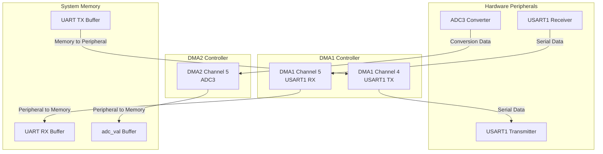
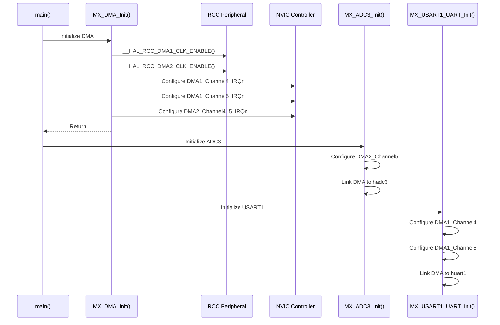
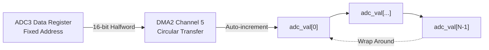
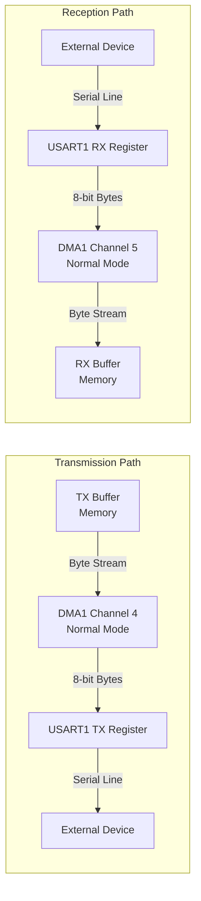
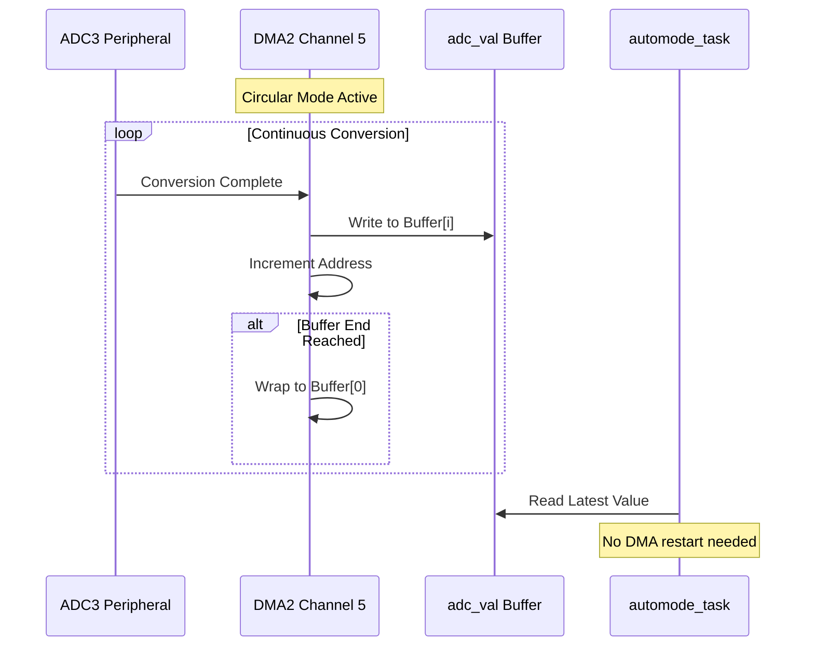
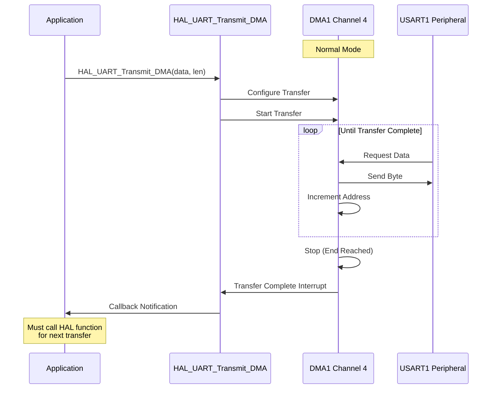
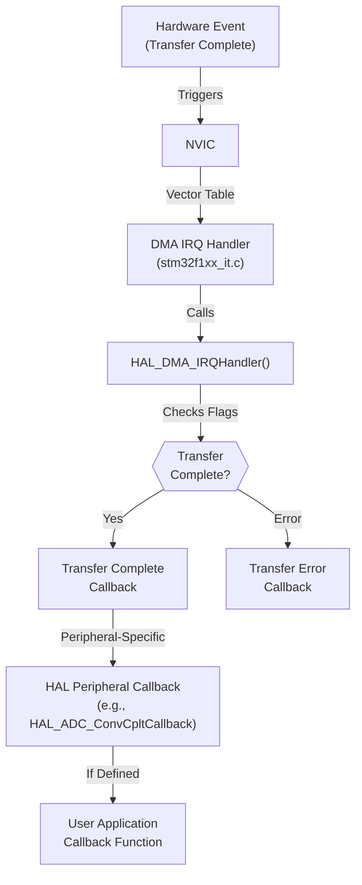
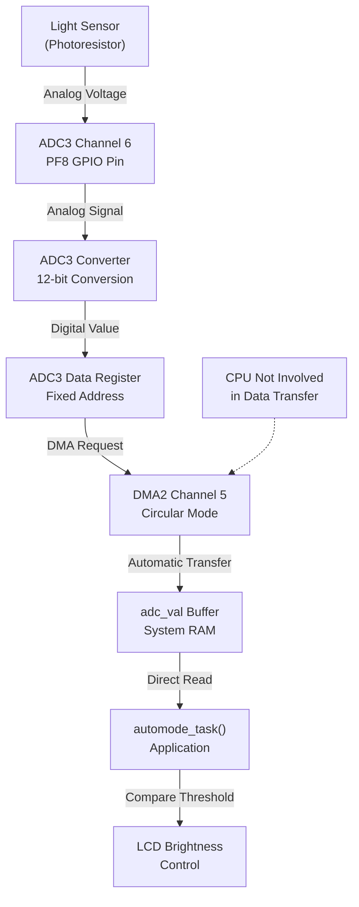
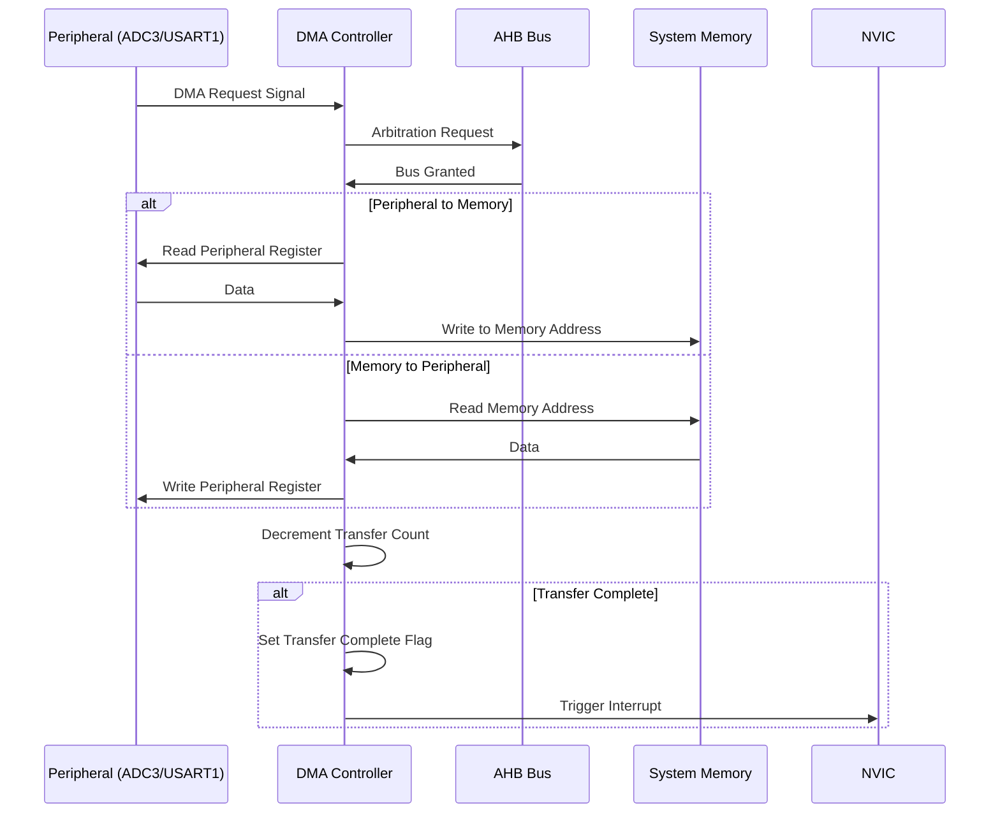

# DMA System

<details>
<summary>Relevant source files</summary>

The following files were used as context for generating this wiki page:

- [Core/Inc/dma.h](Core/Inc/dma.h)
- [Core/Src/adc.c](Core/Src/adc.c)
- [Core/Src/dma.c](Core/Src/dma.c)
- [Core/Src/usart.c](Core/Src/usart.c)

</details>


## Purpose and Scope

This page documents the Direct Memory Access (DMA) controllers and their configuration in the STM32-TFTLCD-UI system. The DMA subsystem enables autonomous data transfer between peripherals and memory without CPU intervention, reducing processor load and enabling efficient real-time operation.

The system uses two DMA controllers:
- **DMA1**: Handles USART1 serial communication transfers
- **DMA2**: Handles ADC3 light sensor data acquisition

For information about the peripherals that use DMA, see [ADC and Light Sensor](#4.2) and [Serial Communication (USART)](#4.6). For interrupt handling details, see [Interrupt System](#3.3).

**Sources: ** [Core/Src/dma.c:1-63](https://github.com/BA2F/STM32-TFTLCD-UI/blob/e0f407ee/Core/Src/dma.c#L1-L63), [Core/Inc/dma.h:1-53](https://github.com/BA2F/STM32-TFTLCD-UI/blob/e0f407ee/Core/Inc/dma.h#L1-L53)

---

## DMA Controller Architecture

The STM32F1xx microcontroller provides two DMA controllers with multiple channels. Each channel is dedicated to servicing specific peripheral requests.

### DMA Controller and Channel Assignment



**DMA Controller and Channel Assignments**

| Controller | Channel | Peripheral | Direction | Transfer Mode | Data Size |
|------------|---------|------------|-----------|---------------|-----------|
| DMA1 | Channel 4 | USART1_TX | Memory → Peripheral | Normal | 8-bit (byte) |
| DMA1 | Channel 5 | USART1_RX | Peripheral → Memory | Normal | 8-bit (byte) |
| DMA2 | Channel 5 | ADC3 | Peripheral → Memory | Circular | 16-bit (halfword) |

**Sources: ** [Core/Src/dma.c:39-57](https://github.com/BA2F/STM32-TFTLCD-UI/blob/e0f407ee/Core/Src/dma.c#L39-L57), [Core/Src/adc.c:93-108](https://github.com/BA2F/STM32-TFTLCD-UI/blob/e0f407ee/Core/Src/adc.c#L93-L108), [Core/Src/usart.c:88-119](https://github.com/BA2F/STM32-TFTLCD-UI/blob/e0f407ee/Core/Src/usart.c#L88-L119)

---

## System Initialization

The DMA system is initialized early in the system startup sequence, before peripheral initialization. This ensures DMA channels are ready when peripherals that depend on them are configured.

### Initialization Sequence



### MX_DMA_Init Function

The `MX_DMA_Init()` function performs global DMA controller initialization:

1. **Clock Enable**: Enables peripheral clocks for both DMA1 and DMA2 controllers
2. **Interrupt Configuration**: Configures NVIC interrupt priorities for all used DMA channels
3. **Priority Setting**: All DMA interrupts are set to priority group 0, sub-priority 0 (highest priority)

```c
// Simplified view of MX_DMA_Init implementation
void MX_DMA_Init(void)
{
    __HAL_RCC_DMA1_CLK_ENABLE();
    __HAL_RCC_DMA2_CLK_ENABLE();
    
    HAL_NVIC_SetPriority(DMA1_Channel4_IRQn, 0, 0);
    HAL_NVIC_EnableIRQ(DMA1_Channel4_IRQn);
    
    HAL_NVIC_SetPriority(DMA1_Channel5_IRQn, 0, 0);
    HAL_NVIC_EnableIRQ(DMA1_Channel5_IRQn);
    
    HAL_NVIC_SetPriority(DMA2_Channel4_5_IRQn, 0, 0);
    HAL_NVIC_EnableIRQ(DMA2_Channel4_5_IRQn);
}
```

**Sources: ** [Core/Src/dma.c:39-57](https://github.com/BA2F/STM32-TFTLCD-UI/blob/e0f407ee/Core/Src/dma.c#L39-L57)

---

## DMA Channel Configurations

Each DMA channel is configured with specific parameters tailored to its peripheral requirements.

### ADC3 DMA Configuration (DMA2 Channel 5)

The ADC3 uses DMA for continuous acquisition of light sensor readings without CPU intervention.

**Configuration Parameters:**

| Parameter | Value | Purpose |
|-----------|-------|---------|
| `Instance` | `DMA2_Channel5` | Hardware channel assignment |
| `Direction` | `DMA_PERIPH_TO_MEMORY` | ADC data flows to memory buffer |
| `PeriphInc` | `DMA_PINC_DISABLE` | ADC data register address is fixed |
| `MemInc` | `DMA_MINC_ENABLE` | Memory buffer address increments |
| `PeriphDataAlignment` | `DMA_PDATAALIGN_HALFWORD` | 16-bit ADC conversion result |
| `MemDataAlignment` | `DMA_MDATAALIGN_HALFWORD` | 16-bit storage in memory |
| `Mode` | `DMA_CIRCULAR` | Continuous acquisition with buffer wrap-around |
| `Priority` | `DMA_PRIORITY_LOW` | Non-critical background operation |

**Circular Mode Operation:**

In circular mode, the DMA automatically wraps back to the beginning of the buffer after reaching the end, enabling continuous data acquisition without CPU intervention. This is ideal for the light sensor, which requires periodic sampling.



**Handle Structure:**

```c
// From adc.c
DMA_HandleTypeDef hdma_adc3;

hdma_adc3.Instance = DMA2_Channel5;
hdma_adc3.Init.Direction = DMA_PERIPH_TO_MEMORY;
hdma_adc3.Init.PeriphInc = DMA_PINC_DISABLE;
hdma_adc3.Init.MemInc = DMA_MINC_ENABLE;
hdma_adc3.Init.PeriphDataAlignment = DMA_PDATAALIGN_HALFWORD;
hdma_adc3.Init.MemDataAlignment = DMA_MDATAALIGN_HALFWORD;
hdma_adc3.Init.Mode = DMA_CIRCULAR;
hdma_adc3.Init.Priority = DMA_PRIORITY_LOW;
```

**DMA Linkage:**

The DMA channel is linked to the ADC handle using the `__HAL_LINKDMA` macro, establishing the connection between the peripheral and its DMA channel.

```c
__HAL_LINKDMA(adcHandle, DMA_Handle, hdma_adc3);
```

**Sources: ** [Core/Src/adc.c:93-108](https://github.com/BA2F/STM32-TFTLCD-UI/blob/e0f407ee/Core/Src/adc.c#L93-L108)

### USART1 DMA Configuration (DMA1 Channels 4 and 5)

USART1 uses two DMA channels for bidirectional serial communication: one for transmission and one for reception.

#### USART1 TX - DMA1 Channel 4

**Configuration Parameters:**

| Parameter | Value | Purpose |
|-----------|-------|---------|
| `Instance` | `DMA1_Channel4` | Hardware channel assignment |
| `Direction` | `DMA_MEMORY_TO_PERIPH` | Transmit buffer flows to USART |
| `PeriphInc` | `DMA_PINC_DISABLE` | USART data register address is fixed |
| `MemInc` | `DMA_MINC_ENABLE` | Transmit buffer address increments |
| `PeriphDataAlignment` | `DMA_PDATAALIGN_BYTE` | 8-bit serial character |
| `MemDataAlignment` | `DMA_MDATAALIGN_BYTE` | 8-bit storage in memory |
| `Mode` | `DMA_NORMAL` | One-shot transfer per transmit request |
| `Priority` | `DMA_PRIORITY_LOW` | Non-critical background operation |

#### USART1 RX - DMA1 Channel 5

**Configuration Parameters:**

| Parameter | Value | Purpose |
|-----------|-------|---------|
| `Instance` | `DMA1_Channel5` | Hardware channel assignment |
| `Direction` | `DMA_PERIPH_TO_MEMORY` | USART data flows to receive buffer |
| `PeriphInc` | `DMA_PINC_DISABLE` | USART data register address is fixed |
| `MemInc` | `DMA_MINC_ENABLE` | Receive buffer address increments |
| `PeriphDataAlignment` | `DMA_PDATAALIGN_BYTE` | 8-bit serial character |
| `MemDataAlignment` | `DMA_MDATAALIGN_BYTE` | 8-bit storage in memory |
| `Mode` | `DMA_NORMAL` | One-shot transfer per receive request |
| `Priority` | `DMA_PRIORITY_LOW` | Non-critical background operation |

**Normal Mode Operation:**

In normal mode, the DMA performs a single transfer from start address to end address, then stops. The application must restart the transfer for subsequent operations. This is appropriate for USART, where each message has a defined length.



**Handle Structures:**

```c
// From usart.c
DMA_HandleTypeDef hdma_usart1_rx;
DMA_HandleTypeDef hdma_usart1_tx;

// TX configuration
hdma_usart1_tx.Instance = DMA1_Channel4;
hdma_usart1_tx.Init.Direction = DMA_MEMORY_TO_PERIPH;
hdma_usart1_tx.Init.PeriphInc = DMA_PINC_DISABLE;
hdma_usart1_tx.Init.MemInc = DMA_MINC_ENABLE;
hdma_usart1_tx.Init.PeriphDataAlignment = DMA_PDATAALIGN_BYTE;
hdma_usart1_tx.Init.MemDataAlignment = DMA_MDATAALIGN_BYTE;
hdma_usart1_tx.Init.Mode = DMA_NORMAL;
hdma_usart1_tx.Init.Priority = DMA_PRIORITY_LOW;

// RX configuration
hdma_usart1_rx.Instance = DMA1_Channel5;
hdma_usart1_rx.Init.Direction = DMA_PERIPH_TO_MEMORY;
// ... (similar parameters)
```

**DMA Linkage:**

Both channels are linked to the UART handle:

```c
__HAL_LINKDMA(uartHandle, hdmarx, hdma_usart1_rx);
__HAL_LINKDMA(uartHandle, hdmatx, hdma_usart1_tx);
```

**Sources: ** [Core/Src/usart.c:88-119](https://github.com/BA2F/STM32-TFTLCD-UI/blob/e0f407ee/Core/Src/usart.c#L88-L119)

---

## DMA Transfer Modes Comparison

The system uses two different DMA transfer modes depending on peripheral requirements:

| Feature | Circular Mode | Normal Mode |
|---------|---------------|-------------|
| **Used By** | ADC3 (DMA2_CH5) | USART1 TX/RX (DMA1_CH4/5) |
| **Buffer Handling** | Automatic wrap-around | Stops at end |
| **Restart Required** | No (continuous) | Yes (per transfer) |
| **Use Case** | Continuous sampling | Message-based communication |
| **CPU Intervention** | Minimal (only for reading data) | Required between transfers |
| **Ideal For** | Periodic sensor acquisition | Event-driven communication |

### Circular Mode Data Flow (ADC3)



### Normal Mode Data Flow (USART1)



**Sources: ** [Core/Src/adc.c:93-108](https://github.com/BA2F/STM32-TFTLCD-UI/blob/e0f407ee/Core/Src/adc.c#L93-L108), [Core/Src/usart.c:88-119](https://github.com/BA2F/STM32-TFTLCD-UI/blob/e0f407ee/Core/Src/usart.c#L88-L119)

---

## DMA Interrupt Configuration

All DMA channels are configured with interrupt support to notify the system when transfers complete or errors occur.

### Interrupt Vector Configuration

| Interrupt Vector | DMA Channels Served | Priority | Sub-Priority | Purpose |
|-----------------|---------------------|----------|--------------|---------|
| `DMA1_Channel4_IRQn` | DMA1 Channel 4 (USART1 TX) | 0 | 0 | TX transfer complete/error |
| `DMA1_Channel5_IRQn` | DMA1 Channel 5 (USART1 RX) | 0 | 0 | RX transfer complete/error |
| `DMA2_Channel4_5_IRQn` | DMA2 Channels 4 & 5 (ADC3) | 0 | 0 | ADC transfer complete/error |

**Note:** Priority 0 is the highest priority level. All DMA interrupts share the same priority, meaning they are serviced in the order they occur.

### Interrupt Processing Flow



**Interrupt Service Routine Structure:**

The interrupt handlers follow the HAL pattern:

1. **Hardware ISR** (in `stm32f1xx_it.c`): Minimal wrapper that calls HAL
2. **HAL Handler** (`HAL_DMA_IRQHandler`): Checks flags and dispatches to callbacks
3. **Peripheral Callbacks**: HAL-level callbacks for specific peripherals
4. **User Callbacks**: Application-specific callback functions (weak, can be overridden)

**Sources: ** [Core/Src/dma.c:46-56](https://github.com/BA2F/STM32-TFTLCD-UI/blob/e0f407ee/Core/Src/dma.c#L46-L56), [Core/Src/adc.c:110-112](https://github.com/BA2F/STM32-TFTLCD-UI/blob/e0f407ee/Core/Src/adc.c#L110-L112), [Core/Src/usart.c:121-123](https://github.com/BA2F/STM32-TFTLCD-UI/blob/e0f407ee/Core/Src/usart.c#L121-L123)

---

## Integration with Peripherals

DMA channels are tightly integrated with their associated peripherals through HAL handle linkage and peripheral-specific initialization.

### Peripheral-DMA Linkage Mechanism

```mermaid
graph TB
    subgraph ADC_MSP["HAL_ADC_MspInit()"]
        ADC_CREATE["Create hdma_adc3<br/>DMA_HandleTypeDef"]
        ADC_CONFIG["Configure DMA Parameters<br/>(Circular, Halfword)"]
        ADC_INIT["HAL_DMA_Init(&hdma_adc3)"]
        ADC_LINK["__HAL_LINKDMA(hadc3,<br/>DMA_Handle, hdma_adc3)"]
    end
    
    subgraph UART_MSP["HAL_UART_MspInit()"]
        UART_CREATE_TX["Create hdma_usart1_tx<br/>DMA_HandleTypeDef"]
        UART_CONFIG_TX["Configure TX Parameters<br/>(Normal, Byte)"]
        UART_INIT_TX["HAL_DMA_Init(&hdma_usart1_tx)"]
        UART_LINK_TX["__HAL_LINKDMA(huart1,<br/>hdmatx, hdma_usart1_tx)"]
        
        UART_CREATE_RX["Create hdma_usart1_rx<br/>DMA_HandleTypeDef"]
        UART_CONFIG_RX["Configure RX Parameters<br/>(Normal, Byte)"]
        UART_INIT_RX["HAL_DMA_Init(&hdma_usart1_rx)"]
        UART_LINK_RX["__HAL_LINKDMA(huart1,<br/>hdmarx, hdma_usart1_rx)"]
    end
    
    ADC_CREATE --> ADC_CONFIG
    ADC_CONFIG --> ADC_INIT
    ADC_INIT --> ADC_LINK
    
    UART_CREATE_TX --> UART_CONFIG_TX
    UART_CONFIG_TX --> UART_INIT_TX
    UART_INIT_TX --> UART_LINK_TX
    
    UART_CREATE_RX --> UART_CONFIG_RX
    UART_CONFIG_RX --> UART_INIT_RX
    UART_INIT_RX --> UART_LINK_RX
```



### Complete Data Flow: Light Sensor to Application

This diagram shows the complete autonomous data path from the physical light sensor to the application, demonstrating how DMA eliminates CPU involvement in data transfer.



### DMA Request Flow



**Sources: ** [Core/Src/adc.c:73-117](https://github.com/BA2F/STM32-TFTLCD-UI/blob/e0f407ee/Core/Src/adc.c#L73-L117), [Core/Src/usart.c:61-127](https://github.com/BA2F/STM32-TFTLCD-UI/blob/e0f407ee/Core/Src/usart.c#L61-L127)

---

## Key DMA Handle Variables

The following global handle variables manage DMA channels throughout the system:

| Variable | Type | Scope | Purpose | Defined In |
|----------|------|-------|---------|-----------|
| `hdma_adc3` | `DMA_HandleTypeDef` | Global | ADC3 DMA transfer management | [Core/Src/adc.c:28]() |
| `hdma_usart1_rx` | `DMA_HandleTypeDef` | Global | USART1 receive DMA management | [Core/Src/usart.c:28]() |
| `hdma_usart1_tx` | `DMA_HandleTypeDef` | Global | USART1 transmit DMA management | [Core/Src/usart.c:29]() |

These handles are initialized in their respective peripheral MSP (MCU Support Package) initialization functions and linked to peripheral handles for coordinated operation.

**Sources: ** [Core/Src/adc.c:28](https://github.com/BA2F/STM32-TFTLCD-UI/blob/e0f407ee/Core/Src/adc.c#L28), [Core/Src/usart.c:28-29](https://github.com/BA2F/STM32-TFTLCD-UI/blob/e0f407ee/Core/Src/usart.c#L28-L29)

---

## Summary

The DMA system in STM32-TFTLCD-UI provides efficient, autonomous data transfer for two critical peripherals:

1. **ADC3 Light Sensor** (DMA2 Channel 5): Continuous circular-mode acquisition for ambient light monitoring
2. **USART1 Serial Port** (DMA1 Channels 4 & 5): Bidirectional normal-mode transfers for debug communication

**Key Design Characteristics:**

- **Minimal CPU Overhead**: DMA handles all data movement autonomously
- **Interrupt-Driven Completion**: High-priority interrupts notify completion without polling
- **Mode-Appropriate Configuration**: Circular mode for continuous sampling, normal mode for message-based communication
- **HAL Integration**: Standard STM32 HAL patterns for portability and maintainability
- **Early Initialization**: DMA controllers initialized before dependent peripherals

The DMA system enables the real-time application to maintain responsive UI updates and time-critical tasks while background data acquisition and communication proceed autonomously.

**Sources: ** [Core/Src/dma.c:1-63](https://github.com/BA2F/STM32-TFTLCD-UI/blob/e0f407ee/Core/Src/dma.c#L1-L63), [Core/Src/adc.c:73-117](https://github.com/BA2F/STM32-TFTLCD-UI/blob/e0f407ee/Core/Src/adc.c#L73-L117), [Core/Src/usart.c:61-127](https://github.com/BA2F/STM32-TFTLCD-UI/blob/e0f407ee/Core/Src/usart.c#L61-L127)