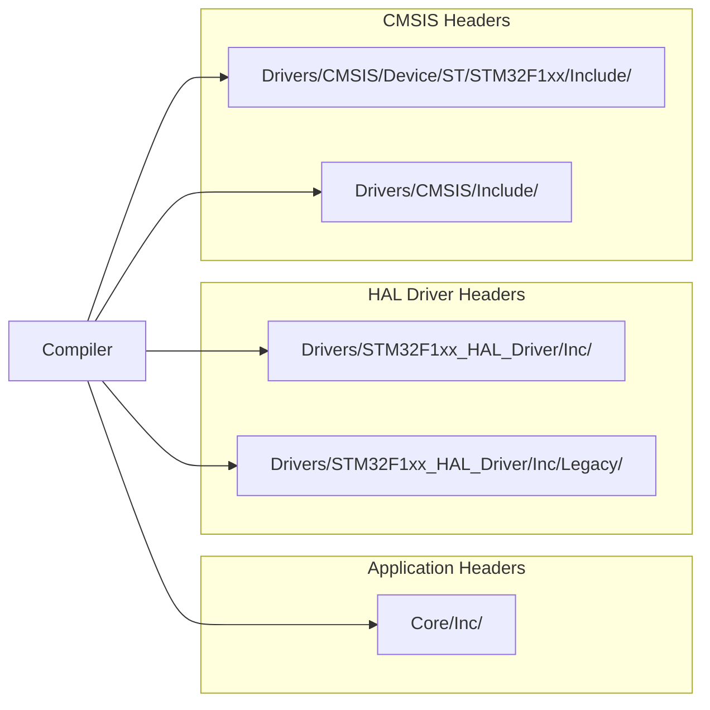
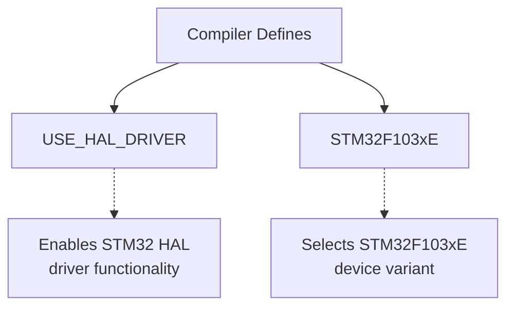
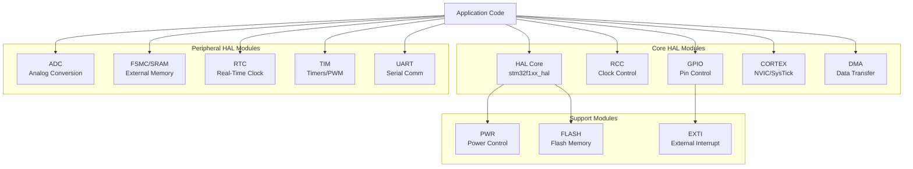
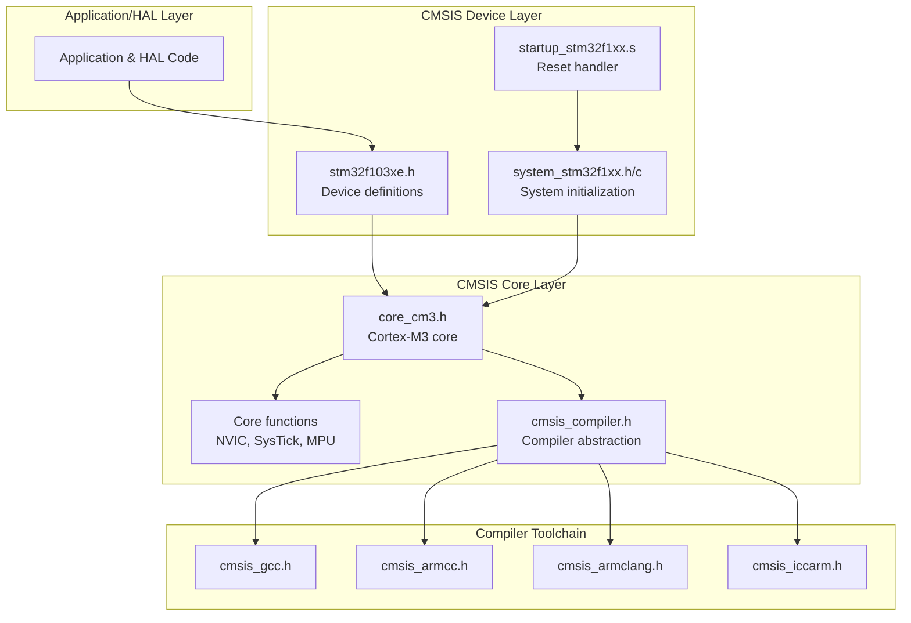
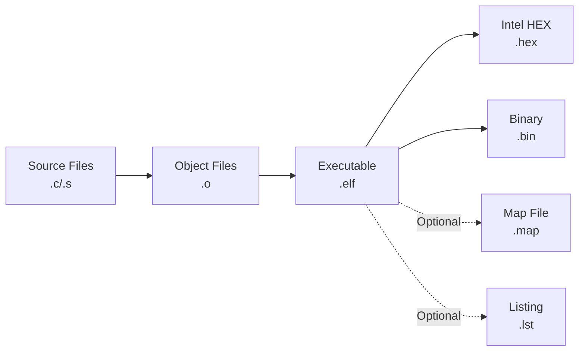
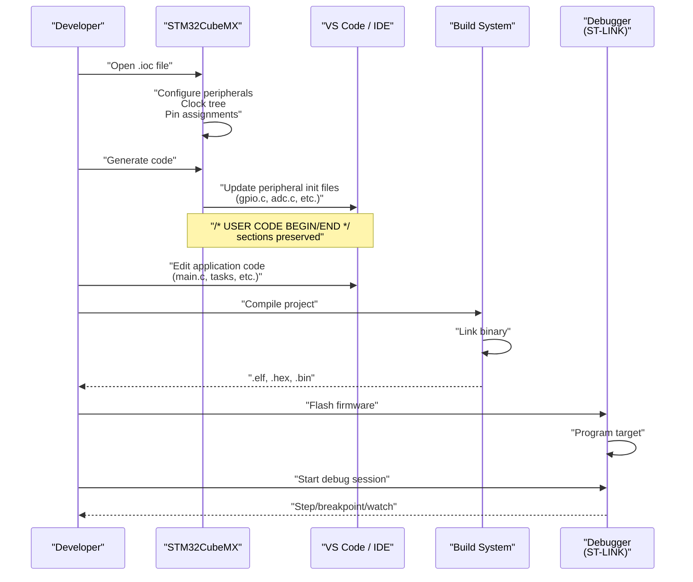
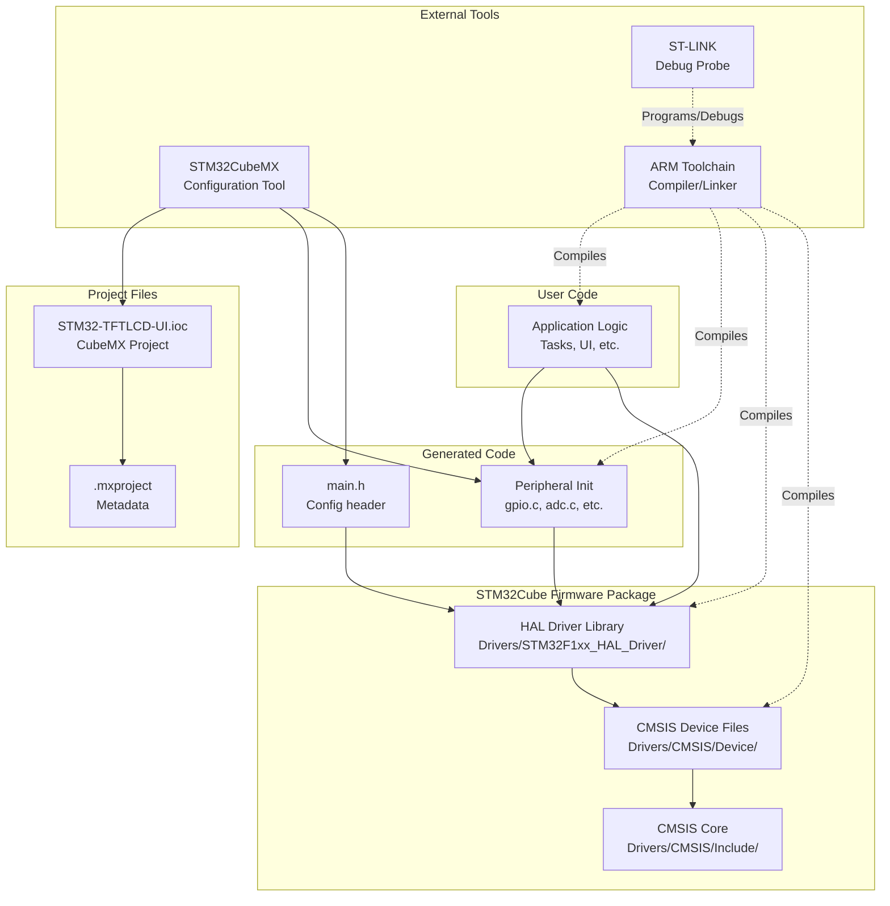

# Development Environment

<details>
<summary>Relevant source files</summary>

The following files were used as context for generating this wiki page:

- [.gitignore](.gitignore)
- [.mxproject](.mxproject)
- [.vscode/settings.json](.vscode/settings.json)

</details>


## Purpose and Scope

This document describes the development environment setup, project structure, and build configuration for the STM32-TFTLCD-UI embedded firmware project. It covers the toolchain requirements, project organization, build system, and dependency structure needed to develop and compile the application.

For specific details about STM32CubeMX peripheral configuration and code generation, see [STM32CubeMX Project](#5.1). For IDE-specific settings and workspace configuration, see [IDE Configuration](#5.2).

---

## Project Overview

The STM32-TFTLCD-UI project is an embedded firmware application developed using the **STM32CubeMX code generation tool** and the **STM32F1xx Hardware Abstraction Layer (HAL)**. The project targets the **STM32F103xE** microcontroller and is structured as a standard STM32Cube project with HAL driver integration.

### Target Microcontroller

| Property | Value |
|----------|-------|
| **Microcontroller Family** | STM32F1xx |
| **Device Part Number** | STM32F103xE |
| **Core** | ARM Cortex-M3 |
| **Flash Memory** | 512 KB |
| **SRAM** | 64 KB |
| **Maximum Clock** | 72 MHz |

**Sources: ** [.mxproject:7](https://github.com/BA2F/STM32-TFTLCD-UI/blob/e0f407ee/.mxproject#L7)

---

## Project Structure

The repository follows the standard STM32Cube project structure with clear separation between application code, HAL drivers, and CMSIS layers.

```mermaid
graph TB
    ROOT["Project Root"]
    
    subgraph "Application Code"
        CORE["Core/"]
        CORE_SRC["Core/Src/"]
        CORE_INC["Core/Inc/"]
        
        MAIN_C["main.c"]
        GPIO_C["gpio.c"]
        ADC_C["adc.c"]
        DMA_C["dma.c"]
        FSMC_C["fsmc.c"]
        RTC_C["rtc.c"]
        TIM_C["tim.c"]
        USART_C["usart.c"]
        IT_C["stm32f1xx_it.c"]
        MSP_C["stm32f1xx_hal_msp.c"]
        
        MAIN_H["main.h"]
        GPIO_H["gpio.h"]
        ADC_H["adc.h"]
        DMA_H["dma.h"]
        FSMC_H["fsmc.h"]
        RTC_H["rtc.h"]
        TIM_H["tim.h"]
        USART_H["usart.h"]
        IT_H["stm32f1xx_it.h"]
        CONF_H["stm32f1xx_hal_conf.h"]
    end
    
    subgraph "HAL Driver Layer"
        DRIVERS["Drivers/"]
        HAL_DRV["STM32F1xx_HAL_Driver/"]
        HAL_SRC["Src/"]
        HAL_INC["Inc/"]
    end
    
    subgraph "CMSIS Layer"
        CMSIS["CMSIS/"]
        CMSIS_DEV["Device/ST/STM32F1xx/"]
        CMSIS_CORE["Include/"]
        SYSTEM_C["system_stm32f1xx.c"]
    end
    
    subgraph "Project Configuration"
        VSCODE[".vscode/"]
        SETTINGS["settings.json"]
        IOC["STM32-TFTLCD-UI.ioc"]
        MXPROJ[".mxproject"]
        GITIGNORE[".gitignore"]
    end
    
    ROOT --> CORE
    ROOT --> DRIVERS
    ROOT --> CMSIS
    ROOT --> VSCODE
    ROOT --> IOC
    ROOT --> MXPROJ
    ROOT --> GITIGNORE
    
    CORE --> CORE_SRC
    CORE --> CORE_INC
    
    CORE_SRC --> MAIN_C
    CORE_SRC --> GPIO_C
    CORE_SRC --> ADC_C
    CORE_SRC --> DMA_C
    CORE_SRC --> FSMC_C
    CORE_SRC --> RTC_C
    CORE_SRC --> TIM_C
    CORE_SRC --> USART_C
    CORE_SRC --> IT_C
    CORE_SRC --> MSP_C
    
    CORE_INC --> MAIN_H
    CORE_INC --> GPIO_H
    CORE_INC --> ADC_H
    CORE_INC --> DMA_H
    CORE_INC --> FSMC_H
    CORE_INC --> RTC_H
    CORE_INC --> TIM_H
    CORE_INC --> USART_H
    CORE_INC --> IT_H
    CORE_INC --> CONF_H
    
    DRIVERS --> HAL_DRV
    HAL_DRV --> HAL_SRC
    HAL_DRV --> HAL_INC
    
    CMSIS --> CMSIS_DEV
    CMSIS --> CMSIS_CORE
    CMSIS_DEV --> SYSTEM_C
    
    VSCODE --> SETTINGS
```



### Directory Organization

| Directory | Contents | Purpose |
|-----------|----------|---------|
| `Core/Src/` | Application source files | Main application logic and peripheral initialization |
| `Core/Inc/` | Application headers | Function prototypes, type definitions, and HAL configuration |
| `Drivers/STM32F1xx_HAL_Driver/` | HAL driver library | Hardware abstraction layer implementation |
| `Drivers/CMSIS/` | CMSIS core and device files | ARM Cortex-M architecture support and device definitions |
| `.vscode/` | Editor configuration | VS Code workspace settings |

**Sources: ** [.mxproject:23-38](https://github.com/BA2F/STM32-TFTLCD-UI/blob/e0f407ee/.mxproject#L23-L38)

---

## Source File Compilation Structure

The project compilation process involves three distinct layers of source files, each serving a specific architectural purpose.

```mermaid
graph TD
    subgraph "Application Layer Sources"
        APP_MAIN["main.c<br/>System entry point"]
        APP_GPIO["gpio.c<br/>GPIO initialization"]
        APP_ADC["adc.c<br/>ADC3 setup"]
        APP_DMA["dma.c<br/>DMA controller setup"]
        APP_FSMC["fsmc.c<br/>FSMC configuration"]
        APP_RTC["rtc.c<br/>RTC configuration"]
        APP_TIM["tim.c<br/>Timer setup"]
        APP_USART["usart.c<br/>UART setup"]
        APP_IT["stm32f1xx_it.c<br/>Interrupt handlers"]
        APP_MSP["stm32f1xx_hal_msp.c<br/>MSP initialization"]
    end
    
    subgraph "HAL Driver Sources"
        HAL_GPIO["stm32f1xx_hal_gpio.c"]
        HAL_ADC["stm32f1xx_hal_adc.c"]
        HAL_ADC_EX["stm32f1xx_hal_adc_ex.c"]
        HAL_DMA["stm32f1xx_hal_dma.c"]
        HAL_FSMC["stm32f1xx_ll_fsmc.c"]
        HAL_SRAM["stm32f1xx_hal_sram.c"]
        HAL_RTC["stm32f1xx_hal_rtc.c"]
        HAL_RTC_EX["stm32f1xx_hal_rtc_ex.c"]
        HAL_TIM["stm32f1xx_hal_tim.c"]
        HAL_TIM_EX["stm32f1xx_hal_tim_ex.c"]
        HAL_UART["stm32f1xx_hal_uart.c"]
        HAL_CORE["stm32f1xx_hal.c"]
        HAL_RCC["stm32f1xx_hal_rcc.c"]
        HAL_CORTEX["stm32f1xx_hal_cortex.c"]
    end
    
    subgraph "CMSIS System Sources"
        CMSIS_SYS["system_stm32f1xx.c<br/>Clock config"]
        CMSIS_STARTUP["startup_stm32f1xx.s<br/>Assembly startup"]
    end
    
    APP_MAIN --> HAL_CORE
    APP_GPIO --> HAL_GPIO
    APP_ADC --> HAL_ADC
    APP_ADC --> HAL_ADC_EX
    APP_DMA --> HAL_DMA
    APP_FSMC --> HAL_FSMC
    APP_FSMC --> HAL_SRAM
    APP_RTC --> HAL_RTC
    APP_RTC --> HAL_RTC_EX
    APP_TIM --> HAL_TIM
    APP_TIM --> HAL_TIM_EX
    APP_USART --> HAL_UART
    APP_IT --> HAL_CORE
    APP_MSP --> HAL_RCC
    APP_MSP --> HAL_CORTEX
    
    HAL_CORE --> CMSIS_SYS
    HAL_GPIO --> CMSIS_SYS
    HAL_ADC --> CMSIS_SYS
    HAL_DMA --> CMSIS_SYS
    HAL_FSMC --> CMSIS_SYS
    HAL_RTC --> CMSIS_SYS
    HAL_TIM --> CMSIS_SYS
    HAL_UART --> CMSIS_SYS
    
    CMSIS_STARTUP -.->|"Calls SystemInit()"| CMSIS_SYS
```



### Compilation Units

The build system compiles **20 C source files** organized across three layers:

**Application Layer (10 files):**
- `main.c` - Main application loop and task scheduling
- `gpio.c`, `adc.c`, `dma.c`, `fsmc.c`, `rtc.c`, `tim.c`, `usart.c` - Peripheral initialization wrappers
- `stm32f1xx_it.c` - Interrupt service routines
- `stm32f1xx_hal_msp.c` - MSP (MCU Support Package) initialization callbacks

**HAL Driver Layer (14+ files):**
- Core HAL functions: `stm32f1xx_hal.c`, `stm32f1xx_hal_cortex.c`, `stm32f1xx_hal_rcc.c`
- Peripheral drivers: GPIO, ADC, DMA, FSMC, SRAM, RTC, Timer, UART
- Extended functionality: `*_ex.c` files for advanced features

**CMSIS Layer (1 file):**
- `system_stm32f1xx.c` - System clock configuration and initialization

**Sources: ** [.mxproject:5](https://github.com/BA2F/STM32-TFTLCD-UI/blob/e0f407ee/.mxproject#L5)

---

## Include Path Configuration

The compiler must be configured with the following include directories to resolve all header file dependencies.

### Required Include Paths



| Priority | Include Path | Purpose |
|----------|--------------|---------|
| 1 | `Core/Inc/` | Application-specific headers and `stm32f1xx_hal_conf.h` |
| 2 | `Drivers/STM32F1xx_HAL_Driver/Inc/` | HAL peripheral driver headers |
| 3 | `Drivers/STM32F1xx_HAL_Driver/Inc/Legacy/` | Legacy HAL compatibility headers |
| 4 | `Drivers/CMSIS/Device/ST/STM32F1xx/Include/` | STM32F1xx device-specific definitions |
| 5 | `Drivers/CMSIS/Include/` | ARM CMSIS core headers |

**Sources: ** [.mxproject:6](https://github.com/BA2F/STM32-TFTLCD-UI/blob/e0f407ee/.mxproject#L6)

---

## Preprocessor Definitions

The following preprocessor symbols must be defined during compilation to ensure correct HAL operation and device targeting.

### Required C Preprocessor Defines



| Define | Purpose | Effect |
|--------|---------|--------|
| `USE_HAL_DRIVER` | Enable HAL library | Activates HAL driver code paths in header files |
| `STM32F103xE` | Device selection | Includes device-specific register definitions and memory map |

The symbol `USE_HAL_DRIVER` appears **three times** in the project configuration, ensuring it is applied consistently across all compilation contexts.

**Sources: ** [.mxproject:7](https://github.com/BA2F/STM32-TFTLCD-UI/blob/e0f407ee/.mxproject#L7)

---

## HAL Driver Dependencies

The project depends on the STM32F1xx HAL driver library, which provides a standardized API for peripheral access. The following HAL modules are used:

### Active HAL Modules



### HAL Module Selection

The active HAL modules are configured through `Core/Inc/stm32f1xx_hal_conf.h`. Each module consists of:

- **Header file:** `stm32f1xx_hal_<module>.h` - Function prototypes and type definitions
- **Source file:** `stm32f1xx_hal_<module>.c` - Implementation
- **Extended module (optional):** `stm32f1xx_hal_<module>_ex.h/c` - Device-specific extensions
- **Low-Layer API (optional):** `stm32f1xx_ll_<module>.h` - Register-level access

**Sources: ** [.mxproject:1-2](https://github.com/BA2F/STM32-TFTLCD-UI/blob/e0f407ee/.mxproject#L1-L2)

---

## CMSIS Dependency Structure

The Cortex Microcontroller Software Interface Standard (CMSIS) provides the foundation layer for ARM Cortex-M processor support.



### CMSIS Components

| Component | File | Purpose |
|-----------|------|---------|
| **Device Header** | `stm32f103xe.h` | Peripheral register definitions, memory map, interrupt numbers |
| **System Files** | `system_stm32f1xx.h/c` | Clock tree configuration, `SystemInit()`, `SystemCoreClock` |
| **Startup Code** | `startup_stm32f1xx.s` | Vector table, reset handler, stack/heap setup |
| **Core Header** | `core_cm3.h` | Cortex-M3 core peripherals (NVIC, SysTick, SCB, MPU) |
| **Compiler Abstraction** | `cmsis_gcc.h` | Compiler-specific intrinsics and attributes |

**Sources: ** [.mxproject:1-2](https://github.com/BA2F/STM32-TFTLCD-UI/blob/e0f407ee/.mxproject#L1-L2)

---

## Build System and Toolchain

### Supported Toolchains

The project can be built with multiple ARM toolchains. The `.mxproject` file shows Keil MDK-ARM compatibility, but GCC-based toolchains are also supported.

| Toolchain | Compiler | Debugger | Notes |
|-----------|----------|----------|-------|
| **GNU Arm Embedded Toolchain** | `arm-none-eabi-gcc` | GDB | Open-source, recommended |
| **Keil MDK-ARM** | ARMCC | µVision debugger | Commercial IDE |
| **IAR EWARM** | IAR C/C++ Compiler | IAR C-SPY | Commercial IDE |
| **STM32CubeIDE** | GCC | GDB/ST-LINK | ST's free Eclipse-based IDE |

### Build Artifacts

The build process produces the following outputs:



**Ignored Build Artifacts** (from `.gitignore`):
- `bin-debug/` - Debug build outputs
- `bin-release/` - Release build outputs
- `[Oo]bj/` - Object file directories
- `[Bb]in/` - Binary output directories

**Sources: ** [.gitignore:1-19](https://github.com/BA2F/STM32-TFTLCD-UI/blob/e0f407ee/.gitignore#L1-L19)

---

## Development Workflow

The typical development workflow integrates STM32CubeMX for configuration and a text editor/IDE for coding.



### STM32CubeMX Code Generation

STM32CubeMX generates peripheral initialization code while preserving user modifications:

1. **Generated Files:** `gpio.c`, `adc.c`, `dma.c`, `fsmc.c`, `rtc.c`, `tim.c`, `usart.c`
2. **User Code Sections:** Marked with `/* USER CODE BEGIN */` and `/* USER CODE END */`
3. **Regeneration Safe:** User code within marked sections is preserved during regeneration

**Sources: ** [.mxproject:9-38](https://github.com/BA2F/STM32-TFTLCD-UI/blob/e0f407ee/.mxproject#L9-L38)

---

## Editor Configuration

The project includes VS Code configuration for enhanced development experience.

### VS Code File Associations

The `.vscode/settings.json` file defines file associations to enable proper syntax highlighting and IntelliSense:

```json
{
    "files.associations": {
        "main.h": "c",
        "fsmc.h": "c",
        "lcd.h": "c",
        "ui_main.h": "c",
        "adc.h": "c",
        "dma.h": "c"
    }
}
```

These associations ensure that header files are correctly identified as C language files, enabling:
- Syntax highlighting
- Code completion
- Symbol navigation
- Error checking

**Sources: ** [.vscode/settings.json:1-10](https://github.com/BA2F/STM32-TFTLCD-UI/blob/e0f407ee/.vscode/settings.json#L1-L10)

---

## Dependency Summary

The complete dependency hierarchy for the development environment:



### Required Dependencies

| Dependency | Version/Source | Purpose |
|------------|----------------|---------|
| **STM32CubeMX** | Latest version | Peripheral configuration and code generation |
| **STM32F1xx HAL Driver** | Included in project | Hardware abstraction layer |
| **CMSIS v5** | Included in project | ARM Cortex-M support |
| **ARM Toolchain** | GCC or commercial | Compilation and linking |
| **ST-LINK Utility** | ST-provided | Firmware flashing and debugging |

**Sources: ** [.mxproject:1-7](https://github.com/BA2F/STM32-TFTLCD-UI/blob/e0f407ee/.mxproject#L1-L7)