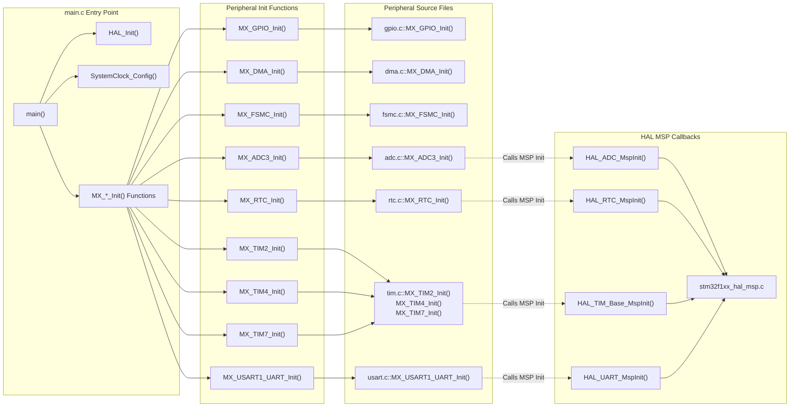
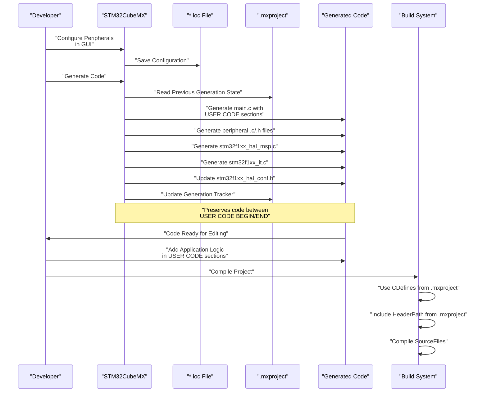

# STM32CubeMX Project

<details>
<summary>Relevant source files</summary>

The following files were used as context for generating this wiki page:

- [.mxproject](.mxproject)
- [Core/Inc/stm32f1xx_hal_conf.h](Core/Inc/stm32f1xx_hal_conf.h)

</details>


This page documents the STM32CubeMX project configuration and the code generation system that produces peripheral initialization code for this embedded application. It explains the project file structure, HAL module selection, and the generated code architecture.

For information about the IDE and build configuration, see [IDE Configuration](#5.2). For details on the HAL system itself and its runtime behavior, see [HAL Configuration](#3.1) and [System Initialization](#3.2).

## Overview

STM32CubeMX is a graphical configuration tool from STMicroelectronics that generates initialization code for STM32 microcontrollers. It manages peripheral configurations, clock settings, pin assignments, and middleware integration through a graphical interface, then generates C code that configures the hardware according to these settings.

The tool operates on an `.ioc` project file (not present in repository, likely `.gitignore`d) and tracks its generated output through a `.mxproject` metadata file. Each time the project is regenerated, CubeMX updates the initialization code while preserving user-written code sections marked with special comment blocks.

**Sources: ** [.mxproject:1-40](https://github.com/BA2F/STM32-TFTLCD-UI/blob/e0f407ee/.mxproject#L1-L40)

## Project File Structure

The STM32CubeMX project maintains two key metadata files that track code generation state and configuration:

```mermaid
graph TB
    subgraph "CubeMX Project Files"
        IOC["*.ioc File<br/>(Configuration Database)"]
        MXPROJ[".mxproject File<br/>(Generation Tracker)"]
    end
    
    subgraph "Generated Header Files"
        MAIN_H["main.h"]
        HAL_CONF["stm32f1xx_hal_conf.h"]
        GPIO_H["gpio.h"]
        ADC_H["adc.h"]
        DMA_H["dma.h"]
        FSMC_H["fsmc.h"]
        RTC_H["rtc.h"]
        TIM_H["tim.h"]
        USART_H["usart.h"]
        IT_H["stm32f1xx_it.h"]
    end
    
    subgraph "Generated Source Files"
        MAIN_C["main.c"]
        GPIO_C["gpio.c"]
        ADC_C["adc.c"]
        DMA_C["dma.c"]
        FSMC_C["fsmc.c"]
        RTC_C["rtc.c"]
        TIM_C["tim.c"]
        USART_C["usart.c"]
        IT_C["stm32f1xx_it.c"]
        MSP_C["stm32f1xx_hal_msp.c"]
    end
    
    subgraph "HAL Library Files"
        HAL_LIB["STM32F1xx_HAL_Driver/*"]
        CMSIS["CMSIS/*"]
    end
    
    IOC -->|"Stores Configuration"| MXPROJ
    MXPROJ -->|"Tracks Generated Files"| MAIN_H
    MXPROJ -->|"Tracks Generated Files"| GPIO_H
    MXPROJ -->|"Tracks Generated Files"| ADC_H
    MXPROJ -->|"Tracks Generated Files"| DMA_H
    MXPROJ -->|"Tracks Generated Files"| FSMC_H
    MXPROJ -->|"Tracks Generated Files"| RTC_H
    MXPROJ -->|"Tracks Generated Files"| TIM_H
    MXPROJ -->|"Tracks Generated Files"| USART_H
    MXPROJ -->|"Tracks Generated Files"| IT_H
    
    MXPROJ -->|"Tracks Generated Files"| MAIN_C
    MXPROJ -->|"Tracks Generated Files"| GPIO_C
    MXPROJ -->|"Tracks Generated Files"| ADC_C
    MXPROJ -->|"Tracks Generated Files"| DMA_C
    MXPROJ -->|"Tracks Generated Files"| FSMC_C
    MXPROJ -->|"Tracks Generated Files"| RTC_C
    MXPROJ -->|"Tracks Generated Files"| TIM_C
    MXPROJ -->|"Tracks Generated Files"| USART_C
    MXPROJ -->|"Tracks Generated Files"| IT_C
    MXPROJ -->|"Tracks Generated Files"| MSP_C
    
    MXPROJ -->|"References Library Files"| HAL_LIB
    MXPROJ -->|"References Library Files"| CMSIS
    
    HAL_CONF -.->|"Configures"| HAL_LIB
```



### .mxproject Metadata File

The `.mxproject` file tracks three categories of information across code generation cycles:

| Section | Purpose | Key Data |
|---------|---------|----------|
| `[PreviousLibFiles]` | Tracks HAL driver files included in last generation | List of all HAL header/source paths |
| `[PreviousUsedKeilFiles]` | Tracks source files and compiler settings | Source file paths, header paths, C defines |
| `[PreviousGenFiles]` | Tracks generated files by CubeMX | Header/source file lists with categorization |

The file structure in [.mxproject:1-40]() shows:

```
[PreviousLibFiles]
LibFiles=Drivers\STM32F1xx_HAL_Driver\Inc\stm32f1xx_hal_adc.h;...

[PreviousUsedKeilFiles]
SourceFiles=..\Core\Src\main.c;..\Core\Src\gpio.c;..\Core\Src\adc.c;...
HeaderPath=..\Drivers\STM32F1xx_HAL_Driver\Inc;..\Drivers\CMSIS\...
CDefines=USE_HAL_DRIVER;STM32F103xE;

[PreviousGenFiles]
AdvancedFolderStructure=true
HeaderFileListSize=10
HeaderFiles#0=..\Core\Inc\gpio.h
SourceFileListSize=10
SourceFiles#0=..\Core\Src\gpio.c
```

This metadata enables CubeMX to:
- Detect changes in peripheral configuration
- Preserve user code sections during regeneration
- Maintain consistent include paths and compiler definitions
- Track which files are generated vs. user-modified

**Sources: ** [.mxproject:1-40](https://github.com/BA2F/STM32-TFTLCD-UI/blob/e0f407ee/.mxproject#L1-L40)

## Generated Code Architecture

STM32CubeMX generates a structured set of initialization files organized by peripheral. Each peripheral has a dedicated source/header pair containing its initialization function.



### Generated File Categories

The project generates files in the `Core/` directory structure:

| Directory | File Type | Purpose | User Editable |
|-----------|-----------|---------|---------------|
| `Core/Inc/` | Header files | Function prototypes, peripheral handles | Between `USER CODE BEGIN/END` only |
| `Core/Src/` | Source files | Initialization functions | Between `USER CODE BEGIN/END` only |
| `Core/Src/` | `stm32f1xx_hal_msp.c` | MSP (MCU Support Package) callbacks | Between `USER CODE BEGIN/END` only |
| `Core/Src/` | `stm32f1xx_it.c` | Interrupt handlers | Between `USER CODE BEGIN/END` only |

Each generated file contains comment blocks marking user-editable sections:

```c
/* USER CODE BEGIN Includes */
// User code preserved during regeneration
/* USER CODE END Includes */
```

**Sources: ** [.mxproject:9-38](https://github.com/BA2F/STM32-TFTLCD-UI/blob/e0f407ee/.mxproject#L9-L38)

## HAL Module Configuration

The HAL configuration file `stm32f1xx_hal_conf.h` controls which peripheral drivers are compiled into the project. This file is generated by STM32CubeMX based on the peripherals selected in the `.ioc` configuration.

```mermaid
graph TB
    subgraph "HAL Configuration File"
        HAL_CONF["stm32f1xx_hal_conf.h"]
        MODULE_SELECT["Module Selection<br/>Lines 31-78"]
        OSC_CONFIG["Oscillator Configuration<br/>Lines 80-122"]
        SYS_CONFIG["System Configuration<br/>Lines 127-135"]
    end
    
    subgraph "Enabled HAL Modules"
        HAL_ADC["HAL_ADC_MODULE_ENABLED"]
        HAL_DMA["HAL_DMA_MODULE_ENABLED"]
        HAL_GPIO["HAL_GPIO_MODULE_ENABLED"]
        HAL_RTC["HAL_RTC_MODULE_ENABLED"]
        HAL_SRAM["HAL_SRAM_MODULE_ENABLED"]
        HAL_TIM["HAL_TIM_MODULE_ENABLED"]
        HAL_UART["HAL_UART_MODULE_ENABLED"]
        HAL_CORTEX["HAL_CORTEX_MODULE_ENABLED"]
        HAL_FLASH["HAL_FLASH_MODULE_ENABLED"]
        HAL_EXTI["HAL_EXTI_MODULE_ENABLED"]
        HAL_PWR["HAL_PWR_MODULE_ENABLED"]
        HAL_RCC["HAL_RCC_MODULE_ENABLED"]
    end
    
    subgraph "HAL Driver Headers"
        ADC_H["stm32f1xx_hal_adc.h"]
        DMA_H["stm32f1xx_hal_dma.h"]
        GPIO_H["stm32f1xx_hal_gpio.h"]
        RTC_H["stm32f1xx_hal_rtc.h"]
        SRAM_H["stm32f1xx_hal_sram.h"]
        TIM_H["stm32f1xx_hal_tim.h"]
        UART_H["stm32f1xx_hal_uart.h"]
    end
    
    subgraph "Oscillator Values"
        HSE["HSE_VALUE=8000000U"]
        HSI["HSI_VALUE=8000000U"]
        LSI["LSI_VALUE=40000U"]
        LSE["LSE_VALUE=32768U"]
    end
    
    MODULE_SELECT --> HAL_ADC
    MODULE_SELECT --> HAL_DMA
    MODULE_SELECT --> HAL_GPIO
    MODULE_SELECT --> HAL_RTC
    MODULE_SELECT --> HAL_SRAM
    MODULE_SELECT --> HAL_TIM
    MODULE_SELECT --> HAL_UART
    MODULE_SELECT --> HAL_CORTEX
    MODULE_SELECT --> HAL_FLASH
    MODULE_SELECT --> HAL_EXTI
    MODULE_SELECT --> HAL_PWR
    MODULE_SELECT --> HAL_RCC
    
    HAL_ADC -.->|"Includes"| ADC_H
    HAL_DMA -.->|"Includes"| DMA_H
    HAL_GPIO -.->|"Includes"| GPIO_H
    HAL_RTC -.->|"Includes"| RTC_H
    HAL_SRAM -.->|"Includes"| SRAM_H
    HAL_TIM -.->|"Includes"| TIM_H
    HAL_UART -.->|"Includes"| UART_H
    
    OSC_CONFIG --> HSE
    OSC_CONFIG --> HSI
    OSC_CONFIG --> LSI
    OSC_CONFIG --> LSE
```



### Module Selection Mechanism

The HAL uses conditional compilation to include only the required peripheral drivers. The configuration file defines preprocessor symbols that control which headers are included:

| Configuration Macro | Header Included | Purpose |
|---------------------|-----------------|---------|
| `HAL_ADC_MODULE_ENABLED` | `stm32f1xx_hal_adc.h` | ADC peripheral driver |
| `HAL_DMA_MODULE_ENABLED` | `stm32f1xx_hal_dma.h` | DMA controller driver |
| `HAL_GPIO_MODULE_ENABLED` | `stm32f1xx_hal_gpio.h` | GPIO port driver |
| `HAL_RTC_MODULE_ENABLED` | `stm32f1xx_hal_rtc.h` | RTC peripheral driver |
| `HAL_SRAM_MODULE_ENABLED` | `stm32f1xx_hal_sram.h` | FSMC SRAM driver |
| `HAL_TIM_MODULE_ENABLED` | `stm32f1xx_hal_tim.h` | Timer peripheral driver |
| `HAL_UART_MODULE_ENABLED` | `stm32f1xx_hal_uart.h` | UART peripheral driver |
| `HAL_CORTEX_MODULE_ENABLED` | `stm32f1xx_hal_cortex.h` | Cortex-M core functions |
| `HAL_FLASH_MODULE_ENABLED` | `stm32f1xx_hal_flash.h` | Flash memory driver |
| `HAL_EXTI_MODULE_ENABLED` | `stm32f1xx_hal_exti.h` | External interrupt driver |
| `HAL_PWR_MODULE_ENABLED` | `stm32f1xx_hal_pwr.h` | Power management driver |
| `HAL_RCC_MODULE_ENABLED` | `stm32f1xx_hal_rcc.h` | Clock control driver |

The conditional inclusion mechanism in [Core/Inc/stm32f1xx_hal_conf.h:237-367]() follows this pattern:

```c
#ifdef HAL_ADC_MODULE_ENABLED
#include "stm32f1xx_hal_adc.h"
#endif /* HAL_ADC_MODULE_ENABLED */
```

This reduces code size by excluding unused peripheral drivers from compilation.

**Sources: ** [Core/Inc/stm32f1xx_hal_conf.h:31-78](https://github.com/BA2F/STM32-TFTLCD-UI/blob/e0f407ee/Core/Inc/stm32f1xx_hal_conf.h#L31-L78), [Core/Inc/stm32f1xx_hal_conf.h:237-367](https://github.com/BA2F/STM32-TFTLCD-UI/blob/e0f407ee/Core/Inc/stm32f1xx_hal_conf.h#L237-L367)

### System Configuration Parameters

The HAL configuration file also defines critical system parameters:

| Parameter | Value | Purpose |
|-----------|-------|---------|
| `HSE_VALUE` | `8000000U` | External crystal frequency (8 MHz) |
| `HSI_VALUE` | `8000000U` | Internal RC oscillator frequency |
| `LSE_VALUE` | `32768U` | External 32.768 kHz RTC crystal |
| `LSI_VALUE` | `40000U` | Internal low-speed RC oscillator |
| `VDD_VALUE` | `3300U` | Supply voltage in millivolts |
| `TICK_INT_PRIORITY` | `15U` | SysTick interrupt priority (lowest) |
| `USE_RTOS` | `0U` | RTOS integration disabled |
| `PREFETCH_ENABLE` | `1U` | Flash prefetch buffer enabled |

These values in [Core/Inc/stm32f1xx_hal_conf.h:80-134]() are used throughout the HAL for:
- Clock tree calculations in `SystemClock_Config()`
- RTC time base configuration
- Timeout calculations based on system clock
- Interrupt priority configuration

**Sources: ** [Core/Inc/stm32f1xx_hal_conf.h:80-134](https://github.com/BA2F/STM32-TFTLCD-UI/blob/e0f407ee/Core/Inc/stm32f1xx_hal_conf.h#L80-L134)

## Code Generation Process

STM32CubeMX follows a structured code generation workflow that integrates with the build system:



### User Code Preservation

CubeMX uses special comment markers to preserve user-written code across regeneration cycles. These markers appear in all generated files:

```c
/* USER CODE BEGIN 0 */
// Application code written here is preserved
/* USER CODE END 0 */
```

Multiple numbered sections exist throughout each file, allowing developers to add initialization code, includes, function definitions, and other custom logic without losing changes when the project is regenerated.

**Sources: ** [.mxproject:1-40](https://github.com/BA2F/STM32-TFTLCD-UI/blob/e0f407ee/.mxproject#L1-L40), [Core/Inc/stm32f1xx_hal_conf.h:1-390](https://github.com/BA2F/STM32-TFTLCD-UI/blob/e0f407ee/Core/Inc/stm32f1xx_hal_conf.h#L1-L390)

## Integration with Build System

The `.mxproject` file provides critical information for the build system, tracking compiler definitions and include paths required for successful compilation:

### Compiler Definitions

The `CDefines` field in [.mxproject:7]() specifies preprocessor macros required for the project:

```
CDefines=USE_HAL_DRIVER;STM32F103xE
```

These defines control:
- `USE_HAL_DRIVER`: Enables HAL library code paths
- `STM32F103xE`: Selects the correct CMSIS device header and peripheral memory map

### Include Path Configuration

The `HeaderPath` field in [.mxproject:6]() lists all directories that must be in the compiler's include path:

```
HeaderPath=..\Drivers\STM32F1xx_HAL_Driver\Inc;
           ..\Drivers\STM32F1xx_HAL_Driver\Inc\Legacy;
           ..\Drivers\CMSIS\Device\ST\STM32F1xx\Include;
           ..\Drivers\CMSIS\Include;
           ..\Core\Inc
```

This ensures the compiler can resolve:
- HAL driver headers (`stm32f1xx_hal_*.h`)
- CMSIS core headers (`core_cm3.h`)
- Device-specific headers (`stm32f103xe.h`)
- Generated peripheral headers (`gpio.h`, `adc.h`, etc.)

### Source File Tracking

The `SourceFiles` field in [.mxproject:5]() enumerates all C source files that must be compiled:

```
SourceFiles=..\Core\Src\main.c;..\Core\Src\gpio.c;..\Core\Src\adc.c;...
```

This list includes:
- Generated peripheral initialization files
- HAL driver source files
- CMSIS system files
- User application files

**Sources: ** [.mxproject:4-7](https://github.com/BA2F/STM32-TFTLCD-UI/blob/e0f407ee/.mxproject#L4-L7)

## Peripheral Configuration Summary

The following table summarizes the peripherals configured in this STM32CubeMX project and their corresponding generated files:

| Peripheral | Generated Files | Init Function | MSP Callback |
|------------|----------------|---------------|--------------|
| **GPIO** | `gpio.c`, `gpio.h` | `MX_GPIO_Init()` | — |
| **DMA** | `dma.c`, `dma.h` | `MX_DMA_Init()` | — |
| **FSMC** | `fsmc.c`, `fsmc.h` | `MX_FSMC_Init()` | `HAL_SRAM_MspInit()` |
| **ADC3** | `adc.c`, `adc.h` | `MX_ADC3_Init()` | `HAL_ADC_MspInit()` |
| **RTC** | `rtc.c`, `rtc.h` | `MX_RTC_Init()` | `HAL_RTC_MspInit()` |
| **TIM2** | `tim.c`, `tim.h` | `MX_TIM2_Init()` | `HAL_TIM_Base_MspInit()` |
| **TIM4** | `tim.c`, `tim.h` | `MX_TIM4_Init()` | `HAL_TIM_Base_MspInit()` |
| **TIM7** | `tim.c`, `tim.h` | `MX_TIM7_Init()` | `HAL_TIM_Base_MspInit()` |
| **USART1** | `usart.c`, `usart.h` | `MX_USART1_UART_Init()` | `HAL_UART_MspInit()` |

Each peripheral's initialization function is called from `main()` during system startup, and MSP callbacks handle low-level configuration such as:
- Clock enable for the peripheral
- GPIO pin configuration for peripheral alternate functions
- Interrupt configuration (NVIC)
- DMA stream configuration

**Sources: ** [.mxproject:12-35](https://github.com/BA2F/STM32-TFTLCD-UI/blob/e0f407ee/.mxproject#L12-L35)

## Project Maintenance Workflow

When modifying peripheral configurations:

1. **Open CubeMX**: Load the `.ioc` file in STM32CubeMX graphical tool
2. **Modify Configuration**: Change peripheral settings, pin assignments, or clock configuration
3. **Generate Code**: Click "Generate Code" button
4. **Review Changes**: CubeMX preserves user code in `USER CODE BEGIN/END` sections
5. **Update `.mxproject`**: CubeMX automatically updates generation tracking metadata
6. **Rebuild**: Compile the project with updated initialization code

This workflow allows hardware configuration changes without manual register programming, while preserving application logic written by developers.

**Sources: ** [.mxproject:1-40](https://github.com/BA2F/STM32-TFTLCD-UI/blob/e0f407ee/.mxproject#L1-L40), [Core/Inc/stm32f1xx_hal_conf.h:1-390](https://github.com/BA2F/STM32-TFTLCD-UI/blob/e0f407ee/Core/Inc/stm32f1xx_hal_conf.h#L1-L390)